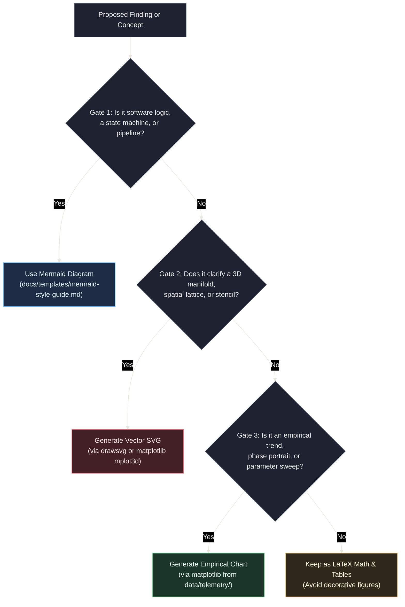

# Scientific Figures & Visualization Skill

The `scientific-figures` skill provides a domain-agnostic visualization framework for scientific and mathematical experimentation repositories. It bridges the gap between high-level architectural diagrams (handled by Mermaid) and complex spatial, continuous, topological, and empirical phenomena that require programmatic rendering.

---

## 1. Core Philosophy: The Cumulative Figure Repertoire

This skill operates on the principle that **every scientific repository is an instance of a broader experimentation template**. Rather than generating one-off or ad-hoc images:

1. **Reproducibility First**: Every figure committed to documentation MUST be 100% reproducible by executing a version-controlled Python script under `.venv/bin/python`.
2. **Repertoire Growth**: When an agent encounters a mathematical or empirical concept that requires visualization, it is **explicitly empowered to author a new modular Python script or adapt an existing archetype**. Over time, the repository organically accumulates a specialized, reusable visualization library.
3. **Dark Theme Consistency**: Every figure programmatically adheres to the repository's dark theme specification (`#161922` dark canvas, `#1e2230` panel, and gentle RGB accents), ensuring visual harmony across GitHub dark mode and VS Code previews.

---

## 2. The 4-Gate Decision Rubric: When to Visualize

To prevent visual clutter and maintain strict documentation discipline, apply this 4-gate rubric before generating any figure:



### Invariants

- **Strict Value-Add Rule**: Do not generate figures for relationships easily expressed in a 2-line equation or compact Markdown table.
- **Document Budget**: Maximum **1 to 2 figures** per Hypothesis (`HYP-*`), Protocol (`EXP-*`), or Diagnostic (`DIAG-*`).
- **Format Standard**: Use vector **SVG (`.svg`)** for 90% of figures (crisp, scalable, diffable). Reserve **300 DPI PNG (`.png`)** strictly for dense 3D shaded meshes or massive micro-state heatmaps (>10,000 cells).

---

## 3. Four Universal Scientific Archetypes

The skill provides foundational, parameterized starter archetypes located in `.agents/skills/scientific-figures/scripts/archetypes/`:

| Archetype | Script | Core Mathematical / Empirical Concepts | Typical Use Cases |
| :--- | :--- | :--- | :--- |
| **1. Continuous Manifolds & Surfaces** | `surface_3d.py` | Parametric surfaces $\mathbf{r}(u,v)$, 3D embeddings, energy landscapes, potential wells | 3D Torus, Sphere, saddle landscapes, loss surfaces |
| **2. Discrete Substrates & Topologies** | `lattice_grid_2d.py` | 2D/3D grids, periodic boundary wrap-around, neighborhood stencils (von Neumann, Moore) | CA lattices, network routing, connectomes |
| **3. Dynamical Systems & Phase Spaces** | `phase_space.py` | Vector fields, streamplots, nullclines, limit cycles, attractor basins | Phase portraits, fixed-point stability, orbital limit cycles |
| **4. Empirical Telemetry & Reductions** | `telemetry_timeseries.py` | Multi-panel time series with critical stability bands, parameter sweeps, box/bar distributions | Critical firing density, noise resilience sweeps, ablation comparisons |

---

## 4. The Agent Protocol: Survey, Adapt, or Author

When an agent needs a scientific figure, it must follow this 4-step workflow:

### Step 1: Survey

Inspect existing scripts in:

1. `python/scripts/figures/` (the repository's current repertoire gallery)
2. `.agents/skills/scientific-figures/scripts/archetypes/` (the template archetypes)

Check [`python/scripts/figures/README.md`](file:///workspaces/ca-experiment/python/scripts/figures/README.md) to see if a similar visual generator already exists.

### Step 2: Adapt or Author

- **Adapt**: If an existing script performs 80% of what is needed, add command-line arguments (via `argparse`) or configure its parameters so it can be reused without code duplication.
- **Author**: If a novel visual mechanism is required (e.g. wavefront collision diagrams, chiral highway rings, bifurcation trees), the agent is **explicitly authorized to create a new script** in `python/scripts/figures/`:
  - Import the dark palette and utilities: `from tools.viz import apply_dark_theme, save_figure, DARK_CANVAS, PRIMARY_RED, ...`
  - Accept parameters via CLI arguments (`--output`, `--seed`, etc.).
  - Output to `docs/assets/figures/` (for architecture/general) or `docs/research/assets/` (for experiments).

### Step 3: Execute & Validate

Run the script using the workspace Python environment:

```bash
.venv/bin/python python/scripts/figures/your_script.py --output docs/research/assets/fig-id-desc.svg
```

Validate the generated asset using the skill's validation script:

```bash
.venv/bin/python .agents/skills/scientific-figures/scripts/validate_figure.py docs/research/assets/fig-id-desc.svg
```

### Step 4: Register & Embed

1. **Catalog Entry**: Append an entry to [`python/scripts/figures/README.md`](file:///workspaces/ca-experiment/python/scripts/figures/README.md) listing:
   - Script path and CLI usage
   - Output asset path
   - Target documents that embed it
2. **Markdown Embedding**: Embed the figure in the target document using standard Markdown syntax:

   ```markdown
   
   ```

---

## 5. Technical Palette Reference

All figures MUST import and use the repo's dark theme palette from `tools.viz`:

```python
from tools.viz import (
    DARK_CANVAS,       # "#161922" (Canvas background)
    DARK_PANEL,        # "#1e2230" (Axes and panel fill)
    BORDER,            # "#434c5e" (Spines and bounding borders)
    GRID,              # "#33394a" (Subtle grid lines)
    TEXT,              # "#e2e8f0" (Primary text / titles)
    TEXT_MUTED,        # "#94a3b8" (Ticks and subtitles)
    PRIMARY_RED,       # "#e06c75" (Core domain, active condition, invariants)
    SECONDARY_GREEN,   # "#73c991" (Critical target bands, active channels)
    TERTIARY_BLUE,     # "#61afef" (Infrastructure, baseline / control condition)
    AMBER,             # "#e5c07b" (Callouts, warnings, ablation conditions)
    apply_dark_theme,  # Automatically configures Matplotlib figures and axes
    save_figure,       # Exports SVG/PNG with dark background and tight bounds
)
```
