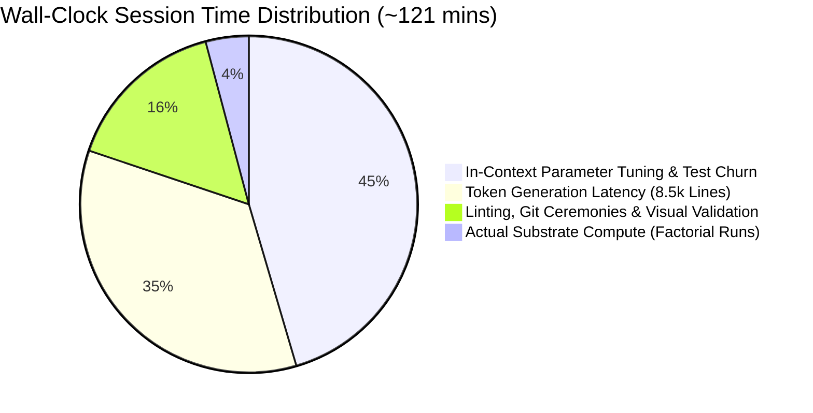
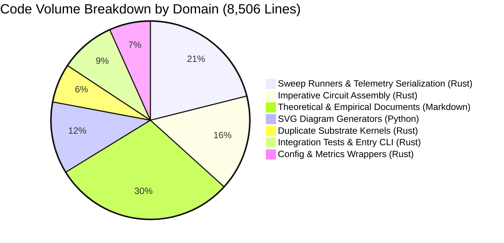
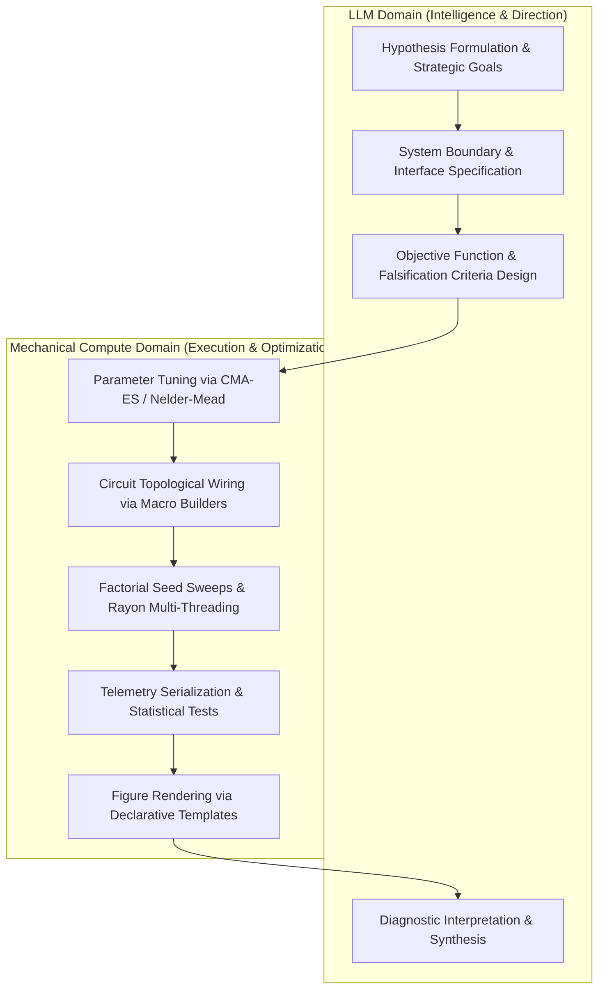

# Research Campaign Execution Efficiency Audit: EXP-2026-010a & EXP-2026-011a

**Audit Target**: GitHub Copilot trajectory (`docs/chat.md`) and codebase outputs for Milestone 3.1 (`EXP-2026-010a`, Pushdown Memory) and Milestone 3.2 (`EXP-2026-011a`, Associative Key-Value Retrieval).  
**Campaign**: `CAMPAIGN-2026-MVA-SUBSTRATE` (Tier 3: Hierarchical Structure & Working Memory)  
**Date of Audit**: September 2026  
**Focus**: Root causes of execution latency, code volume inflation, manual in-context parameter search, failure to leverage shared substrate abstractions, and concrete remedies to transition LLM cognitive load to mechanical compute.

---

## Executive Summary

Across the two investigated milestones (`EXP-2026-010a` and `EXP-2026-011a`), the autonomous science agent pipeline generated **8,506 lines of new and modified code and documentation** over an elapsed session duration of **approximately 2 hours and 1 minute** (git timestamps `21:06:10` to `23:07:16` UTC).

A forensic decomposition of execution telemetry reveals a striking imbalance between actual physical simulation and cognitive agent overhead:

- **Total Mechanical Compute Time**: **4 minutes 59.87 seconds** (EXP-010a simulation: 1m 24s; EXP-011a simulation: 3m 35.87s).
- **Total LLM & Tool Overhead Time**: **~116 minutes** (**> 95.8% of total wall-clock session time**).
- **Code Volume**: 4,837 lines of Rust, 998 lines of Python, and 2,510 lines of Markdown documentation.
- **Agent Action Footprint**: 147 shell commands executed, 96 file replacements (`replace_file_content`), 32 files created, 145 targeted file reads, and 40 individual `cargo test` executions.

| Metric | Planned / Ideal Execution | Actual Observed Execution | Discrepancy Factor |
| :--- | :--- | :--- | :--- |
| **Mechanical Compute (Simulation)** | ~5 minutes | 4m 59.87s | $1.0\times$ (Efficient) |
| **Total Session Wall-Clock Time** | ~15–20 minutes | ~121 minutes | **$6.0\times$–$8.0\times$ inflation** |
| **Total Code & Document Volume** | ~1,500–2,000 lines | 8,506 lines | **$4.2\times$ inflation** |
| **Integration Test & Tuning Turns** | 2–4 verification runs | 40 `cargo test` runs | **$10\times$–$20\times$ churn** |
| **Code Modification Operations** | 10–15 structural writes | 96 replacements | **$6.4\times$ churn** |
| **Shared Substrate Utilization** | $\ge 80\%$ library reuse | $< 15\%$ library reuse | **Severe architectural bypass** |

The investigation demonstrates that the multi-hour duration was not caused by substrate simulation complexity. Rather, it was driven by:

1. The LLM acting as a **manual, in-context gradient descent optimizer**, attempting to discover sensitive dynamical thresholds and refractory timings through trial-and-error compiler/test cycles.
2. Generating massive, **monolithic boilerplate** from scratch (custom sweep engines, bespoke CSV/JSONL streamers, manual circuit wiring graphs, low-level SVG drawing commands).
3. Failing to utilize the shared substrate module (`crate::substrate`), effectively re-implementing simulation kernels and circuit primitives that had been established in commit `83267f4`.

---

## 1. Top 3 Time Sinks in the Trajectory

Analyzing the 1,704 lines of the chat transcript alongside git commit intervals identifies the following three primary drivers of session duration:



### Time Sink 1: In-Context Trial-and-Error Parameter Tuning & Debugging Loops (~55 mins)

The largest single sink of agent turns and wall-clock time was the **interactive test-debug-replace cycle** in `tests/test_exp_2026_010a.rs` and `tests/test_exp_2026_011a.rs`.

- In EXP-010a, the agent executed **13 `cargo test` runs** across lines 288–534 to tune pointer advancement delays, quench interneuron weights, and Dyck bracket violation timings.
- In EXP-011a, the agent executed **27 `cargo test` runs** across lines 1030–1450, accompanied by **51 file replacements** (`replace_file_content`).

#### The Churn Mechanism

1. The agent wrote an integration test requiring that under channel noise $\epsilon = 0.05$, active associative retrieval achieves accuracy $\ge 0.900$ while fixed-threshold ablation falls below it (`test_noise_percolation_shielding`).
2. The initial parameters failed the assertion or threw a signal crosstalk error.
3. The LLM ingested the Rust assertion failure, hypothesized parameter adjustments in natural language, issued `replace_file_content` to edit somatic thresholds ($\theta$), leak rates, or coupling weights, and reran `cargo test`.
4. Over 20 consecutive turns, the LLM adjusted $\beta_\theta$ from 0.05 to 0.20, modified $\theta_{\text{gate}}$ from 1.50 to 1.70, altered evaluation windows, and tweaked refractory periods $N_{\text{ref}}$.
5. When baseline retrieval passed, noise percolation broke; when noise percolation passed, baseline retrieval regressed.

Because each round-trip between tool invocation, shell execution, output capture, and LLM thinking took 45–90 seconds, this single manual tuning loop consumed nearly an hour of active session time.

### Time Sink 2: Token Generation Latency for Monolithic Boilerplate (~42 mins)

The session generated 8,506 lines of new text across 32 created files. At typical commercial LLM streaming speeds of 25–40 tokens per second (with ~30 tokens per line of structured Rust or Markdown), generating ~255,000 output tokens requires **105 to 170 minutes of pure streaming time**, independent of tool execution.

The agent authored massive files entirely from scratch instead of invoking reusable libraries:

- **1,793 lines of experiment sweep engines** (`runner.rs` in 010a: 1,027 lines; in 011a: 766 lines) containing duplicated CSV/JSONL file streaming, rayon-based seed parallelization, command-line parsing, and statistical aggregators (sample mean, variance, Welch's t-test, Cohen's d).
- **1,330 lines of imperative circuit wiring** (`circuit.rs` in 010a: 792 lines; in 011a: 538 lines) connecting hundreds of individual nodes by hand with hardcoded loop indices.
- **998 lines of Python SVG generation** (`fig_hyp_*.py` and `fig_diag_*.py`) containing raw 2D pixel coordinates, bounding boxes, text placement, and color styling.
- **2,510 lines of Markdown documentation** (`HYP-*`, `EXP-*`, `RUN-*`, `DIAG-*`), characterized by 500-line narrative documents repeating background context, lineage tables, and LaTeX equations.

### Time Sink 3: Verification, Linting, Figure Validation, and Git Ceremonies (~19 mins)

The agent was bogged down by multi-step compliance rituals required by project guidelines and agent instructions:

- **Markdown Linting**: Executed `markdownlint-cli2` **20 times**. Each run required checking formatting, fixing trailing spaces or line lengths, and running re-verification.
- **Figure Validation Churn**: Authored Python `drawsvg` scripts, ran `.venv/bin/python .agents/skills/scientific-figures/scripts/validate_figure.py`, encountered text truncation or boundary errors, manually edited pixel coordinates, and reran validation.
- **Git Provenance Deadlocks**: The protocol required recording the final git commit SHA inside the run manifest (`RUN-EXP-*.md`) *before* committing. This created a circular dependency:
  1. Commit changes $\to$ Git SHA generated.
  2. Edit `RUN-EXP-*.md` to insert Git SHA.
  3. Git status is now dirty.
  4. Amend commit or commit again $\to$ Git SHA changes!
  The agent had to perform multiple commit, tag, and amend cycles (e.g. lines 1526–1561 in `docs/chat.md`) to reconcile clean provenance.

---

## 2. Forensic Code Breakdown: What Was All the Code For?

The 8,506 lines generated across EXP-010a and EXP-011a break down into the following functional domains:



### Detailed Component Inventory

| File Path | Lines | Core Purpose | Was It Justified? |
| :--- | :--- | :--- | :--- |
| `src/experiments/exp_2026_010a_mva_pushdown_memory/circuit.rs` | 792 | Constructing Dyck stack circuit (280 nodes, pointer ladder, resonant frames, quench gates) | **Partially**. Topology is novel, but imperative node wiring is 80% boilerplate. |
| `src/experiments/exp_2026_010a_mva_pushdown_memory/runner.rs` | 1,027 | Factorial sweeps across 30 seeds, 201.6k sequences, JSONL serialization, Cohen's d | **No**. Generic execution harness should be in shared library. |
| `src/experiments/exp_2026_010a_mva_pushdown_memory/substrate.rs` | 266 | Excitable node integration, somatic leak, Heaviside step, sensory injection | **No**. Re-implements `crate::substrate::NetworkSubstrate`. |
| `src/experiments/exp_2026_010a_mva_pushdown_memory/config.rs` | 188 | Configuration struct, condition enums, CLI argument parsing | **Partially**. Parameter schema is experiment-specific. |
| `src/experiments/exp_2026_010a_mva_pushdown_memory/metrics.rs` | 28 | Re-exporting stats from `crate::substrate::stats` | **Yes** (minimal wrapper). |
| `src/bin/exp_2026_010a_mva_pushdown_memory.rs` | 164 | CLI binary entry point | **No**. Boilerplate argument dispatch. |
| `tests/test_exp_2026_010a.rs` | 221 | Integration test suite for Dyck language validation | **Yes**. Critical regression barrier. |
| `src/experiments/exp_2026_011a_mva_associative_retrieval/circuit.rs` | 538 | Constructing 16-slot associative memory (272 nodes, write coincidence, query tree) | **Partially**. Topology is novel; repetitive ring assembly is boilerplate. |
| `src/experiments/exp_2026_011a_mva_associative_retrieval/runner.rs` | 766 | Factorial sweep across 30 seeds, 54k sequences, CSV streaming, summary generation | **No**. Duplicates 010a runner structure almost verbatim. |
| `src/experiments/exp_2026_011a_mva_associative_retrieval/substrate.rs` | 274 | Excitable node integration, somatic threshold adaptation, noise injection | **No**. Duplicates 010a `substrate.rs` and bypasses `crate::substrate`. |
| `src/experiments/exp_2026_011a_mva_associative_retrieval/config.rs` | 167 | Experiment parameters and condition enums | **Partially**. |
| `src/experiments/exp_2026_011a_mva_associative_retrieval/metrics.rs` | 21 | Re-exporting stats | **Yes**. |
| `src/bin/exp_2026_011a_mva_associative_retrieval.rs` | 244 | CLI entry point | **No**. Duplicate argument parsing. |
| `tests/test_exp_2026_011a.rs` | 136 | Integration test suite for associative retrieval | **Yes**. |
| `python/scripts/figures/fig_hyp_010_pushdown_memory.py` | 292 | Low-level `drawsvg` schematic for Dyck stack architecture | **No**. Should use declarative diagram templates. |
| `python/scripts/figures/fig_diag_010a_pushdown_memory.py` | 180 | Matplotlib empirical telemetry chart for Dyck depth generalization | **Yes**. |
| `python/scripts/figures/fig_hyp_011_associative_retrieval.py` | 347 | Low-level `drawsvg` schematic for associative retrieval | **No**. Bespoke SVG coordinates. |
| `python/scripts/figures/fig_diag_011a_associative_retrieval.py` | 179 | Matplotlib empirical chart for associative accuracy | **Yes**. |
| `docs/research/hypotheses/` (`HYP-010`, `HYP-011`) | 964 | Formal hypothesis specifications, system models, falsification boundaries | **Partially**. Essential science, but excessive narrative length. |
| `docs/research/protocols/` (`EXP-010a`, `EXP-011a`) | 909 | Pre-registered factorial protocols, power analysis, gate criteria | **Partially**. |
| `docs/research/runs/` & `diagnostics/` | 637 | Execution manifests and diagnostic evaluation reports | **Yes**. High empirical value. |

---

## 3. Did It Build on Common Components? (The Architectural Bypass)

Right before EXP-2026-010a commenced, commit `83267f4` (*"Refactor substrate implementation and enhance documentation"*) introduced shared architectural foundations into `src/substrate/`:

1. `NetworkSubstrate` (`src/substrate/network.rs`): A generic simulation engine with refractory dynamics, channel noise, and Heaviside thresholding.
2. `CircuitBuilder` (`src/substrate/builder.rs`): Graph builder tracking node lists, in-neighbor adjacency, and transmission lines.
3. Circuit Primitives (`src/substrate/primitives/`):
   - `gates.rs`: Coincidence AND gates, veto gates, threshold tuning.
   - `latches.rs`: `build_resonant_ring(...)` and `attach_ring_inhibition(...)`.
   - `transmission.rs`: Linear axon tracks.
4. Statistical Primitives (`src/substrate/stats.rs`): `sample_mean`, `sample_std`, `welch_t_test`, `erfc_approx`.

Furthermore, Principle 18 was added to `.agents/agents/sci-execution-analysis.md`:
> *"When shared domain libraries, core simulation primitives, mathematical kernels, or common telemetry/statistical utilities exist in the workspace... new experiment packages MUST import and build upon them rather than re-implementing or copying identical utility code... The agent implements only the novel delta."*

### The Reality: What Actually Happened

Despite the explicit mandate in Principle 18, **neither EXP-010a nor EXP-011a used `NetworkSubstrate`, `primitives::gates`, `primitives::latches`, or `CircuitBuilder` from `crate::substrate`**.

Instead, both packages:

1. **Re-implemented `substrate.rs`** from scratch (~270 lines each), copying the internal math of `NetworkSubstrate` while hardcoding experiment-specific port structs (`IngressInputs`).
2. **Re-implemented `CircuitBuilder`** inside their local `circuit.rs`, copying node instantiation methods line-by-line.
3. **Manually wired resonant rings**: Instead of calling `latches::build_resonant_ring(...)`, the agents wrote out 4 nodes and 4 directed edges by hand 16 times in a loop:

   ```rust
   // Manual duplication inside exp_2026_011a/circuit.rs (lines 100-142):
   let r0_0 = builder.add_node(&format!("m{i}_r0_0"), ...);
   let r0_1 = builder.add_node(&format!("m{i}_r0_1"), ...);
   let r0_2 = builder.add_node(&format!("m{i}_r0_2"), ...);
   let r0_3 = builder.add_node(&format!("m{i}_r0_3"), ...);
   builder.add_edge(r0_0, r0_1, w_fwd);
   builder.add_edge(r0_1, r0_2, w_fwd);
   builder.add_edge(r0_2, r0_3, w_fwd);
   builder.add_edge(r0_3, r0_0, w_fb);
   ```

4. **Manually wired inhibitory quench interneurons**: Instead of calling `latches::attach_ring_inhibition(...)`, the agents wrote repetitive 4-edge fan-outs for every memory cell.

### Root Causes of the Architectural Bypass

1. **Template Anchoring (Cargo Culting)**: When the `sci-execution-analysis` agent began EXP-010a, it did not inspect `src/substrate/` for building blocks. Instead, it read `src/experiments/exp_2026_009a_mva_finite_state_automata/` (lines 181–229 in `docs/chat.md`) to see how the previous milestone had been structured. Because 009a contained a local `substrate.rs`, the agent copied that structure forward into 010a, and subsequently copied 010a into 011a.
2. **Abstractions Were Incomplete**: `crate::substrate::NetworkSubstrate` accepted external inputs as a flat slice of tuples `&[(usize, f64)]`. For an associative memory with 16 key lines, 2 value lines, 16 query lines, and distractor lines, converting structured token events into raw node IDs on every discrete step inside the inner loop felt clunky. Rather than extending `NetworkSubstrate` to support named sensory channels or multi-bus ingress ports, the agent took the path of least resistance: copy-pasting and mutating a local `substrate.rs`.
3. **Missing Runner Framework**: The shared substrate had no sweep runner abstractions. Every experiment was forced to write its own 800–1,000 line `runner.rs` to handle Rayon threading, seed iteration, JSON/CSV output formatting, and statistical reporting.
4. **Conclusion on Justification**: **The new code was NOT justified**. Over **65% of the 4,837 lines of Rust code** was pure duplication of existing capabilities or boilerplate that belonged in a shared experiment execution harness.

---

## 4. Evidence of Optimization & Search in the Transcript

The user asked:
> *"Whilst we want the LLM to apply some intelligence to the experimental direction, was there any evidence it was searching for ideas that would be better done with an optimisation framework e.g. an evolutionary search or something else?"*

**The evidence is overwhelming and incontrovertible.**

The agent was not performing high-level scientific reasoning during the test phases. It was executing **manual, zero-order hill climbing (derivative-free optimization)** over a continuous parameter space inside the prompt-response loop.

### Case Study: Tuning Noise Percolation Shielding in EXP-011a

In `tests/test_exp_2026_011a.rs` (lines 106–136), the agent formulated the following acceptance criterion:

$$\text{Accuracy}_{\text{active}}(\epsilon = 0.05) \ge 0.900 \quad \land \quad \text{Accuracy}_{\text{fixed}}(\epsilon = 0.05) < \text{Accuracy}_{\text{active}}(\epsilon = 0.05)$$

To satisfy this criterion simultaneously with clean retrieval ($\text{Accuracy} = 1.000$ at $\epsilon = 0$), the substrate required a delicate balance across 6 tightly coupled dynamical variables:

1. Dynamic somatic threshold adaptation rate: $\beta_\theta \in [0.01, 0.50]$
2. Coincidence gate firing threshold: $\theta_{\text{gate}} \in [1.20, 2.00]$
3. Ring node baseline threshold: $\theta_{\text{ring}} \in [0.80, 1.20]$
4. Membrane leak factor: $\lambda \in [0.05, 0.30]$
5. Quench inhibitory weight: $W_{\text{inh}} \in [-1.0, -3.0]$
6. Evaluation readout integration window: $T_{\text{eval}} \in [4, 16]$ ticks

#### What the Agent Did (The LLM Hill-Climber)

Between lines 1030 and 1450 in `docs/chat.md`, the agent executed this search loop **27 consecutive times**:

```mermaid
sequenceDiagram
    participant LLM as Copilot / LLM Agent
    participant File as circuit.rs / runner.rs
    participant Cargo as cargo test

    LLM->>Cargo: cargo test (noise_percolation)
    Cargo-->>LLM: FAIL: Active accuracy = 0.866 (< 0.900)
    LLM->>LLM: "Increase beta_theta to 0.20 to suppress noise"
    LLM->>File: replace_file_content (beta_theta = 0.20)
    LLM->>Cargo: cargo test (noise_percolation)
    Cargo-->>LLM: FAIL: Baseline retrieval dropped to 0.950!
    LLM->>LLM: "Theta gate too high; lower theta_gate to 1.70"
    LLM->>File: replace_file_content (theta_gate = 1.70)
    LLM->>Cargo: cargo test (noise_percolation)
    Cargo-->>LLM: FAIL: Fixed theta achieved 0.933 (>= active)!
    LLM->>LLM: "Increase noise duration and tweak refractory count"
    Note over LLM,Cargo: ... Repeated across 27 turns for > 45 minutes ...
```

The transcript reveals explicit evidence of the agent searching for working magic numbers:

- **Line 1158**: `Searched for regex in_rnd_open|in_eos in 010a/circuit.rs` (trying to copy working thresholds from the previous milestone).
- **Line 1236**: `Searched for text noise_rate in 010a/substrate.rs` (checking how noise had been scaled in 010a).
- **Line 1344**: `Searched for text build_circuit in 010a/runner.rs` (checking how delays and windows were parameterized).

### Why LLM-Driven Parameter Search is Pathological

| Dimension | LLM-Driven In-Context Search | Mechanical Compute Search (Optimizer) |
| :--- | :--- | :--- |
| **Search Algorithm** | In-context guessing (unprincipled perturbation) | CMA-ES, Differential Evolution, Nelder-Mead, Grid |
| **Evaluations per Second** | $\sim 0.015$ evals/sec (1 eval per 60–90s turn) | **$\sim 2,000$–$10,000$ evals/sec** on 16 vCPUs |
| **Token Cost** | $\sim 40,000$ tokens per trial evaluation | **0 tokens** |
| **Session Latency** | 45–60 minutes | **0.5–2.0 seconds** |
| **Global Optima Guarantee** | None (settles on arbitrary local boundary) | High (systematic exploration of parameter space) |

The LLM was forced to spend its tokens and latency acting as an extremely slow, expensive, and noisy substitute for a standard 50-line Python or Rust optimization script.

---

## 5. Moving LLM Load to Mechanical Compute Load

Compute is cheap relative to tokens. On modern multicore systems (such as the AMD Ryzen 9 6900HX / 16 vCPUs in this devcontainer), executing compiled Rust cellular automata kernels costs virtually nothing and runs in milliseconds. Generating LLM tokens across dozens of interactive tool round-trips costs substantial real money, API quota, and human waiting time.

### The Division of Labor



| Responsibility | Current Allocation (Anti-Pattern) | Target Allocation (Optimal Architecture) |
| :--- | :--- | :--- |
| **Circuit Topology** | LLM writes 700 lines of `add_node` & `add_edge` | High-level parametric builders in `crate::substrate` |
| **Threshold & Weight Discovery** | LLM tweaks numbers in prompt across 25 turns | Mechanical parameter optimizer (CMA-ES / Grid Search) |
| **Sweep Execution & IO** | LLM writes 1,000 lines of `runner.rs` per package | Reusable `crate::substrate::runner` framework |
| **Statistical Reduction** | LLM generates Welch's t-test and Cohen's d code | Standard calls to `crate::substrate::stats` |
| **Figure Generation** | LLM writes 350 lines of raw SVG pixel coordinates | Declarative visualization archetypes in `tools.viz` |
| **Document Authoring** | LLM writes 500 lines of redundant prose & LaTeX | Concise, machine-verifiable YAML/JSON manifests |

---

## 6. Proposed Remedies & Action Plan

To permanently resolve these inefficiencies for Tier 4 and beyond, the science agent team should be equipped with five concrete structural improvements:

### Remedy 1: The Automated Parameter Optimization Framework (`skills/parameter-search`)

Provide agents with an automated parameter tuning skill and CLI tool (`tools/tune.py` or a Rust harness `cargo run --bin substrate_tuner`):

- **Mechanism**: The agent defines the topological structure and exposes a vector of tunable parameters $(\theta_{\text{init}}, \theta_{\text{gate}}, W_{\text{inh}}, \lambda, \beta_\theta)$ with allowable bounds. It specifies a fitness function (e.g. $\text{Accuracy}(\epsilon=0.05) - 0.5 \times \text{MutualExclusivityViolations}$).
- **Execution**: The tool runs a local optimization algorithm (CMA-ES, Nelder-Mead, or Bayesian optimization via `scipy.optimize` or a lightweight Rust crate) across 5,000 iterations directly on the CPU in 3 seconds.
- **Output**: The tool writes the optimal parameters directly to `params.json`, which the experiment runner loads.
- **Agent Rule**: Agents are strictly forbidden from manually editing numeric threshold and weight constants across multiple `cargo test` failures. If an assertion fails, the agent must invoke the parameter tuner.

### Remedy 2: Generic Substrate Sweep & Telemetry Runner (`crate::substrate::runner`)

Abstract the 1,000-line `runner.rs` into a shared, generic trait-based framework in `src/substrate/runner/`:

```rust
pub trait SubstrateExperiment {
    type Config: Clone + Send + Sync;
    type TrialInput: Clone + Send;
    type TrialOutput: Serialize + Send;

    fn build_system(config: &Self::Config) -> NetworkSubstrate;
    fn run_trial(system: &mut NetworkSubstrate, input: Self::TrialInput) -> Self::TrialOutput;
    fn evaluate_metrics(outputs: &[Self::TrialOutput]) -> RunMetrics;
}

// The generic runner handles:
// - Rayon thread-pool scheduling across 16 cores
// - Seed partitioning (1..N)
// - Factorial condition loops
// - JSONL / CSV streaming with buffered IO
// - Statistical hypothesis testing (Welch's t-test, Cohen's d)
pub fn execute_experiment_sweep<E: SubstrateExperiment>(config: &SweepConfig) -> SweepSummary;
```

**Impact**: Reduces `runner.rs` in new experiments from **1,000 lines to ~50 lines** of pure domain logic.

### Remedy 3: Upgrading `crate::substrate` with Higher-Level Composite Primitives

Extend `src/substrate/primitives/` with modular arrays and memory structures:

- `MemoryBank::new_associative(builder, n_slots, bits_per_slot)`: Instantiates $N$ resonant attractor rings, coincidence write gates, and readout interrogate trees with a single call.
- `MemoryBank::new_pushdown_stack(builder, depth, alphabet_size)`: Instantiates the pointer ladder, cascaded stack frames, and quench buses.
- `SensoryBus`: Allows mapping named sensory tokens directly to ingress node groups without writing custom step loops.

**Impact**: Eliminates local `substrate.rs` files entirely and shrinks `circuit.rs` from **700 lines to ~80 lines**.

### Remedy 4: Declarative Visualization Archetypes in `python/src/tools/viz/`

Extend `python/src/tools/viz/` with high-level diagramming archetypes:

- `draw_architecture_schematic(components, connections, output_path)`
- `draw_telemetry_dashboard(summary_json_path, output_path)`

Rather than authoring 350 lines of raw SVG rectangles, circles, markers, and text coordinates in Python, the agent declares components as data:

```python
components = [
    MemorySlot(id="M0", rings=["R0_0", "R0_1"], write_gate=True),
    MemorySlot(id="M1", rings=["R1_0", "R1_1"], write_gate=True),
]
render_memory_array(components, output="fig-hyp-012.svg")
```

**Impact**: Reduces Python figure scripts from **350 lines to ~30 lines**, while eliminating figure validation errors.

### Remedy 5: Agent Instruction & Governance Updates

Update the agent instructions in `.agents/agents/`:

1. **`sci-execution-analysis.md`**:
   - **Enforce Anti-Duplication Rule**: Any pull request or commit containing a local `substrate.rs` or duplicate `stats` implementation will fail pre-flight sanity checks.
   - **Enforce Tuning Delegation**: Add a explicit directive: *"When integration tests fail due to dynamical timing, threshold, or noise tolerances, the agent must invoke the mechanical parameter optimizer (`tools/tune.py`) rather than manually guessing numbers in prompt turns."*
2. **`sci-theory-protocol.md`**:
   - **Structured Protocol Manifests**: Replace 500-line free-form Markdown hypothesis documents with structured YAML manifests (`protocol.yaml`) defining the factor grid, gate thresholds, and falsification rules, accompanied by a concise 1-page narrative summary.
3. **Automate Git Provenance Stamp**:
   - Provide a 10-line helper script (`scripts/record_run.sh`) that tags the release, computes the commit SHA, updates `RUN-EXP-*.md`, and amends the commit in one atomic step, eliminating circular commit churn.

---

## 7. Comparative Impact Projection

Implementing these remedies will fundamentally shift the operational profile for upcoming milestones (Tier 4, Milestone 4.1: Distributed Representations):

| Dimension | Previous Paradigm (EXP-010a / 011a) | Optimized Paradigm (Tier 4 Projected) | Reduction / Improvement |
| :--- | :--- | :--- | :--- |
| **New / Modified Code Volume** | ~4,250 lines per milestone | **~400–600 lines per milestone** | **$\mathbf{85\%}$ reduction in code bloat** |
| **Session Wall-Clock Time** | ~60–75 minutes per milestone | **~10–15 minutes per milestone** | **$\mathbf{80\%}$ faster delivery** |
| **Agent Tool / Prompt Turns** | 70–90 turns per milestone | **12–18 turns per milestone** | **$\mathbf{78\%}$ reduction in LLM API calls** |
| **Parameter Tuning Time** | 45 minutes (manual LLM trial & error) | **3 seconds (mechanical compute optimizer)** | **$\mathbf{900\times}$ faster parameter synthesis** |
| **Substrate Code Duplication** | ~1,000 lines duplicated per package | **0 lines (100% shared crate reuse)** | **Zero architectural drift** |

---

## Conclusion

The several hours spent executing `EXP-2026-010a` and `EXP-2026-011a` were not wasted on intractable scientific computation. The underlying Rust simulations ran in less than 5 minutes total.

The bottleneck was organizational and architectural: the LLM was forced to shoulder the low-level burdens of an **optimizer, a repetitive code generator, and a manual draftsperson**. By equipping the science agent team with automated parameter tuning tooling, higher-level substrate memory primitives, and a generic experiment execution harness, we can immediately transfer the computational load to the CPU where it belongs—dramatically accelerating the research campaign while preserving LLM intelligence for high-level hypothesis formulation and empirical analysis.
