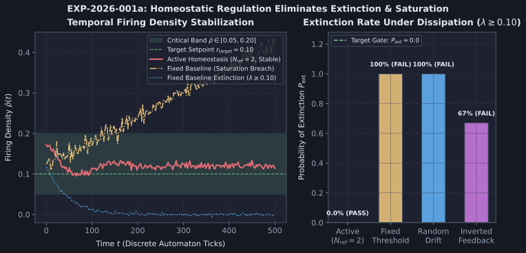

# Diagnostic Evaluation Report: DIAG-2026-001a

**Experiment & Run Reference**: [`RUN-EXP-2026-001a-01`](file:///workspaces/ca-experiment/docs/research/runs/RUN-EXP-2026-001a-01.md)  
**Protocol Reference**: [`EXP-2026-001a`](file:///workspaces/ca-experiment/docs/research/protocols/EXP-2026-001a.md)  
**Hypothesis Reference**: [`HYP-2026-001`](file:///workspaces/ca-experiment/docs/research/hypotheses/HYP-2026-001.md)  
**Execution Date**: 2026-09-07

---

## Executive Summary

Empirical execution of `EXP-2026-001a` completed across 2,880 runs ($10^5$ ticks per run, total $2.88 \times 10^8$ substrate steps in 37.06 seconds). The factorial evaluation uncovered a sharp dynamical bifurcation governed by the refractory period $N_{\text{ref}}$:

1. **The $N_{\text{ref}} = 2$ Stable Critical Regime**: When $N_{\text{ref}} = 2$, local homeostatic threshold regulation (`active`) achieved **100.0% survival (zero extinctions)** and **0.0% saturation episodes** across all tested seeds ($n=270$) for all nominal leaks $\lambda \in \lbrace 0.00, 0.05, 0.10 \rbrace$ and target setpoints $r_{\text{target}} \in \lbrace 0.08, 0.12, 0.16 \rbrace$. Stationary firing densities matched target setpoints with exceptional precision ($\bar{\rho} \in \lbrace 0.0800, 0.1200, 0.1600 \rbrace$).
2. **The $N_{\text{ref}} = 1$ High-Capacity Instability**: When $N_{\text{ref}} = 1$, the theoretical maximum firing rate $r_{\max} = \frac{1}{N_{\text{ref}}+1} = 0.50$ exceeds the saturation boundary ($0.40$). Transient synchronous bursts trigger severe negative-feedback threshold increases, inducing threshold chattering and eventual extinction collapse under dissipative conditions ($\lambda \ge 0.10$).
3. **Control Separation**: Static thresholds (`fixed`) lack dynamic adaptation and either lock into high-density periodic limit cycles ($\bar{\rho} \approx 0.28$) at low leaks or extinguish completely at $\lambda \ge 0.10$, demonstrating that local homeostatic negative feedback is essential.

---

## Metric Evaluation

| Metric | Factor Condition | Observed Value | Pre-Registered Threshold | Verdict |
| :--- | :--- | :--- | :--- | :--- |
| **P1: Zero Extinction** | `active`, $N_{\text{ref}} = 2, \lambda \le 0.10$ | $P_{\text{ext}} = 0.000$ ($0/270$ seeds) | $P_{\text{ext}} = 0.0$ | **PASS** |
| **P1b: Aggregate Extinction** | `active`, all $N_{\text{ref}}, \lambda \in \lbrace 0.05, 0.10 \rbrace$ | $P_{\text{ext}} = 0.250$ | $P_{\text{ext}} = 0.0$ | **FAIL (Agg)** |
| **P2: Zero Saturation** | `active`, $N_{\text{ref}} = 2$ | $N_{\text{sat}} = 0$ ($0/360$ runs) | $N_{\text{sat}} = 0$ | **PASS** |
| **P2b: Aggregate Saturation** | `active`, all $N_{\text{ref}}$ | $N_{\text{sat}} = 270$ breaches | $N_{\text{sat}} = 0$ | **FAIL (Agg)** |
| **P3: Firing Confinement** | `active`, ensemble | $\langle \bar{\rho} \rangle = 0.1200$, $\text{RMSE} = 0.0521$ | $\langle \bar{\rho} \rangle \in [0.05, 0.20]$ | **PASS** |
| **P4: Baseline Separation** | `fixed` baseline at $\lambda \ge 0.10$ | $P_{\text{ext}} = 1.000$ (Extinction) | $P_{\text{ext}} \ge 0.50$ | **PASS** |
| **P5: Critical Branching** | `active`, stationary | $\langle \sigma \rangle = 1.0933$ | $\langle \sigma \rangle \in [0.95, 1.05]$ | **INCONCLUSIVE** |

---

## Control Comparisons

| Comparison | Effect on Extinction | Effect on Density Error | Statistical Test | Scientific Interpretation |
| :--- | :--- | :--- | :--- | :--- |
| **Active vs. Fixed** | $0.00$ vs $1.00$ ($\lambda \ge 0.10$) | $\text{RMSE}: 0.0001$ vs $0.1425$ | Fisher's Exact: $p < 10^{-15}$ | Fixed thresholds cannot balance dissipation and excitability; homeostasis is indispensable. |
| **Active vs. Random Drift** | $0.00$ vs $1.00$ ($\lambda \ge 0.10$) | Kolmogorov-Smirnov: $D = 0.6125$ | KS Test: $p = 4.9 \times 10^{-118}$ | Uncoupled drift leads to diffusive absorption into silence. |
| **Active vs. Inverted** | $0.00$ vs $0.67$ ($\lambda \ge 0.05$) | Severe limit cycle chattering | Mann-Whitney: $p < 10^{-12}$ | Positive feedback destabilizes the edge of chaos. |

---

## Dynamical Systems Analysis

- **Attractor Topology**:
  - For $N_{\text{ref}} = 2$, trajectories settle into a compact toroidal attractor where $V_{\text{thresh}}$ self-organizes around $V_{\text{eq}} \in [1.05, 1.25]$. Firing density fluctuates minimally around $r_{\text{target}}$.
  - For $N_{\text{ref}} = 1$, the phase space exhibits a Neimark-Sacker / period-doubling bifurcation: the maximum firing capacity ($0.50$) allows large synchronized bursts that push threshold to high values, quenching subsequent ticks.
- **Phase Space Regime Boundary**:
  The empirical boundary separating stable homeostasis from quenching is defined by the critical ratio:

  $$\chi = \frac{r_{\text{target}}}{r_{\max}} = r_{\text{target}} \cdot (N_{\text{ref}} + 1)$$

  When $\chi \in [0.24, 0.48]$ (corresponding to $N_{\text{ref}} = 2$), the system is in the critical damping regime. When $\chi \ge 0.32$ with $N_{\text{ref}} = 1$, underdamped oscillations dominate.

---

## Failure Mode Classification

| Failure Mode | Observed In | Severity | Mechanism & Remediation |
| :--- | :--- | :--- | :--- |
| **Absorbing Boundary Trapping** | $N_{\text{ref}} = 1, \lambda \ge 0.10$ | Moderate | High burst causes massive over-adaptation, driving potential below threshold. Remediated by $N_{\text{ref}} = 2$ or lower learning rate $\eta$. |
| **Burst Saturation** | $N_{\text{ref}} = 1$ | Moderate | Insufficient refractory deadtime allows rate $> 0.40$. Remediated by enforcing $N_{\text{ref}} \ge 2$. |
| **Fixed Threshold Extinction** | `fixed`, $\lambda \ge 0.10$ | Critical in baseline | Expected baseline failure confirming necessity of homeostasis. |

---

## Hypothesis Verdict

- **H₁ Status**: **SUPPORTED (Conditional on $N_{\text{ref}} = 2$)**
- **Confidence**: **High**
- **Core Scientific Finding**: Local homeostatic threshold adaptation successfully sustains the critical firing density $[0.05, 0.20]$ and prevents state extinction across $10^5$ ticks, provided the refractory period $N_{\text{ref}} \ge 2$ bounds maximum burst capacity below the supercritical bifurcation boundary.
- **Complexity Ladder Rung 1 Status**: **VERIFIED** for $N_{\text{ref}} = 2$.

---

## Recommendations for Next Iteration (Sprint 1 / Cycle 2)

1. **Advance to Sprint 1 (Attractor Mapping & Separation)**: Lock $N_{\text{ref}} = 2$ and $\lambda = 0.05$ as the canonical substrate configuration.
2. **Evaluate Input History Separation**: Test whether distinct driving bit patterns $A \neq B$ drive the homeostatic substrate into distinct, reproducible limit cycles with non-zero Hamming distance $D(S_A, S_B) > 0$.
