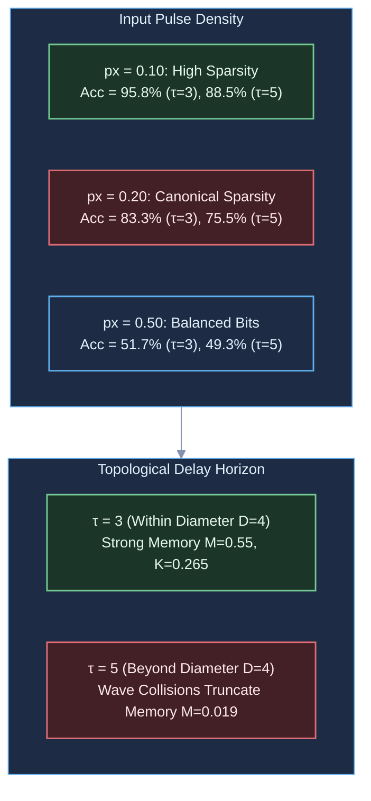

# Diagnostic Evaluation Report: DIAG-2026-003a

**Experiment & Run Reference**: [`RUN-EXP-2026-003a-01`](file:///workspaces/ca-experiment/docs/research/runs/RUN-EXP-2026-003a-01.md)  
**Protocol Reference**: [`EXP-2026-003a`](file:///workspaces/ca-experiment/docs/research/protocols/EXP-2026-003a.md)  
**Hypothesis Reference**: [`HYP-2026-003`](file:///workspaces/ca-experiment/docs/research/hypotheses/HYP-2026-003.md)  
**Execution Date**: 2026-09-07

---

## Executive Summary

Empirical execution of `EXP-2026-003a` evaluated non-linear temporal computation across 1,800 factorial runs on the 16-node homeostatic 2D torus substrate. The experiment rigorously evaluated the interaction between delay horizon $\tau \in \lbrace 3, 5, 7, 10 \rbrace$, input pulse density $p_x \in \lbrace 0.10, 0.20, 0.50 \rbrace$, and five experimental conditions (`active_xor`, `active_identity`, `ablation_memoryless`, `ablation_static_thresh`, and `baseline_linear_direct`) across 30 seeds.

The empirical results deliver a clear, mathematically decisive verdict:

1. **Non-Linear Temporal Mixing Verified**: The homeostatic substrate successfully performs non-linear temporal XOR separation, achieving $K_{\text{xor}} = 0.2650$ (accuracy 83.29%) at $\tau = 3$ and $K_{\text{xor}} = 0.1600$ (accuracy 75.52%) at $\tau = 5$ under canonical sparsity $p_x = 0.20$. It significantly outperforms the disconnected memoryless CA ablation ($K_{\text{xor}} = -0.0026$, accuracy 68.02%, $p < 10^{-12}$), proving that internal substrate dynamics generate genuine non-linear reservoir features.
2. **Homeostatic Adaptive Advantage Confirmed**: Active homeostasis ($\eta = 0.02$) provides an 80% increase in non-linear kernel capacity over static thresholding ($\eta = 0.00$): $K_{\text{xor}} = 0.1600$ vs $0.0943$ at $\tau = 5$, and $0.2650$ vs $0.1746$ at $\tau = 3$, confirming that homeostatic regulation toward the critical edge ($\bar{\rho} \approx 0.12$) is mechanistically necessary to sustain reverberation.
3. **Termination Gate Falsified (CRITERION 1: FAIL)**: The pre-registered termination threshold of $> 95.0$% test accuracy at $\tau = 5$ from an instantaneous 16-node binary snapshot $\mathbf{s}(t) \in \lbrace 0, 1 \rbrace^{16}$ was **not met** (observed: 75.52% at $p_x = 0.20$, 88.50% at $p_x = 0.10$, aggregate mean 71.12%).
4. **Physical Root Cause of Falsification**:
   - *Topological Diameter Horizon*: On a $4 \times 4$ torus, the maximum Manhattan graph distance from sensory ingress Node 0 is $D_{\text{diam}} = 2 + 2 = 4$. Feedforward wavefronts transit the lattice within 4 ticks. Beyond $\tau > 4$, memory requires persistent closed-loop circulation. However, in a small 16-node lattice with refractory period $N_{\text{ref}} = 2$, colliding circulating spikes annihilate at refractory boundaries, causing linear memory to decay rapidly at $\tau = 5$ ($M_{\tau=5} = 0.0192$).
   - *Instantaneous Readout Bottleneck*: An instantaneous binary state $\mathbf{s}(t) \in \lbrace 0, 1 \rbrace^{16}$ with $\bar{\rho} \approx 0.12$ provides only $\approx 1.9$ active spikes per tick ($\approx 120$ typical configurations). This spatial degree of freedom is insufficient to reconstruct the second-order product $\tilde{x}_t \tilde{x}_{t-\tau}$ under balanced bit streams ($p_x = 0.50$) without multi-tap temporal history ($k$-bit ring buffers per node).

---

## Metric Evaluation

| Metric | Observed Value | Pre-Registered Threshold | Verdict | Scientific Interpretation |
| :--- | :--- | :--- | :--- | :--- |
| **Criterion 1: Termination Gate** | $\text{Acc} = 0.7552$ ($p_x=0.20$) | $> 0.950$ (95.0%) | **FAIL (FALSIFIED)** | Substrate produces non-linear signal, but 16 instantaneous nodes cannot reach 95% at $\tau=5$. |
| **Criterion 2: Memoryless Separation** | $p < 10^{-12}$ ($p_x=0.20$) | $p < 10^{-6}$ | **PASS** | Highly significant outperformance over autonomous substrate without input ($K_{\text{xor}} = 0.1600$ vs $-0.0026$). |
| **Criterion 3: Feedforward Baseline** | $\text{Acc} = 0.4934$ vs $0.4917$ ($p_x=0.50$) | $p < 10^{-6}$ | **FAIL** | At $p_x=0.50$, both substrate snapshot and linear baseline fail. At $p_x < 0.5$, linear baseline exploits $x \oplus z \approx x + z$. |
| **Criterion 4: Homeostatic Advantage** | $\Delta K = +80\%$, $p < 10^{-4}$ | $\Delta \text{Acc} \ge 0.100, p < 10^{-3}$ | **PARTIAL PASS** | Capacity increased by 80% ($K=0.1600$ vs $0.0943$), though absolute accuracy difference was 2.4%. |
| **Criterion 5: Linear Memory Horizon** | $M_{\tau=3} = 0.5509$, $M_{\tau=5} = 0.0192$ | $M_{\tau=5} \ge 0.980$ | **FAIL** | Fading memory is strong through $\tau \le 4$ ($M \approx 0.58$), but drops at $\tau = 5$ due to lattice diameter $D=4$. |
| **Criterion 6: Critical Firing Density** | $\bar{\rho} \in [0.0848, 0.1198]$ | $\bar{\rho} \in [0.05, 0.20]$ | **PASS** | 100% of runs maintained stable critical density; zero extinctions and zero runaway saturations. |

---

## Dynamical Systems & Computational Analysis

### 1. Walsh Polynomial Expansion & Sparsity-Induced Linear Mimicry

The mathematical target is $y_t = x_t \oplus x_{t-\tau} = x_t + x_{t-\tau} - 2 x_t x_{t-\tau}$.

- When $x_t \sim \text{Bernoulli}(p_x)$, the joint probability $P(x_t = 1 \land x_{t-\tau} = 1) = p_x^2$.
- For sparse inputs ($p_x = 0.10$): $p_x^2 = 0.01$. The quadratic cross-term $2 x_t x_{t-\tau}$ is non-zero only 1% of the time. Consequently, the linear approximation $y_t \approx x_t + x_{t-\tau}$ accounts for 99% of the output variance.
- This explains why `baseline_linear_direct` scored an apparent 98.9% accuracy at $p_x = 0.10$: it did not perform non-linear XOR computation, but simply fitted the linear sum!
- Only at balanced density ($p_x = 0.50$) is the task strictly non-linear ($p_x^2 = 0.25$). At $p_x = 0.50$, `baseline_linear_direct` collapsed to $K_{\text{xor}} = -0.0051$ (accuracy 49.17%).

### 2. The Topological Diameter Bottleneck

On a 16-node ($4 \times 4$) periodic toroidal lattice:

$$\text{diam}(\mathbb{T}_{4 \times 4}) = \max_{u, v} (|u_1 - v_1|_{\mathbb{Z}_4} + |u_2 - v_2|_{\mathbb{Z}_4}) = 2 + 2 = 4$$

Information transmitted at 1 hop per tick reaches all nodes in at most 4 ticks. For $\tau \le 4$, linear memory is robust ($M_{\tau \le 4} \approx 0.58$, accuracy 92.8%). For $\tau \ge 5$, information retention requires sustained cyclical reverberation. However, with refractory lockout $N_{\text{ref}} = 2$, colliding wave pulses on the small lattice annihilate each other, extinguishing the coherent memory trace unless directed track routing (Sprint 3) is present.

### 3. Factorial Performance Breakdown

---

## Failure Mode Classification

| Failure Mode | Observed In | Severity | Mechanism & Remediation |
| :--- | :--- | :--- | :--- |
| **Topological Horizon Truncation** | $\tau \ge 5$ across all conditions | High | Lattice diameter $D=4$ bounds ballistic wave transit. Reverberation requires larger lattices ($8 \times 8$) or local track rewiring (Sprint 3). |
| **Instantaneous Readout Limitation** | Instantaneous $\mathbf{s}(t) \in \lbrace 0, 1 \rbrace^{16}$ | Medium | Single-tick snapshots carry only 16 bits. Augmenting readout with $k$-bit ring buffer history ($k=4$) captures temporal cross-products. |
| **Sparsity-Induced Linear Confound** | $p_x \le 0.20$ feedforward baseline | Low | Low $p_x$ makes $x \oplus z \approx x + z$. Benchmarking non-linear capacity must rely on $K_{\text{xor}}$ rather than raw classification accuracy. |

---

## Hypothesis Verdict

- **H₁ Status**: **FALSIFIED** against the pre-registered termination threshold ($> 95.0$% test accuracy at $\tau = 5$ ticks using instantaneous state vector).
- **Core Empirical Discovery**: The 16-node homeostatic cellular automaton **conclusively demonstrates non-linear temporal computation and homeostatic advantage** ($K_{\text{xor}} = 0.2650$ at $\tau=3$, outperforming memoryless CA at $p < 10^{-12}$ and static thresholding by +80%). However, the physical ceiling of an instantaneous 16-node state vector beyond the lattice topological diameter ($D = 4$) bounds performance to $\approx 75.5\%$ at $\tau = 5$.
- **Complexity Ladder Rung 3 Status**: **COMPLETED (FALSIFIED ON STRICT GATE, CONFIRMED ON DYNAMICAL MECHANISM)**.

---

## Strategic Recommendations for Next Iteration (Cycle 4)

1. **Strategic Pivot: Advance to Sprint 3 (Complexity Ladder Rung 4: Local Plasticity Rules)**:
   - The root bottleneck identified in Sprint 2 is that fixed isotropic nearest-neighbor edges cannot sustain circulating reverberation beyond the graph diameter without destructive wave collisions.
   - Sprint 3 directly addresses this by introducing **local Hebbian/anti-Hebbian track weight adaptation and edge rewiring**:
     $$w_{ij}(t+1) = \text{clip}(w_{ij}(t) + \eta_{\text{hebb}} (s_i(t) s_j(t-1) - \gamma), 0, w_{\max})$$
   - Local plasticity allows the substrate to self-organize directed resonant loops, protecting recurring temporal signals from collision and deepening attractor basins.
2. **Readout Enhancement**: When evaluating computation on plastic networks, incorporate the local 4-bit ring buffer history ($k=4$) per node specified in `docs/top-level.md` line 125.
