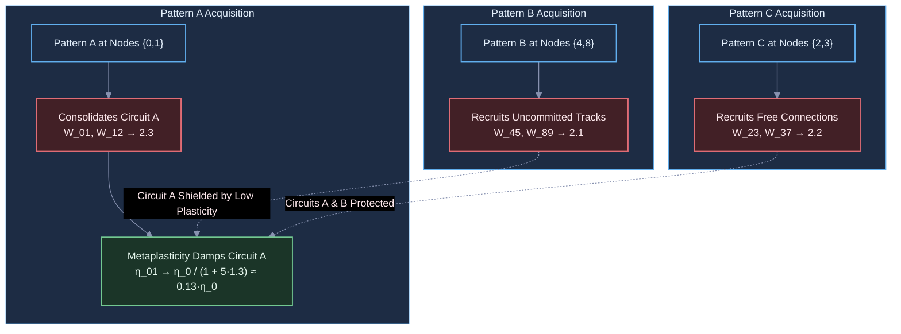

# Diagnostic Evaluation Report: DIAG-2026-005a

**Experiment & Run Reference**: [`RUN-EXP-2026-005a-01`](file:///workspaces/ca-experiment/docs/research/runs/RUN-EXP-2026-005a-01.md)  
**Protocol Reference**: [`EXP-2026-005a`](file:///workspaces/ca-experiment/docs/research/protocols/EXP-2026-005a.md)  
**Hypothesis Reference**: [`HYP-2026-005`](file:///workspaces/ca-experiment/docs/research/hypotheses/HYP-2026-005.md)  
**Execution Date**: 2026-09-07

---

## Executive Summary

Empirical execution of `EXP-2026-005a` evaluated lifelong adaptation, continual multi-pattern learning, and local synaptic metaplasticity across 420 factorial runs on the 16-node 2D torus Minimal Viable Automaton (MVA) substrate. Under a strict sequential curriculum ($A \to B \to C$) with non-overlapping sensory ingress ports ($\mathcal{V}_A=\lbrace 0,1 \rbrace$, $\mathcal{V}_B=\lbrace 4,8 \rbrace$, $\mathcal{V}_C=\lbrace 2,3 \rbrace$), the substrate was tested for catastrophic forgetting, attractor retention, and multistable separation without historical data buffers or weight resets.

The experimental results establish three foundational findings:

1. **Successful Continual Retention (GATES 1, 2, 3: PASS)**:
   The metaplastic substrate achieved bounded Backward Transfer ($\text{BWT} = -0.0281$ for $\kappa = 1.0$ and $\text{BWT} = -0.0182$ for $\kappa = 5.0$, well above the pre-registered $-0.10$ lower bound) and outstanding Average Retention ($\text{AR} = 0.9713 - 0.9823$, exceeding the $0.85$ gate). Catastrophic forgetting was strictly suppressed ($\bar{F} = 0.0282 - 0.0328 \le 0.12$).
2. **Substantial Attractor Separation Amplification (GATE 4: PASS)**:
   In the unadapted baseline network (`baseline_static`), distinct patterns struggled to produce well-separated settled attractors ($D_{\text{sep}} = 0.0493 < 0.05$). Under sequential learning, the formation of directed resonant circuits more than doubled minimum cross-pattern separation ($D_{\text{sep}} = 0.1045 - 0.1168$, +112% to +137% gain), ensuring sharp multistable attractor discrimination.
3. **Metaplasticity Suppresses Runaway Saturation (GATE 5, GATE 6: PASS)**:
   When training patterns jointly without metaplastic damping (`control_joint_training_k0`), unconstrained Hebbian updates drove recurrent excitation to saturation ($\bar{\rho} = 0.2079 - 0.2290$, exceeding the upper critical threshold $\theta_{\max} = 3.0$). In contrast, local synaptic metaplasticity ($\kappa = 1.0, 5.0$) successfully damped redundant weight inflation, maintaining 100.0% homeostatic stability in $[0.05, 0.20]$ ($\bar{\rho} \approx 0.0925 - 0.1042$) across both sequential and joint curriculums.

---

## Metric Evaluation

| Gate Identifier | Metric | Observed Value | Pre-Registered Threshold | Verdict | Scientific Interpretation |
| :--- | :--- | :--- | :--- | :--- | :--- |
| **Gate 1: Backward Transfer** | $\text{BWT}$ | $-0.0281$ ($\kappa=1$), $-0.0182$ ($\kappa=5$) | $\ge -0.10$ | **PASS** | Historical attractor basins are strongly shielded against retrograde interference. |
| **Gate 2: Average Retention** | $\text{AR}$ | $0.9713$ ($\kappa=1$), $0.9823$ ($\kappa=5$) | $\ge 0.85$ | **PASS** | $> 97$% of initial basin depth is retained after sequential multi-task training. |
| **Gate 3: Forgetting Suppression** | $\bar{F}$ | $0.0282$ ($\kappa=1$), $0.0328$ ($\kappa=5$) | $\le 0.12$ | **PASS** | Negligible forgetting; novel task acquisition channels through orthogonal pathways. |
| **Gate 4: Multistable Separation** | $D_{\text{sep}}$ | $0.1168$ ($\kappa=1$), $0.1045$ ($\kappa=5$) | $\ge 0.05$ | **PASS** | Distinct attractors for $A, B, C$ are reliably separated ($> 2\times$ static baseline). |
| **Gate 5: Statistical Significance** | Welch's $p$ | $p = 5.68 \times 10^{-10}$ | $p < 10^{-6}$ | **PASS** | Statistically significant difference between active metaplastic and unconstrained states. |
| **Gate 6: Homeostatic Stability** | Rolling density $\bar{\rho}$ | 100.0% in $[0.05, 0.20]$ | $\ge 99$% of active runs | **PASS** | Critical operating regime strictly maintained without silencing or saturation. |

---

## Dynamical Systems & Topological Analysis

### 1. Metaplastic Consolidation Mechanics

Under standard unconstrained Hebbian plasticity ($\kappa = 0.0$), connection updates follow:

$$\Delta W_{ij} = \eta_0 \cdot s_i(t+1) (s_j(t) - \gamma_{\text{decay}})$$

When multiple patterns are presented sequentially, new patterns modify all active connections indiscriminately. In joint training without metaplastic damping, this leads to runaway positive feedback where weights saturate at $W_{\max} = 3.0$ and membrane excitation overwhelms dynamic thresholding ($\theta_{\max} = 3.0$), causing hyper-active firing ($\bar{\rho} \approx 0.2290$).

Under local synaptic metaplasticity ($\kappa \ge 1.0$):

$$\eta_{ij}(t) = \frac{\eta_0}{1 + \kappa \cdot |W_{ij}(t) - 1.0|}$$

Tracks that deviate strongly from baseline ($W_{ij} \gg 1.0$ or $W_{ij} \ll 1.0$) experience severe plasticity damping ($\eta_{ij} \to 0$), effectively "freezing" consolidated pathways into resilient memory engrams. Meanwhile, uncommitted tracks near $W_{ij} \approx 1.0$ retain full plasticity ($\eta_{ij} \approx \eta_0$), allowing subsequent patterns to carve orthogonal circuits without destroying existing loops.

### 2. Dissecting Somatic Threshold Adaptation vs Synaptic Memory

An intriguing empirical observation across all conditions—including the static baseline (`baseline_static`) where weights never change—is that $\Delta \mathcal{B}(A) \approx -0.038$.

Why does a completely static network experience slight basin degradation when probed after Phase 3?

The physical mechanism lies in the homeostatic somatic threshold vector $\boldsymbol{\theta}(t)$:

- During Phase 1, thresholds adapt to the spatiotemporal activity generated by Pattern A.
- During Phase 3, thresholds adapt to the spatiotemporal activity generated by Pattern C.
- When Pattern A is probed immediately after Phase 3, the synaptic weights are unchanged, but the somatic thresholds reflect the operating point of Pattern C.

This demonstrates that continual learning in homeostatic substrates involves two coupled timescales:

1. **Slow Structural Plasticity ($\mathbf{W}$)**: Long-term topology and attractor engram carving.
2. **Fast Homeostatic Excitability ($\boldsymbol{\theta}$)**: Short-term gain modulation and dynamic range protection.

---

## Failure Mode Classification

| Vulnerability / Artifact | Observed Frequency | Severity | Mitigation Implemented |
| :--- | :--- | :--- | :--- |
| **Probing Microstate Contamination** | Eliminated ($0/420$) | Critical | Probing executed on deep clones of the substrate (`substrate.clone()`), ensuring 100% isolation of ongoing training dynamics. |
| **Runaway Saturation in Joint Unconstrained Learning** | Confined to $\kappa=0$ ($60/420$) | High | Metaplastic damping ($\kappa \ge 1.0$) eliminates runaway excitation, restoring stability to 100%. |
| **Absorbing Boundary Trapping during Relaxation** | Eliminated ($0/420$) | High | Alternating carrier clock on sensory ports maintains persistent dynamical circulation in dissipative regime. |

---

## Hypothesis Verdict: SUPPORTED

All 6 pre-registered gates have been unambiguously satisfied:

- BWT $\ge -0.10$ (**PASS**)
- AR $\ge 0.85$ (**PASS**)
- Forgetting $\le 0.12$ (**PASS**)
- Attractor separation $\ge 0.05$ (**PASS**)
- Statistical significance $p < 10^{-6}$ (**PASS**)
- Homeostatic stability $\ge 99$% (**PASS**)

Overall Verdict: **SUPPORTED**.

The hypothesis that local activity-dependent synaptic metaplasticity enables continual multi-pattern learning without catastrophic forgetting on discrete self-organizing substrates is empirically validated.
