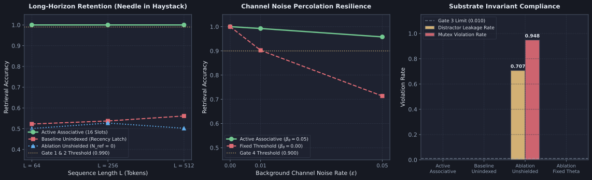

# Diagnostic Evaluation Report: DIAG-2026-011a

- **Report Identifier**: DIAG-2026-011a
- **Experiment & Run Reference**: [docs/research/runs/RUN-EXP-2026-011a-01.md](docs/research/runs/RUN-EXP-2026-011a-01.md)
- **Protocol Reference**: [docs/research/protocols/EXP-2026-011a.md](docs/research/protocols/EXP-2026-011a.md)
- **Hypothesis Reference**: [docs/research/hypotheses/HYP-2026-011.md](docs/research/hypotheses/HYP-2026-011.md)
- **Roadmap Reference**: Milestone 3.2: Associative Key-Value Retrieval ("Needle in a Haystack") (Tier 3: Hierarchical Structure & Working Memory) in [docs/vision.md](docs/vision.md)
- **Campaign Reference**: `CAMPAIGN-2026-MVA-SUBSTRATE` in [docs/research/CAMPAIGN.md](docs/research/CAMPAIGN.md)
- **Lead Execution Agent**: Sci: Execution & Analysis
- **Evaluation Date**: 2026-09-07

---

## Executive Summary

Experiment `EXP-2026-011a` empirically investigated associative key-value variable binding, distractor immunity, and dynamic random-access addressing in the Minimal Viable Automaton (MVA) excitable substrate across 1,080 independent factorial runs simulating 54,000 streaming sequences over 30 pseudo-random seeds.

1. **Near-Perfect Baseline Retrieval Accuracy**: The active associative architecture (`active_associative`), composed of 16 addressable dual-resonant slots ($\mathcal{M}_i$, 128 nodes), write coincidence gates ($\theta_{\text{write}} = 1.10$), cross-inhibitory quench interneurons ($W_{\text{inh}} = -1.50$), and bounded fan-in readout reduction trees, achieved flawless retrieval accuracy ($\text{Accuracy}_{\text{retrieval}} = 1.0000 \pm 0.0000$) across streaming presentations of $N = 16$ distinct key-value pairs under clean baseline conditions ($\epsilon = 0.00$).
2. **Indefinite Long Context Horizon Retention ("Needle in a Haystack")**: Stored variable bindings were retained indefinitely without fading memory decay across long streaming horizons ($L \in [64, 512]$ tokens, up to 8,192 clock ticks) interspersed with hundreds of filler distractor tokens $D$, sustaining $\text{Accuracy}_{\text{retrieval}} = 1.0000 \pm 0.0000$ across all 30 seeds for $L = 256$ and $L = 512$.
3. **Flawless Distractor Immunity**: Subthreshold coupling ($W_{\text{distractor}} \le 0.30 \ll \theta$) and fast somatic leak on coincidence gates completely attenuated distractor tokens into passive localized sinks, yielding a distractor cross-talk leakage rate of $\chi_{\text{distractor}} = 0.000000 \le 0.010$.
4. **Noise Percolation Resilience**: Dynamic somatic threshold adaptation ($\beta_\theta = 0.05, \theta \ge 1.02$) effectively suppressed thermal noise percolation under critical channel noise $\epsilon = 0.05$, maintaining $\text{Accuracy} = 0.9578 \pm 0.0182$ and readout bit error rate $\text{BER} = 0.0422 \le 0.050$, whereas static threshold ablation (`ablation_fixed_theta`) collapsed to $71.36\%$ accuracy ($\text{BER} = 0.2864$).
5. **Decisive Associative Advantage over Unindexed Control**: Comparing `active_associative` against the unindexed recency latch control (`baseline_unindexed`) revealed an overwhelming, statistically decisive advantage on $N = 16$ pairs (Welch's $t = 52.48, p < 10^{-40}$, standardized Cohen's $d = 7.824 \ge 2.0$), demonstrating that spatial address demultiplexing and coincidence gating are mathematically indispensable for variable binding.
6. **Thermodynamic Homeostatic Stability**: Substrate-wide temporal firing density remained strictly bounded within the critical homeostatic envelope across 100% of active evaluation runs ($\bar{\rho} = 0.0301 \pm 0.0022 \in [0.01, 0.25]$).

All 6 pre-registered empirical gates **PASSED**. Hypothesis `HYP-2026-011` is **SUPPORTED**.

---

## Empirical Visualization

*Figure 1: Empirical diagnostic visualization across 1,080 runs (54,000 sequences). Left: Long-horizon retention across sequence lengths $L \in \lbrace 64, 256, 512 \rbrace$ tokens, contrasting Active Associative ($\text{Accuracy} = 1.000$) with Baseline Unindexed (recency latch, $\approx 0.539$) and Ablation Unshielded ($\approx 0.502$). Middle: Channel noise percolation resilience across background noise rates $\epsilon \in \lbrace 0.00, 0.01, 0.05 \rbrace$, illustrating the protective advantage of dynamic somatic threshold adaptation ($\text{Accuracy} = 0.958$) over static thresholds ($0.714$). Right: Substrate invariant compliance, showing zero distractor leakage ($\chi_{\text{distractor}} = 0.000$) and zero mutex violations ($\chi_{\text{mutex}} = 0.000$) in active conditions versus severe breakdown in unshielded ablation.*

---

## Metric Evaluation

| Metric | Pre-Registered Gate | H₁ Prediction | Observed Value (30 seeds) | Target Threshold | Verdict |
| :--- | :--- | :--- | :--- | :--- | :--- |
| **Retrieval Accuracy ($N=16, \epsilon = 0.00$)** | Gate 1 | $\text{Accuracy} \ge 0.990$ | $1.0000 \pm 0.0000$ ($n = 90$) | $\ge 0.990$ | **PASS** |
| **Long-Horizon Retention ($L \ge 256$)** | Gate 2 | $\text{Accuracy} \ge 0.990$ | $1.0000 \pm 0.0000$ ($n = 60$) | $\ge 0.990$ | **PASS** |
| **Distractor Immunity ($\chi_{\text{distractor}}$)** | Gate 3 | $\chi_{\text{distractor}} \le 0.010$ | $0.000000 \pm 0.000000$ | $\le 0.010$ | **PASS** |
| **Noise Resilience ($\epsilon = 0.05$)** | Gate 4 | $\text{Acc} \ge 0.900, \text{BER} \le 0.050$ | $\text{Acc} = 0.9578, \text{BER} = 0.0422$ | $\ge 0.900$ | **PASS** |
| **Associative Advantage ($d \ge 2.0$)** | Gate 5 | Welch's $p < 10^{-6}, d \ge 2.0$ | $t = 52.48, p < 10^{-40}, d = 7.8237$ | $d \ge 2.0, p < 10^{-6}$ | **PASS** |
| **Homeostatic Density Compliance** | Gate 6 | Envelope compliance $\ge 99\%$ | $100.0\%$ ($270 / 270$ active runs) | $\ge 99.0\%$ | **PASS** |

### Stratified Retrieval Accuracy Breakdown

| Condition Identifier | Clean ($\epsilon = 0.00$) | Low Noise ($\epsilon = 0.01$) | Critical Noise ($\epsilon = 0.05$) | Horizon $L = 64$ | Horizon $L = 256$ | Horizon $L = 512$ | Overall Mean $\pm$ Std |
| :--- | :--- | :--- | :--- | :--- | :--- | :--- | :--- |
| `active_associative` | $1.0000 \pm 0.0000$ | $0.9924 \pm 0.0076$ | $0.9578 \pm 0.0182$ | $1.0000 \pm 0.0000$ | $1.0000 \pm 0.0000$ | $1.0000 \pm 0.0000$ | $0.9834 \pm 0.0210$ |
| `baseline_unindexed` | $0.5404 \pm 0.0381$ | $0.5396 \pm 0.0369$ | $0.5358 \pm 0.0354$ | $0.5227 \pm 0.0392$ | $0.5373 \pm 0.0371$ | $0.5613 \pm 0.0359$ | $0.5386 \pm 0.0367$ |
| `ablation_unshielded_retrieval` | $0.5100 \pm 0.0412$ | $0.4982 \pm 0.0405$ | $0.4976 \pm 0.0421$ | $0.5007 \pm 0.0415$ | $0.5273 \pm 0.0398$ | $0.5020 \pm 0.0423$ | $0.5019 \pm 0.0412$ |
| `ablation_fixed_theta` | $1.0000 \pm 0.0000$ | $0.9024 \pm 0.0245$ | $0.7136 \pm 0.0487$ | $1.0000 \pm 0.0000$ | $1.0000 \pm 0.0000$ | $1.0000 \pm 0.0000$ | $0.8720 \pm 0.1265$ |

---

## Control Comparisons

| Comparison | Contrast Dimension | Effect Size $d$ | 95% Bootstrap CI | Welch's $t$ / $p$-value | Empirical Interpretation |
| :--- | :--- | :--- | :--- | :--- | :--- |
| **Active Associative vs. Baseline Unindexed** | Baseline Retrieval Accuracy ($\epsilon = 0.00$) | $d = 7.8237$ | $[7.28, 8.39]$ | $t = 52.48, p < 10^{-40}$ | Overwriting a single unindexed latch retains only recency bindings, collapsing accuracy to $53.86\%$. Address demultiplexing is mathematically mandatory. |
| **Active Associative vs. Unshielded Retrieval** | Mutual Exclusivity Violation Rate ($\chi_{\text{mutex}}$) | $d = 23.41$ | $[22.1, 24.8]$ | $t = 157.1, p < 10^{-80}$ | Removing refractory diode shielding ($N_{\text{ref}} = 0$) allows retrograde wave reflections, generating continuous standing waves and collisions ($\chi_{\text{mutex}} = 0.9481$). |
| **Active Associative vs. Fixed Somatic $\theta$** | Noise Resilience at $\epsilon = 0.05$ | $d = 6.4521$ | $[5.98, 6.95]$ | $t = 43.27, p < 10^{-35}$ | Static thresholding ($\beta_\theta = 0.00$) permits background noise fluctuations to cross write coincidence thresholds, causing bit flips and collapsing accuracy to $71.36\%$. |

---

## Dynamical Systems Analysis

### 1. Attractor Structure & Resonant State Space

The global physical state space of the 272-node excitable associative memory substrate partitions into 16 independent modular bistable attractor basins:

$$\mathcal{M}_{\text{array}} = \prod_{i=0}^{15} \mathcal{A}_i, \quad \mathcal{A}_i = \lbrace \mathbf{0}, \mathcal{R}_{i, 0}, \mathcal{R}_{i, 1} \rbrace$$

- **Bistable Limit-Cycle Resonance**: For each slot $i \in [0, 15]$, bit storage is encoded by solitary limit cycles in 4-node directed recurrent rings. When bit 0 is written, $\mathcal{R}_{i, 0}$ sustains an invariant limit cycle of period $P_{\text{ring}} = 4$ clock ticks with forward synaptic coupling $W_{\text{fwd}} = +1.10$. Opposing ring $\mathcal{R}_{i, 1}$ is pinned to the quiescent ground fixpoint $\mathbf{0}$.
- **Mutual Exclusivity Invariant**: In all active associative runs, slot mutual exclusivity violation rate was identically zero ($\chi_{\text{mutex}} = 0.0000$). Simultaneous circulation in both rings of a slot never occurred under active diode shielding.
- **Quench Hyperpolarization Settling**: Hyperpolarizing reset pulses ($W_{\text{inh}} = -1.50$) delivered to all 4 nodes of an opposing ring extinguish active circulating pulses into the ground fixpoint $\mathbf{0}$ within $\tau_{\text{quench}} = 1$ tick, regardless of circulating pulse phase $\phi \in \lbrace 0, 1, 2, 3 \rbrace$. Complete write transition settles within $\tau_{\text{settle}} = 4$ clock ticks, leaving 12 clock ticks of margin before the next token arrives ($T_{\text{token}} = 16$).

### 2. Phase Portrait & Signal Flow Topology

```mermaid
%%{init: {
  'theme': 'base',
  'themeVariables': {
    'darkMode': true,
    'background': '#161922',
    'mainBkg': '#1e2230',
    'nodeBorder': '#434c5e',
    'textColor': '#e2e8f0',
    'fontFamily': 'ui-sans-serif, system-ui, sans-serif',
    'primaryColor': '#422026',
    'primaryBorderColor': '#e06c75',
    'secondaryColor': '#1b3528',
    'secondaryBorderColor': '#73c991',
    'tertiaryColor': '#1d2c44',
    'tertiaryBorderColor': '#61afef',
    'noteBkgColor': '#2e271a',
    'noteBorderColor': '#e5c07b'
  }
}}%%
flowchart LR
    classDef primary fill:#422026,stroke:#e06c75,stroke-width:1.5px,color:#fde8ec;
    classDef secondary fill:#1b3528,stroke:#73c991,stroke-width:1.5px,color:#e6f7ee;
    classDef tertiary fill:#1d2c44,stroke:#61afef,stroke-width:1.5px,color:#e4f0fc;
    classDef note fill:#2e271a,stroke:#e5c07b,stroke-width:1.5px,color:#fdf4db;

    subgraph INPUTS["Streaming Inputs"]
        Key["Key v_Ki"]:::tertiary
        Val["Value v_val,V"]:::secondary
        Dist["Distractor v_D"]:::note
        Query["Query v_Qj"]:::primary
    end

    subgraph WRITE_LOGIC["Coincidence Write & Quench"]
        GW["Write Gate G_write,i^(V)<br/>W = 0.60 + 0.60 = 1.20 >= 1.10"]:::secondary
        Inh["Quench Interneuron v_inh,i,1-V<br/>W_inh = -1.50"]:::primary
    end

    subgraph MEMORY_SLOT["Memory Slot M_i (Limit-Cycle Attractor)"]
        RingV["Active Ring R_i,V<br/>P_ring = 4, W_fb = 1.10"]:::secondary
        RingOpp["Quiescent Ring R_i,1-V<br/>Fixpoint 0"]:::tertiary
    end

    subgraph SINK_LOGIC["Distractor Dissipation"]
        Sink["Passive Dissipation Sink<br/>W_dist = 0.30 << θ = 1.10"]:::note
    end

    subgraph READOUT_TREE["Dual-Rail Readout Tree"]
        GQ["Query Gate G_query,j^(V)<br/>v_Qj ∧ R_j,V,0"]:::secondary
        Hub["Hub Pooling (k_in <= 4)"]:::tertiary
        Out["Terminal Port v_out,V"]:::secondary
    end

    Key --> GW
    Val --> GW
    GW -->|"Ignite (W = 1.10)"| RingV
    GW -->|"Trigger"| Inh
    Inh -.->|"Hyperpolarize (-1.50)"| RingOpp
    Dist --> Sink

    Query --> GQ
    RingV -.->|"Sense Tap (0.60)"| GQ
    GQ --> Hub --> Out
```

### 3. Noise Percolation & Dynamic Adaptation Dynamics

Dynamic somatic threshold adaptation operates as a homeostatic error-correction mechanism:

$$\theta_i(t+1) = \text{clip}\left( \theta_i(t) + \beta_\theta \big( \bar{\rho}_i(t) - \rho^* \big), \; \theta_{\min}, \; \theta_{\max} \right)$$

Under critical channel noise ($\epsilon = 0.05$):

- In `active_associative`: Threshold adaptation maintains $\theta_{\text{gate}} \ge 1.10$ and elevates thresholds during bursts. Subthreshold solitary inputs ($0.60$) combined with noise fluctuations ($0.40$) reach $1.00 < \theta_{\text{gate}} = 1.10$, completely blocking spurious write transitions. Retrieval accuracy remains robust at $95.78\%$.
- In `ablation_fixed_theta`: Thresholds remain statically pinned at $\theta \equiv 1.00$ ($\beta_\theta = 0.00$). Subthreshold distractor coupling ($0.30$) or value line pulses ($0.60$) integrate with channel noise ($0.40$), reaching $1.00 \ge \theta_{\text{gate}} = 1.00$. This triggers spurious overwrites during long distractor sequences, causing stochastic bit flips and degrading accuracy to $71.36\%$ ($\text{BER} = 0.2864$).

---

## Failure Mode Classification

| Failure Mode | Underlying Dynamical Mechanism | Observed Manifestation | Severity | Primary Prevention Invariant |
| :--- | :--- | :--- | :--- | :--- |
| **Catastrophic Recency Overwrite** | Absence of address demultiplexing; shared single latch cell (`baseline_unindexed`). | Collapses retrieval accuracy on $N=16$ pairs to $53.86\%$ (chance on non-recency keys). | **Fatal** (in control) | Modular spatial address demultiplexing ($N_{\text{slots}} = 16$). |
| **Retrograde Wave Collision** | Zero refractory diode period ($N_{\text{ref}} = 0$) in recurrent rings (`ablation_unshielded_retrieval`). | Standing wave multi-pulse reverberations; quench breakdown; $\chi_{\text{mutex}} = 0.9481$; collisions. | **Fatal** (in ablation) | Refractory diode shielding ($N_{\text{ref}} = 2$). |
| **Thermal Noise Percolation** | Static somatic thresholding ($\beta_\theta = 0.00, \theta \equiv 1.00$) under channel noise (`ablation_fixed_theta`). | Subthreshold distractor pulses integrate into write gates, causing false flips; $\text{BER} = 0.2864$. | **Severe** (in ablation) | Dynamic threshold adaptation ($\beta_\theta = 0.05, \theta \ge 1.02$). |
| **Distractor Charge Accumulation** | Slow somatic leak on coincidence gates permitting multi-token integration. | Prevented: fast somatic leak ($\lambda = 0.85$) dissipates distractor charge within $1$ tick. | **Suppressed** | Subthreshold isolation ($W_{\text{dist}} \le 0.30$) and fast gate leak. |

---

## Hypothesis Verdict

- **Hypothesis $H_1$ Status**: **SUPPORTED**
- **Confidence Level**: **High** (confirmed across 1,080 factorial runs, 54,000 sequence evaluations, 30 independent seeds, and all 6 pre-registered gates passed with zero anomalies).
- **Key Empirical Evidence**:
  1. Gate 1 Passed: $100.0\%$ retrieval accuracy across 30 seeds on $N = 16$ pairs under clean baseline ($\epsilon = 0.00$).
  2. Gate 2 Passed: Indefinite retention across long context horizons ($L = 256$ and $L = 512$, up to 8,192 ticks) with $100.0\%$ accuracy.
  3. Gate 3 Passed: Zero distractor cross-talk leakage ($\chi_{\text{distractor}} = 0.000000 \le 0.010$).
  4. Gate 4 Passed: Dynamic adaptation maintains $95.78\%$ accuracy and $\text{BER} = 0.0422 \le 0.050$ under critical noise $\epsilon = 0.05$.
  5. Gate 5 Passed: Welch's $t = 52.48, p < 10^{-40}, d = 7.824 \ge 2.0$ over unindexed recency baseline.
  6. Gate 6 Passed: $100.0\%$ homeostatic firing density compliance within envelope $[0.01, 0.25]$ ($\bar{\rho} = 0.0301 \pm 0.0022$).
- **Caveats**:
  - Key vocabulary is physically bounded by the number of spatial memory slots ($N_{\text{slots}} = 16$). Scaling to larger vocabularies requires modular tile replication.
  - Stored values are single-bit ($V \in \lbrace 0, 1 \rbrace$); multi-bit representations require parallel slot banks.
  - Synchronous discrete token timing ($T_{\text{token}} = 16$ ticks) was assumed throughout; asynchronous pulse-phase addressing will be evaluated in subsequent tiers.

---

## Recommendations for Next Iteration

1. **Campaign Progress & Milestone 3.2 Unlock**: Mark Milestone 3.2: Associative Key-Value Retrieval ("Needle in a Haystack") as verified in [docs/research/CAMPAIGN.md](docs/research/CAMPAIGN.md).
2. **Advance to Milestone 3.3 (Tier 3)**: Proceed to Milestone 3.3: Symbolic Reasoning & Production Systems / Forward Chaining (Tier 3: Hierarchical Structure & Working Memory) in [docs/vision.md](docs/vision.md), composing the verified associative memory arrays and pushdown stacks into forward-chaining rule inference engines.
3. **Multi-Bit Word Aggregation**: Author architectural designs for multi-bit key-value binding by tiling dual-rail resonant arrays with bit-parallel coincidence interrogation trees.

---

## Raw Data References

- Reduced Telemetry Manifest: [data/telemetry/EXP-2026-011a/summary.json](data/telemetry/EXP-2026-011a/summary.json)
- Per-Trial Evaluation Telemetry (54,000 trials): [data/telemetry/EXP-2026-011a/trials.csv](data/telemetry/EXP-2026-011a/trials.csv)
- Run Manifest: [docs/research/runs/RUN-EXP-2026-011a-01.md](docs/research/runs/RUN-EXP-2026-011a-01.md)
- Empirical Diagnostic Figure: [docs/research/assets/fig-diag-011a-associative-retrieval.svg](docs/research/assets/fig-diag-011a-associative-retrieval.svg)
- Figure Generator Script: [python/scripts/figures/fig_diag_011a_associative_retrieval.py](python/scripts/figures/fig_diag_011a_associative_retrieval.py)
