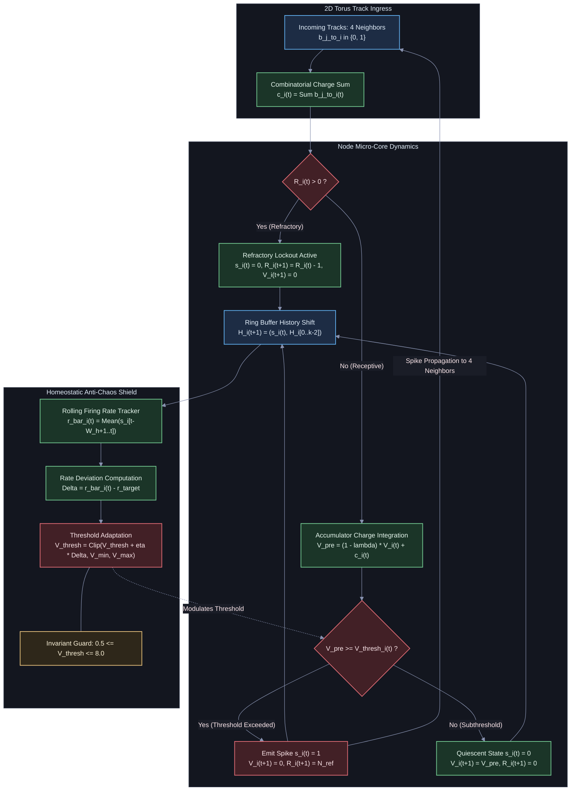

# HYP-2026-001: Local Homeostatic Threshold Regulation for Critical Firing Regimes in Minimal Viable Automata

## Strategic Context

- **Orchestrator Directive:** `CAMPAIGN-2026-MVA-SUBSTRATE`, Sprint 0 (The Minimal Viable Automaton with Homeostatic Anti-Chaos Shield), Complexity Ladder Rung 1.
- **Prior Hypotheses:** Initial hypothesis of the campaign. Graveyard is currently unpopulated. Grounded in the architectural principles of `docs/top-level.md` (Phase 0: The Minimal Viable Automaton).

---

## System Definition

The system is formalized as a synchronous, discrete-time, recurrent cellular automaton defined on a two-dimensional toroidal manifold with localized bit-passing channels and dynamic node thresholds.

### 1. Topology and Lattice Manifold

Let the substrate graph be $\mathcal{G} = (\mathcal{V}, \mathcal{E})$, where $\mathcal{V}$ is a set of $N = 16$ micro-core nodes indexed by coordinate pairs on a discrete 2D torus:

$$\mathcal{V} = \big\lbrace (x, y) \mid x, y \in \mathbb{Z}_4 \big\rbrace \cong \lbrace 0, 1, \dots, 15 \rbrace$$

Flat indexing maps $(x, y) \mapsto i = 4y + x$. Periodic boundary conditions enforce toroidal closure. For any node $i = (x, y)$, the input neighborhood $\mathcal{N}_i$ is defined by the regular von Neumann 4-neighborhood:

$$\mathcal{N}_{(x,y)} = \big\lbrace ((x+1)\bmod 4, y), ((x-1)\bmod 4, y), (x, (y+1)\bmod 4), (x, (y-1)\bmod 4) \big\rbrace$$

Each node possesses in-degree $d_{\text{in}} = 4$ and out-degree $d_{\text{out}} = 4$. The total edge count is $|\mathcal{E}| = 4N = 64$ directed transmission tracks.

### 2. State Space

Time progresses synchronously in discrete ticks $t \in \mathbb{N}_0$. At tick $t$, the state of node $i \in \mathcal{V}$ is defined by the 6-tuple:

$$S_i(t) = \big( s_i(t), V_i(t), R_i(t), H_i(t), \bar{r}_i(t), V_{\text{thresh}, i}(t) \big) \in \mathcal{S}$$

where:

- $s_i(t) \in \lbrace 0, 1 \rbrace$: Binary spike emission at tick $t$.
- $V_i(t) \in \mathbb{R}_{\ge 0}$: Internal membrane accumulator potential (charge counter).
- $R_i(t) \in \lbrace 0, 1, \dots, N_{\text{ref}} \rbrace$: Refractory cooldown counter.
- $H_i(t) \in \lbrace 0, 1 \rbrace^k$: Local $k$-bit ring buffer temporal history ($k = 8$).
- $\bar{r}_i(t) \in [0, 1]$: Rolling firing rate estimated over sliding window $W_h$.
- $V_{\text{thresh}, i}(t) \in [V_{\min}, V_{\max}]$: Dynamic firing threshold.

Transmission tracks transmit a single bit per tick with unit propagation latency:

$$b_{j \to i}(t) = s_j(t-1) \quad \forall (j, i) \in \mathcal{E}$$

The incoming track vector to node $i$ at tick $t$ is denoted $\mathbf{u}_i(t) = \big( b_{j \to i}(t) \big)_{j \in \mathcal{N}_i} \in \lbrace 0, 1 \rbrace^4$.

### 3. Update Operators

The transition function $\Phi: \mathcal{S}^N \to \mathcal{S}^N$ is composed of four deterministic operators applied synchronously:

1. **Incoming Logic Combinator $\mathcal{C}$**: Maps incoming track bits to instantaneous injected charge $c_i(t) = \sum_{j \in \mathcal{N}_i} b_{j \to i}(t) \in \lbrace 0, 1, 2, 3, 4 \rbrace$.
2. **Charge Integration & Leak Operator $\mathcal{I}$**: Integrates $c_i(t)$ with leak factor $\lambda \in [0, 1]$.
3. **Spike & Refractory Emission Operator $\mathcal{S}$**: Evaluates firing condition against $V_{\text{thresh}, i}(t)$, resetting potential and triggering refractory lockout $N_{\text{ref}}$.
4. **Homeostatic Adaptation Operator $\mathcal{T}$**: Regulates $V_{\text{thresh}, i}(t)$ proportionally to deviation $(\bar{r}_i(t) - r_{\text{target}})$.

### 4. Parameter Space

| Parameter | Symbol | Nominal Value / Domain | Physical Interpretation |
| :--- | :--- | :--- | :--- |
| Lattice Size | $N$ | $16$ ($4 \times 4$ torus) | Substrate volume |
| In-Degree | $d$ | $4$ (von Neumann) | Spatial track convergence |
| History Depth | $k$ | $8$ bits | Somatic memory register |
| Refractory Period | $N_{\text{ref}}$ | $\lbrace 1, 2, 3 \rbrace$ ticks | Absolute recovery deadtime |
| Charge Leak | $\lambda$ | $[0.00, 0.20]$ tick$^{-1}$ | Quiescent charge dissipation |
| Target Firing Rate | $r_{\text{target}}$ | $[0.05, 0.20]$ | Critical setpoint target |
| Adaptation Rate | $\eta$ | $[0.005, 0.050]$ | Homeostatic learning rate |
| Sliding Window | $W_h$ | $\lbrace 50, 100, 200 \rbrace$ ticks | Temporal rate integration window |
| Minimum Threshold | $V_{\min}$ | $0.50$ | Non-trivial excitability floor |
| Maximum Threshold | $V_{\max}$ | $8.00$ | Saturation ceiling |

### 5. Architectural Flow Diagram

---

## State Update Equations

At every discrete clock tick $t \ge 0$, for every node $i \in \mathcal{V}$, state transitions evaluate according to the following closed-form update rules:

### 1. Integration and Refractory Dynamics

If $R_i(t) > 0$ (node is in refractory lockout):

$$s_i(t) = 0$$

$$V_i(t+1) = 0$$

$$R_i(t+1) = R_i(t) - 1$$

If $R_i(t) = 0$ (node is receptive to incoming track excitation):

$$c_i(t) = \sum_{j \in \mathcal{N}_i} b_{j \to i}(t)$$

$$V_i^{\text{pre}}(t) = (1 - \lambda) V_i(t) + c_i(t)$$

The spike emission operator evaluates:

$$s_i(t) = \Theta\big( V_i^{\text{pre}}(t) - V_{\text{thresh}, i}(t) \big) = \begin{cases} 1 & \text{if } V_i^{\text{pre}}(t) \ge V_{\text{thresh}, i}(t) \\ 0 & \text{if } V_i^{\text{pre}}(t) < V_{\text{thresh}, i}(t) \end{cases}$$

State variables update post-emission according to:

$$V_i(t+1) = (1 - s_i(t)) \cdot V_i^{\text{pre}}(t)$$

$$R_i(t+1) = s_i(t) \cdot N_{\text{ref}}$$

### 2. History Register Shift

The $k$-bit ring buffer advances by prepending the newest firing decision:

$$H_i(t+1) = \big( s_i(t), H_{i, 0}(t), H_{i, 1}(t), \dots, H_{i, k-2}(t) \big) \in \lbrace 0, 1 \rbrace^k$$

### 3. Rolling Firing Rate Estimation

The instantaneous rolling firing rate $\bar{r}_i(t)$ is computed over sliding window $W_h \in \mathbb{N}$:

$$\bar{r}_i(t) = \frac{1}{W_h} \sum_{\tau=0}^{W_h-1} s_i(t - \tau)$$

For $t < W_h$, the denominator is replaced by $t + 1$.

### 4. Homeostatic Threshold Regulation

The threshold adapts via negative feedback driven by the local firing rate error:

$$V_{\text{thresh}, i}(t+1) = \Pi_{[V_{\min}, V_{\max}]}\Big( V_{\text{thresh}, i}(t) + \eta \cdot \big( \bar{r}_i(t) - r_{\text{target}} \big) \Big)$$

where the projection operator $\Pi_{[a, b]}$ enforces physiological saturation limits:

$$\Pi_{[a, b]}(z) = \max\big(a, \min(z, b)\big)$$

---

## Conservation Rules & Invariants

Throughout the evolution of system trajectory $\mathcal{T} = \lbrace S_i(t) \rbrace_{i \in \mathcal{V}, t \ge 0}$, the following invariants hold strictly:

1. **Refractory Rate Boundedness:** For any node $i$ and tick $t$, if $s_i(t) = 1$, then:

   $$\sum_{\tau=1}^{N_{\text{ref}}} s_i(t + \tau) = 0$$

   Consequently, the maximum allowable instantaneous firing rate is strictly bounded by:

   $$r_{i, \max} \le \frac{1}{N_{\text{ref}} + 1}$$

2. **Threshold Compactness:** Thresholds are bounded in a closed interval:

   $$\forall i \in \mathcal{V}, \forall t \ge 0: \quad V_{\min} \le V_{\text{thresh}, i}(t) \le V_{\max}$$

   ensuring that no node becomes infinitely excitable ($V_{\text{thresh}} \to 0$) or permanently deactivated ($V_{\text{thresh}} \to \infty$).

3. **Membrane Potential Positivity & Non-Overcharging:** Quiescent membrane potential is non-negative and strictly subthreshold:

   $$\forall i \in \mathcal{V}, \forall t \ge 0: \quad 0 \le V_i(t) < V_{\text{thresh}, i}(t)$$

4. **Topological Track Regularity:** The in-degree and out-degree are conserved across all nodes:

   $$\forall i \in \mathcal{V}: \quad \deg_{\text{in}}(i) = \deg_{\text{out}}(i) = 4, \quad |\mathcal{E}| = 64$$

5. **Track Bit Causality and Conservation:** Track transmission is conservative and strictly causal:

   $$\sum_{(j, i) \in \mathcal{E}} b_{j \to i}(t) = 4 \sum_{j \in \mathcal{V}} s_j(t-1)$$

---

## Null Hypothesis (H₀)

Local negative-feedback threshold regulation has no statistically significant stabilizing effect on the recurrent discrete automaton compared to a static threshold baseline ($\eta = 0$) or uncoupled random threshold drift. Formally, for non-zero transient initializations, the substrate under active homeostasis collapses into the all-zeros absorbing state $\mathbf{s}(t) = \mathbf{0}$ or drifts outside the critical band $[0.05, 0.20]$ with a failure rate identical to or exceeding unadapted baselines:

$$\mathbb{P}_{\text{homeo}}\Big( \tau_{\text{extinct}} \le 10^5 \lor \langle \bar{\rho} \rangle \notin [0.05, 0.20] \Big) \ge \mathbb{P}_{\text{fixed}}\Big( \tau_{\text{extinct}} \le 10^5 \lor \langle \bar{\rho} \rangle \notin [0.05, 0.20] \Big)$$

---

## Alternative Hypothesis (H₁)

Local homeostatic threshold regulation operating with adaptation rate $\eta \in [0.005, 0.050]$ and sliding window $W_h \in [50, 200]$ drives the 16-node 2D torus substrate into a self-organized critical state satisfying:

1. **Zero State Extinction:** $\mathbb{P}_{\text{homeo}}(\tau_{\text{extinct}} \le 10^5) = 0$ across all tested pseudo-random seeds ($M \ge 30$).
2. **Zero Runaway Saturation:** $\mathbb{P}_{\text{homeo}}(\exists t \ge 10^3: \bar{\rho}_{W_h}(t) > 0.40) = 0$.
3. **Critical Setpoint Adherence:** The ensemble stationary global firing density $\langle \bar{\rho} \rangle = \frac{1}{T - T_{\text{burn}}} \sum_{t=T_{\text{burn}}}^T \frac{1}{N} \sum_{i=1}^N s_i(t)$ converges to the target setpoint:

   $$\big| \langle \bar{\rho} \rangle - r_{\text{target}} \big| \le 0.03 \quad \text{for } r_{\text{target}} \in [0.08, 0.16]$$

4. **Statistical Separation:** The survival rate and target adherence under active homeostasis demonstrate statistically significant superiority over fixed threshold ($\eta = 0$) and random drift ablations ($p < 10^{-6}$, Fisher's exact test and Mann-Whitney U test).

---

## Quantitative Predictions

1. **Survival Probability Divergence:** For fixed thresholds ($\eta = 0$), $> 90$% of trials will extinguish ($\tau_{\text{extinct}} < 2{,}000$ ticks) when leak $\lambda \ge 0.10$, or lock into high-density periodic limit cycles ($\bar{\rho} > 0.35$) when $\lambda = 0$. Under active homeostasis, 100% of trials survive $10^5$ ticks.
2. **Inverse Variance Scaling:** The temporal variance of network-averaged firing density scales inversely with window length:

   $$\text{Var}_t\big(\bar{\rho}_{W_h}(t)\big) \propto \frac{1}{W_h}$$

   while the steady-state mean satisfies $|\langle \bar{\rho} \rangle - r_{\text{target}}| \le 0.02$.
3. **Open Basin Expansion:** In $(\lambda, V_{\text{thresh}}^{(0)})$ parameter space, the volume of the non-extinct, non-saturated attractor basin expands from a measure-zero boundary under $\eta = 0$ to an open, stable region $\Omega_{\text{crit}}$ spanning the entire tested range $\lambda \in [0.00, 0.20]$ under active homeostasis.
4. **Critical Branching Ratio Convergence:** The network branching parameter:

   $$\sigma(t) = \frac{\sum_{i \in \mathcal{V}} s_i(t)}{\sum_{i \in \mathcal{V}} s_i(t-1) + \epsilon}$$

   converges to the critical transition boundary $\langle \sigma \rangle_{t \ge 10^4} \in [0.95, 1.05]$, indicating true self-organized criticality.

---

## Falsification Criteria

The hypothesis HYP-2026-001 shall be deemed conclusively **refuted** if any of the following conditions occur during empirical evaluation:

1. **Absorbing Extinction Failure:** Active homeostatic runs suffer complete state collapse (all-zeros $\mathbf{s}_i(t) = 0$ for all $i$ sustained for $L_{\text{ext}} = 100$ consecutive ticks) in $\ge 5$% of tested seeds ($M \ge 30$) under nominal settings ($\lambda \in [0.05, 0.10], N_{\text{ref}} \in \lbrace 1, 2 \rbrace, r_{\text{target}} \in [0.08, 0.16]$).
2. **Runaway Saturation Failure:** Active homeostatic runs sustain rolling density $\bar{\rho}_{W_h}(t) > 0.40$ for $L_{\text{sat}} = 200$ consecutive ticks in $\ge 5$% of tested seeds.
3. **Setpoint Drift Failure:** The stationary mean firing density deviates from $r_{\text{target}}$ by more than $0.05$ (i.e., $|\langle \bar{\rho} \rangle - r_{\text{target}}| > 0.05$) across the nominal parameter grid.
4. **Indistinguishability from Random Drift:** A two-sample Kolmogorov-Smirnov test comparing the empirical distribution of $\bar{\rho}_{W_h}$ under active homeostasis against the random threshold drift ablation yields $p \ge 0.01$.

---

## Mathematical Failure Boundaries

The homeostatic mechanism is proven to fail under the following analytical regimes:

1. **Refractory Capacity Ceiling:** If $N_{\text{ref}} \ge \frac{1}{r_{\text{target}}} - 1$, the theoretical maximum firing rate $\frac{1}{N_{\text{ref}} + 1} \le r_{\text{target}}$. In this regime, the target rate is physically inaccessible, forcing $V_{\text{thresh}} \to V_{\min}$ permanently without reaching setpoint equilibrium.
2. **Overdamping / Bifurcation Instability:** If the adaptation rate exceeds critical damping:

   $$\eta > \eta_{\text{crit}} \approx \frac{V_{\max} - V_{\min}}{W_h \cdot r_{\text{target}}}$$

   the threshold dynamics undergo a period-doubling bifurcation, causing catastrophic threshold chattering between $V_{\min}$ and $V_{\max}$, generating burst-and-quench limit cycles.
3. **Absorbing Boundary Trapping:** Because spontaneous ignition noise is zero during autonomous relaxation, if all nodes simultaneously reach $s_i(t) = 0$ with $V_i(t) = 0$, the state $\mathbf{S} = \mathbf{0}$ is an absorbing fixpoint. Although $V_{\text{thresh}}$ decrements to $V_{\min} > 0$, no spike can ever be generated without external drive.

---

## Assumptions & Limitations

1. **Symmetric Homogeneous Lattice:** The $4 \times 4$ torus has uniform degree ($d=4$) and identical node parameters. Heterogeneous topologies (scale-free, small-world) may exhibit localized hot spots or silent clusters.
2. **Synchronous Discrete Clock:** Computation assumes zero clock skew and deterministic unit propagation delay. Real physical substrates exhibit stochastic delay jitter.
3. **Finite-Size Susceptibility:** With $N = 16$ nodes, finite-size fluctuations are non-negligible; simultaneous refractory alignment can lead to stochastic extinction.

---

## Open Questions

1. **Attractor Separation Capacity:** Does the homeostatic anti-chaos shield preserve input-specific attractor trajectories for distinct sensory input patterns (Sprint 1), or does it wash out memory via threshold homogenizing?
2. **Carrier-Assisted Resilience:** Does an ultra-sparse stochastic background carrier ($p_{\text{carrier}} \in [10^{-4}, 10^{-3}]$) eliminate absorbing boundary trapping without disrupting self-organized criticality?
