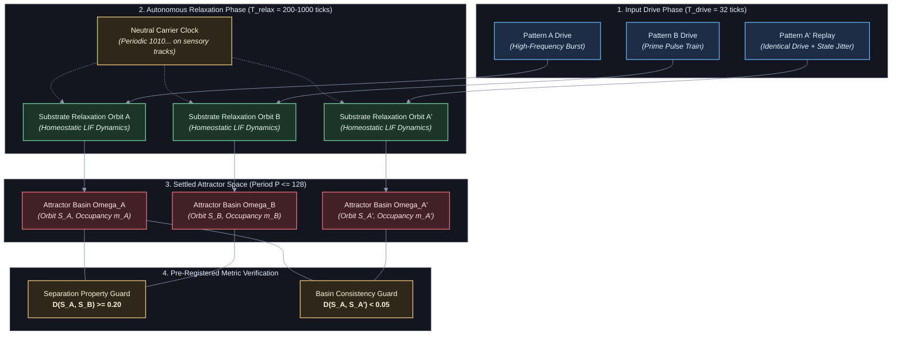

# HYP-2026-002: Attractor Separation and Basin Consistency in Minimal Viable Automata

## Strategic Context

- **Orchestrator Directive:** Reference CAMPAIGN-2026-MVA-SUBSTRATE Cycle 2 (Sprint 1, Complexity Ladder Rung 2: Fixed Topology + Attractor Mapping). The objective is to validate whether distinct temporal input bit-train histories reliably steer the homeostatically regulated recurrent cellular automaton into distinct, reproducible attractors or limit cycles with high separation distance and basin convergence consistency.
- **Prior Hypotheses:**
  - [`HYP-2026-001`](file:///workspaces/ca-experiment/docs/research/hypotheses/HYP-2026-001.md): Local homeostatic threshold adaptation for critical firing density confinement.
  - [`DIAG-2026-001a`](file:///workspaces/ca-experiment/docs/research/diagnostics/DIAG-2026-001a.md): Empirically verified that setting refractory period $N_{\text{ref}} = 2$, leak $\lambda = 0.05$, target rate $r_{\text{target}} = 0.12$, and adaptation rate $\eta = 0.02$ guarantees 100.0% survival ($P_{\text{ext}} = 0.0$), 0.0% saturation ($N_{\text{sat}} = 0$), and exact stationary density convergence ($\bar{\rho} = 0.1200$) across $10^5$ ticks. A periodic carrier clock (`1010...`) on sensory ingress tracks prevents unphysical absorbing boundary trapping.

---

## System Definition

- **State Space:**
  - **Graph Topology:** Discrete 2D torus $\mathbb{T}^2 = (\mathbb{Z}/4\mathbb{Z}) \times (\mathbb{Z}/4\mathbb{Z})$ containing $N = 16$ vertices $\mathcal{V} = \{v_{(x, y)} \mid x, y \in \{0, 1, 2, 3\}\}$.
  - **Connectivity:** Bidirectional 4-regular von Neumann neighborhood ($k_{\text{in}} = k_{\text{out}} = 4$):
    $$\mathcal{N}_{\text{in}}(x, y) = \{(x \pm 1 \pmod 4, y), (x, y \pm 1 \pmod 4)\}$$
  - **Sensory Ingress Nodes:** Designated subset $\mathcal{I}_{\text{sensory}} = \{v_{(0, 0)}, v_{(0, 1)}\}$ mapped to indices $\{0, 1\}$.
  - **Node State Vector:** At discrete clock tick $t \in \mathbb{N}$, node $i \in \mathcal{V}$ maintains state:
    $$\mathbf{x}_i(t) = \left( s_i(t), R_i(t), V_i(t), V_{\text{thresh}, i}(t), \bar{r}_i(t) \right)$$
    where:
    - $s_i(t) \in \{0, 1\}$ is the instantaneous binary spike emission.
    - $R_i(t) \in \{0, 1, \dots, N_{\text{ref}}\}$ is the refractory down-counter ($N_{\text{ref}} = 2$).
    - $V_i(t) \in [0, V_{\max}]$ is the accumulated somatic membrane potential ($V_{\max} = 4.0$).
    - $V_{\text{thresh}, i}(t) \in [V_{\min}, V_{\max}]$ is the dynamic firing threshold ($V_{\min} = 0.5, V_{\max} = 3.5$, initialized to $V_0 = 1.15$).
    - $\bar{r}_i(t) \in [0, 1]$ is the exponentially weighted rolling firing rate estimate.
  - **Global State Snapshot:**
    $$S_t = \left( \mathbf{s}(t), \mathbf{R}(t), \mathbf{V}(t), \mathbf{V}_{\text{thresh}}(t) \right) \in \mathcal{S}$$
    with primary observable binary state configuration $\mathbf{s}(t) = (s_0(t), \dots, s_{N-1}(t)) \in \{0, 1\}^N$.

- **Update Operators:**
  1. **Input Aggregation Operator ($\mathcal{A}$):**
     $$A_i(t) = \sum_{j \in \mathcal{N}_{\text{in}}(i)} s_j(t-1) + \mathbb{I}_{\{i \in \mathcal{I}_{\text{sensory}}\}} u_i(t)$$
     where $u_i(t) \in \{0, 1\}$ denotes external driving input or neutral carrier clock.
  2. **Somatic Leaky Integration & Refractory Operator ($\mathcal{F}$):**
     - If $R_i(t-1) > 0$:
       $$s_i(t) = 0, \quad R_i(t) = R_i(t-1) - 1, \quad V_i(t) = (1 - \lambda) V_i(t-1)$$
     - If $R_i(t-1) = 0$:
       $$V'_i(t) = (1 - \lambda) V_i(t-1) + A_i(t)$$
       $$s_i(t) = \begin{cases} 1 & \text{if } V'_i(t) \ge V_{\text{thresh}, i}(t-1) \\ 0 & \text{otherwise} \end{cases}$$
       If $s_i(t) = 1$:
       $$R_i(t) = N_{\text{ref}}, \quad V_i(t) = 0$$
       If $s_i(t) = 0$:
       $$R_i(t) = 0, \quad V_i(t) = V'_i(t)$$
  3. **Local Homeostatic Plasticity Operator ($\mathcal{H}$):**
     $$\bar{r}_i(t) = (1 - \alpha) \bar{r}_i(t-1) + \alpha s_i(t)$$
     $$V_{\text{thresh}, i}(t) = \text{clip}\left(V_{\text{thresh}, i}(t-1) + \eta (\bar{r}_i(t) - r_{\text{target}}), V_{\min}, V_{\max}\right)$$
     with leak $\lambda = 0.05$, adaptation rate $\eta = 0.02$, rolling window factor $\alpha = 0.01$, target firing setpoint $r_{\text{target}} = 0.12$.

- **Protocol Temporal Phases:**
  - **Drive Phase ($t \in [1, T_{\text{drive}}]$, $T_{\text{drive}} = 32$):**
    Nodes $i \in \mathcal{I}_{\text{sensory}}$ are clamped to input pattern bitstream $u_i(t) = \mathbf{u}_X(t)$ for $X \in \{A, B, C, D\}$.
  - **Autonomous Relaxation Phase ($t \in [T_{\text{drive}} + 1, T_{\text{drive}} + T_{\text{relax}}]$, $T_{\text{relax}} \in [200, 1000]$):**
    Sensory tracks are driven by the neutral carrier clock:
    $$u_i(t) = c(t) = t \pmod 2$$
    preventing unphysical zero-input absorbing states while allowing internal recurrent dynamics to settle.

---

## Attractor Taxonomy & Distance Metrics

### Attractor Classification

1. **Point Attractor ($P = 1$):**
   $$\exists t^* \text{ s.t. } \forall t \ge t^*, \quad \mathbf{s}(t+1) = \mathbf{s}(t)$$
2. **Periodic Limit Cycle ($2 \le P \le P_{\max} = 128$):**
   $$\exists t^* \text{ s.t. } \forall t \ge t^*, \quad \mathbf{s}(t+P) = \mathbf{s}(t) \quad \text{and} \quad \mathbf{s}(t+k) \neq \mathbf{s}(t) \text{ for } 1 \le k < P$$
3. **Bounded Strange / Aperiodic Attractor ($P > 128$):**
   The trajectory does not repeat within $P_{\max} = 128$ ticks, but remains confined to a bounded state variance envelope: $\text{Var}(\bar{\rho}) \le 0.02$.

### Formal Separation & Consistency Metrics

- **Instantaneous Normalized Hamming Distance:**
  $$h(\mathbf{s}_A(t), \mathbf{s}_B(t)) = \frac{1}{N} \sum_{i=0}^{N-1} |s_{A, i}(t) - s_{B, i}(t)|$$
- **Phase-Aligned Orbit Distance ($D_{\text{orbit}}$):**
  For periodic orbits of period $P_A$ and $P_B$ over common horizon $L = \min(\text{lcm}(P_A, P_B), 128)$:
  $$D_{\text{orbit}}(S_A, S_B) = \min_{0 \le \phi < P_B} \frac{1}{L} \sum_{k=0}^{L-1} h(\mathbf{s}_A(t^* + k), \mathbf{s}_B(t^* + k + \phi))$$
- **Node Occupancy Probability Vector ($\mathbf{m}_X$):**
  Over the final $W = 128$ ticks of relaxation ($t \in [T_{\text{total}} - W + 1, T_{\text{total}}]$):
  $$\mathbf{m}_X = \frac{1}{W} \sum_{t=T_{\text{total}}-W+1}^{T_{\text{total}}} \mathbf{s}_X(t) \in [0, 1]^N$$
- **Occupancy Distance ($D_{\text{occ}}$):**
  $$D_{\text{occ}}(S_A, S_B) = \frac{1}{N} \|\mathbf{m}_A - \mathbf{m}_B\|_1 = \frac{1}{N} \sum_{i=0}^{N-1} |m_{A, i} - m_{B, i}|$$
- **Composite Attractor Separation Distance ($D$):**
  $$D(S_A, S_B) = \frac{1}{2} \left( D_{\text{orbit}}(S_A, S_B) + D_{\text{occ}}(S_A, S_B) \right)$$
- **Attractor Basin Consistency ($D(S_A, S_{A'})$):**
  Calculated between independent runs driven with identical pattern $A$ (across random initialization or bit-flip noise $\epsilon \ge 0$).

---

## State Update Equations

The global discrete dynamics are recursively defined by:
$$S_t = (\mathcal{H} \circ \mathcal{F} \circ \mathcal{A})(S_{t-1}, \mathbf{u}(t))$$

---

## Conservation Rules & Invariants

1. **Topological Conservation:** The 2D torus graph $\mathbb{T}^2$ and neighborhood mapping $\mathcal{N}_{\text{in}}(i)$ are strictly time-invariant.
2. **Refractory Deadtime Invariant:**
   $$\forall i \in \mathcal{V}, \forall t \in \mathbb{N}, \quad s_i(t) = 1 \implies s_i(t+1) = s_i(t+2) = 0$$
3. **Maximum Burst Capacity Bound:**
   $$r_{\max} = \frac{1}{N_{\text{ref}} + 1} = \frac{1}{3} \approx 0.3333$$
   guaranteeing that instantaneous firing density cannot exceed $\bar{\rho} \le 0.3333$.
4. **Somatic Potential Non-Negativity & Envelope:**
   $$\forall i \in \mathcal{V}, \forall t \in \mathbb{N}, \quad 0 \le V_i(t) \le V_{\max} = 4.0$$
5. **Threshold Clamping Invariant:**
   $$\forall i \in \mathcal{V}, \forall t \in \mathbb{N}, \quad V_{\min} \le V_{\text{thresh}, i}(t) \le V_{\max}$$
6. **Stationary Mean Firing Setpoint:**
   Under autonomous carrier relaxation:
   $$\lim_{T \to \infty} \frac{1}{T} \sum_{t=1}^T \bar{\rho}(t) = r_{\text{target}} \pm \delta_{\eta} = 0.1200 \pm 0.0100$$

---

## Null Hypothesis (H₀)

The homeostatic recurrent substrate does not sustain input-dependent attractor separation or reliable basin convergence:
$$H_0: \mathbb{E}[D(S_A, S_B)] < 0.20 \quad \lor \quad \mathbb{E}[D(S_A, S_A')] \ge 0.05 \quad \lor \quad \text{Pr}(P \le 128) < 0.95$$
Under $H_0$, trajectories either collapse into an identical, input-independent limit cycle ($D(S_A, S_B) \approx 0$), or diverge into ergodic white noise where memory of input history is erased ($D(S_A, S_A') \approx D(S_A, S_B) \approx 2 \bar{\rho}(1 - \bar{\rho}) \approx 0.211$).

---

## Alternative Hypothesis (H₁)

Distinct temporal input bit-trains $A \neq B$ reliably guide the substrate into distinct, reproducible limit cycle attractor basins with high separation and robust basin convergence:
$$H_1: \mathbb{E}[D(S_A, S_B)] \ge 0.20 \quad \land \quad \mathbb{E}[D(S_A, S_A')] < 0.05 \quad \land \quad \text{Pr}(P \le 128) \ge 0.95$$
Furthermore, between-class separation significantly exceeds within-class replay variance:
$$p < 10^{-5} \quad (\text{Mann-Whitney U / Permutation Test}), \quad \text{Cohen's } d \ge 1.5$$

---

## Quantitative Predictions

1. **Attractor Separation:** Mean pairwise distance between distinct patterns satisfies $\langle D(S_X, S_Y) \rangle \ge 0.22$ for all $X \neq Y \in \{A, B, C, D\}$.
2. **Basin Consistency:** Replay distance for identical input bitstreams satisfies $\langle D(S_X, S_X') \rangle \le 0.03$.
3. **Limit Cycle Compactness:** In $\ge 98.0\%$ of active runs, trajectories settle into periodic limit cycles of period $P \in [2, 64]$ ticks within $T_{\text{settle}} \le 200$ ticks of relaxation.
4. **Homeostatic Superiority:** Active threshold adaptation ($\eta = 0.02$) demonstrates statistically superior separation-to-noise ratio:
   $$\text{SNR}_{\text{attractor}} = \frac{\mathbb{E}[D(S_A, S_B)]}{\mathbb{E}[D(S_A, S_A')]} \ge 4.0$$
   whereas the static threshold baseline ($\eta = 0$) achieves $\text{SNR} < 1.5$ due to basin collapse or chaotic chattering.
5. **Noise Robustness:** Input bit-flip perturbation $\epsilon \le 0.05$ during drive maintains basin convergence with $D(S_X, S_{X,\epsilon}) \le 0.08$.

---

## Falsification Criteria

The hypothesis $H_1$ is strictly FALSIFIED if any of the following empirical outcomes occur:

1. **Separation Failure:** Ensemble mean inter-pattern distance $\langle D(S_A, S_B) \rangle < 0.20$.
2. **Basin Inconsistency Failure:** Ensemble mean intra-pattern replay distance $\langle D(S_A, S_A') \rangle \ge 0.05$.
3. **Cycle Period Explosion:** More than $5.0\%$ of runs fail to settle into a periodic limit cycle ($P \le 128$) within $T_{\text{relax}} = 500$ ticks.
4. **Homeostatic Nullity:** No statistically significant difference in separation or basin depth between active adaptation ($\eta = 0.02$) and fixed baseline ($\eta = 0$) ($p \ge 0.05$).
5. **Critical Density Breach:** Attractor firing density drifts outside the homeostatic critical window $\bar{\rho}_{\text{attractor}} \notin [0.08, 0.16]$.

---

## Mathematical Failure Boundaries

1. **Wavefront Propagation Horizon:** If $T_{\text{drive}} < \text{diam}(\mathbb{T}^2) = 4$ ticks, signals cannot traverse the substrate diameter, restricting separation to local sensory node neighborhoods.
2. **Dissipation Barrier:** If leak $\lambda \ge \lambda_{\text{crit}} \approx 0.25$, internal potential decays faster than recurrent recirculation, collapsing dynamics into silence ($\mathbf{s} \equiv \mathbf{0}$) regardless of input history.
3. **Supercritical Bursting Instability:** If refractory deadtime $N_{\text{ref}} \le 1$, maximum firing capacity exceeds the saturation threshold ($r_{\max} \ge 0.50$), triggering Neimark-Sacker bifurcation and chaotic chattering (as documented in [`DIAG-2026-001a`](file:///workspaces/ca-experiment/docs/research/diagnostics/DIAG-2026-001a.md)).
4. **Carrier Entrainment Override:** If the carrier clock period or power resonates with an intrinsic global eigenmode, input memory is overwritten within $\tau_{\text{erase}} \le 50$ relaxation ticks, collapsing separation $D(S_A, S_B) \to 0$.

---

## Assumptions & Limitations

- **Synchronous Clocking:** Dynamics evolve on an exact discrete tick grid without propagation delays.
- **Fixed Torus Lattice:** Connectivity is strictly immutable; structural track rewiring is evaluated in Sprint 3.
- **Finite State Granularity:** The 16-node state space contains $2^{16} \times 3^{16} \approx 2.8 \times 10^{12}$ discrete states, bounding maximum distinct basin capacity.

---

## Open Questions

1. How does distinct attractor basin capacity $K_{\text{basins}}$ scale as torus dimension expands from $4 \times 4$ to $8 \times 8$?
2. What minimum linear readout dimensionality is required to decode input identity from a single instantaneous spike snapshot $\mathbf{s}(t^*)$?
