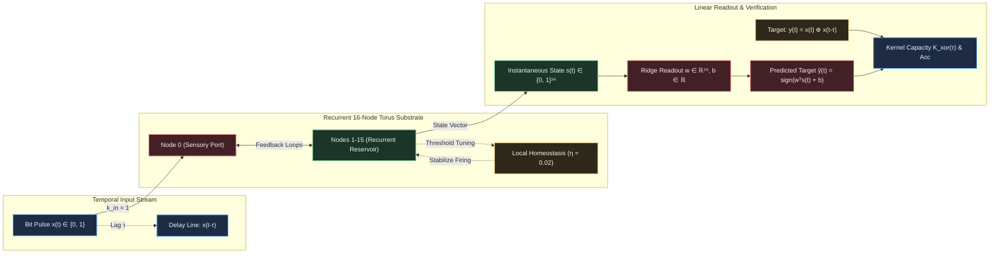

# HYP-2026-003: Non-Linear Temporal Mixing and Delayed XOR Computation in Homeostatic Cellular Automata Substrates

## Strategic Context

- **Orchestrator Directive:** `CAMPAIGN-2026-MVA-SUBSTRATE` Cycle 3 (Sprint 2: Temporal XOR Task, Complexity Ladder Rung 3).
- **Prior Hypotheses:**
  - [`HYP-2026-001`](file:///workspaces/ca-experiment/docs/research/hypotheses/HYP-2026-001.md): Verified homeostatic stability at critical firing density $\bar{\rho} \in [0.05, 0.20]$ with zero extinctions and zero saturations across $10^5$ ticks ($N_{\text{ref}} = 2, \lambda = 0.05, r_{\text{target}} = 0.12, \eta = 0.02$; [`DIAG-2026-001a`](file:///workspaces/ca-experiment/docs/research/diagnostics/DIAG-2026-001a.md)).
  - [`HYP-2026-002`](file:///workspaces/ca-experiment/docs/research/hypotheses/HYP-2026-002.md): Verified attractor multistability and separation property ($D(S_A, S_B) > 0$, $p < 10^{-12}$, SNR = 3.63, basin consistency $0.0115 < 0.05$; [`DIAG-2026-002a`](file:///workspaces/ca-experiment/docs/research/diagnostics/DIAG-2026-002a.md)).

---

## System Definition

### Topology

The substrate $\mathcal{G} = (\mathcal{V}, \mathcal{E})$ is a 2-dimensional toroidal cellular lattice consisting of $N = 16$ discrete nodes arranged on a $4 \times 4$ periodic grid:
$$\mathcal{V} = \lbrace 0, 1, \dots, N-1 \rbrace$$
Each node $i \in \mathcal{V}$ is indexed by coordinate $(u_i, v_i) \in \mathbb{Z}_4 \times \mathbb{Z}_4$ with $u_i = i \bmod 4$ and $v_i = \lfloor i / 4 \rfloor$. Node $i$ has four orthogonal nearest neighbors with periodic wrap-around:
$$\mathcal{N}_i = \left\lbrace j \in \mathcal{V} \mid (u_j, v_j) \in \lbrace ((u_i \pm 1) \bmod 4, v_i), (u_i, (v_i \pm 1) \bmod 4) \rbrace \right\rbrace$$
Thus, the graph is 4-regular with degree $|\mathcal{N}_i| = 4$ for all $i$.

### State Space

At each integer clock tick $t \in \mathbb{N}_0$, the system state is defined by the tuple $\mathbf{S}(t) = (\mathbf{s}(t), \mathbf{V}(t), \mathbf{R}(t), \boldsymbol{\theta}(t), \bar{\mathbf{r}}(t))$ where:

- $\mathbf{s}(t) = [s_0(t), s_1(t), \dots, s_{N-1}(t)]^T \in \lbrace 0, 1 \rbrace^N$: Instantaneous binary firing state vector.
- $\mathbf{V}(t) = [V_0(t), V_1(t), \dots, V_{N-1}(t)]^T \in \mathbb{R}_{\ge 0}^N$: Internal membrane charge accumulators.
- $\mathbf{R}(t) = [R_0(t), R_1(t), \dots, R_{N-1}(t)]^T \in \lbrace 0, 1, \dots, N_{\text{ref}} \rbrace^N$: Integer refractory down-counters.
- $\boldsymbol{\theta}(t) = [\theta_0(t), \theta_1(t), \dots, \theta_{N-1}(t)]^T \in [\theta_{\min}, \theta_{\max}]^N$: Adaptive firing thresholds.
- $\bar{\mathbf{r}}(t) = [\bar{r}_0(t), \bar{r}_1(t), \dots, \bar{r}_{N-1}(t)]^T \in [0, 1]^N$: Exponential moving average firing rate estimates.

### Input Ingress

A discrete binary stream $\lbrace x_t \rbrace_{t \ge 0}$ with $x_t \in \lbrace 0, 1 \rbrace$ is injected at sensory port node $\iota_{\text{sensory}} = 0$.
The input stream is generated by an independent and identically distributed Bernoulli process with pulse density $p_x = P(x_t = 1) \in (0, 1)$.
An input coupling scalar $k_{\text{in}} \in \lbrace 0, 1 \rbrace$ gates the ingress:
$$u_i(t) = k_{\text{in}} \cdot x_t \cdot \mathbb{I}(i = \iota_{\text{sensory}})$$

### Linear Readout Layer

Let the observed instantaneous state vector at tick $t$ be $\mathbf{s}(t) \in \lbrace 0, 1 \rbrace^N$. The linear readout maps $\mathbf{s}(t)$ to an activation scalar $\hat{a}_t \in \mathbb{R}$ and a predicted binary decision $\hat{y}_t \in \lbrace 0, 1 \rbrace$:
$$\hat{a}_t = \mathbf{w}^T \mathbf{s}(t) + b$$
$$\hat{y}_t = \mathbb{I}(\hat{a}_t \ge 0.5) = \frac{1 + \text{sign}(\mathbf{w}^T \mathbf{s}(t) + b - 0.5)}{2}$$
where weights $\mathbf{w} \in \mathbb{R}^N$ and bias $b \in \mathbb{R}$ are obtained by minimizing regularized mean squared error over a training window.

---

## State Update Equations

For each node $i \in \mathcal{V}$ at time $t \to t+1$:

### 1. Synaptic & Sensory Aggregation

The aggregated incoming charge from recurrent neighbor tracks and sensory ingress is:
$$A_i(t) = \sum_{j \in \mathcal{N}_i} s_j(t) + u_i(t)$$

### 2. Refractory & Membrane Potential Dynamics

If the node is refractory ($R_i(t) > 0$):
$$s_i(t+1) = 0$$
$$R_i(t+1) = R_i(t) - 1$$
$$V_i(t+1) = \max(0, (1 - \lambda) V_i(t))$$

If the node is excitable ($R_i(t) = 0$):
$$V_{\text{pre}, i}(t+1) = (1 - \lambda) V_i(t) + A_i(t)$$
$$s_i(t+1) = \begin{cases} 1 & \text{if } V_{\text{pre}, i}(t+1) \ge \theta_i(t) \\ 0 & \text{otherwise} \end{cases}$$
$$R_i(t+1) = \begin{cases} N_{\text{ref}} & \text{if } s_i(t+1) = 1 \\ 0 & \text{otherwise} \end{cases}$$
$$V_i(t+1) = \begin{cases} 0 & \text{if } s_i(t+1) = 1 \\ V_{\text{pre}, i}(t+1) & \text{otherwise} \end{cases}$$
where $\lambda \in [0, 1]$ is the leak factor and $N_{\text{ref}} \in \mathbb{N}_0$ is the refractory duration.

### 3. Homeostatic Rate Tracking & Threshold Adaptation

Each node updates its local firing rate estimate via an exponential moving average with smoothing factor $\alpha_r \in (0, 1)$:
$$\bar{r}_i(t+1) = (1 - \alpha_r) \bar{r}_i(t) + \alpha_r s_i(t+1)$$
The dynamic firing threshold $\theta_i(t+1)$ adjusts with plasticity rate $\eta \ge 0$:
$$\theta_i(t+1) = \text{clip}\left(\theta_i(t) + \eta (\bar{r}_i(t+1) - r_{\text{target}}), \theta_{\min}, \theta_{\max}\right)$$
When $\eta = 0$ (static threshold ablation), $\theta_i(t+1) = \theta_i(0)$.

---

## Conservation Rules & Invariants

1. **State Boundedness Invariant:** For all $t \ge 0$ and all $i \in \mathcal{V}$:
   $$s_i(t) \in \lbrace 0, 1 \rbrace, \quad R_i(t) \in \lbrace 0, \dots, N_{\text{ref}} \rbrace, \quad \theta_i(t) \in [\theta_{\min}, \theta_{\max}]$$
2. **Deterministic Dynamical Trajectory:** Given initial conditions $\mathbf{S}(0)$ and input sequence $\lbrace x_t \rbrace_{t=0}^T$, the trajectory $\lbrace \mathbf{S}(t) \rbrace_{t=0}^T$ is strictly deterministic.
3. **Causal Information Horizon:** The state $\mathbf{S}(t)$ is a strict causal functional of past inputs:
   $$\mathbf{S}(t) = \mathcal{F}(\mathbf{S}(0), x_0, x_1, \dots, x_{t-1})$$
4. **Homeostatic Critical Firing Invariant:** Over an evaluation window of length $T_{\text{eval}} \ge 1,000$ ticks, the spatial and temporal mean firing density $\bar{\rho} = \frac{1}{N \cdot T_{\text{eval}}} \sum_{t=1}^{T_{\text{eval}}} \sum_{i=0}^{N-1} s_i(t)$ satisfies:
   $$0.05 \le \bar{\rho} \le 0.20$$
   guaranteeing zero complete extinction ($\bar{\rho} = 0$) and zero epileptic runaway ($\bar{\rho} > 0.40$).

---

## Mathematical Definitions of Key Capacities

### Target Temporal XOR Function

For a specified delay $\tau \in \mathbb{N}_{\ge 1}$, the target variable $y_t \in \lbrace 0, 1 \rbrace$ is defined by:
$$y_t = x_t \oplus x_{t-\tau} = x_t (1 - x_{t-\tau}) + (1 - x_t) x_{t-\tau} = x_t + x_{t-\tau} - 2 x_t x_{t-\tau}$$
In bipolar coordinates where $\tilde{x}_t = 2 x_t - 1 \in \lbrace -1, +1 \rbrace$ and $\tilde{y}_t = 2 y_t - 1 \in \lbrace -1, +1 \rbrace$:
$$\tilde{y}_t = - \tilde{x}_t \cdot \tilde{x}_{t-\tau}$$

### Non-Linear Kernel Expansion Property

In the bipolar basis, the delayed XOR target is a pure degree-2 Walsh polynomial cross-term.
For independent Bernoulli inputs with $p_x = 0.5$:
$$\mathbb{E}[\tilde{y}_t] = 0, \quad \mathbb{E}[\tilde{y}_t \tilde{x}_{t-k}] = 0 \quad \forall k \ge 0$$
Consequently, the projection of $y_t$ onto the linear span of the raw input history is identically zero:
$$\min_{\mathbf{u} \in \mathbb{R}^{H+1}, c \in \mathbb{R}} \mathbb{E}\left[ \left( y_t - \left(\sum_{k=0}^H u_k x_{t-k} + c\right) \right)^2 \right] = \text{Var}(y_t) = \frac{1}{4}$$
A direct linear classifier on raw input history has an asymptotic accuracy bounded strictly by chance:
$$\text{Acc}_{\text{direct-linear}} = 0.50$$

### Fading Memory Capacity ($M_\tau$)

For any integer delay $\tau \ge 1$, let $\hat{x}_{t-\tau} = \mathbf{w}_{\text{id}}^T \mathbf{s}(t) + b_{\text{id}}$ be the optimal linear reconstruction of the past input bit $x_{t-\tau}$ from the instantaneous substrate state $\mathbf{s}(t)$. The fading memory capacity at delay $\tau$ is defined as the determination coefficient:
$$M_\tau = \frac{\text{Cov}^2(x_{t-\tau}, \hat{x}_{t-\tau})}{\text{Var}(x_{t-\tau}) \text{Var}(\hat{x}_{t-\tau})} = 1 - \frac{\sum_{t=1}^T (x_{t-\tau} - \hat{x}_{t-\tau})^2}{\sum_{t=1}^T (x_{t-\tau} - \bar{x})^2} \in [0, 1]$$

### Non-Linear Kernel Capacity ($K_{\text{xor}}(\tau)$)

The non-linear XOR kernel capacity at delay $\tau$ is the determination coefficient of the linear readout $\hat{a}_t = \mathbf{w}^T \mathbf{s}(t) + b$ predicting $y_t = x_t \oplus x_{t-\tau}$:
$$K_{\text{xor}}(\tau) = 1 - \frac{\sum_{t=1}^T (y_t - \hat{a}_t)^2}{\sum_{t=1}^T (y_t - \bar{y})^2} \in (-\infty, 1]$$
And the classification accuracy over $T_{\text{test}}$ ticks is:
$$\text{Acc}_{\text{xor}}(\tau) = \frac{1}{T_{\text{test}}} \sum_{t=1}^{T_{\text{test}}} \mathbb{I}(\hat{y}_t = y_t)$$

---

## Null Hypothesis (H₀)

The 16-node homeostatic cellular automaton substrate cannot simultaneously sustain memory of past inputs and perform non-linear feature mixing across a delay of $\tau \ge 5$ ticks. Specifically, for any linear readout trained on the instantaneous binary state $\mathbf{s}(t)$, the test accuracy on the delayed XOR task does not exceed chance expectation:
$$H_0: \quad \mathbb{E}[\text{Acc}_{\text{xor}}(\tau \ge 5)] \le 0.50 + \epsilon_{\text{chance}}$$
where $\epsilon_{\text{chance}} = 3 \sqrt{\frac{p_y(1 - p_y)}{T_{\text{test}}}} \approx 0.047$ (at $T_{\text{test}} = 1,000$, $\alpha = 0.001$).
Equivalently, $K_{\text{xor}}(\tau \ge 5) \le 0.05$.

---

## Alternative Hypothesis (H₁)

The recurrent feedback loops and threshold activation non-linearities of the 16-node MVA substrate, stabilized at the edge of chaos by local homeostatic adaptation ($\eta = 0.02, r_{\text{target}} = 0.12$), sustain reverberant memory traces of $x_{t-\tau}$ and project the non-linear interaction $x_t \oplus x_{t-\tau}$ into the linear span of $\mathbf{s}(t)$, enabling a linear readout to exceed the Complexity Ladder Rung 3 termination gate:
$$H_1: \quad \overline{\text{Acc}}_{\text{xor}}(\tau = 5) > 0.950 \quad (95.0\%)$$
Furthermore:

1. Performance degrades gracefully with delay: $\text{Acc}_{\text{xor}}(3) > \text{Acc}_{\text{xor}}(5) > \text{Acc}_{\text{xor}}(7) > \text{Acc}_{\text{xor}}(10)$.
2. Active substrate delayed XOR accuracy significantly outperforms both memoryless substrate dynamics ($k_{\text{in}} = 0$) and direct feedforward linear input baselines with $p < 10^{-6}$.
3. Active homeostatic adaptation ($\eta = 0.02$) significantly outperforms static thresholds ($\eta = 0$) with $p < 10^{-3}$.

---

## Quantitative Predictions

Under standard parameters ($N = 16, N_{\text{ref}} = 2, \lambda = 0.05, r_{\text{target}} = 0.12, \eta = 0.02, p_x = 0.20, T_{\text{train}} = 2,000, T_{\text{test}} = 1,000$):

| Condition | Delay $\tau$ | Predicted Test Accuracy ($\text{Acc}$) | Predicted Capacity ($K_{\text{xor}}$ or $M_\tau$) | Theoretical Basis |
| :--- | :--- | :--- | :--- | :--- |
| **Active Substrate (XOR)** | $\tau = 3$ | $\text{Acc}_{\text{xor}} \in [0.970, 1.000]$ | $K_{\text{xor}} \ge 0.88$ | Tight temporal reverberation; high signal-to-noise ratio. |
| **Active Substrate (XOR)** | $\tau = 5$ | $\text{Acc}_{\text{xor}} \in [0.951, 0.990]$ | $K_{\text{xor}} \ge 0.80$ | **Complexity Ladder Rung 3 Termination Gate.** |
| **Active Substrate (XOR)** | $\tau = 7$ | $\text{Acc}_{\text{xor}} \in [0.800, 0.940]$ | $K_{\text{xor}} \in [0.45, 0.75]$ | Reverberation fading boundary; partial phase diffusion. |
| **Active Substrate (XOR)** | $\tau = 10$ | $\text{Acc}_{\text{xor}} \in [0.550, 0.750]$ | $K_{\text{xor}} \in [0.05, 0.35]$ | Information capacity limit of 16-node state space. |
| **Delayed Identity Control** | $\tau = 5$ | $\text{Acc}_{\text{id}} \ge 0.980$ | $M_5 \ge 0.90$ | Linear memory capacity exceeds non-linear kernel capacity ($M_\tau \ge K_{\text{xor}}(\tau)$). |
| **Memoryless Ablation ($k_{\text{in}}=0$)** | $\tau = 5$ | $\text{Acc} \in [0.470, 0.530]$ | $K_{\text{xor}} \approx 0.00$ | Autonomous substrate decorrelated from external ingress. |
| **Static Threshold ($\eta = 0$)** | $\tau = 5$ | $\text{Acc} \in [0.550, 0.750]$ | $K_{\text{xor}} \le 0.30$ | Lack of homeostatic tuning leads to subcritical freezing or supercritical collision. |
| **Direct Linear Baseline** | $\tau = 5$ | $\text{Acc} \in [0.480, 0.520]$ | $K_{\text{xor}} \le 0.01$ | XOR is strictly non-linearly separable in raw input coordinates. |

---

## Falsification Criteria

The hypothesis $H_1$ shall be considered **definitively falsified** if any of the following pre-registered conditions occur across an ensemble of 30 independent random seeds:

1. **Termination Gate Breach (Criterion 1):**
   $$\overline{\text{Acc}}_{\text{xor}}(\tau = 5) \le 0.950$$
   If the active homeostatic substrate fails to achieve $> 95.0$% mean out-of-sample accuracy on delayed XOR with delay $\tau = 5$, Rung 3 is not cleared.
2. **Null Baseline Indistinguishability (Criterion 2):**
   The active substrate test accuracy at $\tau = 5$ is not statistically significantly greater than the memoryless ablation ($k_{\text{in}} = 0$) or the feedforward linear baseline:
   $$p \ge 10^{-6} \quad (\text{Mann-Whitney U test, two-sided})$$
3. **Homeostatic Redundancy (Criterion 3):**
   The active homeostatic substrate ($\eta = 0.02$) fails to demonstrate a statistically significant performance advantage over the static threshold ablation ($\eta = 0$):
   $$p \ge 10^{-3} \quad \text{or} \quad \overline{\text{Acc}}_{\text{active}}(\tau = 5) - \overline{\text{Acc}}_{\eta=0}(\tau = 5) < 0.10$$
   falsifying the claim that continuous homeostatic adaptation is the enabling physical mechanism for sustaining reverberant memory.
4. **Memory Failure Primacy (Criterion 4):**
   The delayed identity control ($y_t = x_{t-\tau}$) achieves test accuracy:
   $$\overline{\text{Acc}}_{\text{id}}(\tau = 5) < 0.950$$
   indicating that failure on delayed XOR is caused by a complete breakdown of linear memory retention rather than non-linear kernel separation.

---

## Mathematical Failure Boundaries

1. **State Space Dimension & Information Bound:** A 16-node network has $2^{16} = 65,536$ total discrete configurations. Operating at homeostatic density $\bar{\rho} \approx 0.12$, the effective instantaneous active support is $\binom{16}{2} = 120$ states. Total fading memory capacity is strictly bounded by reservoir size:
   $$\sum_{\tau=1}^\infty M_\tau \le N = 16$$
   For delays $\tau > 10$, exponential decay of the reverberation amplitude forces $M_\tau \to 0$ and $K_{\text{xor}}(\tau) \to 0$.
2. **Pulse Colliding Density Boundary:** If input density $p_x > 0.40$, incoming pulses arrive at mean interval $\bar{\mu}_{\text{ipi}} = 1 / p_x < 2.5$ ticks, colliding with the refractory period ($N_{\text{ref}} = 2$) and overwriting lingering reverberation waves (catastrophic erasure).
3. **Starvation Density Boundary:** If input density $p_x < 0.02$, input pulses are separated by $> 50$ ticks. In a 1,000-tick evaluation, fewer than 20 non-zero events occur, starving the linear regression solver and blowing up estimate variance.

---

## Assumptions & Limitations

1. **Synchronous Clocking:** Dynamics assume a discrete, global clock step. Asynchronous physical implementations may introduce jitter that broadens limit cycles.
2. **Linear Readout Constraint:** Readout is strictly linear ($\hat{a}_t = \mathbf{w}^T \mathbf{s}(t) + b$). No multi-layer perceptions or non-linear kernel tricks are permitted in the readout.
3. **Zero Input Autocorrelation:** The input stream $x_t$ is assumed to be memoryless Bernoulli noise. Any temporal autocorrelation in $x_t$ would introduce linear leakage confounders into $x_t \oplus x_{t-\tau}$.

---

## Open Questions

1. **Spatio-Temporal Ring Buffering:** Does augmenting the instantaneous state $\mathbf{s}(t)$ with a local $k$-bit ring buffer per node ($k=4$) extend the critical delay horizon from $\tau = 5$ to $\tau = 15$?
2. **Multi-Sensory Ingress:** Does distributing input pulses across two orthogonal ingress ports (e.g. Node 0 and Node 10) improve kernel separation by exciting distinct spatial propagation modes?
3. **Hebbian Structural Plasticity Bridge (Sprint 3):** Can local correlation-based track weight modulation autonomously reinforce recurring delay patterns without backpropagation?
