# HYP-2026-004: Local Hebbian Track Rewiring and Autonomous Attractor Basin Deepening in Homeostatic Cellular Automata Substrates

## Strategic Context

- **Orchestrator Directive:** `CAMPAIGN-2026-MVA-SUBSTRATE` Cycle 4 (Sprint 3: Local Plasticity Rules & Hebbian Track Rewiring, Complexity Ladder Rung 4).
- **Core Research Question:** Can edges rewire or adjust delay tracks via a strictly local, bitwise Hebbian/anti-Hebbian rule without backpropagation, such that the substrate autonomously improves attractor basin depth and perturbation resistance for recurring input patterns?
- **Prior Hypotheses & Lineage:**
  - [`HYP-2026-001`](file:///workspaces/ca-experiment/docs/research/hypotheses/HYP-2026-001.md): Verified homeostatic stability at critical firing density $\bar{\rho} \in [0.05, 0.20]$ with zero extinctions and zero runaway saturations across $10^5$ ticks ($N_{\text{ref}} = 2, \lambda = 0.05, r_{\text{target}} = 0.12, \eta = 0.02$; [`DIAG-2026-001a`](file:///workspaces/ca-experiment/docs/research/diagnostics/DIAG-2026-001a.md)).
  - [`HYP-2026-002`](file:///workspaces/ca-experiment/docs/research/hypotheses/HYP-2026-002.md): Verified attractor multistability and separation property ($D(S_A, S_B) > 0$, $p < 10^{-12}$, SNR = 3.63, basin consistency $D(A, A') = 0.0115 < 0.05$; [`DIAG-2026-002a`](file:///workspaces/ca-experiment/docs/research/diagnostics/DIAG-2026-002a.md)).
  - [`HYP-2026-003`](file:///workspaces/ca-experiment/docs/research/hypotheses/HYP-2026-003.md): Evaluated non-linear temporal mixing on 2-bit delayed XOR. Demonstrated non-linear mixing ($K_{\text{xor}} = 0.2650$, $+80\%$ homeostatic advantage), but falsified the $> 95\%$ instantaneous readout gate at $\tau = 5$ due to topological diameter limitation ($D = 4$) and wave collisions under fixed isotropic edges ([`DIAG-2026-003a`](file:///workspaces/ca-experiment/docs/research/diagnostics/DIAG-2026-003a.md)).
- **Graveyard of Discarded Ideas (Autopsy Reference):**
  - *Fixed isotropic nearest-neighbor edges for long-horizon reverberation ($\tau > 4$)*: Falsified in `EXP-2026-003a`. Isotropic coupling on a small torus without directed track differentiation causes counter-propagating wavefronts to collide and annihilate at refractory boundaries. Sustaining circulating signals and deep attractor basins requires local plasticity to break isotropic symmetry into directed resonant loops.

```mermaid
%%{init: {
  'theme': 'base',
  'themeVariables': {
    'darkMode': true,
    'background': '#161922',
    'mainBkg': '#1e2230',
    'nodeBorder': '#434c5e',
    'textColor': '#e2e8f0',
    'fontFamily': 'ui-sans-serif, system-ui, -apple-system, BlinkMacSystemFont, "Segoe UI", Roboto, sans-serif',
    'fontSize': '14px',
    'lineColor': '#8892b0',
    'primaryColor': '#422026',
    'primaryTextColor': '#fde8ec',
    'primaryBorderColor': '#e06c75',
    'secondaryColor': '#1b3528',
    'secondaryTextColor': '#e6f7ee',
    'secondaryBorderColor': '#73c991',
    'tertiaryColor': '#1d2c44',
    'tertiaryTextColor': '#e4f0fc',
    'tertiaryBorderColor': '#61afef',
    'clusterBkg': '#13161f',
    'clusterBorder': '#373e51',
    'noteBkgColor': '#2e271a',
    'noteTextColor': '#fdf4db',
    'noteBorderColor': '#e5c07b',
    'edgeLabelBackground': '#1a1d27'
  }
}}%%
flowchart LR
    classDef primary fill:#422026,stroke:#e06c75,stroke-width:1.5px,color:#fde8ec;
    classDef secondary fill:#1b3528,stroke:#73c991,stroke-width:1.5px,color:#e6f7ee;
    classDef tertiary fill:#1d2c44,stroke:#61afef,stroke-width:1.5px,color:#e4f0fc;
    classDef note fill:#2e271a,stroke:#e5c07b,stroke-width:1.5px,color:#fdf4db;

    subgraph Ingress["Sensory Driving & Noise"]
        PAT["Recurring Pattern P ∈ {A, B, C, D}"]:::tertiary
        NOISE["Bit-Flip Perturbation ε ∈ {0.00, 0.01, 0.05}"]:::tertiary
        PAT --> NOISE
    end

    subgraph Substrate["16-Node Torus Substrate with Local Plasticity"]
        direction TB
        NODE_PRE["Presynaptic Node j<br/>s_j(t) ∈ {0, 1}"]:::secondary
        WEIGHT["Directed Synapse W_ij(t)<br/>Plasticity + Synaptic Scaling"]:::primary
        NODE_POST["Postsynaptic Node i<br/>s_i(t+1) ∈ {0, 1}"]:::secondary
        HOMEO["Local Homeostasis<br/>Δθ_i ~ (r_i - r_target)"]:::note

        NODE_PRE -->|"Directed Drive"| WEIGHT
        WEIGHT -->|"A_i(t) = ∑ W_ij s_j"| NODE_POST
        NODE_POST -.->|"Spike Feedback s_i(t+1)"| WEIGHT
        NODE_POST -.->|"Firing Rate"| HOMEO
        HOMEO -.->|"Adapt Threshold"| NODE_POST
    end

    subgraph Metrics["Dynamical Evaluation"]
        REPLAY["Replay Distance D_replay(P)"]:::primary
        RESIST["Perturbation Resistance Ω_ε(P)"]:::primary
        DEPTH["Attractor Basin Depth ℬ(P)"]:::note

        REPLAY --> DEPTH
        RESIST --> DEPTH
    end

    NOISE -->|"Clamp Ports {0, 5}"| NODE_PRE
    NODE_POST --> REPLAY
    NODE_POST --> RESIST
```



---

## System Definition

### Topology

The substrate is a directed graph $\mathcal{G} = (\mathcal{V}, \mathcal{E})$ embedded on a 2-dimensional periodic torus $\mathbb{T}_{4 \times 4}$ containing $N = 16$ discrete nodes:

$$\mathcal{V} = \{0, 1, \dots, N-1\}$$

Each node $i \in \mathcal{V}$ is positioned at integer coordinate $\mathbf{x}_i = (u_i, v_i) \in \mathbb{Z}_4 \times \mathbb{Z}_4$, where $u_i = i \bmod 4$ and $v_i = \lfloor i / 4 \rfloor$. The set of directed incoming neighbors for node $i$ is fixed to its four orthogonal lattice adjacent nodes with periodic boundary wrap-around:

$$\mathcal{N}_i^{\text{in}} = \left\{ j \in \mathcal{V} \mid (u_j, v_j) \in \left\{ ((u_i \pm 1) \bmod 4, v_i), (u_i, (v_i \pm 1) \bmod 4) \right\} \right\}$$

with incoming degree $k_{\text{in}} = |\mathcal{N}_i^{\text{in}}| = 4$ for all $i \in \mathcal{V}$. Symmetrically, each node has four outgoing tracks $\mathcal{N}_i^{\text{out}}$. Non-adjacent node pairs are strictly uncoupled: $\mathcal{E} = \{ (j, i) \in \mathcal{V}^2 \mid j \in \mathcal{N}_i^{\text{in}} \}$.

### State Space

At discrete clock tick $t \in \mathbb{N}_0$, the complete network state is defined by the 6-tuple:

$$\mathbf{S}(t) = \left( \mathbf{s}(t), \, \mathbf{V}(t), \, \mathbf{R}(t), \, \boldsymbol{\theta}(t), \, \bar{\mathbf{r}}(t), \, \mathbf{W}(t) \right)$$

where:

1. $\mathbf{s}(t) = [s_0(t), \dots, s_{N-1}(t)]^T \in \{0, 1\}^N$: Instantaneous binary firing state vector.
2. $\mathbf{V}(t) = [V_0(t), \dots, V_{N-1}(t)]^T \in \mathbb{R}_{\ge 0}^N$: Somatic membrane charge accumulators.
3. $\mathbf{R}(t) = [R_0(t), \dots, R_{N-1}(t)]^T \in \{0, 1, \dots, N_{\text{ref}}\}^N$: Integer refractory down-counters ($N_{\text{ref}} = 2$).
4. $\boldsymbol{\theta}(t) = [\theta_0(t), \dots, \theta_{N-1}(t)]^T \in [\theta_{\min}, \theta_{\max}]^N$: Adaptive firing threshold potentials.
5. $\bar{\mathbf{r}}(t) = [\bar{r}_0(t), \dots, \bar{r}_{N-1}(t)]^T \in [0, 1]^N$: Exponential moving average firing rate estimates.
6. $\mathbf{W}(t) = [W_{ij}(t)]_{i, j = 0}^{N-1} \in [0, W_{\max}]^{N \times N}$: Directed track weight matrix, where $W_{ij}(t) \equiv 0$ whenever $j \notin \mathcal{N}_i^{\text{in}}$. Initial unadapted weights are uniform: $W_{ij}(0) = 1.0$ for all $j \in \mathcal{N}_i^{\text{in}}$.

### Sensory Ingress Ports & Driving Protocol

Sensory ingress tracks inject external bitstreams into sensory ports $\mathcal{I}_{\text{sensory}} = \{0, 5\}$ (diagonal node pair to break toroidal spatial symmetry):

$$u_i(t) = \begin{cases} u_{P}(t \bmod 32) & \text{if } i = 0 \text{ and } t \le T_{\text{drive}} \\ u_{P}((t - 4) \bmod 32) & \text{if } i = 5 \text{ and } t \le T_{\text{drive}} \\ c(t) = t \bmod 2 & \text{if } i \in \mathcal{I}_{\text{sensory}} \text{ and } t > T_{\text{drive}} \\ 0 & \text{otherwise} \end{cases}$$

where $P \in \{A, B, C, D\}$ denotes a canonical 32-tick driving bitstream and $c(t)$ is the neutral alternating carrier clock preventing zero-input absorbing states during autonomous relaxation.

---

## State Update Equations

For each clock tick transition $t \to t+1$:

### 1. Synaptic & Sensory Aggregation

Incoming weighted excitation from neighboring tracks and sensory ingress is summed at postsynaptic node $i$:

$$A_i(t) = \sum_{j \in \mathcal{N}_i^{\text{in}}} W_{ij}(t) s_j(t) + u_i(t)$$

### 2. Leaky Integration & Refractory Dynamics

- **Refractory branch ($R_i(t) > 0$):**
  $$s_i(t+1) = 0$$
  $$R_i(t+1) = R_i(t) - 1$$
  $$V_i(t+1) = \max\left(0, (1 - \lambda) V_i(t)\right)$$

- **Excitable branch ($R_i(t) = 0$):**
  $$V_{\text{pre}, i}(t+1) = (1 - \lambda) V_i(t) + A_i(t)$$
  $$s_i(t+1) = \begin{cases} 1 & \text{if } V_{\text{pre}, i}(t+1) \ge \theta_i(t) \\ 0 & \text{otherwise} \end{cases}$$
  $$R_i(t+1) = \begin{cases} N_{\text{ref}} & \text{if } s_i(t+1) = 1 \\ 0 & \text{otherwise} \end{cases}$$
  $$V_i(t+1) = \begin{cases} 0 & \text{if } s_i(t+1) = 1 \\ V_{\text{pre}, i}(t+1) & \text{otherwise} \end{cases}$$

with membrane potential leak factor $\lambda = 0.05$ and refractory lockout duration $N_{\text{ref}} = 2$.

### 3. Homeostatic Rate Tracking & Threshold Adaptation

Each node tracks its firing rate via exponential smoothing with rolling factor $\alpha_r = 0.01$:

$$\bar{r}_i(t+1) = (1 - \alpha_r) \bar{r}_i(t) + \alpha_r s_i(t+1)$$

The somatic firing threshold adjusts with homeostatic adaptation rate $\eta_{\text{homeo}} = 0.02$:

$$\theta_i(t+1) = \text{clip}\left(\theta_i(t) + \eta_{\text{homeo}} \left( \bar{r}_i(t+1) - r_{\text{target}} \right), \, \theta_{\min}, \, \theta_{\max}\right)$$

with target firing setpoint $r_{\text{target}} = 0.12$ and threshold clamping boundaries $[\theta_{\min}, \theta_{\max}] = [0.5, 3.5]$.

### 4. Local Spike-Timing Hebbian Track Plasticity

During plastic training exposure ($t \in [0, T_{\text{hebb}}]$), each incoming track $j \in \mathcal{N}_i^{\text{in}}$ updates its provisional weight $\widetilde{W}_{ij}(t+1)$ via causal spike-timing correlation and postsynaptic activity-dependent depression:

$$\widetilde{W}_{ij}(t+1) = \text{clip}\left(W_{ij}(t) + \eta_{\text{hebb}} \left( s_i(t+1) s_j(t) - \gamma_{\text{decay}} s_i(t+1) \right), \, 0, \, W_{\max}\right)$$

where:

- $s_i(t+1) s_j(t) \in \{0, 1\}$ represents causal Long-Term Potentiation (LTP): presynaptic node $j$ fired at $t$, immediately preceding postsynaptic spike $i$ at $t+1$.
- $\gamma_{\text{decay}} s_i(t+1)$ represents postsynaptic Long-Term Depression (LTD): postsynaptic firing without preceding presynaptic excitation depresses the incoming connection. We set $\gamma_{\text{decay}} = r_{\text{target}} = 0.12$.
- $W_{\max} = 2.5$ is the saturation limit on individual edge conductivity.

In the anti-Hebbian ablation condition (`ablation_anti_hebbian`), the update direction is inverted:

$$\widetilde{W}_{ij}(t+1) = \text{clip}\left(W_{ij}(t) - \eta_{\text{hebb}} \left( s_i(t+1) s_j(t) - \gamma_{\text{decay}} s_i(t+1) \right), \, 0, \, W_{\max}\right)$$

In the random drift ablation condition (`ablation_random_drift`), updates are uncoupled Gaussian fluctuations:

$$\widetilde{W}_{ij}(t+1) = \text{clip}\left(W_{ij}(t) + \xi_{ij}(t), \, 0, \, W_{\max}\right), \quad \xi_{ij}(t) \sim \mathcal{N}(0, \sigma_{\text{drift}}^2)$$

where $\sigma_{\text{drift}}^2 = \text{Var}_{\text{empirical}}(\Delta W_{\text{hebb}})$.

### 5. Synaptic Scaling & Inflow Budget Conservation

To prevent runaways and maintain competitive track dynamics, total incoming synaptic weight to node $i$ is constrained to a conserved budget $W_{\text{budget}} = 4.0$ (matching the unadapted baseline sum $4 \times 1.0 = 4.0$):

$$S_i(t+1) = \sum_{k \in \mathcal{N}_i^{\text{in}}} \widetilde{W}_{ik}(t+1)$$

$$W_{ij}(t+1) = \begin{cases} \widetilde{W}_{ij}(t+1) \cdot \frac{W_{\text{budget}}}{S_i(t+1)} & \text{if } S_i(t+1) > W_{\text{budget}} \\ \widetilde{W}_{ij}(t+1) & \text{otherwise} \end{cases}$$

This ensures that potentiation along one incoming edge naturally scales down inactive orthogonal edges, breaking isotropic symmetry.

---

## Conservation Rules & Invariants

1. **Synaptic Inflow Budget Invariant:** For all nodes $i \in \mathcal{V}$ and all ticks $t \ge 0$:
   $$\sum_{j \in \mathcal{N}_i^{\text{in}}} W_{ij}(t) \le W_{\text{budget}} = 4.0$$
2. **Conductivity Envelope Invariant:** Transmission weights are non-negative and bounded:
   $$\forall (j, i) \in \mathcal{E}, \quad 0 \le W_{ij}(t) \le W_{\max} = 2.5$$
3. **Topological Sparsity Invariant:** No edges are created outside the nearest-neighbor 4-regular torus stencil:
   $$\forall j \notin \mathcal{N}_i^{\text{in}}, \quad W_{ij}(t) \equiv 0$$
4. **Refractory Absolute Deadtime:**
   $$\forall i \in \mathcal{V}, \quad s_i(t) = 1 \implies s_i(t+1) = s_i(t+2) = 0$$
   bounding maximum instantaneous firing rate to $\rho_{\max} = \frac{1}{1 + N_{\text{ref}}} = 0.3333$.
5. **Critical Homeostatic Operating Envelope:** Mean spatial-temporal firing density over an evaluation window of $T_{\text{eval}} \ge 500$ ticks satisfies:
   $$0.05 \le \bar{\rho} \le 0.20$$
   ruling out complete extinction ($\bar{\rho} = 0$) and seizure runaway ($\bar{\rho} > 0.30$).
6. **Deterministic Trajectory Invariant:** For any fixed random seed $S$ and input stream, the trajectory $\mathbf{S}(t)$ is bit-exact deterministic.

---

## Formal Definitions of Empirical Metrics

### Attractor Representation & Node Occupancy Vector

For an evaluation window of duration $W = 128$ ticks following settling ($t \in [T_{\text{settle}} + 1, T_{\text{settle}} + W]$ with $T_{\text{settle}} = T_{\text{drive}} + T_{\text{relax}} - W$):

$$\mathbf{m}_P = \frac{1}{W} \sum_{k=1}^W \mathbf{s}(T_{\text{settle}} + k) \in [0, 1]^N$$

where $m_{P, i} \in [0, 1]$ is the empirical firing occupancy of node $i$.

### Intra-Pattern Replay Distance ($D_{\text{replay}}$)

Let $\mathbf{m}_P^{(1)}$ and $\mathbf{m}_P^{(2)}$ denote the settled occupancy vectors from two independent runs driven by identical pattern $P$ but started from independent randomized initial microstates $\mathbf{S}^{(1)}(0) \neq \mathbf{S}^{(2)}(0)$:

$$D_{\text{replay}}(P) = \frac{1}{N} \|\mathbf{m}_P^{(1)} - \mathbf{m}_P^{(2)}\|_1 = \frac{1}{N} \sum_{i=0}^{N-1} |m_{P, i}^{(1)} - m_{P, i}^{(2)}|$$

### Inter-Pattern Separation ($D_{\text{sep}}$)

For two distinct driving patterns $P \neq Q \in \{A, B, C, D\}$:

$$D_{\text{inter}}(P, Q) = \frac{1}{N} \|\mathbf{m}_P - \mathbf{m}_Q\|_1$$

The minimum separation of pattern $P$ from the rest of the alphabet is:

$$D_{\text{sep}}(P) = \min_{Q \neq P} D_{\text{inter}}(P, Q)$$

### Attractor Basin Depth ($\mathcal{B}$)

Attractor basin depth quantifies how cleanly the network state contracts into a unique, compact attractor relative to neighboring attractor basins:

$$\mathcal{B}(P) = 1 - \frac{D_{\text{replay}}(P)}{D_{\text{sep}}(P) + 10^{-6}} \in [0, 1]$$

A perfectly deterministic, invariant attractor basin yields $D_{\text{replay}} \to 0 \implies \mathcal{B} \to 1.0$.

The **Relative Basin Deepening** achieved by Hebbian plasticity relative to the unadapted static baseline is:

$$\Delta D_{\text{replay}}(P) = \frac{D_{\text{replay}}^{\text{hebb}}(P) - D_{\text{replay}}^{\text{static}}(P)}{D_{\text{replay}}^{\text{static}}(P)}$$

$$\Delta \mathcal{B}(P) = \frac{\mathcal{B}_{\text{hebb}}(P) - \mathcal{B}_{\text{static}}(P)}{\mathcal{B}_{\text{static}}(P)}$$

### Perturbation Resistance ($\Omega_\epsilon$)

Let $\mathbf{u}_P^\epsilon(t)$ be a perturbed version of driving bitstream $\mathbf{u}_P(t)$ where each bit is flipped independently with probability $\epsilon \in \{0.01, 0.05\}$. Let $\mathbf{m}_{P, \epsilon}$ be the settled occupancy vector under noisy driving, and $\mathbf{m}_{P, 0}$ be the unperturbed reference orbit.

The perturbation deviation distance is:

$$D_{\text{perturb}}(P, \epsilon) = \frac{1}{N} \|\mathbf{m}_{P, \epsilon} - \mathbf{m}_{P, 0}\|_1$$

The **Perturbation Resistance** $\Omega_\epsilon(P)$ is defined as the normalized basin retention fraction:

$$\Omega_\epsilon(P) = \max\left(0, \, 1 - \frac{D_{\text{perturb}}(P, \epsilon)}{D_{\text{sep}}(P) + 10^{-6}}\right) \in [0, 1]$$

When perturbed trajectories remain fully within the unperturbed attractor basin ($D_{\text{perturb}} \ll D_{\text{sep}}$), $\Omega_\epsilon \approx 1.0$. When noise pushes the trajectory out of the basin, $\Omega_\epsilon \to 0$.

The **Relative Perturbation Resistance Improvement** is:

$$\Delta \Omega_\epsilon(P) = \frac{\Omega_\epsilon^{\text{hebb}}(P) - \Omega_\epsilon^{\text{static}}(P)}{\Omega_\epsilon^{\text{static}}(P)}$$

---

## Null Hypothesis (H₀)

Local spike-timing Hebbian plasticity and synaptic scaling do not deepen attractor basins or increase noise perturbation resistance for recurring driving patterns compared to static isotropic networks. Specifically, across an ensemble of 30 independent random seeds:

$$H_0: \quad \mathbb{E}[\Delta D_{\text{replay}}(P_{\text{train}})] \ge 0 \quad \text{and} \quad \mathbb{E}[\Delta \Omega_{\epsilon=0.05}(P_{\text{train}})] \le 0$$

Equivalently, Hebbian exposure does not achieve a statistically significant relative replay distance reduction of $\ge 30\%$ ($\Delta D_{\text{replay}} > -0.30$) or a relative perturbation resistance increase of $\ge 25\%$ ($\Delta \Omega_{\epsilon=0.05} < +0.25$).

---

## Alternative Hypothesis (H₁)

Repeated driving of the homeostatic cellular automaton by target pattern $P_{\text{train}}$ under local spike-timing Hebbian plasticity ($\eta_{\text{hebb}} \in [0.005, 0.02]$) with synaptic scaling autonomously reorganizes directed track conductivities into low-loss resonant loops, significantly deepening the target attractor basin and increasing perturbation resistance:

$$H_1: \quad \overline{\Delta D}_{\text{replay}}(P_{\text{train}}) \le -0.30 \quad (-30\% \text{ reduction in replay distance})$$

$$\overline{\Delta \Omega}_{\epsilon=0.05}(P_{\text{train}}) \ge +0.25 \quad (+25\% \text{ increase in perturbation resistance})$$

with two-sample statistical significance $p < 10^{-6}$ (Mann-Whitney U test vs `baseline_static` across 30 seeds).

Furthermore:

1. **Pattern Specificity:** Basin deepening is selective for the training pattern:
   $$\overline{D}_{\text{replay}}(P_{\text{train}}) < \overline{D}_{\text{replay}}(P_{\text{novel}}) \quad (p < 10^{-4})$$
2. **Anti-Hebbian Inversion:** Inverting the correlation rule (`ablation_anti_hebbian`) degrades attractor stability: $\Delta D_{\text{replay}} > 0$.
3. **Random Drift Non-Specificity:** Random weight fluctuations (`ablation_random_drift`) fail to deepen attractor basins: $\Delta D_{\text{replay}} \ge 0$.
4. **Critical Homeostasis Maintenance:** Synaptic scaling and threshold adaptation preserve mean firing density $\bar{\rho} \in [0.05, 0.20]$ across all runs.

---

## Quantitative Predictions

Under standard simulation parameters ($N = 16, N_{\text{ref}} = 2, \lambda = 0.05, r_{\text{target}} = 0.12, \eta_{\text{homeo}} = 0.02, \eta_{\text{hebb}} = 0.01, T_{\text{hebb}} = 1000$ ticks, 30 seeds):

| Experimental Condition | Target Pattern | Noise Level $\epsilon$ | Predicted Replay Dist $D_{\text{replay}}$ | Predicted Perturbation Resist $\Omega_\epsilon$ | Predicted Basin Depth $\mathcal{B}$ | Predicted Firing Density $\bar{\rho}$ | Theoretical Rationale |
| :--- | :--- | :--- | :--- | :--- | :--- | :--- | :--- |
| **Active Hebbian (`active_hebbian`)** | $P_{\text{train}}$ | $0.00$ | $\le 0.0075$ | $1.000$ | $\ge 0.965$ | $0.118 \pm 0.010$ | Directed loops consolidate recurring wave trajectory; replay variance contracts. |
| **Active Hebbian (`active_hebbian`)** | $P_{\text{train}}$ | $0.01$ | $\le 0.0120$ | $\ge 0.920$ | $\ge 0.940$ | $0.118 \pm 0.010$ | Deepened basin absorbs 1-bit transient noise; orbit recovers. |
| **Active Hebbian (`active_hebbian`)** | $P_{\text{train}}$ | $0.05$ | $\le 0.0280$ | $\ge 0.820$ | $\ge 0.860$ | $0.119 \pm 0.012$ | **Complexity Ladder Rung 4 Termination Gate:** $\Delta \Omega \ge +25\%$ vs static. |
| **Static Baseline (`baseline_static`)** | $P_{\text{train}}$ | $0.00$ | $0.0115 \pm 0.0020$ | $1.000$ | $0.945 \pm 0.010$ | $0.117 \pm 0.008$ | Baseline isotropic connectivity from Rung 2 (`DIAG-2026-002a`). |
| **Static Baseline (`baseline_static`)** | $P_{\text{train}}$ | $0.05$ | $0.0520 \pm 0.0060$ | $0.640 \pm 0.035$ | $0.740 \pm 0.030$ | $0.118 \pm 0.009$ | Isotropic edges are vulnerable to wave collision and phase jitter under noise. |
| **Novel Pattern Control** | $P_{\text{novel}}$ | $0.00$ | $0.0110 \pm 0.0020$ | $1.000$ | $0.947 \pm 0.010$ | $0.118 \pm 0.008$ | Unadapted orthogonal pattern experiences no selective basin deepening. |
| **Anti-Hebbian Ablation** | $P_{\text{train}}$ | $0.00$ | $\ge 0.0220$ | $\le 0.850$ | $\le 0.890$ | $0.115 \pm 0.015$ | Inverted rule depresses resonant pathways, dispersing limit cycles. |
| **Random Drift Ablation** | $P_{\text{train}}$ | $0.00$ | $0.0145 \pm 0.0030$ | $\le 0.880$ | $\le 0.925$ | $0.117 \pm 0.012$ | Uncorrelated weight fluctuations degrade clean attractor geometry. |

---

## Falsification Criteria

Hypothesis $H_1$ shall be considered **definitively falsified** if any of the following pre-registered conditions occur across the 30-seed factorial evaluation:

1. **Basin Deepening Gate Failure (Criterion 1):**
   $$\overline{\Delta D}_{\text{replay}}(P_{\text{train}}) > -0.30$$
   The active Hebbian substrate fails to achieve at least a $30\%$ reduction in intra-pattern replay distance relative to the static baseline.
2. **Perturbation Robustness Gate Failure (Criterion 2):**
   $$\overline{\Delta \Omega}_{\epsilon=0.05}(P_{\text{train}}) < +0.25$$
   The active Hebbian substrate fails to improve perturbation resistance by at least $25\%$ under $5\%$ bit-flip noise relative to the static baseline.
3. **Statistical Indistinguishability from Baseline (Criterion 3):**
   The two-sample Mann-Whitney U test between `active_hebbian` and `baseline_static` on intra-pattern replay distance fails to achieve statistical significance:
   $$p \ge 10^{-6}$$
4. **Pattern Specificity Failure (Criterion 4):**
   The reduction in replay distance for the novel unexposed patterns $P_{\text{novel}}$ is equal to or greater than that of the trained pattern:
   $$\overline{D}_{\text{replay}}(P_{\text{novel}}) \le \overline{D}_{\text{replay}}(P_{\text{train}}) \quad \text{or} \quad p \ge 10^{-4}$$
   falsifying the claim that Hebbian adaptation is an engram-specific associative process.
5. **Ablation Indistinguishability (Criterion 5):**
   The performance of `active_hebbian` is statistically indistinguishable ($p \ge 10^{-4}$) from `ablation_random_drift` or `ablation_anti_hebbian`.
6. **Homeostatic Invariant Breakdown (Criterion 6):**
   Any run under active plasticity yields an out-of-envelope mean firing density:
   $$\bar{\rho} \notin [0.05, 0.20]$$
   proving that synaptic scaling failed to prevent runaway excitation or activity extinction.

---

## Mathematical Failure Boundaries

1. **Synaptic Saturation Boundary ($\eta_{\text{hebb}} \cdot T_{\text{hebb}} \gg W_{\max}$):** If the product of learning rate and exposure duration is excessive, weights saturate at $W_{\max} = 2.5$ or decay to 0, forming rigid cyclical sub-loops that eliminate dynamical degrees of freedom and cause complete plasticity loss.
2. **Sub-Critical Plasticity Boundary ($\eta_{\text{hebb}} \cdot T_{\text{hebb}} \le 1.0$):** Cumulative weight adjustments remain $\le 0.02$, failing to break the initial isotropic symmetry ($W_{ij} \equiv 1.0$) against homeostatic threshold fluctuations.
3. **LTD Dissolution Boundary ($\gamma_{\text{decay}} > 0.35$):** Activity-dependent depression overwhelms causal LTP, eroding total synaptic inflow faster than scaling can normalize, causing connectivity dropout and silent subgraphs.
4. **Noise Erasure Boundary ($\epsilon > 0.15$):** At bit-flip noise $> 15\%$, input pulse sequences decorrelate within 6 ticks, destroying causal spike-timing relationships and converting Hebbian updates into isotropic random walk diffusion.

---

## Assumptions & Limitations

1. **Synchronous Discrete Clocking:** State updates and track propagation occur across synchronous clock intervals. Continuous asynchronous time-constants may require continuous STDP windows.
2. **Fixed 4-Regular Lattice Topography:** Structural plasticity is restricted to modulating the transmission conductivities $W_{ij} \in [0, W_{\max}]$ of existing physical tracks; non-local axonal growth across arbitrary coordinate distances is not modeled.
3. **Sequential Interference (Plasticity vs. Stability Dilemma):** This protocol evaluates single-pattern basin deepening. Lifelong continual training across multiple sequential patterns without catastrophic interference is designated for Complexity Ladder Rung 5.

---

## Open Questions

1. **Subspace Orthogonality:** Does Hebbian rewiring for pattern $A$ shrink or expand the available phase space volume for learning subsequent patterns $B, C, D$?
2. **Multi-Tap Ring Buffer Synergies:** Can local Hebbian track modulation combine with internal 4-bit ring buffers per node to resolve the long-delay XOR challenge ($\tau \ge 5$) identified in `EXP-2026-003a`?

---

```markdown
# docs/research/protocols/EXP-2026-004a.md
