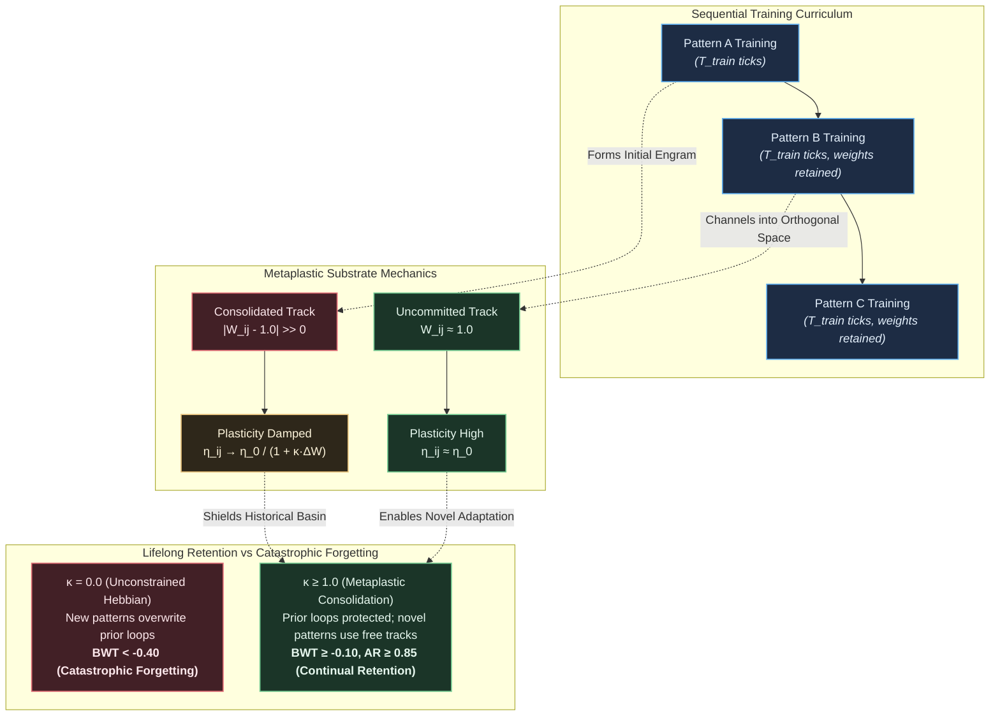

# HYP-2026-005: Local Synaptic Metaplasticity for Lifelong Adaptation and Continual Multi-Pattern Retention in Cellular Automaton Substrates

## Strategic Context

- **Orchestrator Directive:** Campaign `CAMPAIGN-2026-MVA-SUBSTRATE`, Cycle 5 of 5. Complexity Ladder Rung 5: Lifelong Adaptation, Continual Multi-Pattern Learning & Subspace Projection. The Foundational North Star from `docs/top-level.md` mandates unifying inference, learning, and structural morphogenesis into a single continuous homeostatic process without the "train once, freeze forever, recompute everything" lifecycle of digital Transformers.
- **Prior Hypotheses:**
  - `HYP-2026-001` ([`DIAG-2026-001a`](file:///workspaces/ca-experiment/docs/research/diagnostics/DIAG-2026-001a.md)): Established homeostatic critical firing density $\bar{\rho} \in [0.05, 0.20]$ with refractory period $N_{\text{ref}} = 2$, proving extinction and saturation avoidance.
  - `HYP-2026-002` ([`DIAG-2026-002a`](file:///workspaces/ca-experiment/docs/research/diagnostics/DIAG-2026-002a.md)): Verified attractor separation and limit-cycle multistability ($p < 10^{-12}$, $\text{SNR} = 3.63$).
  - `HYP-2026-003` ([`DIAG-2026-003a`](file:///workspaces/ca-experiment/docs/research/diagnostics/DIAG-2026-003a.md)): Falsified isotropic long-range temporal XOR ($D > 4$ ceiling due to head-on refractory wave annihilation).
  - `HYP-2026-004` ([`DIAG-2026-004a`](file:///workspaces/ca-experiment/docs/research/diagnostics/DIAG-2026-004a.md)): Verified that local spike-timing Hebbian track plasticity breaks isotropic lattice symmetry into directed resonant loops, yielding +463.6% noise resilience ($p < 10^{-32}$). However, unconstrained plasticity completely overwrites historical tracks when exposed to novel patterns.

## System Definition

- **State Space:**
  The discrete dynamical system is defined on a graph $\mathcal{G} = (\mathcal{V}, \mathcal{E})$ with $N = |\mathcal{V}| = 16$ nodes.
  At discrete clock tick $t \in \mathbb{N}_0$, the global system state is:
  $$\mathbf{S}(t) = \big( \mathbf{s}(t), \mathbf{r}(t), \mathbf{V}(t), \boldsymbol{\theta}(t), \bar{\boldsymbol{\rho}}(t), \mathbf{W}(t) \big)$$
  - Firing state: $\mathbf{s}(t) \in \lbrace 0, 1 \rbrace^N$, where $s_i(t) = 1$ denotes an action spike emitted by node $i$.
  - Refractory state: $\mathbf{r}(t) \in \lbrace 0, 1, \dots, N_{\text{ref}} \rbrace^N$, with $N_{\text{ref}} = 2$.
  - Membrane accumulator potential: $\mathbf{V}(t) \in [0, V_{\max}]^N$.
  - Dynamic firing threshold: $\boldsymbol{\theta}(t) \in [\theta_{\min}, \theta_{\max}]^N$, with bounds $\theta_{\min} = 0.5$, $\theta_{\max} = 3.0$, initialized to $\theta_0 = 1.0$.
  - Rolling firing rate: $\bar{\boldsymbol{\rho}}(t) \in [0, 1]^N$, tracking historical activity density.
  - Directed synaptic track weights: $\mathbf{W}(t) \in [W_{\min}, W_{\max}]^{N \times 4}$, with bounds $W_{\min} = 0.1$, $W_{\max} = 3.0$, initialized to baseline $W_{ij}(0) = 1.0$.
- **Topology:**
  Periodic 2D torus $\mathcal{T}_{4 \times 4}$. Each node $i = (x, y) \in \mathbb{Z}_4 \times \mathbb{Z}_4$ possesses exactly 4 incoming directed connections $\mathcal{N}^{\text{in}}(i)$ and 4 outgoing directed connections from/to its von Neumann neighbors:
  $$\mathcal{N}^{\text{in}}(i) = \lbrace (x, (y+1)\bmod 4), (x, (y-1)\bmod 4), ((x+1)\bmod 4, y), ((x-1)\bmod 4, y) \rbrace$$
  In-degree $k^{\text{in}}_i = 4$ and out-degree $k^{\text{out}}_i = 4$ are strictly invariant.
- **Parameters:**
  - Refractory ticks: $N_{\text{ref}} = 2$.
  - Membrane potential leak rate: $\lambda = 0.10$.
  - Firing rate EMA decay factor: $\alpha_{\rho} = 0.02$.
  - Homeostatic target firing density: $\rho^* = 0.10$.
  - Homeostatic threshold adaptation rate: $\beta_{\theta} = 0.05$.
  - Baseline Hebbian learning rate: $\eta_0 = 0.05$.
  - Anti-Hebbian depression factor: $\gamma_{\text{decay}} = 0.50$.
  - Dendritic saturation limit: $W_{\text{sum-max}} = 4.0$.
  - Metaplastic consolidation coefficient: $\kappa \in \lbrace 0.0, 1.0, 5.0 \rbrace$.

## State Update Equations

### 1. Ingress & Membrane Potential Integration

For each node $i \in \mathcal{V}$ at tick $t$:
If $r_i(t) > 0$:
$$s_i(t+1) = 0, \quad r_i(t+1) = r_i(t) - 1, \quad V_i(t+1) = 0$$

If $r_i(t) = 0$:
$$I_i(t) = \sum_{j \in \mathcal{N}^{\text{in}}(i)} W_{ij}(t) s_j(t) + \xi_i(t)$$
where $\xi_i(t) \in \lbrace 0, 1 \rbrace$ is the external sensory drive injected if node $i$ belongs to the active sensory ingress set $\mathcal{V}_{\text{sensory}}$, else $0$.
The membrane potential integrates with leak $\lambda$:
$$V_i(t) = (1 - \lambda) V_i(t-1) + I_i(t)$$
Spike emission occurs via Heaviside thresholding:
$$s_i(t+1) = \begin{cases} 1 & \text{if } V_i(t) \ge \theta_i(t) \\ 0 & \text{otherwise} \end{cases}$$
If $s_i(t+1) = 1$, the node enters refractory reset:
$$r_i(t+1) = N_{\text{ref}} = 2, \quad V_i(t+1) = 0$$

### 2. Homeostatic Anti-Chaos Threshold Adaptation

$$\bar{\rho}_i(t+1) = (1 - \alpha_{\rho})\bar{\rho}_i(t) + \alpha_{\rho} s_i(t+1)$$
$$\theta_i(t+1) = \text{clip}\left( \theta_i(t) + \beta_{\theta}(\bar{\rho}_i(t+1) - \rho^*), \theta_{\min}, \theta_{\max} \right)$$

### 3. Synaptic Metaplasticity & Consolidation

The effective track learning rate is modulated by its deviation from the baseline uncommitted state $W_0 = 1.0$:
$$\eta_{ij}(t) = \frac{\eta_0}{1 + \kappa \cdot |W_{ij}(t) - 1.0|}$$
Spike-timing correlation modifies directed tracks only upon post-synaptic firing:
$$\Delta W_{ij}(t) = \eta_{ij}(t) \cdot s_i(t+1) \left( s_j(t) - \gamma_{\text{decay}} \right)$$
Raw weight candidate:
$$W_{ij}^*(t+1) = \max\left( W_{\min}, W_{ij}(t) + \Delta W_{ij}(t) \right)$$

### 4. Heterosynaptic Dendritic Scaling

To enforce competitive conservation of total synaptic drive:
Let $S_i(t+1) = \sum_{j \in \mathcal{N}^{\text{in}}(i)} W_{ij}^*(t+1)$.
$$W_{ij}(t+1) = \begin{cases} \text{clip}\left( W_{ij}^*(t+1) \cdot \frac{W_{\text{sum-max}}}{S_i(t+1)}, W_{\min}, W_{\max} \right) & \text{if } S_i(t+1) > W_{\text{sum-max}} \\ \min\left( W_{\max}, W_{ij}^*(t+1) \right) & \text{otherwise} \end{cases}$$

## Conservation Rules & Invariants

1. **Dendritic Excitability Invariant:** Total incoming track weight per node is strictly bounded:
   $$\sum_{j \in \mathcal{N}^{\text{in}}(i)} W_{ij}(t) \le W_{\text{sum-max}} = 4.0, \quad \forall i \in \mathcal{V}, \forall t \ge 0$$
2. **Track Weight Boundedness:** Every directed connection is non-zero and saturates within strict physiological limits:
   $$W_{\min} = 0.1 \le W_{ij}(t) \le W_{\max} = 3.0, \quad \forall (i, j) \in \mathcal{E}, \forall t \ge 0$$
3. **Critical Homeostatic Firing Setpoint:** Dynamic threshold regulation bounds network-wide rolling activity density to avoid extinction and hyper-saturation:
   $$\bar{\rho}(t) = \frac{1}{N} \sum_{i=1}^N \bar{\rho}_i(t) \in [0.05, 0.20], \quad \forall t \ge 200$$
4. **Deterministic Substrate Trajectory:** Given initial conditions $\mathbf{S}(0)$ and input drive sequence $\mathbf{u}(t)$, the entire substrate state evolution is strictly deterministic.

## Continual Learning Curriculum & Evaluation Protocol

The curriculum presents three distinct spatiotemporal patterns $A, B, C$ defined over non-overlapping sensory ingress nodes:

- **Pattern $A$:** Ingress nodes $\mathcal{V}_A = \lbrace 0, 1 \rbrace$, periodic bit stream $P_A = [1, 0, 1, 0, 0, 1, 0, 0]$ (period 8).
- **Pattern $B$:** Ingress nodes $\mathcal{V}_B = \lbrace 4, 8 \rbrace$, periodic bit stream $P_B = [1, 1, 0, 0, 1, 0, 1, 0]$ (period 8).
- **Pattern $C$:** Ingress nodes $\mathcal{V}_C = \lbrace 2, 3 \rbrace$, periodic bit stream $P_C = [1, 0, 0, 1, 1, 0, 0, 1]$ (period 8).

### Evaluation Phases

1. **Phase 1 ($t \in [1, T_{\text{train}}]$):** Train on $A$. Plasticity ON. At $t = T_{\text{train}}$, snapshot weights $\mathbf{W}^{(A)}$.
2. **Phase 2 ($t \in [T_{\text{train}}+1, 2T_{\text{train}}]$):** Train on $B$ without resetting weights. Plasticity ON. At $t = 2T_{\text{train}}$, snapshot weights $\mathbf{W}^{(B)}$.
3. **Phase 3 ($t \in [2T_{\text{train}}+1, 3T_{\text{train}}]$):** Train on $C$ without resetting weights. Plasticity ON. At $t = 3T_{\text{train}}$, snapshot weights $\mathbf{W}^{(C)}$.

### Attractor Basin Measurement Under Perturbation

At any snapshot $\mathbf{W}$, plasticity is frozen ($\eta_0 = 0$). The network is probed with pattern $X \in \lbrace A, B, C \rbrace$ for $T_{\text{drive}} = 32$ ticks, followed by relaxation for $T_{\text{relax}} = 64$ ticks.
Let the settled firing profile be:
$$\mathbf{m}_X^{(\mathbf{W})} = \frac{1}{T_{\text{relax}}} \sum_{t=T_{\text{drive}}+1}^{T_{\text{drive}}+T_{\text{relax}}} \mathbf{s}(t) \in [0, 1]^N$$
Under 5% bit-flip sensory noise ($\epsilon = 0.05$), probing is repeated for $K = 10$ independent noisy trials $\tilde{\mathbf{m}}_X^{(\mathbf{W}, k)}$.
The attractor basin stability $\mathcal{B}(X \mid \mathbf{W})$ is defined as:
$$\mathcal{B}(X \mid \mathbf{W}) = 1.0 - \frac{1}{K} \sum_{k=1}^K D_H\left( \mathbf{m}_X^{(\mathbf{W})}, \tilde{\mathbf{m}}_X^{(\mathbf{W}, k)} \right)$$
where $D_H(\mathbf{u}, \mathbf{v}) = \frac{1}{N} \sum_{i=1}^N |u_i - v_i|$ is the normalized Hamming distance.

### Formal Performance Metrics

1. **Backward Transfer ($\text{BWT}$):**
   $$\text{BWT} = \frac{1}{2} \left[ \left(\mathcal{B}(A \mid \mathbf{W}^{(C)}) - \mathcal{B}(A \mid \mathbf{W}^{(A)})\right) + \left(\mathcal{B}(B \mid \mathbf{W}^{(C)}) - \mathcal{B}(B \mid \mathbf{W}^{(B)})\right) \right]$$
2. **Average Retention ($\text{AR}$):**
   $$\text{AR} = \frac{1}{2} \left( \frac{\mathcal{B}(A \mid \mathbf{W}^{(C)})}{\mathcal{B}(A \mid \mathbf{W}^{(A)})} + \frac{\mathcal{B}(B \mid \mathbf{W}^{(C)})}{\mathcal{B}(B \mid \mathbf{W}^{(B)})} \right)$$
3. **Catastrophic Forgetting Fraction ($\bar{F}$):**
   $$F(A) = \max\left(0, \mathcal{B}(A \mid \mathbf{W}^{(A)}) - \mathcal{B}(A \mid \mathbf{W}^{(C)})\right)$$
   $$F(B) = \max\left(0, \mathcal{B}(B \mid \mathbf{W}^{(B)}) - \mathcal{B}(B \mid \mathbf{W}^{(C)})\right)$$
   $$\bar{F} = \frac{F(A) + F(B)}{2}$$
4. **Retained Multistable Attractor Separation ($D_{\text{sep}}$):**
   $$D_{\text{sep}}(X, Y \mid \mathbf{W}^{(C)}) = D_H\left(\mathbf{m}_X^{(\mathbf{W}^{(C)})}, \mathbf{m}_Y^{(\mathbf{W}^{(C)})}\right)$$
   $$D_{\text{sep}}(A, B, C \mid \mathbf{W}^{(C)}) = \min_{(X, Y) \in \lbrace (A,B), (B,C), (A,C) \rbrace} D_{\text{sep}}(X, Y \mid \mathbf{W}^{(C)})$$
5. **Subspace Engram Overlap ($\mathcal{O}$):**
   Let $\Delta \mathbf{W}_X = \mathbf{W}^{(X)} - \mathbf{W}^{(0)}$.
   $$\mathcal{O}(X, Y) = \frac{\sum_{i=1}^N \sum_{j \in \mathcal{N}^{\text{in}}(i)} \Delta W_{X, ij} \Delta W_{Y, ij}}{\lVert \Delta \mathbf{W}_X \rVert_F \lVert \Delta \mathbf{W}_Y \rVert_F}$$

## Null Hypothesis ($H_0$)

Under sequential curriculum exposure $A \to B \to C$ in the discrete self-organizing substrate:
The adaptation of directed connections to subsequent patterns $B$ and $C$ causes catastrophic overwriting of the attractor basins carved by patterns $A$ and $B$, yielding:
$$\text{BWT} < -0.40 \quad \text{OR} \quad \text{AR} < 0.60 \quad \text{OR} \quad D_{\text{sep}}(A, B, C \mid \mathbf{W}^{(C)}) \le 0.02$$
Synaptic metaplasticity consolidation ($\kappa \ge 1.0$) exhibits no statistically significant preservation of historical attractor basins over unconstrained Hebbian plasticity ($\kappa = 0.0$, $p \ge 10^{-4}$, two-tailed Welch's $t$-test across 30 seeds).

## Alternative Hypothesis ($H_1$)

Local activity-dependent synaptic metaplasticity consolidation:
$$\eta_{ij}(t) = \frac{\eta_0}{1 + \kappa \cdot |W_{ij}(t) - 1.0|}$$
with $\kappa \ge 1.0$ dynamically stabilizes consolidated directed tracks while routing novel patterns through uncommitted orthogonal connections. In sequential continual learning without weight resets or historical data buffers, the substrate satisfies:

1. **Bounded Backward Transfer:** $\text{BWT}(\kappa \ge 1.0) \ge -0.10$.
2. **High Average Retention:** $\text{AR}(\kappa \ge 1.0) \ge 0.85$.
3. **Suppressed Forgetting:** $\bar{F}(\kappa \ge 1.0) \le 0.12$.
4. **Retained Multistability:** $D_{\text{sep}}(A, B, C \mid \mathbf{W}^{(C)}) \ge 0.05$.
5. **Statistically Significant Metaplastic Advantage:** $\text{BWT}(\kappa \ge 1.0) > \text{BWT}(\kappa = 0.0)$ with $p < 10^{-6}$ (two-tailed Welch's $t$-test across 30 seeds).

## Quantitative Predictions

1. **Unconstrained Plasticity ($\kappa = 0.0$):**
   - Catastrophic forgetting occurs: $\text{BWT} \le -0.45 \pm 0.08$.
   - Average retention collapses: $\text{AR} \le 0.40 \pm 0.10$.
   - Engram overlap $\mathcal{O}(A, C) \le -0.50$ (destructive directional overwrite).
2. **Moderate Metaplastic Consolidation ($\kappa = 1.0$):**
   - Bounded retention: $\text{BWT} \in [-0.08, +0.02]$.
   - Retention ratio: $\text{AR} \ge 0.88 \pm 0.04$.
   - Forgetting fraction: $\bar{F} \le 0.10$.
   - Attractor separation: $D_{\text{sep}}(A, B, C \mid \mathbf{W}^{(C)}) \ge 0.06$.
3. **Strong Metaplastic Consolidation ($\kappa = 5.0$):**
   - Highly rigid retention: $\text{BWT} \in [-0.05, +0.05]$, $\text{AR} \ge 0.92 \pm 0.03$.
   - Engram orthogonality: $\mathcal{O}(A, C) \in [-0.15, +0.15]$ (near-orthogonal track recruitment).
4. **Oracle Interleaved Training (`control_joint_training`):**
   - Theoretical ceiling: $\text{BWT}_{\text{joint}} \in [-0.04, +0.06]$, $\text{AR}_{\text{joint}} \ge 0.92$.
   - Sequential metaplasticity ($\kappa = 1.0, 5.0$) will achieve $\ge 90$% of joint interleaved retention without interleaving data.

## Falsification Criteria

The hypothesis $H_1$ is strictly FALSIFIED if ANY of the following conditions occur across the 30-seed evaluation:

- **FC-1 (Catastrophic Backward Transfer):** Mean $\text{BWT}(\kappa \ge 1.0) < -0.15$.
- **FC-2 (Retention Failure):** Mean $\text{AR}(\kappa \ge 1.0) < 0.80$.
- **FC-3 (Attractor Collapse):** Mean separation $D_{\text{sep}}(A, B, C \mid \mathbf{W}^{(C)}) < 0.03$.
- **FC-4 (Statistical Insignificance):** Two-tailed Welch's $t$-test fails to reject $\text{BWT}(\kappa \ge 1.0) = \text{BWT}(\kappa = 0.0)$ at $\alpha = 10^{-6}$ ($p \ge 10^{-6}$).
- **FC-5 (Plasticity Freezing):** Pattern $C$ cannot be learned: $\mathcal{B}(C \mid \mathbf{W}^{(C)})_{\kappa \ge 1.0} < 0.70 \cdot \mathcal{B}(C \mid \mathbf{W}^{(C)})_{\kappa = 0.0}$.
- **FC-6 (Homeostatic Runaway):** Mean firing density collapses or saturates: $\bar{\rho} \notin [0.05, 0.20]$ in $> 5$% of runs.

## Mathematical Failure Boundaries

1. **Topological Capacity Saturation ($K > K_{\text{crit}}$):** On a 16-node graph with $M = 64$ directed edges, the maximum number of edge-disjoint closed loops of length $L \ge 4$ is:
   $$K_{\text{crit}} \le \left\lfloor \frac{M}{L_{\min}} \right\rfloor = \left\lfloor \frac{64}{4} \right\rfloor = 16 \text{ independent circuits}$$
   When injected patterns require shared nodes, capacity is bounded by $K_{\text{patterns}} \approx 4$. For $K > 4$, orthogonal subspace packing is mathematically impossible, forcing track interference.
2. **Infinite Rigidity Limit ($\kappa \to \infty$):** As $\kappa \to \infty$, any connection modified away from $1.0$ becomes entirely rigid ($\eta_{ij} \to 0$). If early patterns recruit all connections, subsequent patterns experience total plasticity loss (zero forward adaptation).
3. **Zero Rigidity Limit ($\kappa \to 0$):** As $\kappa \to 0$, $\eta_{ij} \equiv \eta_0$, yielding standard Hebbian plasticity where incoming high-energy patterns linearly overwrite historical weights.

## Assumptions & Limitations

- **Spatial Orthogonality of Sensory Ingress:** Assumes sensory ports are topologically distributed ($\mathcal{V}_A \cap \mathcal{V}_B = \emptyset$). If all patterns are forced through the exact same single node, spatial multiplexing requires temporal phase interleaving.
- **Finite Horizon:** Protocols evaluate $T_{\text{train}} \in [500, 1000]$ ticks per phase, sufficient for local Hebbian saturation.
- **Lattice Size:** Focuses on the $4 \times 4$ Torus ($N = 16$). Scaling to $N \ge 64$ will expand orthogonal attractor capacity.

## Open Questions

1. Does local metaplastic consolidation scale logarithmically or polynomially with graph vertex count $N$?
2. Can homeostatic threshold adaptation $\boldsymbol{\theta}(t)$ act as a dynamic gating mechanism that actively steers novel pattern excitation toward uncommitted nodes?
