# HYP-2026-006: Directed Regenerative Transmission Tracks with Refractory Diode Shielding and Branching Fan-Out for Zero-Attenuation Signal Propagation ($D \ge 30$) in Cellular Automaton Substrates

## Strategic Context

- **Orchestrator Directive:** Campaign `CAMPAIGN-2026-MVA-SUBSTRATE`, Cycle 1 of 5 (Tier 1 Inception). Active Milestone 1.1: Signal Transport & Fan-Out (Tier 1: Spatial Routing & Compositionality) from [`docs/vision.md`](file:///workspaces/ca-experiment/docs/vision.md).
  - Milestone Mandate: Propagate an arbitrary binary signal over spatial distance $D \ge 30$ cells with zero attenuation ($\text{BER} = 0$), and duplicate a single input into multiple independent downstream channels ($\text{Fan-Out} \ge 2$, 1-to-2 Buffer) with 100% transmission fidelity under background noise and spatial jitter.
- **Prior Hypotheses:**
  - `HYP-2026-001` ([`DIAG-2026-001a`](file:///workspaces/ca-experiment/docs/research/diagnostics/DIAG-2026-001a.md)): Established homeostatic critical firing density $\bar{\rho} \in [0.05, 0.20]$ with refractory period $N_{\text{ref}} = 2$ on a 16-node torus, avoiding extinction and hyper-saturation.
  - `HYP-2026-002` ([`DIAG-2026-002a`](file:///workspaces/ca-experiment/docs/research/diagnostics/DIAG-2026-002a.md)): Verified attractor separation and limit-cycle multistability under sensory drive ($p < 10^{-12}$, $\text{SNR} = 3.63$).
  - `HYP-2026-003` ([`DIAG-2026-003a`](file:///workspaces/ca-experiment/docs/research/diagnostics/DIAG-2026-003a.md)): Falsified isotropic long-range temporal XOR ($D > 4$ ceiling due to head-on refractory wave annihilation). Established that long-range transmission requires directed transmission tracks rather than isotropic reverberation.
  - `HYP-2026-004` ([`DIAG-2026-004a`](file:///workspaces/ca-experiment/docs/research/diagnostics/DIAG-2026-004a.md)): Verified that spike-timing Hebbian plasticity breaks isotropic symmetry into directed resonant tracks, conferring +463.6% noise resilience ($p < 10^{-32}$).
  - `HYP-2026-005` ([`DIAG-2026-005a`](file:///workspaces/ca-experiment/docs/research/diagnostics/DIAG-2026-005a.md)): Verified local synaptic metaplasticity for lifelong multi-pattern retention without catastrophic forgetting ($\text{BWT} \ge -0.028$, $\text{AR} \ge 0.97$), validating all Tier 0 foundational primitives.

## System Definition

- **State Space:**
  The discrete dynamical system is defined on a directed transport graph $\mathcal{G} = (\mathcal{V}, \mathcal{E})$ with $N = |\mathcal{V}|$ nodes.
  At discrete clock tick $t \in \mathbb{N}_0$, the global system state is:
  $$\mathbf{S}(t) = \big( \mathbf{s}(t), \mathbf{r}(t), \mathbf{V}(t), \boldsymbol{\theta}(t), \bar{\boldsymbol{\rho}}(t) \big)$$
  - Firing state: $\mathbf{s}(t) \in \lbrace 0, 1 \rbrace^N$, where $s_i(t) = 1$ denotes an active binary pulse emitted by node $i$.
  - Refractory state: $\mathbf{r}(t) \in \lbrace 0, 1, \dots, N_{\text{ref}} \rbrace^N$, where $N_{\text{ref}} = 2$ in the active shielded condition.
  - Membrane accumulator potential: $\mathbf{V}(t) \in [0, V_{\max}]^N$, where $V_{\max} = 4.0$.
  - Dynamic firing threshold: $\boldsymbol{\theta}(t) \in [\theta_{\min}, \theta_{\max}]^N$, with bounds $\theta_{\min} = 0.50$, $\theta_{\max} = 2.50$, and baseline initialization $\theta_0 = 1.00$.
  - Rolling firing rate EMA: $\bar{\boldsymbol{\rho}}(t) \in [0, 1]^N$, tracking historical activity density.
  - Synaptic connectivity matrix: $\mathbf{W} \in \mathbb{R}_{\ge 0}^{N \times N}$, where $W_{ij}$ represents the synaptic coupling strength from presynaptic node $j$ to postsynaptic node $i$.

- **Topology:**
  The spatial routing graph $\mathcal{G}_{\text{transport}} = (\mathcal{V}, \mathcal{E})$ implements a 1-to-2 branching buffer structured into three contiguous sub-graphs:
  1. **Stem Track ($\mathcal{V}_{\text{stem}}$):** A linear directed chain of $L_{\text{stem}}$ nodes:
     $$\mathcal{V}_{\text{stem}} = \lbrace v_0, v_1, \dots, v_{L_{\text{stem}}-1} \rbrace$$
     Directed forward edges: $(v_l, v_{l+1}) \in \mathcal{E}$ for $l \in \lbrace 0, 1, \dots, L_{\text{stem}}-2 \rbrace$.
     Node $v_0$ is the sensory ingress port driven by input bitstream $u(t) \in \lbrace 0, 1 \rbrace$.
  2. **Branching Fork Node ($v_{\text{fork}}$):** The terminal node of the stem track:
     $$v_{\text{fork}} = v_{L_{\text{stem}}-1}$$
     Node $v_{\text{fork}}$ possesses out-degree $k^{\text{out}} = 2$, connecting forward to the root of Branch 1 and the root of Branch 2.
  3. **Downstream Branch 1 ($\mathcal{V}_{\text{branch1}}$):** A linear directed chain of $L_{\text{branch1}}$ nodes:
     $$\mathcal{V}_{\text{branch1}} = \lbrace u_1, u_2, \dots, u_{L_{\text{branch1}}} \rbrace$$
     Fork connection: $(v_{\text{fork}}, u_1) \in \mathcal{E}$.
     Directed internal edges: $(u_m, u_{m+1}) \in \mathcal{E}$ for $m \in \lbrace 1, \dots, L_{\text{branch1}}-1 \rbrace$.
     Terminal readout node: $u_{\text{out}} = u_{L_{\text{branch1}}}$.
  4. **Downstream Branch 2 ($\mathcal{V}_{\text{branch2}}$):** A linear directed chain of $L_{\text{branch2}}$ nodes:
     $$\mathcal{V}_{\text{branch2}} = \lbrace w_1, w_2, \dots, w_{L_{\text{branch2}}} \rbrace$$
     Fork connection: $(v_{\text{fork}}, w_1) \in \mathcal{E}$.
     Directed internal edges: $(w_n, w_{n+1}) \in \mathcal{E}$ for $n \in \lbrace 1, \dots, L_{\text{branch2}}-1 \rbrace$.
     Terminal readout node: $w_{\text{out}} = w_{L_{\text{branch2}}}$.
  5. **Total Path Distances:**
     - Path length to Branch 1 readout: $D_1 = L_{\text{stem}} + L_{\text{branch1}}$.
     - Path length to Branch 2 readout: $D_2 = L_{\text{stem}} + L_{\text{branch2}}$.
     - Minimum benchmark distance: $D_1, D_2 \ge 30$ cells (e.g., $L_{\text{stem}} = 15$, $L_{\text{branch1}} = 15$, $L_{\text{branch2}} = 15 \implies D = 30$, total nodes $N = 45$).
     - Spatial jitter and branch asymmetry: $\Delta L = |L_{\text{branch1}} - L_{\text{branch2}}| \in \lbrace 0, 2, 5 \rbrace$.
  6. **Coupling Matrix Configuration:**
     - Forward track weights: $W_{v_{l+1}, v_l} = W_{\text{fwd}} = 1.0$; $W_{u_1, v_{\text{fork}}} = W_{\text{fwd}} = 1.0$; $W_{w_1, v_{\text{fork}}} = W_{\text{fwd}} = 1.0$; $W_{u_{m+1}, u_m} = 1.0$; $W_{w_{n+1}, w_n} = 1.0$.
     - Retrograde weights: In the unshielded ablation, bidirectional physical coupling is active: $W_{v_l, v_{l+1}} = W_{\text{back}} = 1.0$, $W_{v_{\text{fork}}, u_1} = 1.0$, $W_{v_{\text{fork}}, w_1} = 1.0$. In the active condition, retrograde transmission is annihilated by the refractory diode shield.
     - Inter-branch cross-coupling: Strictly zero: $W_{u_m, w_n} = W_{w_n, u_m} = 0$ for all $m, n$.

- **Parameters:**
  - Membrane leak factor: $\lambda = 0.10$.
  - Refractory ticks: $N_{\text{ref}} = 2$ (active condition), $N_{\text{ref}} = 0$ (unshielded ablation).
  - Forward coupling strength: $W_{\text{fwd}} = 1.00$.
  - Retrograde coupling strength: $W_{\text{back}} \in \lbrace 0.00, 1.00 \rbrace$.
  - Dynamic threshold adaptation rate: $\beta_\theta = 0.05$ (active condition), $\beta_\theta = 0.00$ (fixed-threshold ablation).
  - Target homeostatic firing density: $\rho^* = 0.10$.
  - Firing density EMA rate decay: $\alpha_\rho = 0.02$.
  - Dynamic threshold bounds: $[\theta_{\min}, \theta_{\max}] = [0.50, 2.50]$, initialized to $\theta_0 = 1.00$.
  - Background noise rate: $\epsilon \in [0.00, 0.10]$.

```mermaid
%%{init: {
  'theme': 'base',
  'themeVariables': {
    'darkMode': true,
    'background': '#161922',
    'mainBkg': '#1e2230',
    'nodeBorder': '#434c5e',
    'textColor': '#e2e8f0',
    'fontFamily': 'ui-sans-serif, system-ui, -apple-system, BlinkMacSystemFont, "Segoe UI", Roboto, sans-serif',
    'fontSize': '14px',
    'lineColor': '#8892b0',
    'primaryColor': '#422026',
    'primaryTextColor': '#fde8ec',
    'primaryBorderColor': '#e06c75',
    'secondaryColor': '#1b3528',
    'secondaryTextColor': '#e6f7ee',
    'secondaryBorderColor': '#73c991',
    'tertiaryColor': '#1d2c44',
    'tertiaryTextColor': '#e4f0fc',
    'tertiaryBorderColor': '#61afef',
    'clusterBkg': '#13161f',
    'clusterBorder': '#373e51',
    'noteBkgColor': '#2e271a',
    'noteTextColor': '#fdf4db',
    'noteBorderColor': '#e5c07b',
    'edgeLabelBackground': '#1a1d27'
  }
}}%%
flowchart LR
    classDef primary fill:#422026,stroke:#e06c75,stroke-width:1.5px,color:#fde8ec;
    classDef secondary fill:#1b3528,stroke:#73c991,stroke-width:1.5px,color:#e6f7ee;
    classDef tertiary fill:#1d2c44,stroke:#61afef,stroke-width:1.5px,color:#e4f0fc;
    classDef note fill:#2e271a,stroke:#e5c07b,stroke-width:1.5px,color:#fdf4db;

    input["Input Bitstream u(t)"]:::tertiary

    subgraph STEM["Stem Transmission Track (L_stem = 15 cells)"]
        direction LR
        v0["v_0 (Ingress)"]:::tertiary -->|"W_fwd = 1.0"| v1["v_1"]:::secondary
        v1 -->|"W_fwd = 1.0"| v2["v_2 ..."]:::secondary
        v2 -->|"W_fwd = 1.0"| vfork["v_fork (Cell 15)"]:::primary
    end

    subgraph DIODE["Refractory Diode Shield"]
        direction TB
        shield_info["Post-Spike Refractory Rest: r_i(t+1) = 2<br/>Annihilates Retrograde Back-Coupling<br/>T_back = 0 (Unidirectional)"]:::note
    end

    subgraph BRANCH1["Downstream Branch 1 (L_branch1 = 15 cells)"]
        direction LR
        u1["u_1"]:::secondary -->|"W_fwd = 1.0"| u2["u_2 ..."]:::secondary
        u2 -->|"W_fwd = 1.0"| uout["u_out (Cell 30)"]:::tertiary
    end

    subgraph BRANCH2["Downstream Branch 2 (L_branch2 = 15+ΔL cells)"]
        direction LR
        w1["w_1"]:::secondary -->|"W_fwd = 1.0"| w2["w_2 ..."]:::secondary
        w2 -->|"W_fwd = 1.0"| wout["w_out (Cell 30+ΔL)"]:::tertiary
    end

    out1["Readout 1: BER_1 = 0.0"]:::tertiary
    out2["Readout 2: BER_2 = 0.0"]:::tertiary

    input --> v0
    vfork -->|"W_fwd = 1.0 (Zero Split Loss)"| u1
    vfork -->|"W_fwd = 1.0 (Zero Split Loss)"| w1
    uout --> out1
    wout --> out2
    vfork -.-> DIODE
```

## State Update Equations

### 1. Ingress & Synaptic Integration

For each node $i \in \mathcal{V}$ at clock tick $t$:
If the refractory counter $r_i(t) > 0$:
$$s_i(t+1) = 0, \quad r_i(t+1) = r_i(t) - 1, \quad V_i(t+1) = 0$$

If the refractory counter $r_i(t) = 0$:
The total presynaptic drive $I_i(t)$ combines upstream synaptic transmission, primary ingress drive, and stochastic background noise:
$$I_i(t) = \sum_{j \in \mathcal{N}^{\text{in}}(i)} W_{ij} s_j(t) + \delta_{i, v_0} \cdot u(t) + \xi_i(t)$$
where:

- $\delta_{i, v_0}$ is the Kronecker delta selecting sensory ingress node $v_0$.
- $u(t) \in \lbrace 0, 1 \rbrace$ is the primary input bit at tick $t$.
- $\xi_i(t) \sim \text{Bernoulli}(\epsilon)$ is an independent Bernoulli noise process flipping bit state with probability $\epsilon$.

The membrane potential $V_i(t)$ integrates incoming charge with leak $\lambda$:
$$V_i(t) = (1 - \lambda) V_i(t-1) + I_i(t)$$

### 2. Regenerative All-or-None Spike Emission

Action potential emission occurs via discrete Heaviside thresholding:
$$s_i(t+1) = \Theta\left(V_i(t) - \theta_i(t)\right) = \begin{cases} 1 & \text{if } V_i(t) \ge \theta_i(t) \\ 0 & \text{otherwise} \end{cases}$$

Upon firing ($s_i(t+1) = 1$):

- The emitted pulse amplitude is strictly standardized: $s_i(t+1) = 1.0$, completely decoupling downstream signal energy from upstream attenuation.
- The membrane potential resets to ground: $V_i(t+1) = 0.0$.
- The node enters forced refractory rest: $r_i(t+1) = N_{\text{ref}} = 2$.

If $s_i(t+1) = 0$:

- The membrane potential retains decayed residual charge: $V_i(t+1) = V_i(t)$.
- The refractory counter remains at zero: $r_i(t+1) = 0$.

### 3. Refractory Diode Shielding Dynamics

Consider presynaptic node $i$ and postsynaptic node $i+1$ coupled by forward weight $W_{i+1, i} = 1.0$ and potential retrograde coupling $W_{i, i+1} = W_{\text{back}} \ge 0$:

1. At tick $t$: Node $i$ fires ($s_i(t) = 1$). Node $i+1$ receives charge $I_{i+1}(t) = 1.0 \ge \theta_{i+1}(t)$.
2. At tick $t+1$:
   - Node $i+1$ fires ($s_{i+1}(t+1) = 1$).
   - Node $i$ resets and enters refractory state: $r_i(t+1) = N_{\text{ref}} = 2$, $V_i(t+1) = 0$.
3. At tick $t+2$:
   - Node $i+1$ emits retrograde drive back toward node $i$: $I_i(t+1) = W_{i, i+1} s_{i+1}(t+1) = W_{\text{back}} \cdot 1.0$.
   - Node $i$'s refractory counter decrements: $r_i(t+2) = r_i(t+1) - 1 = 1 > 0$.
   - By the refractory update rule, because $r_i(t+2) > 0$, node $i$ ignores $I_i(t+1)$ and sets $s_i(t+2) = 0, V_i(t+2) = 0$.
4. At tick $t+3$:
   - Node $i$'s refractory counter expires: $r_i(t+3) = 0$.
   - The retrograde pulse has dissipated completely with zero residual membrane polarization.

Hence, the effective retrograde transmission coefficient $T_{\text{back}}$ satisfies:
$$T_{\text{back}} \equiv \frac{\Delta V_i(\text{retrograde})}{V_{\text{pulse}}} = 0.0$$
The refractory period acts as a temporal diode, enforcing unidirectional forward signal transport.

### 4. Branching Fan-Out Dynamics (1-to-2 Buffer)

At branching fork node $v_{\text{fork}}$, the forward output connects simultaneously to Branch 1 root $u_1$ and Branch 2 root $w_1$:
$$W_{u_1, v_{\text{fork}}} = W_{\text{fwd}} = 1.0, \quad W_{w_1, v_{\text{fork}}} = W_{\text{fwd}} = 1.0$$

When $v_{\text{fork}}$ fires at tick $t$ ($s_{v_{\text{fork}}}(t) = 1$):

- Presynaptic drive to $u_1$: $I_{u_1}(t) = W_{u_1, v_{\text{fork}}} s_{v_{\text{fork}}}(t) = 1.0 \ge \theta_{u_1}(t)$.
- Presynaptic drive to $w_1$: $I_{w_1}(t) = W_{w_1, v_{\text{fork}}} s_{v_{\text{fork}}}(t) = 1.0 \ge \theta_{w_1}(t)$.
- Both branch roots fire concurrently at tick $t+1$:
  $$s_{u_1}(t+1) = 1, \quad s_{w_1}(t+1) = 1$$
- Node $v_{\text{fork}}$ enters refractory rest: $r_{v_{\text{fork}}}(t+1) = N_{\text{ref}} = 2$.
- Retrograde reflection from $u_1$ or $w_1$ into $v_{\text{fork}}$ at $t+2$ is annihilated by $r_{v_{\text{fork}}}(t+2) = 1 > 0$.
- Because $W_{u_1, w_1} = W_{w_1, u_1} = 0$, the branches share zero direct lateral coupling, guaranteeing total cross-talk isolation.

### 5. Homeostatic Threshold Regulation & Noise Filtering

Each node tracks its historical activity density via exponential moving average:
$$\bar{\rho}_i(t+1) = (1 - \alpha_\rho)\bar{\rho}_i(t) + \alpha_\rho s_i(t+1)$$
Dynamic somatic threshold adaptation:
$$\theta_i(t+1) = \text{clip}\left( \theta_i(t) + \beta_\theta(\bar{\rho}_i(t+1) - \rho^*), \theta_{\min}, \theta_{\max} \right)$$

Under background noise rate $\epsilon \le 0.05$:

- A solitary noise bit $\xi_i(t) = 1$ into an unprimed resting node ($V_i(t-1) = 0$) contributes charge $1.0$.
- If $\theta_i(t) > 1.0$ (due to active transmission adaptation), the noise pulse is strictly subthreshold and decays via leak $\lambda$:
  $$V_i(t+k) = (1 - \lambda)^k \cdot 1.0 \to 0$$
- If an occasional spurious spike occurs, elevated local firing density $\bar{\rho}_i > \rho^*$ increases $\theta_i$, raising the barrier against further noise percolation.

## Conservation Rules & Invariants

1. **Zero Attenuation Invariant:** Over arbitrary distance $D \ge 30$ cells, under clean input ($\epsilon = 0$), the Bit Error Rate on both downstream branches is identically zero:
   $$\text{BER}_1 = 0.000, \quad \text{BER}_2 = 0.000, \quad \forall D \ge 30$$
2. **Fan-Out Duplication Invariant:** The branching buffer duplicates single input pulses into $\text{Fan-Out} \ge 2$ independent channels with unity transmission fidelity:
   $$\mathcal{F} = (1 - \text{BER}_1)(1 - \text{BER}_2) = 1.000$$
3. **Retrograde Diode Invariant:** Retrograde wave transmission is strictly blocked ($T_{\text{back}} = 0$). Even in the presence of symmetric reverse coupling ($W_{\text{back}} = 1.0$), refractory recovery state $r_i(t) > 0$ eliminates backward reflection waves and standing-wave oscillations.
4. **Inter-Branch Crosstalk Isolation Invariant:** Asynchronous perturbations injected into Branch 1 produce zero spurious emissions on Branch 2:
   $$\chi_{1 \to 2} \equiv \frac{1}{T_{\text{perturb}}} \sum_{t=1}^{T_{\text{perturb}}} s_{w_{\text{out}}}(t) \cdot \mathbb{I}(\text{perturbation on Branch 1}) = 0.000$$
5. **Deterministic Constant Velocity Latency Invariant:** Signal propagation speed is strictly 1 cell per clock tick ($v = 1.0\text{ cell/tick}$), yielding deterministic arrival latency:
   $$\tau_1 = D_1 = L_{\text{stem}} + L_{\text{branch1}}, \quad \tau_2 = D_2 = L_{\text{stem}} + L_{\text{branch2}}$$
   Branch path jitter $\Delta L$ produces an exact deterministic temporal skew $\Delta \tau = \tau_2 - \tau_1 = \Delta L$ ticks without waveform dispersion or symbol distortion.
6. **Homeostatic Firing Density Invariant:** The rolling substrate-wide firing density remains strictly bounded within the non-silent, non-saturating operational regime:
   $$\bar{\rho}(t) = \frac{1}{N}\sum_{i=1}^N \bar{\rho}_i(t) \in [0.01, 0.25], \quad \forall t \ge 100$$

## Null Hypothesis ($H_0$)

In cellular automaton signal transmission tracks:
Passive analog decay, lack of refractory diode shielding, or charge starvation at branching nodes prevents reliable signal propagation and duplication over distance $D \ge 30$ cells, yielding:
$$\text{BER}_1(D \ge 30) > 0.05 \quad \text{OR} \quad \text{BER}_2(D \ge 30) > 0.05 \quad \text{OR} \quad \mathcal{F}(D \ge 30) < 0.90 \quad \text{OR} \quad \chi_{1 \to 2} > 0.01$$
Under bidirectional coupling, absence of refractory shielding ($N_{\text{ref}} = 0$) causes retrograde reflections and standing waves with $\text{BER} > 0.20$. Active regenerative thresholding with refractory shielding demonstrates no statistically significant advantage over unshielded or passive baselines ($p \ge 10^{-6}$, two-tailed Welch's $t$-test across 30 seeds).

## Alternative Hypothesis ($H_1$)

Discrete excitable nodes with all-or-none regenerative thresholding ($W_{\text{fwd}} \ge \theta$), dynamic homeostatic adaptation $\theta_i(t)$, and refractory diode shielding ($N_{\text{ref}} = 2$) establish a stable, unidirectional, zero-attenuation signal transport channel and 1-to-2 branching buffer satisfying:

1. **Zero Attenuation Over Spatial Distance:** $\text{BER}_1 = \text{BER}_2 = 0.000$ and transmission fidelity $\mathcal{F} = 1.000$ across all distances $D \in \lbrace 10, 20, 30, 50 \rbrace$ cells under clean input ($\epsilon = 0.0$).
2. **Refractory Diode Retrograde Annihilation:** Unidirectional propagation is enforced even under symmetric physical coupling ($W_{\text{back}} = 1.0$); the active shielded condition achieves $\text{BER} = 0.000$, whereas unshielded ablation ($N_{\text{ref}} = 0$) collapses into retrograde ring reverberation ($\text{BER} \ge 0.25$), with active advantage $p < 10^{-12}$ (two-tailed Welch's $t$-test across 30 seeds).
3. **Crosstalk Isolation:** Inter-branch crosstalk is strictly zero ($\chi_{1 \to 2} < 10^{-4}$) under unilateral branch perturbation.
4. **Noise Suppression:** Under background noise rate $\epsilon \le 0.05$, dynamic threshold filtering preserves $\text{BER} \le 0.010$ and fidelity $\mathcal{F} \ge 0.980$.
5. **Deterministic Jitter Tolerance:** Path length asymmetry $\Delta L \in \lbrace 0, 2, 5 \rbrace$ introduces an exact deterministic skew $\Delta \tau = \Delta L$ ticks with zero inter-symbol interference and zero cross-branch degradation.

## Quantitative Predictions

1. **Active Regenerative Condition (`active_regenerative`):**
   - Clean transmission ($\epsilon = 0.00$): $\text{BER}_1 = 0.000 \pm 0.000$, $\text{BER}_2 = 0.000 \pm 0.000$, $\mathcal{F} = 1.000 \pm 0.000$ for all $D \in \lbrace 10, 20, 30, 50 \rbrace$.
   - Low noise ($\epsilon = 0.01$): $\text{BER} \le 0.002 \pm 0.001$, $\mathcal{F} \ge 0.995$.
   - Critical noise ($\epsilon = 0.05$): $\text{BER} \le 0.008 \pm 0.002$, $\mathcal{F} \ge 0.984$.
   - Elevated noise ($\epsilon = 0.10$): $\text{BER} \le 0.035 \pm 0.008$.
   - Crosstalk isolation: $\chi_{1 \to 2} = 0.000 \pm 0.000$.
   - Latency: $\tau_1 = L_{\text{stem}} + L_{\text{branch1}}$, $\tau_2 = L_{\text{stem}} + L_{\text{branch2}}$.

2. **Passive Analog Cable Ablation (`baseline_passive`):**
   - Without active threshold regeneration, potential decays exponentially: $V(x) = V_0 (1 - \lambda)^x = 1.0 \times (0.90)^x$.
   - At distance $x = 10$: $V(10) = (0.90)^{10} \approx 0.349 < \theta_0 = 1.00$. Signal falls below threshold, causing complete bit dropouts ($\text{BER} \approx 0.500$).
   - At distance $x = 30$: $V(30) = (0.90)^{30} \approx 0.042 \ll \theta_0$. Total signal extinction ($\text{BER} = 0.500, \mathcal{F} = 0.250$).

3. **Unshielded Bidirectional Ablation (`ablation_unshielded`, $N_{\text{ref}} = 0, W_{\text{back}} = 1.0$):**
   - When node $i+1$ fires, it immediately drives node $i$ backward without a refractory barrier.
   - Reflected pulses produce self-sustaining bidirectional ring reverberation and spurious bursts.
   - Result: Severe degradation with $\text{BER} \ge 0.300 \pm 0.050$ and fidelity $\mathcal{F} \le 0.490$.

4. **Fixed-Threshold Ablation (`ablation_fixed_theta`, $\beta_\theta = 0.00$):**
   - Under clean input ($\epsilon = 0.00$), matches active performance ($\text{BER} = 0.000$).
   - Under background noise $\epsilon = 0.05$ or $0.10$, the inability to adaptively raise $\theta_i$ against elevated noise activity results in a 200% to 400% increase in false positive bit errors relative to `active_regenerative` ($p < 10^{-6}$).

## Falsification Criteria

Hypothesis $H_1$ is strictly FALSIFIED if ANY of the following pre-registered failure conditions occur across the 30-seed evaluation:

- **FC-1 (Zero Attenuation Failure):** Mean $\text{BER}_1 > 0.000$ or $\text{BER}_2 > 0.000$ at distance $D \ge 30$ cells under clean input ($\epsilon = 0.00$).
- **FC-2 (Fan-Out Fidelity Failure):** Combined transmission fidelity $\mathcal{F} < 1.000$ across both downstream branches at $D \ge 30$ under clean input ($\epsilon = 0.00$).
- **FC-3 (Crosstalk Leakage):** Inter-branch crosstalk coefficient $\chi_{1 \to 2} \ge 10^{-4}$ under unilateral branch perturbation.
- **FC-4 (Noise Degradation):** Mean Bit Error Rate $\text{BER} > 0.010$ under background noise rate $\epsilon = 0.05$.
- **FC-5 (Refractory Shielding Insignificance):** Two-tailed Welch's $t$-test fails to reject equivalence between active shielded condition and unshielded ablation (`ablation_unshielded`) at significance level $\alpha = 10^{-6}$ ($p \ge 10^{-6}$).
- **FC-6 (Homeostatic Instability):** Substrate rolling firing density collapses to silence ($\bar{\rho} < 0.01$) or saturates ($\bar{\rho} > 0.25$) in $> 1$% of active runs.

## Mathematical Failure Boundaries

1. **Courant-Friedrichs-Lewy / Speed-of-Light Horizon:**
   In a synchronous discrete lattice with nearest-neighbor forward connectivity, information can propagate at most 1 cell per clock tick ($v_{\max} = 1.0\text{ cell/tick}$). The minimum physical latency over distance $D$ is strictly:
   $$\tau_{\min} = D\text{ clock ticks}$$
   Transmission arriving in $\tau < D$ ticks is physically impossible in this topology.
2. **Refractory Nyquist Bandwidth Limit:**
   A node requires $N_{\text{ref}}$ ticks of refractory rest plus 1 tick of activation recovery before firing again. The minimum inter-spike interval is:
   $$T_{\min} = N_{\text{ref}} + 1\text{ ticks}$$
   For $N_{\text{ref}} = 2$, $T_{\min} = 3$ ticks. Any input signal containing consecutive spikes ($u(t) = 1, u(t+1) = 1$) or pulse frequencies exceeding $f_{\max} = \frac{1}{N_{\text{ref}} + 1} = \frac{1}{3}\text{ pulses/tick}$ violates the refractory boundary, causing deterministic annihilation of the second pulse ($11 \to 10$). Bitstreams must respect rate coding with spacing $\Delta t \ge 3$ ticks.
3. **Noise Percolation Boundary ($\epsilon \ge \epsilon_{\text{crit}}$):**
   A node integrates noise charge over an effective leak dissipation window $T_{\text{leak}} \approx 1/\lambda = 10$ ticks. If background noise events occur frequently enough that expected charge accumulation exceeds $\theta_{\min}$:
   $$\mathbb{E}[V_{\text{noise}}] \approx \frac{\epsilon}{\lambda} \ge \theta_{\min} \implies \epsilon_{\text{crit}} \approx \lambda \cdot \theta_{\min} = 0.10 \times 0.50 = 0.05$$
   For $\epsilon > 0.05$, spontaneous noise clusters breach firing thresholds without sensory input, causing dark firing cascades.
4. **Dendritic Fan-Out Saturation Limit ($K > K_{\max}$):**
   If a branching node branches into $K$ downstream tracks subject to total dendritic weight capacity $W_{\text{sum-max}}$:
   $$\sum_{k=1}^K W_k \le W_{\text{sum-max}} \implies W_k \le \frac{W_{\text{sum-max}}}{K}$$
   To reliably trigger downstream firing, each branch connection must satisfy $W_k \ge \theta_{\max} = 1.50$. For $W_{\text{sum-max}} = 4.0$:
   $$K_{\max} = \left\lfloor \frac{W_{\text{sum-max}}}{\theta_{\max}} \right\rfloor = \left\lfloor \frac{4.0}{1.5} \right\rfloor = 2\text{ downstream branches}$$
   A 1-to-2 branching fork operates at optimal capacity. Scaling to 1-to-3 or 1-to-4 without intermediate repeaters causes charge starvation ($W_k < \theta$).

## Assumptions & Limitations

- **Synchronous Global Clock:** Dynamics assume a discrete synchronous clock tick. Asynchronous event-driven extensions are deferred to subsequent tiers.
- **Signal Pre-Encoding:** Input bit patterns are assumed to conform to the refractory Nyquist limit ($\Delta t \ge 3$ ticks between consecutive high bits).
- **Geometric Planarity:** The 1-to-2 branching buffer operates as a planar tree without wire crossings. Wire crossings and multi-gate composition belong to Milestone 1.2.

## Open Questions

1. How do self-repairing mechanisms or morphological plasticity dynamically restore transmission tracks when an intermediate relay node suffers permanent ablation?
2. Can resonant loops discovered in `EXP-2026-004a` be harnessed as localized repeater amplifiers to support fan-out factors $K \ge 4$?
