# HYP-2026-007: Cascaded Boolean Logic Gate Composition and Planar Wire Crossing with Delay Equalization in Cellular Automaton Substrates

## Strategic Context

- **Orchestrator Directive:** Campaign `CAMPAIGN-2026-MVA-SUBSTRATE`, Cycle 1 of 5 (Milestone 1.2 Inception). Active Milestone 1.2: Multi-Gate Composition & Wire Crossing (Tier 1: Spatial Routing & Compositionality) from [`docs/vision.md`](file:///workspaces/ca-experiment/docs/vision.md).
  - Milestone Mandate: Cascade multiple non-linear Boolean operations (AND, OR, NOT, XOR) without intermediate signal degradation, resolve planar wire crossings without non-planar layer assumptions or crosstalk, and achieve exact truth-table parity ($\text{Accuracy} = 1.000$) on a 1-bit Full Adder across all 8 input combinations of $(A, B, C_{\text{in}}) \in \lbrace 0, 1 \rbrace^3$.
- **Prior Hypotheses & Cumulative Empirical Lineage:**
  - `HYP-2026-001` ([`DIAG-2026-001a`](file:///workspaces/ca-experiment/docs/research/diagnostics/DIAG-2026-001a.md)): Established homeostatic critical firing density $\bar{\rho} \in [0.05, 0.20]$ with refractory period $N_{\text{ref}} = 2$ on a 16-node torus, avoiding extinction and hyper-saturation.
  - `HYP-2026-002` ([`DIAG-2026-002a`](file:///workspaces/ca-experiment/docs/research/diagnostics/DIAG-2026-002a.md)): Verified sensory attractor separation and limit-cycle multistability ($p < 10^{-12}$, $\text{SNR} = 3.63$).
  - `HYP-2026-003` ([`DIAG-2026-003a`](file:///workspaces/ca-experiment/docs/research/diagnostics/DIAG-2026-003a.md)): Falsified isotropic long-range temporal XOR ($D > 4$ ceiling due to head-on refractory wave annihilation). Established that long-range computation requires directed transmission tracks rather than isotropic reverberation.
  - `HYP-2026-004` ([`DIAG-2026-004a`](file:///workspaces/ca-experiment/docs/research/diagnostics/DIAG-2026-004a.md)): Verified that spike-timing Hebbian plasticity breaks isotropic symmetry into directed resonant tracks, conferring +463.6% noise resilience ($p < 10^{-32}$).
  - `HYP-2026-005` ([`DIAG-2026-005a`](file:///workspaces/ca-experiment/docs/research/diagnostics/DIAG-2026-005a.md)): Verified local synaptic metaplasticity for lifelong multi-pattern retention without catastrophic forgetting ($\text{BWT} \ge -0.028$, $\text{AR} \ge 0.97$).
  - `HYP-2026-006` ([`DIAG-2026-006a`](file:///workspaces/ca-experiment/docs/research/diagnostics/DIAG-2026-006a.md)): Verified lossless long-range signal transport ($\text{BER} = 0.000$, $\mathcal{F} = 1.000$ over $D \ge 50$ cells) and 1-to-2 branching duplication via all-or-none somatic regeneration, refractory diode shielding ($N_{\text{ref}} = 2, T_{\text{back}} = 0$), and homeostatic threshold filtering ($\theta \ge 1.02, \chi_{1 \to 2} < 10^{-4}$).

---

## System Definition

- **State Space:**
  The discrete dynamical system is defined on a directed spatial circuit graph $\mathcal{G}_{\text{adder}} = (\mathcal{V}, \mathcal{E})$ with $N = |\mathcal{V}|$ excitable nodes.
  At discrete clock tick $t \in \mathbb{N}_0$, the global system state vector is:
  $$\mathbf{S}(t) = \big( \mathbf{s}(t), \mathbf{r}(t), \mathbf{V}(t), \boldsymbol{\theta}(t), \bar{\boldsymbol{\rho}}(t) \big)$$
  - Firing state: $\mathbf{s}(t) \in \lbrace 0, 1 \rbrace^N$, where $s_i(t) = 1$ denotes a standardized action pulse emitted by node $i$.
  - Refractory state: $\mathbf{r}(t) \in \lbrace 0, 1, \dots, N_{\text{ref}} \rbrace^N$, where $N_{\text{ref}} = 2$ in the active condition.
  - Membrane accumulator potential: $\mathbf{V}(t) \in [V_{\min}, V_{\max}]^N$, where $V_{\min} = -2.00$ (accommodating hyperpolarizing inhibition) and $V_{\max} = 4.00$.
  - Dynamic firing threshold: $\boldsymbol{\theta}(t) \in [\theta_{\min}, \theta_{\max}]^N$, with bounds $\theta_{\min} = 0.50$, $\theta_{\max} = 2.50$, and baseline initialization $\theta_0 = 1.00$.
  - Rolling firing rate EMA: $\bar{\boldsymbol{\rho}}(t) \in [0, 1]^N$, tracking historical activity density.
  - Synaptic coupling matrix: $\mathbf{W} \in \mathbb{R}^{N \times N}$, where $W_{ij}$ represents the directed coupling strength from presynaptic node $j$ to postsynaptic node $i$.

- **Topology & Circuit Modular Decomposition:**
  The circuit graph $\mathcal{G}_{\text{adder}}$ implements a 1-bit Full Adder with delay-matched routing tracks and planar wire crossing, decomposed into five sequential stages:
  1. **Ingress & Sensory Fan-Out Stage ($\mathcal{V}_{\text{in}}$):**
     - Three sensory ingress nodes: $v_A$ (Input $A$), $v_B$ (Input $B$), $v_C$ (Input $C_{\text{in}}$).
     - 1-to-2 branching buffers fan out $A$ and $B$ into parallel operand streams at $t = 1$:
       $$A \to (A_{\text{XOR1}}, A_{\text{AND1}}), \quad B \to (B_{\text{XOR1}}, B_{\text{AND1}})$$
  2. **Half Adder 1 Stage ($\mathcal{V}_{\text{HA1}}$):**
     - Computes intermediate sum $X_1 = A \oplus B$ via dual-rail lateral inhibition XOR (latency $\tau = 2$ ticks).
     - Computes intermediate carry $Y_1 = A \land B$ via convergent coincidence AND (latency $\tau = 1$ tick).
     - Meander delay track $D_{Y1}$ of length $L = 1$ cell delays $Y_1$ by 1 tick, equalizing HA1 output arrival at $t = 3$.
  3. **Planar Routing, Delay Equalization & Wire Crossing Stage ($\mathcal{V}_{\text{cross}}$):**
     - $C_{\text{in}}$ delay track: A linear chain of 3 cells equalizes $C_{\text{in}}$ arrival to $t = 3$.
     - Planar Wire Crossing Bridge: Resolves the physical path intersection between eastward-traveling intermediate carry $Y_1$ and northward-traveling carry-in $C_{\text{in}}$ without out-of-plane layers or signal crosstalk ($\chi_{\text{cross}} < 10^{-4}$).
     - In `active_composed`, crossing is executed via a delay-equalized, refractory-shielded bridge.
     - In `ablation_unshielded_crossing`, crossing is replaced with an unshielded 4-way collision node.
     - 1-to-2 branching buffers duplicate $X_1$ and $C_{\text{in}}$ for the second half-adder stage.
  4. **Half Adder 2 Stage ($\mathcal{V}_{\text{HA2}}$):**
     - Computes primary sum output:
       $$\text{Sum} = X_1 \oplus C_{\text{in}} = (A \oplus B) \oplus C_{\text{in}}$$
       via dual-rail lateral inhibition XOR (latency $\tau = 2$ ticks).
     - Computes secondary carry component:
       $$Y_2 = X_1 \land C_{\text{in}} = (A \oplus B) \land C_{\text{in}}$$
       via convergent coincidence AND (latency $\tau = 1$ tick).
  5. **Carry-Out OR Stage & Output Readout ($\mathcal{V}_{\text{out}}$):**
     - Delay equalization track $D_{Y1\text{-post}}$ aligns $Y_1$ arrival with $Y_2$ at the carry-out OR gate.
     - OR gate node $G_{\text{OR}}$ computes:
       $$C_{\text{out}} = Y_1 \lor Y_2 = (A \land B) \lor \big( C_{\text{in}} \land (A \oplus B) \big)$$
       with latency $\tau = 1$ tick.
     - Terminal readout ports: $v_{\text{Sum}}$ and $v_{C_{\text{out}}}$.

- **Parameters:**
  - Membrane leak factor: $\lambda = 0.10$.
  - Refractory ticks: $N_{\text{ref}} = 2$ (active condition), $N_{\text{ref}} = 0$ (unshielded ablation).
  - Somatic threshold adaptation rate: $\beta_\theta = 0.05$ (active condition), $\beta_\theta = 0.00$ (fixed-threshold ablation).
  - Target homeostatic firing density: $\rho^* = 0.10$.
  - Firing density EMA rate decay: $\alpha_\rho = 0.02$.
  - Somatic threshold bounds: $[\theta_{\min}, \theta_{\max}] = [0.50, 2.50]$, initialized to $\theta_0 = 1.00$.
  - Background noise rate: $\epsilon \in [0.00, 0.05]$.

```mermaid
%%{init: {
  'theme': 'base',
  'themeVariables': {
    'darkMode': true,
    'background': '#161922',
    'mainBkg': '#1e2230',
    'nodeBorder': '#434c5e',
    'textColor': '#e2e8f0',
    'fontFamily': 'ui-sans-serif, system-ui, -apple-system, BlinkMacSystemFont, "Segoe UI", Roboto, sans-serif',
    'fontSize': '14px',
    'lineColor': '#8892b0',
    'primaryColor': '#422026',
    'primaryTextColor': '#fde8ec',
    'primaryBorderColor': '#e06c75',
    'secondaryColor': '#1b3528',
    'secondaryTextColor': '#e6f7ee',
    'secondaryBorderColor': '#73c991',
    'tertiaryColor': '#1d2c44',
    'tertiaryTextColor': '#e4f0fc',
    'tertiaryBorderColor': '#61afef',
    'clusterBkg': '#13161f',
    'clusterBorder': '#373e51',
    'noteBkgColor': '#2e271a',
    'noteTextColor': '#fdf4db',
    'noteBorderColor': '#e5c07b',
    'edgeLabelBackground': '#1a1d27'
  }
}}%%
flowchart LR
    classDef primary fill:#422026,stroke:#e06c75,stroke-width:1.5px,color:#fde8ec;
    classDef secondary fill:#1b3528,stroke:#73c991,stroke-width:1.5px,color:#e6f7ee;
    classDef tertiary fill:#1d2c44,stroke:#61afef,stroke-width:1.5px,color:#e4f0fc;
    classDef note fill:#2e271a,stroke:#e5c07b,stroke-width:1.5px,color:#fdf4db;

    subgraph INGRESS["Stage 1: Sensory Ingress & Fan-Out (t = 0..1)"]
        direction TB
        inA["Input A"]:::tertiary --> forkA["Fork A (1-to-2)"]:::secondary
        inB["Input B"]:::tertiary --> forkB["Fork B (1-to-2)"]:::secondary
        inC["Input Cin"]:::tertiary --> delayC["Meander Delay Cin<br/>(L = 3 cells)"]:::secondary
    end

    subgraph HA1["Stage 2: Half Adder 1 (t = 1..3)"]
        direction TB
        forkA -->|"W = +1.0"| xor1_a["XOR1a (A and not B)"]:::secondary
        forkB -->|"W = -1.5"| xor1_a
        forkB -->|"W = +1.0"| xor1_b["XOR1b (B and not A)"]:::secondary
        forkA -->|"W = -1.5"| xor1_b
        xor1_a -->|"W = +1.0"| xor1_out["XOR1 Out: X1 = A ⊕ B<br/>(Ready t = 3)"]:::primary
        xor1_b -->|"W = +1.0"| xor1_out
        
        forkA -->|"W = +0.6"| and1["AND1: Y1 = A ∧ B<br/>(θ = 1.1, Ready t = 2)"]:::secondary
        forkB -->|"W = +0.6"| and1
        and1 --> delayY1["Meander Delay Y1<br/>(L = 1 cell, Ready t = 3)"]:::secondary
    end

    subgraph CROSSING["Stage 3: Planar Wire Crossing & Fan-Out (t = 3..5)"]
        direction TB
        xor1_out --> forkX1["Fork X1 (1-to-2)"]:::secondary
        delayC --> crossBridge["Planar Crossing Bridge<br/>(Cin ↔ Y1 Isolation χ < 10^-4)"]:::note
        delayY1 --> crossBridge
        crossBridge --> forkC["Fork Cin (1-to-2)"]:::secondary
        crossBridge --> delayY1_post["Meander Delay Y1<br/>(Equalize to HA2)"]:::secondary
    end

    subgraph HA2["Stage 4: Half Adder 2 (t = 5..7)"]
        direction TB
        forkX1 -->|"W = +1.0"| xor2_a["XOR2a (X1 and not Cin)"]:::secondary
        forkC -->|"W = -1.5"| xor2_a
        forkC -->|"W = +1.0"| xor2_b["XOR2b (Cin and not X1)"]:::secondary
        forkX1 -->|"W = -1.5"| xor2_b
        xor2_a -->|"W = +1.0"| sumOut["Sum Out: A ⊕ B ⊕ Cin<br/>(Ready t = 7)"]:::tertiary
        xor2_b -->|"W = +1.0"| sumOut

        forkX1 -->|"W = +0.6"| and2["AND2: Y2 = X1 ∧ Cin<br/>(θ = 1.1, Ready t = 6)"]:::secondary
        forkC -->|"W = +0.6"| and2
    end

    subgraph OUTSTAGE["Stage 5: Carry-Out Synthesis (t = 6..7)"]
        direction TB
        and2 -->|"W = +1.0"| orGate["OR Gate: Cout = Y1 ∨ Y2<br/>(θ = 1.0, Ready t = 7)"]:::primary
        delayY1_post -->|"W = +1.0"| orGate
        orGate --> coutOut["Cout Out: (A∧B) ∨ (Cin∧(A⊕B))<br/>(Ready t = 7)"]:::tertiary
    end
```

---

## State Update Equations

### 1. Ingress & Presynaptic Synaptic Integration

For each node $i \in \mathcal{V}$ at clock tick $t$:
If the refractory counter $r_i(t) > 0$:
$$s_i(t+1) = 0, \quad r_i(t+1) = r_i(t) - 1, \quad V_i(t+1) = 0$$

If the refractory counter $r_i(t) = 0$:
The total incoming presynaptic drive $I_i(t)$ combines presynaptic action potentials, sensory ingress signals, and independent background channel noise:
$$I_i(t) = \sum_{j \in \mathcal{N}^{\text{in}}(i)} W_{ij} s_j(t) + \sum_{k \in \lbrace A, B, C \rbrace} \delta_{i, v_k} \cdot u_k(t) + \xi_i(t)$$
where:

- $\mathcal{N}^{\text{in}}(i) = \lbrace j \in \mathcal{V} \mid W_{ij} \neq 0 \rbrace$ denotes the presynaptic neighborhood of node $i$.
- $\delta_{i, v_k}$ is the Kronecker delta selecting sensory ingress port $v_k$.
- $u_k(t) \in \lbrace 0, 1 \rbrace$ represents the binary input bit applied at ingress port $v_k$.
- $\xi_i(t) \sim \text{Bernoulli}(\epsilon)$ is an independent Bernoulli bit-flip noise process.

The membrane potential $V_i(t)$ integrates presynaptic drive with somatic leak factor $\lambda$:
$$V_i(t) = (1 - \lambda) V_i(t-1) + I_i(t)$$

### 2. Regenerative All-or-None Action Potential & Somatic Dynamics

Action potential emission is governed by discrete Heaviside thresholding:
$$s_i(t+1) = \Theta\left(V_i(t) - \theta_i(t)\right) = \begin{cases} 1 & \text{if } V_i(t) \ge \theta_i(t) \\ 0 & \text{otherwise} \end{cases}$$

State transitions upon threshold crossing:

- **Firing ($s_i(t+1) = 1$):**
  1. The node emits a standardized binary action spike $s_i(t+1) = 1.0$, decoupling downstream signal amplitude from upstream attenuation.
  2. The membrane accumulator resets to ground: $V_i(t+1) = 0.0$.
  3. The refractory counter is initialized: $r_i(t+1) = N_{\text{ref}} = 2$.
- **Subthreshold ($s_i(t+1) = 0$):**
  1. The membrane accumulator retains decayed residual polarization: $V_i(t+1) = V_i(t)$.
  2. The refractory counter remains at rest: $r_i(t+1) = 0$.

### 3. Convergent Homeostatic Logic Primitives

The substrate implements four elementary Boolean logic primitives using convergent synaptic weighting and somatic thresholding:

1. **OR Primitive ($\text{Gate}_{\text{OR}}(x_1, x_2)$):**
   - Presynaptic coupling: $W_{k, x_1} = 1.00$, $W_{k, x_2} = 1.00$.
   - Somatic threshold: $\theta_k = 1.00$.
   - Operational response:
     $$I_k(t) = 1.00 \cdot x_1(t) + 1.00 \cdot x_2(t)$$
     - If $(x_1, x_2) = (0, 0) \implies I_k = 0.00 < \theta_k \implies s_k(t+1) = 0$.
     - If $(x_1, x_2) \in \lbrace (1, 0), (0, 1) \rbrace \implies I_k = 1.00 \ge \theta_k \implies s_k(t+1) = 1$.
     - If $(x_1, x_2) = (1, 1) \implies I_k = 2.00 \ge \theta_k \implies s_k(t+1) = 1$.
   - Latency: $\tau_{\text{OR}} = 1$ clock tick.

2. **AND Primitive ($\text{Gate}_{\text{AND}}(x_1, x_2)$):**
   - Presynaptic coupling: $W_{k, x_1} = 0.60$, $W_{k, x_2} = 0.60$.
   - Somatic threshold: $\theta_k = 1.10$.
   - Operational response:
     $$I_k(t) = 0.60 \cdot x_1(t) + 0.60 \cdot x_2(t)$$
     - If $(x_1, x_2) = (0, 0) \implies I_k = 0.00 \ll \theta_k \implies s_k(t+1) = 0$.
     - If $(x_1, x_2) \in \lbrace (1, 0), (0, 1) \rbrace \implies I_k = 0.60 < \theta_k = 1.10 \implies s_k(t+1) = 0$.
       Subthreshold safety margin: $\Delta V_{\text{margin}} = 1.10 - 0.60 = 0.50$.
     - If $(x_1, x_2) = (1, 1) \implies I_k = 1.20 \ge \theta_k = 1.10 \implies s_k(t+1) = 1$.
       Suprathreshold firing drive: $\Delta V_{\text{drive}} = 1.20 - 1.10 = 0.10$.
   - Latency: $\tau_{\text{AND}} = 1$ clock tick.

3. **NOT / Inversion Primitive ($\text{Gate}_{\text{NOT}}(x)$):**
   - Presynaptic drive: Carrier input $W_{\text{carrier}} = 1.00$, feedforward inhibitory coupling $W_{\text{inh}} = -1.50$.
   - Somatic threshold: $\theta_k = 1.00$.
   - Synchronized carrier pulse $c(t) = 1$:
     $$I_k(t) = W_{\text{carrier}} \cdot c(t) + W_{\text{inh}} \cdot x(t) = 1.00 - 1.50 \cdot x(t)$$
     - If $x(t) = 0 \implies I_k = 1.00 \ge \theta_k \implies s_k(t+1) = 1$.
     - If $x(t) = 1 \implies I_k = -0.50 < \theta_k \implies s_k(t+1) = 0$.
   - Latency: $\tau_{\text{NOT}} = 1$ clock tick.

4. **XOR Primitive ($\text{Gate}_{\text{XOR}}(x_1, x_2)$):**
   - Dual-rail lateral inhibition architecture comprising two mutual-inhibition nodes ($H_a, H_b$) converging onto an OR emission node ($H_x$):
     - Node $H_a$: $W_{H_a, x_1} = +1.00$, $W_{H_a, x_2} = -1.50$, $\theta = 1.00$.
       Fires if and only if $x_1 = 1 \land x_2 = 0$.
     - Node $H_b$: $W_{H_b, x_2} = +1.00$, $W_{H_b, x_1} = -1.50$, $\theta = 1.00$.
       Fires if and only if $x_1 = 0 \land x_2 = 1$.
     - Emission Node $H_x$: $W_{H_x, H_a} = +1.00$, $W_{H_x, H_b} = +1.00$, $\theta = 1.00$.
       Fires if either $H_a$ or $H_b$ fires.
   - Latency: $\tau_{\text{XOR}} = 1 \text{ (intermediate)} + 1 \text{ (emission)} = 2$ clock ticks.

### 4. Delay Equalization via Meander Tracks

Because signals propagate across nearest-neighbor transmission edges at finite uniform speed:
$$v = 1.0\text{ cell/tick}$$
any path latency disparity $\Delta \tau = |\tau(p_1) - \tau(p_2)| > 0$ causes multi-input coincidence gates (AND, XOR) to evaluate out-of-phase operands.

To guarantee synchronous operand arrival ($\Delta \tau = 0$):
For any two convergent signal paths $p_1, p_2$ terminating at gate $K$:
$$\tau(p_1) + L_{\text{meander}, 1} = \tau(p_2) + L_{\text{meander}, 2}$$
where $L_{\text{meander}}$ is a linear delay buffer chain of $L$ unbranched excitable relay nodes introducing an exact latency of:
$$\tau_{\text{delay}} = L\text{ clock ticks}$$

### 5. Planar Wire Crossing Resolution & Crosstalk Suppression

In a 2D planar cellular lattice without out-of-plane vias or third-dimension layers, two signal paths $P$ and $Q$ intersecting at a spatial coordinate must cross without mutual crosstalk.

#### Active Shielded Crossing Architecture

The planar crossing is implemented using a 3-XOR planar bridge or temporal phase-delayed refractory junction:

- Let signal $P(t)$ traverse horizontally ($W_{\text{fwd}} = 1.0$) and signal $Q(t)$ traverse vertically.
- Under the 3-XOR planar crossing bridge:
  Three consecutive planar XOR stages compute:
  1. $T_1 = P \oplus Q$
  2. $Q' = Q \oplus T_1 = Q \oplus (P \oplus Q) = P$
  3. $P' = T_1 \oplus Q' = (P \oplus Q) \oplus P = Q$
  The horizontal output receives $P' = Q$ and vertical output receives $Q' = P$, executing a lossless signal permutation across the plane.
- Under the delay-multiplexed refractory crossing bridge:
  Signal $Q$ is staggered by $\Delta t = 1$ tick via a 1-cell delay track. Node $J$ evaluates $P$ at tick $t$ and $Q$ at tick $t+1$. Post-spike refractory state $r_J(t+1) = N_{\text{ref}} = 2$ combined with directional forward gating eliminates reverse back-coupling ($T_{\text{back}} = 0$).

#### Unshielded Crossing Ablation (`ablation_unshielded_crossing`)

Two intersecting tracks share a single unshielded 4-way intersection node $J_{\text{unshielded}}$:
$$W_{J, P_{\text{in}}} = 1.0, \quad W_{J, Q_{\text{in}}} = 1.0, \quad W_{P_{\text{out}}, J} = 1.0, \quad W_{Q_{\text{out}}, J} = 1.0$$
with refractory counter clamped to zero ($N_{\text{ref}} = 0$).
When an active pulse arrives on track $P$, node $J$ fires simultaneously into both $P_{\text{out}}$ and $Q_{\text{out}}$, leaking charge into channel $Q$ with crossing crosstalk:
$$\chi_{\text{cross}} \equiv \frac{1}{T_{\text{eval}}} \sum_{t=1}^{T_{\text{eval}}} s_{Q_{\text{out}}}(t) \cdot \mathbb{I}(Q_{\text{in}}(t) = 0 \land P_{\text{in}}(t) = 1) \ge 0.50$$

### 6. Full Adder Circuit Composition & Dynamics

The complete 1-bit Full Adder circuit evaluates $(A, B, C_{\text{in}}) \to (\text{Sum}, C_{\text{out}})$ with balanced propagation latency $\tau_{\text{adder}} = 7$ clock ticks:

$$\begin{aligned}
\text{Sum}(t + 7) &= A(t) \oplus B(t) \oplus C_{\text{in}}(t) \\
C_{\text{out}}(t + 7) &= \big( A(t) \land B(t) \big) \lor \Big( C_{\text{in}}(t) \land \big( A(t) \oplus B(t) \big) \Big)
\end{aligned}$$

#### Full Adder Truth Table

| State $k$ | $A$ | $B$ | $C_{\text{in}}$ | $\text{Sum}$ | $C_{\text{out}}$ | Arithmetic Value ($A + B + C_{\text{in}}$) |
| :---: | :---: | :---: | :---: | :---: | :---: | :---: |
| 0 | 0 | 0 | 0 | 0 | 0 | 0 |
| 1 | 0 | 0 | 1 | 1 | 0 | 1 |
| 2 | 0 | 1 | 0 | 1 | 0 | 1 |
| 3 | 0 | 1 | 1 | 0 | 1 | 2 |
| 4 | 1 | 0 | 0 | 1 | 0 | 1 |
| 5 | 1 | 0 | 1 | 0 | 1 | 2 |
| 6 | 1 | 1 | 0 | 0 | 1 | 2 |
| 7 | 1 | 1 | 1 | 1 | 1 | 3 |

---

## Conservation Rules & Invariants

1. **Exact Truth Table Parity Invariant:** Across all $2^3 = 8$ possible input combinations of $(A, B, C_{\text{in}}) \in \lbrace 0, 1 \rbrace^3$, under clean channel conditions ($\epsilon = 0.00$), the composed circuit achieves 100% truth table classification accuracy:
   $$\text{Accuracy} = \frac{1}{8} \sum_{k=0}^7 \mathbb{I}\Big( \big( s_{\text{Sum}}(t_k + \tau) == \text{Sum}_k^* \big) \land \big( s_{C_{\text{out}}}(t_k + \tau) == C_{\text{out}, k}^* \big) \Big) = 1.000$$
2. **Zero Inter-Stage Attenuation Invariant:** Standardized pulse regeneration at each gate decoupling stage maintains Bit Error Rate identically zero across all stages under clean input ($\epsilon = 0.00$):
   $$\text{BER}_{\text{Sum}} = 0.000, \quad \text{BER}_{C_{\text{out}}} = 0.000$$
3. **Planar Crossing Crosstalk Isolation Invariant:** Unilateral pulse transmission along track $P$ produces strictly zero spurious emissions on crossing track $Q$:
   $$\chi_{\text{cross}} \equiv \frac{1}{T_{\text{eval}}} \sum_{t=1}^{T_{\text{eval}}} s_{Q_{\text{out}}}(t) \cdot \mathbb{I}(Q_{\text{in}}(t) = 0 \land P_{\text{in}}(t) = 1) < 10^{-4}$$
4. **Synchronous Operand Arrival Invariant (Zero Latency Skew):** Operands at every multi-input logic gate arrive with zero temporal dispersion:
   $$\Delta \tau = |\tau(p_1) - \tau(p_2)| = 0\text{ ticks}$$
   Both primary outputs $\text{Sum}$ and $C_{\text{out}}$ emit with identical total latency:
   $$\tau_{\text{Sum}} = \tau_{C_{\text{out}}} = \tau_{\text{adder}} = 7\text{ ticks}, \quad \Delta \tau_{\text{out}} = 0\text{ ticks}$$
5. **Refractory Directionality Invariant:** Retrograde back-coupling is completely blocked by refractory state $r_i > 0$, guaranteeing unidirectional forward execution ($T_{\text{back}} = 0$).
6. **Homeostatic Firing Density Invariant:** Rolling substrate-wide activity density remains bounded within the critical operational envelope:
   $$\bar{\rho}(t) \in [0.01, 0.25], \quad \forall t \ge 50$$

---

## Null Hypothesis ($H_0$)

In cellular automaton logic gate composition:
Cumulative threshold drift, spatial propagation delay mismatch ($\Delta \tau > 0$), or wire crossing collision crosstalk prevents reliable multi-gate composition and wire crossing, resulting in:
$$\text{Accuracy} < 0.950 \quad \text{OR} \quad \text{BER}_{\text{Sum}} > 0.05 \quad \text{OR} \quad \text{BER}_{C_{\text{out}}} > 0.05 \quad \text{OR} \quad \chi_{\text{cross}} \ge 0.01$$
Under uncompensated propagation delays (`baseline_uncompensated_delay`), temporal desynchronization causes truth table failure ($\text{Accuracy} \le 0.500$). Active composed logic with delay equalization and shielded planar crossing exhibits no statistically significant advantage over uncompensated or unshielded baselines ($p \ge 10^{-6}$, two-tailed Welch's $t$-test across 30 independent seeds).

---

## Alternative Hypothesis ($H_1$)

Discrete excitable cellular automaton nodes configured with convergent weighted logic primitives (AND, OR, NOT, XOR), meander delay equalization tracks ($\Delta \tau = 0$), refractory diode shielding ($N_{\text{ref}} = 2$), and non-interfering planar wire crossings establish a fully composable, lossless 1-bit Full Adder satisfying:

1. **Exact Truth Table Parity:** $\text{Accuracy} = 1.000$ (8/8 input combinations correct) under clean input ($\epsilon = 0.00$).
2. **Lossless Multi-Stage Cascading:** $\text{BER}_{\text{Sum}} = 0.000$ and $\text{BER}_{C_{\text{out}}} = 0.000$ across 5 cascaded logic layers without signal attenuation or amplitude degradation.
3. **Planar Crossing Crosstalk Isolation:** Crossing crosstalk coefficient $\chi_{\text{cross}} < 10^{-4}$ under unilateral and asynchronous pulse streams.
4. **Decisive Delay Equalization Advantage:** Delay equalization confers a statistically decisive advantage over uncompensated delay baselines ($p < 10^{-12}$, Cohen's $d \ge 5.0$).
5. **Channel Noise Resilience:** Dynamic homeostatic threshold adaptation ($\beta_\theta = 0.05, \theta \ge 1.02$) maintains $\text{Accuracy} \ge 0.950$ and mean $\text{BER} \le 0.025$ under channel noise rate $\epsilon = 0.05$.
6. **Zero Output Latency Skew:** Outputs $\text{Sum}$ and $C_{\text{out}}$ emit synchronously with matched deterministic latency $\tau_{\text{adder}} = 7$ ticks ($\Delta \tau_{\text{out}} = 0$).

---

## Quantitative Predictions

1. **Active Composed Condition (`active_composed`):**
   - Clean evaluation ($\epsilon = 0.00$): $\text{Accuracy} = 1.000 \pm 0.000$, $\text{BER}_{\text{Sum}} = 0.000 \pm 0.000$, $\text{BER}_{C_{\text{out}}} = 0.000 \pm 0.000$ across all 30 seeds.
   - Low noise ($\epsilon = 0.01$): $\text{Accuracy} \ge 0.985 \pm 0.010$, mean $\text{BER} \le 0.005 \pm 0.002$.
   - Critical noise ($\epsilon = 0.05$): $\text{Accuracy} \ge 0.950 \pm 0.018$, mean $\text{BER} \le 0.020 \pm 0.005$.
   - Planar crossing crosstalk: $\chi_{\text{cross}} = 0.000 \pm 0.000 < 10^{-4}$.
   - Propagation latency: $\tau_{\text{Sum}} = 7.00 \pm 0.00$ ticks, $\tau_{C_{\text{out}}} = 7.00 \pm 0.00$ ticks ($\Delta \tau_{\text{out}} = 0$).

2. **Uncompensated Delay Baseline (`baseline_uncompensated_delay`):**
   - In the absence of meander delay equalization tracks, path latency disparities cause operands to arrive out of phase at multi-input coincidence gates:
     - $C_{\text{in}}$ arrives at Stage 2 at $t = 0$ instead of $t = 3$.
     - Operands to XOR2 arrive at $t = 3$ and $t = 0$, completely missing temporal coincidence ($|\Delta \tau| = 3$ ticks).
   - Result: Severe logical failure across all states where multi-variable interaction is required.
   - Predicted truth table accuracy: $\text{Accuracy} \le 0.375 \pm 0.050$, with $\text{BER}_{\text{Sum}} \ge 0.500$, failing truth table parity.

3. **Unshielded Crossing Ablation (`ablation_unshielded_crossing`):**
   - An unshielded 4-way collision node at the $Y_1 \times C_{\text{in}}$ planar intersection merges crossing signals:
     - When $Y_1 = 1$ ($A=1, B=1$), charge leaks into the $C_{\text{in}}$ track, triggering false firings on HA2.
     - When $C_{\text{in}} = 1$, charge leaks into the $Y_1$ track, prematurely triggering the carry-out OR gate even when $A=0, B=0$.
   - Result: Crossing crosstalk $\chi_{\text{cross}} \ge 0.350 \pm 0.050$, collapsing truth table accuracy to $\text{Accuracy} \le 0.500 \pm 0.080$.

4. **Fixed-Threshold Ablation (`ablation_fixed_theta`, $\beta_\theta = 0.00$):**
   - Under clean input ($\epsilon = 0.00$), matches active performance ($\text{Accuracy} = 1.000$).
   - Under channel noise $\epsilon = 0.05$, static thresholding ($\theta \equiv 1.00$) allows solitary noise bits to trigger cascading false-positive pulses across 5 cascaded stages, resulting in a 250% to 500% increase in bit errors relative to `active_composed` ($\text{Accuracy} \le 0.880, p < 10^{-6}$).

---

## Falsification Criteria

Hypothesis $H_1$ is strictly **FALSIFIED** if ANY of the following pre-registered failure conditions occur across the 30-seed evaluation:

- **FC-1 (Truth Table Parity Failure):** Mean truth table accuracy $\text{Accuracy} < 1.000$ (fewer than 8/8 states correct) under clean conditions ($\epsilon = 0.00$).
- **FC-2 (Intermediate Attenuation Failure):** Mean Bit Error Rate $\text{BER}_{\text{Sum}} > 0.000$ or $\text{BER}_{C_{\text{out}}} > 0.000$ under clean conditions ($\epsilon = 0.00$).
- **FC-3 (Crossing Crosstalk Leakage):** Planar wire crossing crosstalk coefficient $\chi_{\text{cross}} \ge 10^{-4}$ under unilateral track perturbation.
- **FC-4 (Noise Degradation):** Mean truth table accuracy $\text{Accuracy} < 0.950$ or mean Bit Error Rate $\text{BER}_{\text{mean}} > 0.025$ under background noise rate $\epsilon = 0.05$.
- **FC-5 (Delay Equalization Insignificance):** Two-tailed Welch's $t$-test fails to reject equivalence between `active_composed` and `baseline_uncompensated_delay` at significance level $\alpha = 10^{-6}$ ($p \ge 10^{-6}$).
- **FC-6 (Homeostatic Instability):** Substrate rolling firing density collapses to silence ($\bar{\rho} < 0.01$) or saturates ($\bar{\rho} > 0.25$) in $> 1$% of active runs.

---

## Mathematical Failure Boundaries

1. **Courant-Friedrichs-Lewy / Speed-of-Light Horizon:**
   In a discrete lattice with nearest-neighbor directed edges, signal propagation speed is bounded by:
   $$v_{\max} = 1.0\text{ cell/tick}$$
   The minimum latency through a cascade of depth $K$ logic layers with fan-out buffers is:
   $$\tau_{\min} = \sum_{k=1}^K \tau_k \ge 7\text{ clock ticks}$$
   Any full adder output arriving in $\tau < 7$ clock ticks is physically impossible in this nearest-neighbor topology.

2. **Refractory Nyquist Bandwidth Limit ($T_{\min}$):**
   Nodes enforce an absolute refractory period of $N_{\text{ref}} = 2$ clock ticks. The minimum inter-spike interval between successive arithmetic operations is:
   $$T_{\min} = N_{\text{ref}} + 1 = 3\text{ clock ticks}$$
   Applying sequential input tuples at frequency $f > \frac{1}{3}\text{ tuples/tick}$ (e.g. consecutive high pulses on the same input port at $\Delta t \le 2$ ticks) violates the refractory boundary, causing deterministic bit erasure ($11 \to 10$).

3. **Somatic Noise Percolation Threshold ($\epsilon_{\text{crit}}$):**
   In multi-stage cascaded circuits, noise bits integrated across leaky accumulators over relaxation window $T_{\text{leak}} \approx 1/\lambda = 10$ ticks accumulate expected charge:
   $$\mathbb{E}[V_{\text{noise}}] \approx \frac{\epsilon}{\lambda}$$
   If $\mathbb{E}[V_{\text{noise}}] \ge \theta_{\min} = 0.50$, spontaneous noise cascades breach firing thresholds without sensory input:
   $$\epsilon_{\text{crit}} \approx \lambda \cdot \theta_{\min} = 0.10 \times 0.50 = 0.05$$
   For $\epsilon > 0.05$, false-positive cascades percolate uncontrollably through cascaded OR/AND gates.

4. **Delay Skew Coincidence Aperture Limit ($|\Delta \tau| \ge 1$):**
   Coincidence detection in discrete AND/XOR gates requires exact temporal overlap:
   $$\text{Aperture Window } W_{\text{coincidence}} = 1\text{ clock tick}$$
   Any path delay skew $|\Delta \tau| \ge 1$ tick causes the earlier pulse to decay via leak $\lambda = 0.10$ before the arrival of the second operand, converting coincidence AND into subthreshold silence ($0.60 \cdot (1 - \lambda)^{\Delta \tau} < \theta = 1.10$). Meander delay matching must be exact to integer tick precision ($\Delta \tau = 0$).

---

## Assumptions & Limitations

- **Synchronous Global Clock:** Circuit nodes advance in synchronous discrete time steps. Asynchronous continuous-time relaxation is deferred to subsequent research tiers.
- **Rate-Coded Input Spacing:** Consecutive input evaluation tuples are spaced by $\Delta t \ge 3$ ticks to respect the refractory Nyquist limit.
- **Topological Planarity:** All routing and gate compositions are embedded strictly in a 2D planar graph without out-of-plane shortcuts or vias.

---

## Open Questions

1. Can meander delay equalization tracks be synthesized autonomously via local Spike-Timing-Dependent Plasticity (STDP) rather than predetermined track lengths?
2. How does the 1-bit Full Adder primitive scale when recursively cascaded into an $N$-bit ripple-carry adder or carry-lookahead arithmetic logic unit (ALU)?
3. What is the minimum physical node count required to construct a self-repairing planar wire crossing that dynamically reroutes around localized node damage?
