# HYP-2026-008: Bistable Resonant Latching and Nondestructive Dynamic Bit Storage in Bounded-Degree Cellular Automaton Substrates

## Strategic Context

- **Orchestrator Directive:** Campaign `CAMPAIGN-2026-MVA-SUBSTRATE`, Cycle 2 of 5 (Milestone 2.1 Inception). Active Milestone 2.1: Bistable Latching (Dynamic Bit Storage) (Tier 2: Temporal Dynamics & State Retention) from [`docs/vision.md`](file:///workspaces/ca-experiment/docs/vision.md).
  - Milestone Mandate: Synthesize a localized spatial basin or dynamic cycle that retains binary state ($Q \in \lbrace 0, 1 \rbrace$) indefinitely after input stimulus is removed, supporting controlled Write (Set/Reset) and Read triggers.
  - Evaluation Task: Gated D-Latch and Set-Reset Flip-Flop.
  - Success Metric: State retention over quiescent horizon $\Delta t \ge 10^3$ substrate update steps post-write with read accuracy $\text{Accuracy} = 1.000$ and zero bit error rate ($\text{BER}_{\text{Read}} = 0.000$).
- **Architectural Redirection Reference:** [`docs/architecture/adr-0001-substrate-connectivity-topology.md`](file:///workspaces/ca-experiment/docs/architecture/adr-0001-substrate-connectivity-topology.md) (Accepted Option 2: Relax planarity, preserve locality/degree bound).
  - Protocol assumes relaxed non-planar topology: direct bounded-degree feedback edges ($k_{\text{in}} \le 4, k_{\text{out}} \le 4$) are permitted for recurrent loops and cross-couplings without requiring artificial planar crossing bridges or meander wire-crossing shields.
  - Physical Invariants Preserved: Decentralized, local integrate-and-fire dynamics, bounded fan-in/fan-out ($k \le 4$), refractory diode shielding ($N_{\text{ref}} = 2$), dynamic somatic threshold adaptation ($\beta_\theta = 0.05, \theta \ge 1.02$), and thermodynamic boundedness.
- **Prior Hypotheses & Cumulative Empirical Lineage:**
  - `HYP-2026-001` ([`DIAG-2026-001a`](file:///workspaces/ca-experiment/docs/research/diagnostics/DIAG-2026-001a.md)): Established homeostatic critical firing density $\bar{\rho} \in [0.05, 0.20]$ with refractory period $N_{\text{ref}} = 2$ on a 16-node torus, avoiding extinction and hyper-saturation.
  - `HYP-2026-002` ([`DIAG-2026-002a`](file:///workspaces/ca-experiment/docs/research/diagnostics/DIAG-2026-002a.md)): Verified sensory attractor separation and limit-cycle multistability ($p < 10^{-12}$, $\text{SNR} = 3.63$).
  - `HYP-2026-003` ([`DIAG-2026-003a`](file:///workspaces/ca-experiment/docs/research/diagnostics/DIAG-2026-003a.md)): Falsified isotropic long-range temporal XOR ($D > 4$ ceiling due to head-on refractory wave annihilation). Established that long-range computation requires directed transmission tracks rather than isotropic reverberation.
  - `HYP-2026-004` ([`DIAG-2026-004a`](file:///workspaces/ca-experiment/docs/research/diagnostics/DIAG-2026-004a.md)): Verified that spike-timing Hebbian plasticity breaks isotropic symmetry into directed resonant tracks, conferring +463.6% noise resilience ($p < 10^{-32}$).
  - `HYP-2026-005` ([`DIAG-2026-005a`](file:///workspaces/ca-experiment/docs/research/diagnostics/DIAG-2026-005a.md)): Verified local synaptic metaplasticity for lifelong multi-pattern retention without catastrophic forgetting ($\text{BWT} \ge -0.028$, $\text{AR} \ge 0.97$).
  - `HYP-2026-006` ([`DIAG-2026-006a`](file:///workspaces/ca-experiment/docs/research/diagnostics/DIAG-2026-006a.md)): Verified lossless long-range signal transport ($\text{BER} = 0.000$, $\mathcal{F} = 1.000$ over $D \ge 50$ cells) and 1-to-2 branching duplication via all-or-none somatic regeneration, refractory diode shielding ($N_{\text{ref}} = 2, T_{\text{back}} = 0$), and homeostatic threshold filtering ($\theta \ge 1.02, \chi_{1 \to 2} < 10^{-4}$).
  - `HYP-2026-007` ([`DIAG-2026-007a`](file:///workspaces/ca-experiment/docs/research/diagnostics/DIAG-2026-007a.md)): Verified cascaded Boolean logic composition and delay equalization ($\Delta \tau = 0$) on 1-bit Full Adder with 100% truth-table parity across all 8 canonical states.

---

## System Definition

- **State Space:**
  The discrete dynamical system is defined on a directed excitable circuit graph $\mathcal{G}_{\text{latch}} = (\mathcal{V}, \mathcal{E})$ with $N = |\mathcal{V}|$ excitable nodes and bounded node degrees ($\max_{i \in \mathcal{V}} k_{\text{in}}(i) \le 4, \max_{i \in \mathcal{V}} k_{\text{out}}(i) \le 4$).
  At discrete clock tick $t \in \mathbb{N}_0$, the global system state vector is:

  $$\mathbf{S}(t) = \big( \mathbf{s}(t), \mathbf{r}(t), \mathbf{V}(t), \boldsymbol{\theta}(t), \bar{\boldsymbol{\rho}}(t) \big)$$

  - Firing state: $\mathbf{s}(t) \in \lbrace 0, 1 \rbrace^N$, where $s_i(t) = 1$ denotes a standardized action potential pulse emitted by node $i$.
  - Refractory state: $\mathbf{r}(t) \in \lbrace 0, 1, \dots, N_{\text{ref}} \rbrace^N$, where $N_{\text{ref}} = 2$ in the active condition ($N_{\text{ref}} = 0$ in unshielded ablation).
  - Membrane accumulator potential: $\mathbf{V}(t) \in [V_{\min}, V_{\max}]^N$, with bounds $V_{\min} = -2.00$ (accommodating hyperpolarizing reset inhibition) and $V_{\max} = 4.00$.
  - Dynamic firing threshold: $\boldsymbol{\theta}(t) \in [\theta_{\min}, \theta_{\max}]^N$, with bounds $[\theta_{\min}, \theta_{\max}] = [0.50, 2.50]$, resting baseline initialization $\theta_0 = 1.00$.
  - Rolling firing rate EMA: $\bar{\boldsymbol{\rho}}(t) \in [0, 1]^N$, tracking historical activity density per node.
  - Synaptic coupling matrix: $\mathbf{W} \in \mathbb{R}^{N \times N}$, where $W_{ij}$ represents the directed coupling strength from presynaptic node $j$ to postsynaptic node $i$.

- **Circuit Modular Decomposition & Topology:**
  Under the architectural relaxation granted by ADR-0001, $\mathcal{G}_{\text{latch}}$ decomposes into three functional stages without artificial planar wire crossing:
  1. **Control Interface Stage ($\mathcal{V}_{\text{ctrl}}$):**
     - Sensory Ingress Ports:
       - Data port $v_D$: binary input bit stream $D(t) \in \lbrace 0, 1 \rbrace$.
       - Write-Enable port $v_{WE}$: write strobe $WE(t) \in \lbrace 0, 1 \rbrace$.
       - Direct Set port $v_S$: trigger pulse for direct asynchronous Set.
       - Direct Reset port $v_R$: trigger pulse for direct asynchronous Reset.
       - Read-Enable port $v_{RE}$: read strobe $RE(t) \in \lbrace 0, 1 \rbrace$ for gated memory sampling.
     - Set Gate ($v_{\text{gate-set}}$): Coincidence AND primitive computing $S_{\text{pulse}} = D \land WE$ with coupling $W = +0.60, +0.60$ and threshold $\theta = 1.10$.
     - Reset Gate ($v_{\text{gate-rst}}$): Lateral inhibition gate computing $R_{\text{pulse}} = \neg D \land WE$ with excitatory $W_{WE} = +1.00$, feedforward inhibitory $W_D = -1.50$, and threshold $\theta = 1.00$.
     - Inhibitory Reset Interneuron ($v_{\text{inh}}$): Convergent OR primitive driven by $v_{\text{gate-rst}}$ and direct port $v_R$ ($W = +1.00, \theta = 1.00$). Fan-out connects to all loop nodes with hyperpolarizing weight $W_{\text{inh}} = -1.50$.
  2. **Bistable Resonant Core Stage ($\mathcal{V}_{\text{core}}$):**
     - Directed recurrent ring of length $L = 4$ nodes: $\mathcal{R} = \lbrace R_0, R_1, R_2, R_3 \rbrace$.
     - Forward ring transmission edges: $R_0 \to R_1$, $R_1 \to R_2$, $R_2 \to R_3$ with standard regenerative weight $W_{\text{fwd}} = +1.00$.
     - Recurrent feedback closure edge: $R_3 \to R_0$ with coupling $W_{\text{fb}} = +1.00$ in `active_latch` ($W_{\text{fb}} = 0.00$ in `baseline_feedforward_loss`).
     - Write-1 (Set) Ingress: $v_{\text{gate-set}} \to R_0$ and $v_S \to R_0$ with forward weight $W_{\text{set}} = +1.00$.
     - Write-0 (Reset) Hyperpolarization: $v_{\text{inh}} \to R_k$ for all $k \in \lbrace 0, 1, 2, 3 \rbrace$ with hyperpolarizing weight $W_{\text{inh}} = -1.50$.
  3. **Nondestructive Readout Stage ($\mathcal{V}_{\text{read}}$):**
     - Continuous Sense Tap ($v_{\text{sense}}$): Standard regenerative buffer tapped directly from loop node $R_0$ ($W = +1.00, \theta = 1.00$). Emits a standard pulse whenever $R_0$ fires without drawing current from the loop.
     - Gated Output Port ($v_{\text{read}}$): Coincidence AND primitive driven by $v_{\text{sense}}$ ($W = +0.60$) and $v_{RE}$ ($W = +0.60$) with threshold $\theta = 1.10$. Emits a synchronous read pulse when probed.

- **Parameters:**
  - Membrane potential leak factor: $\lambda = 0.10$.
  - Absolute refractory duration: $N_{\text{ref}} = 2$ clock ticks (active condition), $N_{\text{ref}} = 0$ (unshielded ablation).
  - Somatic threshold adaptation rate: $\beta_\theta = 0.05$ (active condition), $\beta_\theta = 0.00$ (fixed-threshold ablation).
  - Target homeostatic firing density: $\rho^* = 0.10$.
  - Firing density EMA rate decay: $\alpha_\rho = 0.02$.
  - Somatic threshold bounds: $[\theta_{\min}, \theta_{\max}] = [0.50, 2.50]$, initialized to $\theta_0 = 1.00$.
  - Background channel noise rate: $\epsilon \in \lbrace 0.00, 0.01, 0.05 \rbrace$.
  - Quiescent retention horizon: $\Delta t = 1000$ clock ticks.

```mermaid
%%{init: {
  'theme': 'base',
  'themeVariables': {
    'darkMode': true,
    'background': '#161922',
    'mainBkg': '#1e2230',
    'nodeBorder': '#434c5e',
    'textColor': '#e2e8f0',
    'fontFamily': 'ui-sans-serif, system-ui, -apple-system, BlinkMacSystemFont, "Segoe UI", Roboto, sans-serif',
    'fontSize': '14px',
    'lineColor': '#8892b0',
    'primaryColor': '#422026',
    'primaryTextColor': '#fde8ec',
    'primaryBorderColor': '#e06c75',
    'secondaryColor': '#1b3528',
    'secondaryTextColor': '#e6f7ee',
    'secondaryBorderColor': '#73c991',
    'tertiaryColor': '#1d2c44',
    'tertiaryTextColor': '#e4f0fc',
    'tertiaryBorderColor': '#61afef',
    'clusterBkg': '#13161f',
    'clusterBorder': '#373e51',
    'noteBkgColor': '#2e271a',
    'noteTextColor': '#fdf4db',
    'noteBorderColor': '#e5c07b',
    'edgeLabelBackground': '#1a1d27'
  }
}}%%
flowchart LR
    classDef primary fill:#422026,stroke:#e06c75,stroke-width:1.5px,color:#fde8ec;
    classDef secondary fill:#1b3528,stroke:#73c991,stroke-width:1.5px,color:#e6f7ee;
    classDef tertiary fill:#1d2c44,stroke:#61afef,stroke-width:1.5px,color:#e4f0fc;
    classDef note fill:#2e271a,stroke:#e5c07b,stroke-width:1.5px,color:#fdf4db;

    subgraph CONTROL["Stage 1: Control & Ingress Interface"]
        direction TB
        inD["Data (D)"]:::tertiary
        inWE["Write Enable (WE)"]:::tertiary
        inRE["Read Enable (RE)"]:::tertiary
        inS["Direct Set (S)"]:::tertiary
        inR["Direct Reset (R)"]:::tertiary

        gateSet["Set Gate (D ∧ WE)<br/>W=+0.6,+0.6, θ=1.1"]:::secondary
        gateRst["Reset Gate (¬D ∧ WE)<br/>W_WE=+1.0, W_D=-1.5, θ=1.0"]:::secondary
        vInh["Inhibitory Interneuron (v_inh)<br/>W=+1.0, θ=1.0"]:::primary

        inD --> gateSet
        inWE --> gateSet
        inD --> gateRst
        inWE --> gateRst
        gateRst --> vInh
        inR --> vInh
    end

    subgraph RESONANT["Stage 2: Bistable Resonant Core (L = 4, N_ref = 2)"]
        direction TB
        R0["Node R0<br/>(Ingress Port)"]:::secondary
        R1["Node R1"]:::secondary
        R2["Node R2"]:::secondary
        R3["Node R3<br/>(Feedback Node)"]:::secondary

        R0 -->|"W = +1.0"| R1
        R1 -->|"W = +1.0"| R2
        R2 -->|"W = +1.0"| R3
        R3 -->|"W_fb = +1.0 (Active)"| R0

        gateSet -->|"W = +1.0"| R0
        inS -->|"W = +1.0"| R0

        vInh -.->|"W_inh = -1.5"| R0
        vInh -.->|"W_inh = -1.5"| R1
        vInh -.->|"W_inh = -1.5"| R2
        vInh -.->|"W_inh = -1.5"| R3
    end

    subgraph READOUT["Stage 3: Nondestructive Readout"]
        direction TB
        vSense["Sense Tap (v_sense)<br/>W=+1.0, θ=1.0"]:::note
        vRead["Gated Read Port (v_read)<br/>W=+0.6,+0.6, θ=1.1"]:::tertiary

        R0 -->|"W = +1.0 (Nondestructive)"| vSense
        vSense --> vRead
        inRE --> vRead
    end
```

---

## State Update Equations

### 1. Ingress & Presynaptic Synaptic Integration

For each node $i \in \mathcal{V}$ at clock tick $t$:

If the refractory counter $r_i(t) > 0$:

$$s_i(t+1) = 0, \quad r_i(t+1) = r_i(t) - 1, \quad V_i(t+1) = 0.0$$

If the refractory counter $r_i(t) = 0$:
The total presynaptic drive $I_i(t)$ integrates recurrent synaptic action potentials, sensory ingress signals, and channel noise:

$$I_i(t) = \sum_{j \in \mathcal{N}^{\text{in}}(i)} W_{ij} s_j(t) + \sum_{k \in \lbrace D, WE, S, R, RE \rbrace} \delta_{i, v_k} \cdot u_k(t) + \xi_i(t)$$

where:

- $\mathcal{N}^{\text{in}}(i) = \lbrace j \in \mathcal{V} \mid W_{ij} \neq 0 \rbrace$ denotes the presynaptic neighborhood of node $i$ ($|\mathcal{N}^{\text{in}}(i)| \le 4$).
- $\delta_{i, v_k}$ is the Kronecker delta selecting sensory ingress port $v_k$.
- $u_k(t) \in \lbrace 0, 1 \rbrace$ is the binary input bit applied at ingress port $v_k$.
- $\xi_i(t) \sim \text{Bernoulli}(\epsilon)$ is an independent background channel noise process.

The membrane potential accumulator integrates incoming drive with somatic leak factor $\lambda$:

$$V_i(t) = (1 - \lambda) V_i(t-1) + I_i(t)$$

subject to clamping $V_i(t) \in [V_{\min}, V_{\max}] = [-2.00, 4.00]$.

### 2. Regenerative Action Potential & Somatic Dynamics

Action potential emission is governed by discrete Heaviside thresholding:

$$s_i(t+1) = \Theta\left(V_i(t) - \theta_i(t)\right) = \begin{cases} 1 & \text{if } V_i(t) \ge \theta_i(t) \\ 0 & \text{otherwise} \end{cases}$$

State transitions upon threshold evaluation:

- **Firing Event ($s_i(t+1) = 1$):**
  1. Node $i$ emits a standardized binary action spike $s_i(t+1) = 1.0$, completely decoupling forward pulse amplitude from historical membrane dynamics.
  2. The membrane accumulator resets to resting ground: $V_i(t+1) = 0.0$.
  3. The absolute refractory counter is initialized: $r_i(t+1) = N_{\text{ref}} = 2$ in the active condition ($r_i(t+1) = 0$ in unshielded ablation).
  4. Somatic threshold increments by homeostatic quantum: $\Delta \theta = \beta_\theta \cdot \alpha_\rho$.
- **Subthreshold Event ($s_i(t+1) = 0$):**
  1. The membrane potential retains decayed residual charge: $V_i(t+1) = V_i(t)$.
  2. The refractory counter remains at zero: $r_i(t+1) = 0$.
  3. Dynamic threshold relaxes toward resting baseline $\theta_0 = 1.00$.

### 3. Dynamic Somatic Threshold Adaptation

Each node maintains a rolling exponential moving average of its firing rate $\bar{\rho}_i(t)$:

$$\bar{\rho}_i(t) = (1 - \alpha_\rho) \bar{\rho}_i(t-1) + \alpha_\rho s_i(t)$$

Dynamic threshold adaptation follows homeostatic error correction:

$$\theta_i(t+1) = \text{clip}\left( \theta_i(t) + \beta_\theta \big( \bar{\rho}_i(t) - \rho^* \big), \; \theta_{\min}, \; \theta_{\max} \right)$$

where $\rho^* = 0.10$ is the target homeostatic firing density, $\beta_\theta = 0.05$ is the adaptation rate ($\beta_\theta = 0.00$ in `ablation_fixed_theta`), and $[\theta_{\min}, \theta_{\max}] = [0.50, 2.50]$.

### 4. Resonant Limit-Cycle & Attractor Dynamics

The resonant core $\mathcal{R} = \lbrace R_0, R_1, R_2, R_3 \rbrace$ exhibits two distinct stable attractors:

1. **State 0 (Quiescent Fixpoint Attractor $\mathcal{A}_0$):**

   $$\mathbf{s}_{\mathcal{R}}^* = \mathbf{0}, \quad \mathbf{V}_{\mathcal{R}}^* = \mathbf{0}, \quad \mathbf{r}_{\mathcal{R}}^* = \mathbf{0}, \quad \boldsymbol{\theta}_{\mathcal{R}}^* = \theta_0 \cdot \mathbf{1}$$

   Because $I_k(t) = 0 < \theta_k$ for all $k \in \mathcal{R}$, the quiescent state is an asymptotically stable point attractor in phase space. With zero external inputs, the system remains in $\mathcal{A}_0$ for $\Delta t \to \infty$.

2. **State 1 (Periodic Limit-Cycle Attractor $\mathcal{A}_1$):**
   A stable circulating solitary pulse traveling cyclically through the directed ring:

   $$R_0 \xrightarrow{\tau=1} R_1 \xrightarrow{\tau=1} R_2 \xrightarrow{\tau=1} R_3 \xrightarrow{\tau=1} R_0 \xrightarrow{\tau=1} \dots$$

   The temporal period of the limit cycle is:

   $$P = L = 4\text{ clock ticks}$$

   At any tick $t$, exactly one node fires:

   $$\sum_{k=0}^3 s_{R_k}(t) = 1, \quad \forall t \ge t_{\text{settled}}$$

   Because the ring length $L = 4 > N_{\text{ref}} + 1 = 3$, when the circulating pulse returns to node $R_0$ at tick $t + 4$, node $R_0$ has satisfied its refractory duration ($r_{R_0}(t+4) = 0$), avoiding refractory self-annihilation and sustaining perpetual circulation.

### 5. Write Mechanics: Set and Reset Execution

1. **Set / Write-1 Operation ($0 \to 1$ Transition):**
   - Asserting $D(t) = 1 \land WE(t) = 1$ causes $v_{\text{gate-set}}$ to fire at $t+1$.
   - Forward weight $W = +1.00$ delivers presynaptic drive $I_{R_0}(t+1) = 1.00 \ge \theta_{R_0}$, triggering $R_0$ to fire at $t+2$.
   - Node $R_0$ launches the circulating pulse through $R_1, R_2, R_3$, entraining the network into limit cycle $\mathcal{A}_1$.
   - **Idempotent Overwrite ($1 \to 1$ Transition):** If the ring is already circulating ($Q=1$), an incoming Set pulse arriving at $R_0$ either:
     - Arrives while $R_0$ is refractory ($r_{R_0} > 0$): absorbed harmlessly by the refractory diode without altering pulse circulation.
     - Arrives while $R_0$ is non-refractory: reinforces $R_0$'s firing. Any duplicate wavefront generated collides with the refractory wake of the existing pulse within $L=4 < 2(N_{\text{ref}}+1)=6$ ticks and is annihilated, leaving exactly one circulating pulse.

2. **Reset / Write-0 Operation ($1 \to 0$ Transition):**
   - Asserting $D(t) = 0 \land WE(t) = 1$ (or direct reset $R(t) = 1$) triggers $v_{\text{gate-rst}}$ at $t+1$, which excites inhibitory interneuron $v_{\text{inh}}$ to fire at $t+2$.
   - At tick $t+3$, $v_{\text{inh}}$ delivers simultaneous hyperpolarization $W_{\text{inh}} = -1.50$ to all four ring nodes $\mathcal{R}$.
   - Whichever node $R_{(m+1)\bmod 4}$ was scheduled to receive forward excitation $+1.00$ from predecessor $R_m$ receives net presynaptic drive:

     $$I_{(m+1)\bmod 4}(t+3) = W_{\text{fwd}} \cdot s_{R_m}(t+2) + W_{\text{inh}} \cdot s_{\text{inh}}(t+2) = 1.00 - 1.50 = -0.50 \ll \theta$$

   - Because $I < \theta$, the scheduled node fails to fire. All other ring nodes receive $I = -1.50 \ll \theta$.
   - At tick $t+4$, zero nodes fired in the ring. Presynaptic drive collapses to zero.
   - The limit cycle is extinguished into quiescent point attractor $\mathcal{A}_0$ in a single clock tick, regardless of the ring's phase at the moment of reset.
   - **Idempotent Overwrite ($0 \to 0$ Transition):** When $Q=0$, firing $v_{\text{inh}}$ delivers $-1.50$ to already quiescent nodes, maintaining quiescent point attractor $\mathcal{A}_0$ with zero state perturbation.

### 6. Nondestructive Sense Port Mechanics

Sense node $v_{\text{sense}}$ taps node $R_0$ with forward coupling $W = +1.00$:

$$I_{\text{sense}}(t) = 1.00 \cdot s_{R_0}(t)$$

Because action potential emission in MVA excitable nodes is regenerative and all-or-none ($s_{R_0} \in \lbrace 0, 1 \rbrace$), branching from $R_0$ into both $R_1$ and $v_{\text{sense}}$ does not divide or attenuate the circulating somatic charge ($T_{\text{branch}} = 1.00$).

When memory readout is probed over aperture window $T_{\text{read}} = P = 4$ ticks starting at $t_{\text{sample}}$:

$$Q_{\text{read}} = \mathbb{I}\left( \sum_{t = t_{\text{sample}}}^{t_{\text{sample}} + 3} s_{\text{sense}}(t) \ge 1 \right)$$

- If $Q = 1$: Exactly one pulse passes through $R_0$ during any 4-tick window $\implies \sum s_{\text{sense}} = 1 \ge 1 \implies Q_{\text{read}} = 1$.
- If $Q = 0$: Zero pulses pass through $R_0 \implies \sum s_{\text{sense}} = 0 < 1 \implies Q_{\text{read}} = 0$.
- Gated read port $v_{\text{read}}$ fires synchronously upon coincidence of $s_{\text{sense}} = 1$ and $RE = 1$.

---

## Conservation Rules & Invariants

1. **Pulse Capacity Conservation Invariant:**
   For a directed recurrent ring of length $L = 4$ with absolute refractory period $N_{\text{ref}} = 2$, the maximum number of non-interfering circulating pulses is strictly bounded:

   $$C_{\text{pulse}} = \left\lfloor \frac{L}{N_{\text{ref}} + 1} \right\rfloor = \left\lfloor \frac{4}{3} \right\rfloor = 1$$

   The topological pulse capacity of the latch core is invariant and equal to exactly 1. Multi-pulse standing wave corruption is topologically forbidden.

2. **Bistable Basin Separation Invariant:**
   The state space of the recurrent core $\mathcal{R}$ partitions into two disjoint, non-overlapping attractor basins:
   - Basin $\mathcal{B}_0$: Attracted to quiescent point attractor $\mathcal{A}_0$ ($Q = 0$).
   - Basin $\mathcal{B}_1$: Attracted to periodic limit-cycle attractor $\mathcal{A}_1$ ($Q = 1$).
   Under zero input ($D=0, WE=0$), trajectories in $\mathcal{B}_0$ and $\mathcal{B}_1$ remain strictly separated across arbitrary time horizons:

   $$\mathcal{B}_0 \cap \mathcal{B}_1 = \emptyset, \quad \forall t \ge 0$$

3. **Nondestructive Readout Invariant:**
   Probing the memory state through sense port $v_{\text{sense}}$ or gated port $v_{\text{read}}$ extracts state information with strictly zero attenuation of the circulating limit cycle:

   $$\Delta \mathbf{S}_{\mathcal{R}}(t_{\text{read}} + \tau) = \mathbf{0}, \quad \text{BER}_{\text{Read}} = 0.000$$

4. **Indefinite Quiescent Retention Invariant:**
   Following the removal of write stimuli at $t_{\text{write}}$, the stored bit $Q(t) \in \lbrace 0, 1 \rbrace$ persists with 100% accuracy over arbitrary quiescent evaluation horizons $\Delta t \ge 10^3$ ticks:

   $$Q(t_{\text{write}} + \Delta t) = Q(t_{\text{write}}), \quad \forall \Delta t \ge 1000$$

5. **Phase-Invariant Reset Extinction Invariant:**
   An inhibitory reset pulse of amplitude $W_{\text{inh}} \le -1.50$ delivered concurrently to all loop nodes extinguishes limit cycle $\mathcal{A}_1$ into $\mathcal{A}_0$ in a single clock tick:

   $$\forall \phi \in \lbrace 0, 1, 2, 3 \rbrace, \quad \mathbf{s}_{\mathcal{R}}(t_{\text{reset}} + 2) = \mathbf{0}$$

6. **Homeostatic Firing Density Invariant:**
   Substrate-wide temporal firing density remains bounded within the critical operational envelope across all operational regimes:

   $$\bar{\rho}(t) \in [0.01, 0.25], \quad \forall t \ge 50$$

---

## Null Hypothesis ($H_0$)

In cellular automaton dynamical memory:
Recurrent feedback loops without global clock synchronization suffer inevitable pulse decay, refractory phase collision, or noise-induced spontaneous state transitions over extended horizons, such that:

$$\text{Accuracy}_{\text{retention}}(\Delta t \ge 10^3) < 0.950 \quad \text{OR} \quad \text{BER}_{\text{Read}} > 0.05 \quad \text{OR} \quad \text{Fidelity}_{\text{transition}} < 1.000$$

Under feedforward open-loop control (`baseline_feedforward_loss`, $W_{\text{fb}} = 0$), stored bit retention is statistically indistinguishable from the active recurrent latch ($p \ge 10^{-6}$, two-tailed Welch's $t$-test across 30 independent seeds), indicating that recurrent feedback is dispensable for state persistence.

---

## Alternative Hypothesis ($H_1$)

A bounded-degree excitable cellular automaton circuit ($k \le 4$) incorporating a directed recurrent resonant loop ($L = 4$), refractory diode shielding ($N_{\text{ref}} = 2$), feedforward hyperpolarizing reset inhibition ($W_{\text{inh}} = -1.50$), dynamic somatic threshold adaptation ($\beta_\theta = 0.05, \theta \ge 1.02$), and an all-or-none regenerative sense tap establishes an unconditionally stable, nondestructive bistable latch satisfying:

1. **Indefinite Quiescent State Retention:** $\text{Accuracy}_{\text{retention}} = 1.000$ (100% bit preservation for both $Q=0$ and $Q=1$) across quiescent horizon $\Delta t \ge 10^3$ update steps under clean channel conditions ($\epsilon = 0.00$).
2. **Nondestructive Readout Fidelity:** $\text{BER}_{\text{Read}} = 0.000$ with zero pulse attenuation or cycle disruption post-read.
3. **Deterministic State Transition Reliability:** 100% transition fidelity across all 4 canonical operations:
   - Set ($0 \to 1$): $100\%$ transition rate.
   - Reset ($1 \to 0$): $100\%$ transition rate.
   - Set Overwrite ($1 \to 1$): $100\%$ idempotent preservation.
   - Reset Overwrite ($0 \to 0$): $100\%$ idempotent preservation.
4. **Percolation Channel Noise Resilience:** Under background channel noise $\epsilon = 0.05$, dynamic somatic threshold adaptation maintains retention accuracy $\text{Accuracy} \ge 0.950$ and readout $\text{BER} \le 0.025$, suppressing spontaneous ignition in State 0 and pulse extinction in State 1.
5. **Statistically Decisive Recurrent Advantage:** Active recurrent latching confers a decisive advantage over open-loop feedforward controls (`baseline_feedforward_loss`, $W_{\text{fb}} = 0$) with Welch's $t$-test $p < 10^{-6}$ and Cohen's $d \ge 2.0$.
6. **Thermodynamic Homeostatic Stability:** Substrate temporal firing density satisfies $\bar{\rho} \in [0.01, 0.25]$ in $\ge 99\%$ of runs.

---

## Quantitative Predictions

1. **Active Latch Condition (`active_latch`):**
   - Clean evaluation ($\epsilon = 0.00$): $\text{Accuracy}_{\text{retention}} = 1.000 \pm 0.000$, $\text{BER}_{\text{Read}} = 0.000 \pm 0.000$, transition fidelity $= 1.000 \pm 0.000$ (4/4 transitions correct) across all 30 independent seeds.
   - Low noise ($\epsilon = 0.01$): $\text{Accuracy}_{\text{retention}} \ge 0.985 \pm 0.008$, $\text{BER}_{\text{Read}} \le 0.005 \pm 0.002$.
   - Critical noise ($\epsilon = 0.05$): $\text{Accuracy}_{\text{retention}} \ge 0.950 \pm 0.015$, $\text{BER}_{\text{Read}} \le 0.020 \pm 0.005$.
   - Mean substrate firing density: $\bar{\rho} \approx 0.055 \pm 0.010 \in [0.01, 0.25]$.

2. **Severed Recurrent Baseline (`baseline_feedforward_loss`, $W_{\text{fb}} = 0$):**
   - In the absence of recurrent feedback, an injected Set pulse propagates through $R_0 \to R_1 \to R_2 \to R_3$ and terminates.
   - At retention evaluation tick $t = t_{\text{write}} + 1000$, network state has collapsed to quiescent ground $\mathbf{s} = \mathbf{0}$.
   - Stored State 1 is completely erased ($\text{Accuracy}_{Q=1} = 0.000$).
   - Overall retention accuracy collapses to $\text{Accuracy}_{\text{retention}} \le 0.500 \pm 0.000$ (correct only on State 0 where target is 0), failing Gate 1.

3. **Unshielded Feedback Ablation (`ablation_unshielded_feedback`, $N_{\text{ref}} = 0$):**
   - Without absolute refractory shielding, backward reflections and multi-spike ringing destabilize the limit cycle.
   - Upon injection of a Set pulse, the unshielded ring degenerates into high-frequency multi-pulse reverberations or standing-wave saturation ($\bar{\rho}_{\mathcal{R}} \to 1.0$).
   - Hyperpolarizing reset pulses ($W_{\text{inh}} = -1.50$) fail to extinguish standing waves because unshielded nodes immediately re-excite from neighboring nodes once inhibition ceases.
   - Transition fidelity collapses to $\text{Fidelity}_{\text{transition}} \le 0.500 \pm 0.060$, failing Gate 3.

4. **Fixed-Threshold Ablation (`ablation_fixed_theta`, $\beta_\theta = 0.00, \theta \equiv 1.00$):**
   - Under clean input ($\epsilon = 0.00$), matches active performance ($\text{Accuracy} = 1.000$).
   - Under background noise $\epsilon = 0.05$, static thresholding allows solitary thermal noise spikes to trigger spontaneous firing in the quiescent ring during the long horizon $\Delta t = 1000$ ticks.
   - Spontaneous false writes corrupt State 0 ($0 \to 1$ spurious transitions), collapsing retention accuracy to $\text{Accuracy}_{\text{retention}} \le 0.820 \pm 0.045$ and increasing readout $\text{BER}$ to $\ge 0.060 \pm 0.012$, failing Gate 4.

---

## Falsification Criteria

Hypothesis $H_1$ is strictly **FALSIFIED** if ANY of the following pre-registered failure gates trigger across the 30-seed empirical evaluation:

- **FC-1 (State Retention Failure):** Mean quiescent retention accuracy $\text{Accuracy}_{\text{retention}} < 1.000$ over $\Delta t = 10^3$ substrate update steps post-write under clean conditions ($\epsilon = 0.00$).
- **FC-2 (Readout Distortion Failure):** Readout Bit Error Rate $\text{BER}_{\text{Read}} > 0.000$ or failure of circulating pulse persistence following readout sampling at $\epsilon = 0.00$.
- **FC-3 (Transition Reliability Failure):** Mean state transition fidelity $< 1.000$ across the 4 canonical transitions ($0 \to 1, 1 \to 0, 1 \to 1, 0 \to 0$) under clean conditions ($\epsilon = 0.00$).
- **FC-4 (Noise Percolation Degradation):** Mean retention accuracy $\text{Accuracy}_{\text{retention}} < 0.950$ or readout $\text{BER}_{\text{Read}} > 0.025$ under critical noise rate $\epsilon = 0.05$.
- **FC-5 (Recurrent Advantage Insignificance):** Two-tailed Welch's $t$-test fails to reject equivalence between `active_latch` and `baseline_feedforward_loss` at significance level $\alpha = 10^{-6}$ ($p \ge 10^{-6}$) or standardized effect size Cohen's $d < 2.0$.
- **FC-6 (Homeostatic Instability):** Substrate rolling firing density collapses to silence ($\bar{\rho} < 0.01$) or exceeds hyperactive saturation ($\bar{\rho} > 0.25$) in $> 1\%$ of active runs.

---

## Mathematical Failure Boundaries

1. **Topological Refractory Circulation Horizon ($L < N_{\text{ref}} + 1$):**
   A directed ring of length $L$ cannot sustain a circulating limit cycle if the loop transit latency is less than the node recovery window:

   $$L < N_{\text{ref}} + 1 = 3\text{ clock ticks}$$

   For $L \le 2$, a pulse returning to the origin node strikes it while in refractory state $r_0 > 0$, causing deterministic self-annihilation at tick $t = L$. Bistability is mathematically impossible for $L < 3$.

2. **Spontaneous Thermal Ignition Horizon ($\epsilon \cdot \Delta t \gg 1$):**
   In the quiescent state ($Q=0$), four ring nodes are exposed to background noise over retention horizon $\Delta t = 1000$ ticks.
   The expected number of solitary noise injections is:

   $$\mathbb{E}[N_{\text{noise}}] = 4 \cdot \Delta t \cdot \epsilon$$

   At $\epsilon = 0.05$, $\mathbb{E}[N_{\text{noise}}] = 4 \times 1000 \times 0.05 = 200$ noise events.
   Without dynamic threshold elevation ($\beta_\theta > 0, \theta \ge 1.02$), the cumulative probability of at least one subthreshold noise integration triggering a false-positive action potential approaches:

   $$P_{\text{ignition}} = 1 - \exp\left( -4 \Delta t \cdot P(\text{noise} \ge \theta) \right) \approx 1.000$$

   Dynamic somatic adaptation is an absolute mathematical boundary against thermal ignition over macroscopic retention horizons.

3. **Inter-Pulse Nyquist Aperture Limit ($T_{\text{write-interval}} < 3$ ticks):**
   Nodes enforce absolute refractory period $N_{\text{ref}} = 2$. Successive write operations (e.g. Set immediately followed by Reset) must satisfy:

   $$\Delta t_{\text{write}} \ge N_{\text{ref}} + 1 = 3\text{ clock ticks}$$

   Applying write triggers at intervals $\Delta t \le 2$ ticks causes the second trigger to be swallowed by refractory clamping, producing deterministic write omission.

4. **Inhibitory Quenching Window Margin ($|W_{\text{inh}}| < W_{\text{fwd}} - \theta_{\min}$):**
   To guarantee extinction of a circulating pulse, hyperpolarization must depress membrane potential below minimum firing threshold:

   $$W_{\text{fwd}} + W_{\text{inh}} < \theta_{\min} \implies W_{\text{inh}} < \theta_{\min} - W_{\text{fwd}} = 0.50 - 1.00 = -0.50$$

   With $W_{\text{inh}} = -1.50$, the extinguishing margin is $\Delta V_{\text{extinguish}} = -0.50 - 0.50 = -1.00\text{ V}$, providing complete protection against phase-shifted pulse survival.

---

## Assumptions & Limitations

- **Synchronous Cellular Automaton Clock:** Circuit nodes advance in synchronous discrete time steps. Continuous-time asynchronous relaxation is deferred to higher tiers.
- **Bounded-Degree Connectivity (ADR-0001):** Circuit assumes direct feedback and non-planar cross-couplings adhering to bounded fan-in/fan-out ($k \le 4$).
- **Single-Bit Memory Cell:** The protocol specifies a 1-bit bistable storage unit. Scaling to multi-bit registers, addressable shift registers, and associative RAM is scheduled for Tier 2.2 and Tier 3.

---

## Open Questions

1. Can the recurrent resonant latch autonomously tune its forward synaptic weight $W_{\text{fb}}$ via Spike-Timing-Dependent Plasticity (STDP) to compensate for localized node damage?
2. What is the minimum energy dissipation $\Delta \mathcal{H}$ required to execute a bit-flip transition ($0 \to 1$ or $1 \to 0$) relative to the Landauer thermodynamic limit?
3. How many orthogonal limit-cycle attractors can be sustained within a single $K$-node bounded-degree cluster to enable multi-valued logic storage ($Q \in \lbrace 0, 1, 2, \dots, M-1 \rbrace$)?
