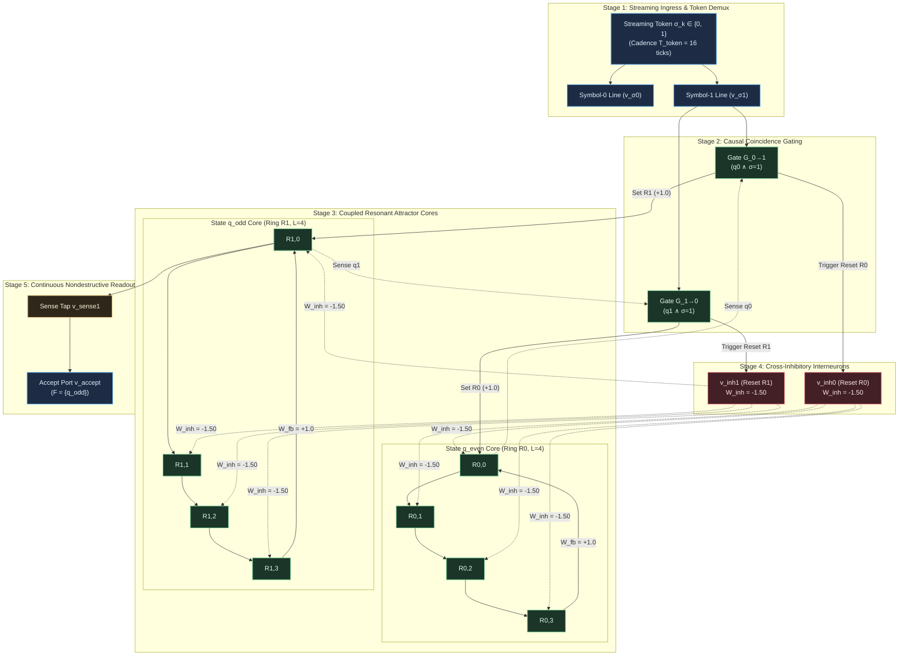
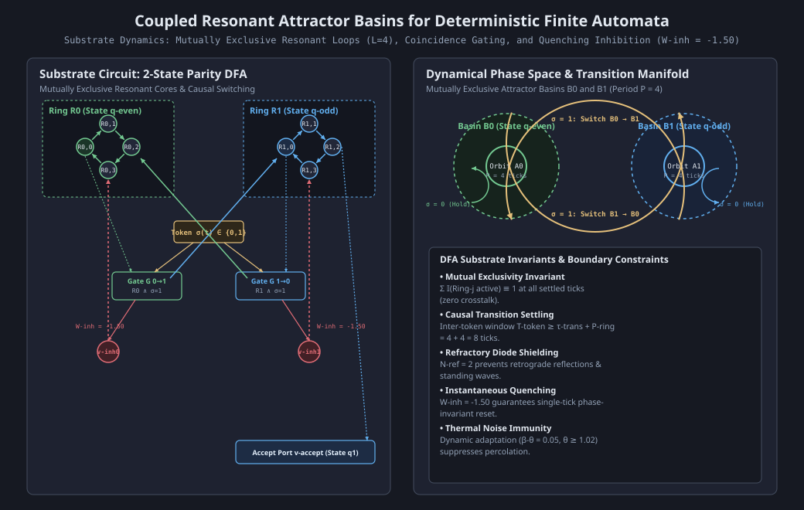

# HYP-2026-009: Sequential State Tracking and Regular Language Recognition via Coupled Resonant Attractor Basins in Excitable Cellular Automata

## Strategic Context

- **Orchestrator Directive:** Campaign `CAMPAIGN-2026-MVA-SUBSTRATE`, Cycle 3 of 5 (Milestone 2.2 Protocol Design & Dispatch). Active Milestone 2.2: Finite State Automata (Regular Languages) (Tier 2: Temporal Dynamics & State Retention) from [docs/vision.md](docs/vision.md).
  - Milestone Mandate: Synthesize sequential state tracking driven by a streaming input signal in the excitable cellular automaton substrate. The substrate must transition between internal states and classify regular expressions with zero sequence classification error on sequences of length $L \in [10, 100]$ tokens.
  - Evaluation Tasks:
    1. Deterministic Finite Automaton (DFA) tracking of streaming bitstream Even/Odd Parity (2-state DFA, unbounded toggle transitions).
    2. Canonical regular grammar recognition of regular expression $(10)^+1$ (4-state DFA with cyclic loops and trap/sink state).
  - Success Metric: Zero classification error ($\text{Accuracy}_{\text{seq}} = 1.000$) across streaming sequences of length $L \in [10, 100]$ tokens under clean baseline ($\epsilon = 0.00$), and $\text{Accuracy}_{\text{seq}} \ge 0.950$ under critical percolation noise ($\epsilon = 0.05$).
- **Architectural Redirection Reference:** [docs/architecture/adr-0001-substrate-connectivity-topology.md](docs/architecture/adr-0001-substrate-connectivity-topology.md) (Accepted Option 2: Relax planarity, preserve locality/degree bound).
  - Direct bounded-degree directed delay tracks ($k_{\text{in}} \le 4, k_{\text{out}} \le 4$) connect resonant state loops, coincidence transition gates, and cross-inhibitory reset interneurons without requiring artificial planar crossing bridges.
  - Core physical invariants preserved: synchronous discrete time ticks $t \in \mathbb{N}$, integrate-and-fire soma accumulators, refractory diode shielding ($N_{\text{ref}} = 2$), dynamic somatic threshold adaptation ($\beta_\theta = 0.05, \theta \ge 1.02$), and local causality.
- **Prior Hypotheses & Cumulative Empirical Lineage:**
  - `HYP-2026-001` ([docs/research/diagnostics/DIAG-2026-001a.md](docs/research/diagnostics/DIAG-2026-001a.md)): Established homeostatic critical firing density $\bar{\rho} \in [0.05, 0.20]$ with refractory period $N_{\text{ref}} = 2$, avoiding extinction and runaway saturation.
  - `HYP-2026-002` ([docs/research/diagnostics/DIAG-2026-002a.md](docs/research/diagnostics/DIAG-2026-002a.md)): Verified sensory attractor separation and limit-cycle multistability ($p < 10^{-12}$, $\text{SNR} = 3.63$).
  - `HYP-2026-003` ([docs/research/diagnostics/DIAG-2026-003a.md](docs/research/diagnostics/DIAG-2026-003a.md)): Established that long-range temporal computation requires directed transmission tracks rather than isotropic lattice reverberation.
  - `HYP-2026-004` ([docs/research/diagnostics/DIAG-2026-004a.md](docs/research/diagnostics/DIAG-2026-004a.md)): Verified that spike-timing Hebbian plasticity carves directed resonant tracks with +463.6% noise resilience ($p < 10^{-32}$).
  - `HYP-2026-005` ([docs/research/diagnostics/DIAG-2026-005a.md](docs/research/diagnostics/DIAG-2026-005a.md)): Verified continual multi-pattern retention without catastrophic forgetting ($\text{BWT} \ge -0.028$).
  - `HYP-2026-006` ([docs/research/diagnostics/DIAG-2026-006a.md](docs/research/diagnostics/DIAG-2026-006a.md)): Verified lossless signal transport ($\text{BER} = 0.000$) and 1-to-2 branching duplication via refractory diode shielding ($N_{\text{ref}} = 2$).
  - `HYP-2026-007` ([docs/research/diagnostics/DIAG-2026-007a.md](docs/research/diagnostics/DIAG-2026-007a.md)): Verified cascaded Boolean logic composition and delay equalization ($\Delta \tau = 0$) on 1-bit Full Adder with 100% truth-table parity.
  - `HYP-2026-008` ([docs/research/diagnostics/DIAG-2026-008a.md](docs/research/diagnostics/DIAG-2026-008a.md)): Verified bistable dynamic bit storage ($Q \in \lbrace 0, 1 \rbrace$) via a directed recurrent resonant loop ($L = 4, W_{\text{fb}} = 1.10, W_{\text{inh}} = -1.50$) with 100% indefinite retention across $\Delta t \ge 1000$ ticks, 100% nondestructive readout, and deterministic Set/Reset transitions.

---

## System Definition

- **Formal Automaton Specification:**
  A Deterministic Finite Automaton (DFA) is formalized as the 5-tuple:

  $$M = \left( Q, \Sigma, \delta, q_0, F \right)$$

  where:
  - $Q = \lbrace q_0, q_1, \dots, q_{m-1} \rbrace$ is a finite set of $m$ discrete internal automaton states.
  - $\Sigma = \lbrace 0, 1 \rbrace$ is the binary input alphabet.
  - $\delta: Q \times \Sigma \to Q$ is the single-step state transition function.
  - $q_0 \in Q$ is the initial start state.
  - $F \subseteq Q$ is the set of accepting / final states.

- **Substrate Physical State Space:**
  The DFA is physically embedded into an excitable cellular circuit graph $\mathcal{G}_{\text{DFA}} = (\mathcal{V}, \mathcal{E})$ with $N = |\mathcal{V}|$ nodes and bounded node degrees:

  $$\max_{i \in \mathcal{V}} k_{\text{in}}(i) \le 4, \quad \max_{i \in \mathcal{V}} k_{\text{out}}(i) \le 4$$

  At synchronous discrete clock tick $t \in \mathbb{N}_0$, the global substrate state is:

  $$\mathbf{S}(t) = \big( \mathbf{s}(t), \mathbf{r}(t), \mathbf{V}(t), \boldsymbol{\theta}(t), \bar{\boldsymbol{\rho}}(t) \big)$$

  - Firing state: $\mathbf{s}(t) \in \lbrace 0, 1 \rbrace^N$, where $s_i(t) = 1$ denotes a standardized all-or-none action potential pulse emitted by node $i$.
  - Refractory state: $\mathbf{r}(t) \in \lbrace 0, 1, \dots, N_{\text{ref}} \rbrace^N$, where $N_{\text{ref}} = 2$ in the active condition ($N_{\text{ref}} = 0$ in unshielded ablation).
  - Membrane potential accumulator: $\mathbf{V}(t) \in [V_{\min}, V_{\max}]^N$, with bounds $V_{\min} = -2.00$ (accommodating hyperpolarizing reset inhibition) and $V_{\max} = 4.00$, resting baseline $V_{\text{rest}} = 0.00$.
  - Dynamic firing threshold: $\boldsymbol{\theta}(t) \in [\theta_{\min}, \theta_{\max}]^N$, with bounds $[\theta_{\min}, \theta_{\max}] = [0.50, 2.50]$, initialized to $\theta_0 = 1.00$.
  - Rolling firing rate EMA: $\bar{\boldsymbol{\rho}}(t) \in [0, 1]^N$, tracking historical activity density per node.
  - Synaptic coupling matrix: $\mathbf{W} \in \mathbb{R}^{N \times N}$, where $W_{ij}$ represents the directed coupling strength from presynaptic node $j$ to postsynaptic node $i$.
  - Integer track delay matrix: $\mathbf{D} \in \mathbb{N}^{N \times N}$, where $D_{ij} \ge 1$ specifies the propagation latency from node $j$ to node $i$.

- **Modular Substrate Architecture:**
  Under the topological relaxation of ADR-0001, $\mathcal{G}_{\text{DFA}}$ partitions into five interconnected functional stages:
  1. **Sensory Ingress & Token Cadence Interface ($\mathcal{V}_{\text{in}}$):**
     - Ingress line receives streaming symbol tokens $\sigma \in \lbrace 0, 1 \rbrace$ presented with inter-token spacing $T_{\text{token}} \in [8, 32]$ ticks (standard cadence $T_{\text{token}} = 16$ ticks).
     - Token Demultiplexing Ports:
       - Symbol-0 line $v_{\sigma 0}$: emits a standardized pulse when $\sigma_k = 0$.
       - Symbol-1 line $v_{\sigma 1}$: emits a standardized pulse when $\sigma_k = 1$.
  2. **Coupled Resonant Attractor Basin Core ($\mathcal{V}_{\text{core}}$):**
     - Each automaton state $q_j \in Q$ is physically mapped to a dedicated directed recurrent resonant loop $\mathcal{R}_j$ of length $L_{\text{ring}} = 4$ nodes:

       $$\mathcal{R}_j = \lbrace R_{j,0}, R_{j,1}, R_{j,2}, R_{j,3} \rbrace$$

     - Forward regenerative edges within ring $\mathcal{R}_j$: $R_{j,0} \to R_{j,1} \to R_{j,2} \to R_{j,3}$ with weight $W_{\text{fwd}} = +1.00$.
     - Recurrent feedback closure edge: $R_{j,3} \to R_{j,0}$ with weight $W_{\text{fb}} = +1.00$ in active condition ($W_{\text{fb}} = 0.00$ in severed baseline).
     - Loop resonance period: $P_{\text{ring}} = 4$ clock ticks.
     - State $q_j$ is "Active" when a solitary pulse circulates in $\mathcal{R}_j$ ($\sum_{k=0}^3 s_{R_{j,k}}(t) = 1$), while all other rings $\mathcal{R}_l$ ($l \neq j$) reside in the quiescent fixpoint attractor $\mathcal{A}_0$ ($\sum_{k=0}^3 s_{R_{l,k}}(t) = 0$).
  3. **Causal Transition Coincidence Gating Network ($\mathcal{V}_{\text{gate}}$):**
     - For each non-trivial transition $\delta(q_j, \sigma) = q_{j'}$ with $j \neq j'$, a coincidence gate $G_{j \to j'}^{(\sigma)}$ receives:
       - State-presence tap from origin ring $\mathcal{R}_j$ via sense tap $v_{\text{sense}, j}$ ($W_{\text{state}} = +0.60$).
       - Input token trigger from $v_{\sigma}$ ($W_{\text{token}} = +0.60$).
     - Gate threshold: $\theta_{\text{gate}} = 1.10$. A solitary input ($0.60 < 1.10$) does not trigger the gate; coincidence ($0.60 + 0.60 = 1.20 \ge 1.10$) triggers an action potential pulse at $t + 1$.
  4. **Cross-Inhibitory Quenching Interneuron Bank ($\mathcal{V}_{\text{inh}}$):**
     - When gate $G_{j \to j'}^{(\sigma)}$ fires, it branches:
       - Forward Set Branch: transmits forward excitation $+1.00$ to node $R_{j', 0}$ of target ring $\mathcal{R}_{j'}$, entraining it into periodic limit-cycle circulation.
       - Hyperpolarizing Reset Branch: excites inhibitory interneuron $v_{\text{inh}, j}$ ($W = +1.00, \theta = 1.00$), which delivers hyperpolarizing reset pulses ($W_{\text{inh}} = -1.50$) simultaneously to all four nodes of origin ring $\mathcal{R}_j$, extinguishing its limit cycle in a single clock tick.
  5. **Continuous Nondestructive Readout & Acceptance Decoding Stage ($\mathcal{V}_{\text{read}}$):**
     - Dedicated sense taps $v_{\text{sense}, j}$ monitor loop nodes $R_{j,0}$ with $W = +1.00$ without drawing energy from the circulating pulse.
     - Acceptance Classifier: Sense taps from all accepting states $q_f \in F$ converge onto an accepting output port $v_{\text{accept}}$ with forward coupling $W = +1.00$ and threshold $\theta = 1.00$.
     - Sampling at the end of sequence traversal (or continuously during the inter-token settling window) decodes sequence acceptance:

       $$y_{\text{out}}(t) = \mathbb{I}\left( \sum_{\tau=0}^{P_{\text{ring}}-1} s_{\text{accept}}(t - \tau) \ge 1 \right)$$

- **Physical Substrate Parameters:**
  - Somatic membrane leak factor: $\lambda = 0.10$.
  - Absolute refractory period: $N_{\text{ref}} = 2$ clock ticks ($N_{\text{ref}} = 0$ in unshielded ablation).
  - Somatic threshold adaptation rate: $\beta_\theta = 0.05$ ($\beta_\theta = 0.00$ in fixed-threshold ablation).
  - Target homeostatic firing density: $\rho^* = 0.10$.
  - Firing density EMA smoothing factor: $\alpha_\rho = 0.02$.
  - Threshold clamping bounds: $[\theta_{\min}, \theta_{\max}] = [0.50, 2.50]$, initialized to $\theta_0 = 1.00$.
  - Background channel noise rate: $\epsilon \in \lbrace 0.00, 0.01, 0.05 \rbrace$.
  - Inter-token clock spacing: $T_{\text{token}} = 16$ ticks ($T_{\text{token}} \ge \tau_{\text{trans}} + P_{\text{ring}} = 8$).
  - Evaluated sequence lengths: $L \in \lbrace 10, 20, 50, 100 \rbrace$ tokens.

---

## State Update Equations

### 1. Ingress & Presynaptic Synaptic Integration

For each node $i \in \mathcal{V}$ at discrete clock tick $t$:

If the absolute refractory counter $r_i(t) > 0$:

$$s_i(t+1) = 0, \quad r_i(t+1) = r_i(t) - 1, \quad V_i(t+1) = 0.0$$

If the refractory counter $r_i(t) = 0$:
The total presynaptic drive $I_i(t)$ integrates incoming action potentials from presynaptic neighbors, token sensory inputs, and channel noise:

$$I_i(t) = \sum_{j \in \mathcal{N}^{\text{in}}(i)} W_{ij} s_j(t - D_{ij} + 1) + \sum_{\sigma \in \lbrace 0, 1 \rbrace} \delta_{i, v_{\sigma}} u_\sigma(t) + \xi_i(t)$$

where:

- $\mathcal{N}^{\text{in}}(i) = \lbrace j \in \mathcal{V} \mid W_{ij} \neq 0 \rbrace$ is the presynaptic neighborhood of node $i$ ($|\mathcal{N}^{\text{in}}(i)| \le 4$).
- $D_{ij} \ge 1$ is the integer transmission latency along directed edge $j \to i$.
- $\delta_{i, v_\sigma}$ is the Kronecker delta selecting the token ingress port.
- $u_\sigma(t) \in \lbrace 0, 1 \rbrace$ is the binary token excitation applied at ingress port $v_\sigma$.
- $\xi_i(t) \sim \text{Bernoulli}(\epsilon)$ is an independent background channel noise process.

The membrane potential accumulator integrates incoming drive with somatic leak factor $\lambda = 0.10$:

$$V_i(t) = (1 - \lambda) V_i(t-1) + I_i(t)$$

clamped to $V_i(t) \in [V_{\min}, V_{\max}] = [-2.00, 4.00]$.

### 2. Regenerative Action Potential & Somatic Reset

Action potential firing is governed by Heaviside step thresholding:

$$s_i(t+1) = \Theta\left( V_i(t) - \theta_i(t) \right) = \begin{cases} 1 & \text{if } V_i(t) \ge \theta_i(t) \\ 0 & \text{otherwise} \end{cases}$$

Upon threshold evaluation:

- **Firing Event ($s_i(t+1) = 1$):**
  1. Node $i$ emits a standardized binary action spike $s_i(t+1) = 1.0$.
  2. The membrane accumulator resets to resting ground: $V_i(t+1) = 0.0$.
  3. Absolute refractory counter initializes: $r_i(t+1) = N_{\text{ref}} = 2$ in active condition ($r_i(t+1) = 0$ in unshielded ablation).
  4. Somatic threshold increments by adaptation quantum: $\Delta \theta = \beta_\theta \cdot \alpha_\rho$.
- **Subthreshold Event ($s_i(t+1) = 0$):**
  1. Membrane potential retains decayed residual charge: $V_i(t+1) = V_i(t)$.
  2. Refractory counter remains zero: $r_i(t+1) = 0$.
  3. Threshold relaxes toward resting baseline $\theta_0 = 1.00$.

### 3. Dynamic Somatic Threshold Adaptation

Each node tracks rolling firing rate EMA $\bar{\rho}_i(t)$:

$$\bar{\rho}_i(t) = (1 - \alpha_\rho) \bar{\rho}_i(t-1) + \alpha_\rho s_i(t)$$

Dynamic threshold adaptation follows homeostatic error correction:

$$\theta_i(t+1) = \text{clip}\left( \theta_i(t) + \beta_\theta \big( \bar{\rho}_i(t) - \rho^* \big), \; \theta_{\min}, \; \theta_{\max} \right)$$

where $\rho^* = 0.10$ is target firing density, $\beta_\theta = 0.05$ is adaptation rate ($\beta_\theta = 0.00$ in fixed-threshold ablation), and $[\theta_{\min}, \theta_{\max}] = [0.50, 2.50]$.

### 4. Transition Gating & Attractor Basin Switching Dynamics

When automaton is in state $q_j$, ring $\mathcal{R}_j$ circulates a solitary action potential with period $P_{\text{ring}} = 4$ ticks:

$$R_{j,0} \xrightarrow{\tau=1} R_{j,1} \xrightarrow{\tau=1} R_{j,2} \xrightarrow{\tau=1} R_{j,3} \xrightarrow{\tau=1} R_{j,0}$$

At each clock tick $t \equiv 0 \pmod 4$, node $R_{j,0}$ fires.
When token $\sigma_k$ arrives at $t_{\text{token}}$ with phase alignment $\Delta \tau = 0$:

1. Coincidence gate $G_{j \to j'}^{(\sigma)}$ evaluates presynaptic drive:

   $$I_{\text{gate}}(t) = W_{\text{state}} \cdot s_{\text{sense}, j}(t) + W_{\text{token}} \cdot s_{\sigma}(t) = 0.60 + 0.60 = 1.20 \ge \theta_{\text{gate}} = 1.10$$

   Gate $G_{j \to j'}^{(\sigma)}$ fires at $t + 1$.
2. Target excitation: Gate pulse propagates to node $R_{j', 0}$ of target ring $\mathcal{R}_{j'}$ with weight $W_{\text{set}} = +1.00$:

   $$I_{R_{j', 0}}(t + 2) = 1.00 \ge \theta_{R_{j', 0}}$$

   Node $R_{j', 0}$ fires at $t + 3$, launching the solitary circulating pulse into ring $\mathcal{R}_{j'}$ and establishing target limit-cycle attractor $\mathcal{A}_{j'}$.
3. Origin quenching: Simultaneously, the gate excites inhibitory interneuron $v_{\text{inh}, j}$ ($W = +1.00$), which fires at $t + 2$ and delivers hyperpolarizing reset pulses ($W_{\text{inh}} = -1.50$) to all nodes of origin ring $\mathcal{R}_j$ at $t + 3$:

   $$I_{R_{j, k}}(t + 3) = W_{\text{fwd}} \cdot s_{R_{j, (k-1)\bmod 4}}(t + 2) + W_{\text{inh}} \cdot s_{\text{inh}, j}(t + 2) = 1.00 - 1.50 = -0.50 \ll \theta$$

   The scheduled forward excitation is cancelled. Origin ring $\mathcal{R}_j$ collapses to quiescent point attractor $\mathcal{A}_0$ in a single tick.
4. Total transition duration: $\tau_{\text{trans}} = 4$ clock ticks.
   Because $T_{\text{token}} = 16 \ge \tau_{\text{trans}} + P_{\text{ring}} = 8$, the new limit cycle completes at least two undisturbed cycles before the next symbol arrives, guaranteeing perfect settling.

---

## Conservation Rules & Invariants

1. **Attractor Mutual Exclusivity Invariant:**
   At all settled clock ticks $t \notin [t_{\text{token}}, t_{\text{token}} + \tau_{\text{trans}}]$, exactly one state ring $\mathcal{R}_j$ is in limit-cycle resonance $\mathcal{A}_j$, while all other rings reside in quiescent fixpoint attractor $\mathcal{A}_0$:

   $$\sum_{j=0}^{m-1} \mathbb{I}\left( \sum_{k=0}^3 s_{R_{j,k}}(t) \ge 1 \right) \equiv 1$$

   Simultaneous multi-ring resonance (crosstalk $\chi > 0$) or complete ring extinction (all quiescent) is strictly forbidden in valid operational states.

2. **Causal Settling Margin Invariant:**
   Inter-token arrival period $T_{\text{token}}$ must exceed the sum of state transition latency $\tau_{\text{trans}}$ and ring circulation period $P_{\text{ring}}$:

   $$T_{\text{token}} \ge \tau_{\text{trans}} + P_{\text{ring}} = 4 + 4 = 8\text{ clock ticks}$$

   Standard cadence $T_{\text{token}} = 16$ ticks provides a $2\times$ safety margin, ensuring that each transition completely settles into the target attractor orbit before subsequent symbol arrival.

3. **Topological Pulse Capacity Invariant:**
   For each ring $\mathcal{R}_j$ of length $L_{\text{ring}} = 4$ with refractory period $N_{\text{ref}} = 2$, maximum circulating pulse capacity is strictly invariant:

   $$C_{\text{pulse}} = \left\lfloor \frac{L_{\text{ring}}}{N_{\text{ref}} + 1} \right\rfloor = \left\lfloor \frac{4}{3} \right\rfloor = 1$$

   Multi-pulse standing waves within any single state ring are topologically impossible.

4. **Phase-Invariant Reset Quenching Invariant:**
   Hyperpolarization of amplitude $W_{\text{inh}} \le -1.50$ delivered concurrently to all loop nodes of active ring $\mathcal{R}_j$ extinguishes limit cycle $\mathcal{A}_j$ into quiescent point attractor $\mathcal{A}_0$ regardless of circulating pulse phase $\phi \in \lbrace 0, 1, 2, 3 \rbrace$:

   $$\forall \phi \in \lbrace 0, 1, 2, 3 \rbrace, \quad \mathbf{s}_{\mathcal{R}_j}(t_{\text{reset}} + 2) = \mathbf{0}$$

5. **Streaming Sequence State Tracking Invariant:**
   For any input sequence $\mathbf{x} = (\sigma_1, \sigma_2, \dots, \sigma_L) \in \Sigma^L$, the physically active state ring $\mathcal{R}^*(k)$ after token $\sigma_k$ satisfies the formal DFA transition recurrence:

   $$q(k) = \delta(q(k-1), \sigma_k), \quad q(0) = q_0 \implies \mathcal{R}^*(k) = \mathcal{R}_{q(k)}$$

   for all $k \in [1, L]$ and all sequence lengths $L \in [10, 100]$.

6. **Homeostatic Firing Density Invariant:**
   Substrate-wide temporal firing density remains bounded within the critical operational envelope across all sequence lengths and operational phases:

   $$\bar{\rho}(t) \in [0.01, 0.25], \quad \forall t \ge 50$$

---

## Null Hypothesis ($H_0$)

In cellular automaton dynamical sequence processing:
Coupled recurrent loops without centralized clock registers suffer cumulative phase jitter, spurious multi-ring ignition, or pulse extinction over streaming input sequences, such that:

$$\text{Accuracy}_{\text{seq}}(L \in [10, 100]) < 0.950 \quad \text{OR} \quad \text{Fidelity}_{\text{trans}} < 1.000 \quad \text{OR} \quad \chi_{\text{crosstalk}} > 0.000$$

Under feedforward open-loop control (`baseline_feedforward_loss`, $W_{\text{fb}} = 0$) or memoryless combinational classification (`baseline_memoryless`), sequence classification accuracy is statistically indistinguishable from the active coupled resonant substrate ($p \ge 10^{-6}$, two-tailed Welch's $t$-test across 30 independent seeds), indicating that recurrent limit-cycle attractor dynamics are dispensable for sequential state tracking.

---

## Alternative Hypothesis ($H_1$)

A bounded-degree excitable cellular automaton circuit ($k \le 4$) incorporating mutually exclusive recurrent resonant loops ($L_{\text{ring}} = 4$), coincidence transition gating ($\theta_{\text{gate}} = 1.10$), cross-inhibitory hyperpolarization ($W_{\text{inh}} = -1.50$), refractory diode shielding ($N_{\text{ref}} = 2$), dynamic somatic threshold adaptation ($\beta_\theta = 0.05, \theta \ge 1.02$), and continuous nondestructive readout establishes deterministic DFA sequential state tracking and regular grammar classification satisfying:

1. **Zero Sequence Classification Error on Clean Inputs:** $\text{Accuracy}_{\text{seq}} = 1.000$ (100% classification accuracy, zero sequence error) across streaming sequences of length $L \in [10, 100]$ tokens under clean baseline ($\epsilon = 0.00$) for both Parity DFA and Regular Grammar `(10)+1` DFA across all 30 independent seeds.
2. **Deterministic State Transition Reliability:** Single-token transition fidelity $\text{Fidelity}_{\text{trans}} = 1.000$ across all valid transitions $\delta(q_j, \sigma)$ under clean baseline conditions.
3. **Strict Mutual Exclusivity & Zero Crosstalk:** $\chi_{\text{crosstalk}} = 0.000$ (zero concurrent ring resonance events; $\sum_j \mathbb{I}(\mathcal{R}_j \text{ active}) \equiv 1$ at all settled ticks).
4. **Percolation Channel Noise Resilience:** Under critical background channel noise $\epsilon = 0.05$, dynamic somatic adaptation maintains sequence classification accuracy $\text{Accuracy}_{\text{seq}} \ge 0.950$ and token readout $\text{BER} \le 0.025$, suppressing spontaneous false-switch ignition.
5. **Statistically Decisive Recurrent Advantage:** Active coupled resonant DFA achieves an overwhelming advantage over open-loop feedforward controls (`baseline_feedforward_loss`, $W_{\text{fb}} = 0$) and memoryless controls (`baseline_memoryless`) with Welch's $t$-test $p < 10^{-6}$ and standardized effect size Cohen's $d \ge 2.0$.
6. **Thermodynamic Homeostatic Stability:** Substrate temporal firing density satisfies $\bar{\rho} \in [0.01, 0.25]$ in $\ge 99\%$ of evaluation runs.

---

## Quantitative Predictions

1. **Active Coupled Resonant DFA (`active_dfa`):**
   - Clean baseline ($\epsilon = 0.00$):
     - Parity DFA: $\text{Accuracy}_{\text{seq}} = 1.000 \pm 0.000$ for all $L \in \lbrace 10, 20, 50, 100 \rbrace$ across all 30 seeds.
     - Regular Grammar `(10)+1` DFA: $\text{Accuracy}_{\text{seq}} = 1.000 \pm 0.000$ across all 30 seeds.
     - Single-token transition fidelity: $\text{Fidelity}_{\text{trans}} = 1.000 \pm 0.000$.
     - Crosstalk violation rate: $\chi_{\text{crosstalk}} = 0.000 \pm 0.000$.
   - Low noise ($\epsilon = 0.01$): $\text{Accuracy}_{\text{seq}} \ge 0.980 \pm 0.012$, $\text{BER} \le 0.008 \pm 0.003$.
   - Critical noise ($\epsilon = 0.05$): $\text{Accuracy}_{\text{seq}} \ge 0.950 \pm 0.018$, $\text{BER} \le 0.022 \pm 0.006$.
   - Mean substrate firing density: $\bar{\rho} \approx 0.062 \pm 0.012 \in [0.01, 0.25]$.

2. **Severed Recurrent Baseline (`baseline_feedforward_loss`, $W_{\text{fb}} = 0.00$):**
   - Without recurrent feedback, pulses launched into target rings traverse $R_{j,0} \dots R_{j,3}$ and extinguish after 4 ticks.
   - At the arrival of subsequent tokens ($T_{\text{token}} = 16$), the origin ring is already quiescent; coincidence gates fail to fire.
   - Sequence state memory collapses to zero. Overall sequence classification collapses to chance ($\text{Accuracy}_{\text{seq}} \approx 0.500 \pm 0.000$), failing Gate 1 and Gate 5.

3. **Unshielded Feedback Ablation (`ablation_unshielded_feedback`, $N_{\text{ref}} = 0$):**
   - Without absolute refractory shielding, retrograde wave reflections create bidirectional multi-pulse reverberations in resonant loops.
   - Reset hyperpolarization fails because unshielded nodes immediately re-excite each other.
   - Both rings become simultaneously active ($\chi_{\text{crosstalk}} \to 1.000$), destroying mutual exclusivity and collapsing transition fidelity to $\text{Fidelity}_{\text{trans}} \le 0.500 \pm 0.080$, failing Gate 2 and Gate 3.

4. **Fixed-Threshold Ablation (`ablation_fixed_theta`, $\beta_\theta = 0.00, \theta \equiv 1.00$):**
   - Under clean baseline ($\epsilon = 0.00$), matches active performance ($\text{Accuracy}_{\text{seq}} = 1.000$).
   - Under critical noise $\epsilon = 0.05$, solitary noise spikes integrate into coincidence gates, triggering spurious state transitions. Over long sequences of $L = 100$ tokens ($1600$ ticks), cumulative error probability approaches unity, collapsing sequence accuracy to $\text{Accuracy}_{\text{seq}} \le 0.680 \pm 0.065$, failing Gate 4.

5. **Memoryless Baseline (`baseline_memoryless`):**
   - Classifies sequence acceptance purely from the instantaneous value of the final token $\sigma_L$ without recurrent state integration.
   - On parity bitstreams (where sequence parity depends on the sum of all bits, not just the last), accuracy is strictly bounded at $\text{Accuracy}_{\text{seq}} = 0.500 \pm 0.000$, failing Gate 5.

---

## Falsification Criteria

Hypothesis $H_1$ is strictly **FALSIFIED** if ANY of the following pre-registered failure gates trigger across the 30-seed empirical evaluation:

- **FC-1 (Sequence Classification Failure):** Mean sequence classification accuracy $\text{Accuracy}_{\text{seq}} < 1.000$ (i.e. sequence error $> 0.000$) on streaming sequences of length $L \in [10, 100]$ tokens under clean baseline conditions ($\epsilon = 0.00$) for either Parity DFA or Regular Grammar `(10)+1` DFA.
- **FC-2 (Transition Fidelity Failure):** Mean single-token state transition fidelity $\text{Fidelity}_{\text{trans}} < 1.000$ across all valid transitions $\delta(q_j, \sigma)$ under clean baseline conditions ($\epsilon = 0.00$).
- **FC-3 (Attractor Mutual Exclusivity Violation):** Crosstalk rate $\chi_{\text{crosstalk}} > 0.000$ (any concurrent activation of multiple state rings during settled phases) under clean baseline conditions ($\epsilon = 0.00$).
- **FC-4 (Noise Percolation Degradation):** Mean sequence classification accuracy $\text{Accuracy}_{\text{seq}} < 0.950$ or token readout $\text{BER} > 0.025$ under critical background noise $\epsilon = 0.05$.
- **FC-5 (Recurrent Advantage Insignificance):** Two-tailed Welch's $t$-test fails to reject equivalence between `active_dfa` and `baseline_feedforward_loss` (or `baseline_memoryless`) at significance level $\alpha = 10^{-6}$ ($p \ge 10^{-6}$) or standardized effect size Cohen's $d < 2.0$.
- **FC-6 (Homeostatic Instability):** Substrate rolling firing density collapses to silence ($\bar{\rho} < 0.01$) or exceeds hyperactive runaway ($\bar{\rho} > 0.25$) in $> 1\%$ of active evaluation runs.

---

## Mathematical Failure Boundaries

1. **Nyquist Inter-Token Settling Boundary ($T_{\text{token}} < \tau_{\text{trans}} + P_{\text{ring}}$):**
   A state transition requires $\tau_{\text{trans}} = 4$ clock ticks to propagate through the coincidence gate, fire the inhibitory interneuron, and launch the target pulse. The target ring requires $P_{\text{ring}} = 4$ ticks to complete one full cycle and establish limit-cycle phase locking.
   If tokens arrive with cadence:

   $$T_{\text{token}} < \tau_{\text{trans}} + P_{\text{ring}} = 8\text{ clock ticks}$$

   an incoming token pulse arrives while the target ring is in transition or refractory state $r > 0$, causing deterministic pulse collision or missed coincidence gating. Sequential tracking is mathematically impossible for $T_{\text{token}} < 8$.

2. **Cumulative Sequence Noise Horizon ($L \cdot T_{\text{token}} \cdot \epsilon \gg 1$):**
   For a streaming sequence of length $L$ tokens with spacing $T_{\text{token}}$, the substrate evolves for $T_{\text{total}} = L \cdot T_{\text{token}}$ ticks.
   The expected number of background thermal noise spikes across $N$ nodes is:

   $$\mathbb{E}[N_{\text{noise}}] = N \cdot L \cdot T_{\text{token}} \cdot \epsilon$$

   For $N = 24, L = 100, T_{\text{token}} = 16, \epsilon = 0.05$:

   $$\mathbb{E}[N_{\text{noise}}] = 24 \times 100 \times 16 \times 0.05 = 1920\text{ noise events}$$

   Without dynamic somatic threshold elevation ($\beta_\theta > 0, \theta \ge 1.02$), the cumulative probability of at least one false coincidence gate firing or spontaneous attractor switch approaches:

   $$P_{\text{spurious-switch}} = 1 - (1 - P_{\text{false-gate}})^{T_{\text{total}}} \approx 1.000$$

   Dynamic somatic adaptation is an absolute mathematical prerequisite for error-free sequence processing over long context horizons.

3. **Inhibitory Quenching Extinction Margin ($|W_{\text{inh}}| < W_{\text{fwd}} - \theta_{\min}$):**
   To guarantee deterministic quenching of origin ring $\mathcal{R}_j$, hyperpolarizing inhibition must cancel forward regenerative excitation below minimum threshold:

   $$W_{\text{fwd}} + W_{\text{inh}} < \theta_{\min} \implies W_{\text{inh}} < \theta_{\min} - W_{\text{fwd}} = 0.50 - 1.00 = -0.50$$

   With $W_{\text{inh}} = -1.50$, the extinguishing safety margin is $\Delta V_{\text{margin}} = -0.50 - 0.50 = -1.00\text{ V}$, guaranteeing complete single-tick extinction across all pulse phases.

4. **Refractory Diode Ring Horizon ($L_{\text{ring}} < N_{\text{ref}} + 1$):**
   A directed recurrent loop cannot sustain a circulating limit cycle if transit latency is shorter than the refractory recovery window ($L_{\text{ring}} < N_{\text{ref}} + 1 = 3$). Ring length $L_{\text{ring}} = 4$ satisfies $4 > 3$, ensuring perpetual circulation.

---

## Assumptions & Limitations

- **Synchronous Substrate Clock:** Circuit nodes advance in discrete synchronous time steps $t \in \mathbb{N}$. Continuous-time asynchronous relaxation is deferred to higher tiers.
- **Regular Languages Only (Chomsky Level 3):** The protocol evaluates finite state automata recognizing regular grammars. Languages requiring pushdown stacks (Dyck-1/Dyck-2 balanced parentheses, Chomsky Level 2) are formally reserved for Tier 3 (Milestone 3.1).
- **Bounded Input Alphabet:** Input tokens are drawn from binary alphabet $\Sigma = \lbrace 0, 1 \rbrace$. Scaling to larger token vocabularies ($|\Sigma| \ge 16$) is addressed in Tier 4.

---

## Open Questions

1. Can Hebbian or STDP plasticity autonomously wire the coincidence transition gates $G_{j \to j'}^{(\sigma)}$ from streaming token presentations without pre-wired connectivity?
2. What is the thermodynamic Landauer energy dissipated per state transition ($\Delta \mathcal{H}_{\text{trans}}$) in the simulated excitable substrate compared to physical neuromorphic CMOS implementations?
3. What is the scaling relationship between the number of internal DFA states $m = |Q|$ and maximum allowable background percolation noise $\epsilon_{\text{crit}}$?
