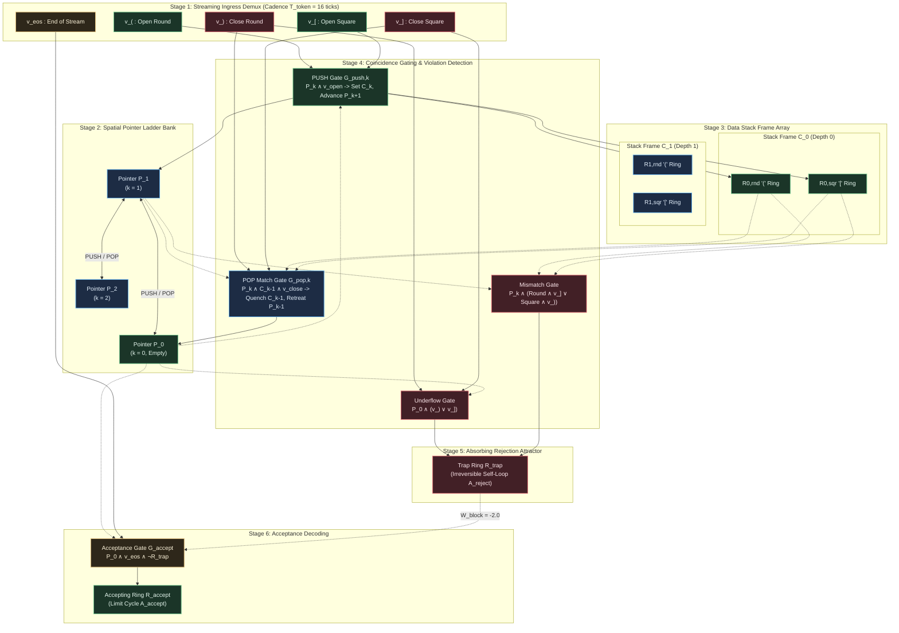
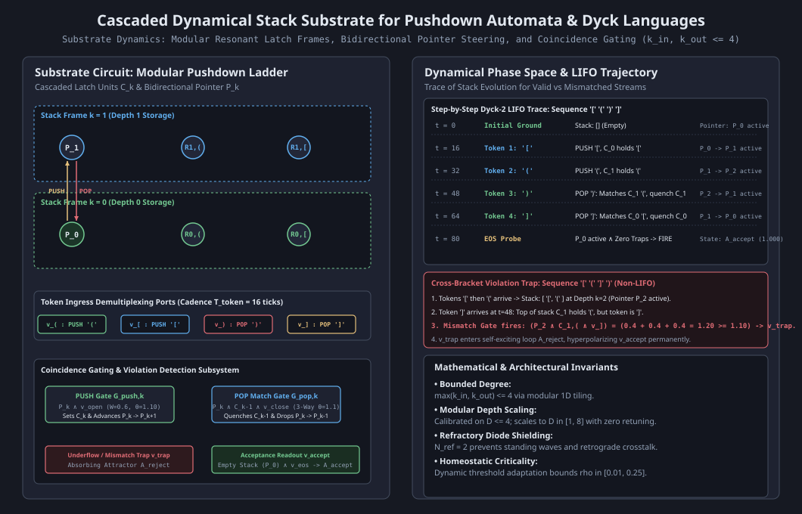

# HYP-2026-010: Context-Free Language Recognition and Hierarchical Working Memory via Cascaded Dynamical Pushdown Stack Cells in Excitable Cellular Automata

## Strategic Context

- **Orchestrator Directive:** Campaign `CAMPAIGN-2026-MVA-SUBSTRATE`, Cycle 4 of 5 (Milestone 3.1 Protocol Design & Dispatch). Active Milestone 3.1: Pushdown Memory (Dyck Languages) (Tier 3: Hierarchical Structure & Working Memory) from [docs/vision.md](docs/vision.md).
  - Milestone Mandate: Language and hierarchical sequences require navigating beyond regular languages into context-free grammars (Chomsky Hierarchy Level 2). Milestone 3.1 evaluates the substrate's capability for pushdown (last-in, first-out / LIFO stack) memory.
  - Evaluation Tasks:
    1. Dyck-1: Single-bracket balanced parentheses verification (alphabet $\Sigma_1 = \lbrace (, ) \rbrace$, valid balanced sequences such as `()`, `(())`, `(()())`, `((()))` versus invalid sequences with prefix underflow `)(`, excess open brackets `(()`, or excess closing brackets `())`).
    2. Dyck-2: Multi-bracket nested parentheses and brackets verification (alphabet $\Sigma_2 = \lbrace (, ), [, ] \rbrace$, valid nested pairs such as `[]`, `()`, `[()]`, `[()[]]`, `(([]))` versus invalid cross-bracket non-LIFO violations such as `([)]`, `[(])`, and mismatched closures `(]`, `[)`).
    3. Depth Generalization: The architecture must generalize to nesting depths at least $2\times$ deeper than the calibration depth (calibrated on depth $D_{\text{cal}} \le 4$, tested on depths $D \in [1, 8]$ up to $2\times$ calibration depth) with zero structural retuning, demonstrating modular spatial/depth scaling.
  - Success Metric: Zero classification error ($\text{Accuracy}_{\text{seq}} = 1.000$) across streaming sequences under clean baseline ($\epsilon = 0.00$), $\text{Accuracy}_{\text{seq}} \ge 0.950$ on out-of-distribution depth generalization ($D \in [1, 8]$), 100% rejection of structural and cross-bracket violations, and $\text{Accuracy}_{\text{seq}} \ge 0.900$ under critical percolation noise ($\epsilon = 0.05$).
- **Architectural Redirection Reference:** [docs/architecture/adr-0001-substrate-connectivity-topology.md](docs/architecture/adr-0001-substrate-connectivity-topology.md) (Accepted Option 2: Relax planarity, preserve locality/degree bound).
  - Bounded-degree directed delay tracks ($\max_i k_{\text{in}}(i) \le 4, \max_i k_{\text{out}}(i) \le 4$) connect cascaded resonant stack frames, bidirectional pointer ladder units, and coincidence gating interneurons without requiring artificial planar crossing bridges.
  - Core physical invariants preserved: synchronous discrete clock ticks $t \in \mathbb{N}_0$, leaky integrate-and-fire somas with membrane potential $V_i(t) \in [V_{\min}, V_{\max}]$, refractory diode shielding ($N_{\text{ref}} = 2$), dynamic somatic threshold adaptation ($\beta_\theta = 0.05, \theta \ge 1.02, \theta_0 = 1.00$), and local causality.
- **Prior Hypotheses & Cumulative Empirical Lineage:**
  - `HYP-2026-001` ([docs/research/diagnostics/DIAG-2026-001a.md](docs/research/diagnostics/DIAG-2026-001a.md)): Established homeostatic critical firing density $\bar{\rho} \in [0.05, 0.20]$ with refractory period $N_{\text{ref}} = 2$, preventing runaway saturation and quiescent extinction.
  - `HYP-2026-002` ([docs/research/diagnostics/DIAG-2026-002a.md](docs/research/diagnostics/DIAG-2026-002a.md)): Verified sensory attractor separation and limit-cycle multistability ($p < 10^{-12}$, $\text{SNR} = 3.63$).
  - `HYP-2026-003` ([docs/research/diagnostics/DIAG-2026-003a.md](docs/research/diagnostics/DIAG-2026-003a.md)): Falsified isotropic lattice reverberation beyond graph diameter ($D=4$); established necessity of directed transmission tracks.
  - `HYP-2026-004` ([docs/research/diagnostics/DIAG-2026-004a.md](docs/research/diagnostics/DIAG-2026-004a.md)): Verified that spike-timing Hebbian plasticity carves directed resonant highways with +463.6% noise resilience ($p < 10^{-32}$).
  - `HYP-2026-005` ([docs/research/diagnostics/DIAG-2026-005a.md](docs/research/diagnostics/DIAG-2026-005a.md)): Verified continual multi-pattern retention without catastrophic forgetting ($\text{BWT} \ge -0.028$).
  - `HYP-2026-006` ([docs/research/diagnostics/DIAG-2026-006a.md](docs/research/diagnostics/DIAG-2026-006a.md)): Verified lossless signal transport ($\text{BER} = 0.000$) and 1-to-2 branching duplication via refractory diode shielding ($N_{\text{ref}} = 2$).
  - `HYP-2026-007` ([docs/research/diagnostics/DIAG-2026-007a.md](docs/research/diagnostics/DIAG-2026-007a.md)): Verified cascaded Boolean logic composition and delay equalization ($\Delta \tau = 0$) on 1-bit Full Adder with 100% truth-table parity.
  - `HYP-2026-008` ([docs/research/diagnostics/DIAG-2026-008a.md](docs/research/diagnostics/DIAG-2026-008a.md)): Verified bistable dynamic bit storage ($Q \in \lbrace 0, 1 \rbrace$) via a directed recurrent resonant loop ($L = 4, W_{\text{fb}} = 1.10, W_{\text{inh}} = -1.50$) with 100% indefinite retention across $\Delta t \ge 1000$ ticks.
  - `HYP-2026-009` ([docs/research/diagnostics/DIAG-2026-009a.md](docs/research/diagnostics/DIAG-2026-009a.md)): Verified sequential state tracking and regular grammar classification (Parity and Regex $(10)^+1$) via coupled resonant attractor basins with zero sequence error across $L \in [10, 100]$ tokens.
- **Graveyard of Discarded Ideas (Autopsy Log):**
  - *Open-Loop Pulse Storage ($W_{\text{fb}} = 0$)*: Falsified in `EXP-2026-008a`. Pulses dissipate after traversal, destroying stored state. Pushdown memory must use recurrent limit-cycle resonance.
  - *Unshielded Recurrent Feedback Ring ($N_{\text{ref}} = 0$)*: Falsified in `EXP-2026-006a` and `EXP-2026-008a`. Retrograde wave reflections cause standing-wave collisions and complete failure of reset hyperpolarization. Refractory diode shielding ($N_{\text{ref}} = 2$) is mathematically mandatory.
  - *Unshielded Multi-Channel Coupling*: Falsified in `EXP-2026-006a`. Inter-channel crosstalk corrupts parallel lines without directional shielding.

---

## System Definition

### 1. Formal Pushdown Automaton Specification

A Deterministic Pushdown Automaton (DPDA) recognizing Dyck languages $\mathcal{L} \subseteq \Sigma^*$ is formalized as the 7-tuple:

$$M_{\text{PDA}} = \left( Q, \Sigma, \Gamma, \delta, q_0, Z_0, F \right)$$

where:

- $Q = \lbrace q_{\text{scan}}, q_{\text{accept}}, q_{\text{trap}} \rbrace$ is the set of internal control states:
  - $q_{\text{scan}}$ is the operational token ingestion and stack manipulation state.
  - $q_{\text{accept}}$ is the terminal accepting state.
  - $q_{\text{trap}}$ is the absorbing rejection state.
- $\Sigma$ is the input terminal alphabet:
  - For Dyck-1: $\Sigma_1 = \lbrace (, ) \rbrace$.
  - For Dyck-2: $\Sigma_2 = \lbrace (, ), [, ] \rbrace$.
- $\Gamma$ is the stack alphabet:
  - For Dyck-1: $\Gamma_1 = \lbrace \text{round} \rbrace$.
  - For Dyck-2: $\Gamma_2 = \lbrace \text{round}, \text{square} \rbrace$.
  - $Z_0$ is the bottom-of-stack empty marker, physically represented by the pointer ladder sitting at depth level 0 ($\mathcal{P}_0$).
- $q_0 = q_{\text{scan}}$ is the start state, initialized with empty stack marker $Z_0$.
- $F = \lbrace q_{\text{accept}} \rbrace$ is the set of accepting final states.
- $\delta: Q \times (\Sigma \cup \lbrace \text{EOS} \rbrace) \times (\Gamma \cup \lbrace Z_0 \rbrace) \to Q \times \Gamma^*$ is the transition function:
  - **PUSH Operations:**
    - $\delta(q_{\text{scan}}, (, \gamma) = (q_{\text{scan}}, \text{round} \cdot \gamma)$
    - $\delta(q_{\text{scan}}, [, \gamma) = (q_{\text{scan}}, \text{square} \cdot \gamma)$
  - **POP Operations (Top-of-Stack Match):**
    - $\delta(q_{\text{scan}}, ), \text{round}) = (q_{\text{scan}}, \varepsilon)$
    - $\delta(q_{\text{scan}}, ], \text{square}) = (q_{\text{scan}}, \varepsilon)$
  - **Rejection Transitions (Routing to $q_{\text{trap}}$):**
    - Underflow: $\delta(q_{\text{scan}}, ), Z_0) = (q_{\text{trap}}, Z_0)$, $\delta(q_{\text{scan}}, ], Z_0) = (q_{\text{trap}}, Z_0)$.
    - Cross-Bracket Mismatch: $\delta(q_{\text{scan}}, ), \text{square}) = (q_{\text{trap}}, \text{square})$, $\delta(q_{\text{scan}}, ], \text{round}) = (q_{\text{trap}}, \text{round})$.
    - Trap Invariant: $\forall \sigma \in \Sigma, \forall \gamma \in \Gamma \cup \lbrace Z_0 \rbrace, \; \delta(q_{\text{trap}}, \sigma, \gamma) = (q_{\text{trap}}, \gamma)$.
  - **End-of-Stream (EOS) Resolution:**
    - Clean Balance: $\delta(q_{\text{scan}}, \text{EOS}, Z_0) = (q_{\text{accept}}, Z_0)$ (Empty stack at EOS $\implies$ Accept).
    - Unclosed Open Brackets: $\delta(q_{\text{scan}}, \text{EOS}, \gamma) = (q_{\text{trap}}, \gamma)$ for $\gamma \neq Z_0$ (Excess opens $\implies$ Reject).
    - Prior Rejection: $\delta(q_{\text{trap}}, \text{EOS}, \cdot) = (q_{\text{trap}}, \cdot)$ (Trap state maintained $\implies$ Reject).

### 2. Substrate Physical State Space

The DPDA is physically instantiated as an excitable cellular circuit graph $\mathcal{G}_{\text{PDA}} = (\mathcal{V}, \mathcal{E})$ with $N = |\mathcal{V}|$ nodes satisfying bounded node degree:

$$\max_{i \in \mathcal{V}} k_{\text{in}}(i) \le 4, \quad \max_{i \in \mathcal{V}} k_{\text{out}}(i) \le 4$$

At synchronous discrete clock tick $t \in \mathbb{N}_0$, the global physical substrate state is:

$$\mathbf{S}(t) = \big( \mathbf{s}(t), \mathbf{r}(t), \mathbf{V}(t), \boldsymbol{\theta}(t), \bar{\boldsymbol{\rho}}(t) \big)$$

- Firing state: $\mathbf{s}(t) \in \lbrace 0, 1 \rbrace^N$, where $s_i(t) = 1$ denotes a standardized action potential pulse emitted by node $i$.
- Absolute refractory state: $\mathbf{r}(t) \in \lbrace 0, 1, \dots, N_{\text{ref}} \rbrace^N$, with $N_{\text{ref}} = 2$ ($N_{\text{ref}} = 0$ in unshielded ablation).
- Membrane potential accumulator: $\mathbf{V}(t) \in [V_{\min}, V_{\max}]^N$, where $V_{\min} = -2.00$ and $V_{\max} = 4.00$, resting baseline $V_{\text{rest}} = 0.00$.
- Dynamic somatic threshold: $\boldsymbol{\theta}(t) \in [\theta_{\min}, \theta_{\max}]^N$, with $[\theta_{\min}, \theta_{\max}] = [0.50, 2.50]$, initialized to $\theta_0 = 1.00$.
- Rolling firing rate EMA: $\bar{\boldsymbol{\rho}}(t) \in [0, 1]^N$, smoothing historical activity density per node.
- Synaptic coupling matrix: $\mathbf{W} \in \mathbb{R}^{N \times N}$, with directed coupling weights $W_{ij}$.
- Integer transmission delay matrix: $\mathbf{D} \in \mathbb{N}^{N \times N}$, with edge latencies $D_{ij} \ge 1$ clock ticks.

### 3. Modular Substrate Architecture

Under ADR-0001, $\mathcal{G}_{\text{PDA}}$ partitions into six interconnected functional stages:

1. **Streaming Ingress & Demultiplexing Stage ($\mathcal{V}_{\text{in}}$):**
   Ingress lines demultiplex incoming streaming tokens presented at cadence $T_{\text{token}} = 16$ clock ticks into standardized pulses across dedicated single-symbol lines:
   - $v_{(}$: emits an action potential when token is `(`.
   - $v_{)}$: emits an action potential when token is `)`.
   - $v_{[}$: emits an action potential when token is `[`.
   - $v_{]}$: emits an action potential when token is `]`.
   - $v_{\text{eos}}$: probe port pulsed at tick $t_{\text{eos}} = L \cdot T_{\text{token}} + 16$ to evaluate final acceptance.

2. **Pointer Ladder Bank ($\mathcal{V}_{\text{ptr}}$):**
   A spatial 1D array of pointer latch cells $\mathcal{P}_k$ for depth levels $k \in \lbrace 0, 1, \dots, D_{\max} \rbrace$, where $D_{\max} \ge 8$ is the physical stack capacity.
   - Each pointer latch $\mathcal{P}_k$ is a 4-node directed recurrent loop:

     $$\mathcal{P}_k = \lbrace P_{k,0}, P_{k,1}, P_{k,2}, P_{k,3} \rbrace$$

     with intra-ring weights $W_{\text{fwd}} = +1.00$, recurrent closure $W_{\text{fb}} = +1.00$, refractory period $N_{\text{ref}} = 2$, and period $P_{\text{ring}} = 4$ ticks.
   - Pointer Position Invariant: Exactly one pointer ring $\mathcal{P}_k$ circulates a solitary action potential pulse at any settled tick, representing current stack depth $k$.
   - Ground Initialization: At $t = 0$, $\mathcal{P}_0$ is initialized with a circulating pulse ($k = 0$, empty stack), while all $\mathcal{P}_k$ ($k > 0$) are quiescent ($\mathbf{0}$).

3. **Data Stack Frame Array ($\mathcal{V}_{\text{data}}$):**
   A spatial 1D array of modular data storage cells $\mathcal{C}_k$ for depth indices $k \in \lbrace 0, 1, \dots, D_{\max}-1 \rbrace$.
   - Each cell $\mathcal{C}_k$ contains two independent 4-node recurrent resonant loops ($L_{\text{ring}} = 4, P_{\text{ring}} = 4$):
     - Round Bracket Ring $\mathcal{R}_{k, \text{rnd}} = \lbrace R_{k,\text{rnd},0}, \dots, R_{k,\text{rnd},3} \rbrace$ (holds symbol `(`).
     - Square Bracket Ring $\mathcal{R}_{k, \text{sqr}} = \lbrace R_{k,\text{sqr},0}, \dots, R_{k,\text{sqr},3} \rbrace$ (holds symbol `[`).
   - When stack depth is $d$, cells $\mathcal{C}_0, \dots, \mathcal{C}_{d-1}$ each sustain an active circulating pulse in the ring corresponding to the pushed bracket type, while all unallocated cells $\mathcal{C}_k$ ($k \ge d$) reside in the quiescent fixpoint $\mathbf{0}$.

4. **Bidirectional Coincidence Gating Network ($\mathcal{V}_{\text{gate}}$):**
   - **PUSH Gating Units:** For each level $k \in \lbrace 0, \dots, D_{\max}-1 \rbrace$, coincidence gate $G_{\text{push}, k}^{(\text{rnd})}$ receives state presence from pointer $\mathcal{P}_k$ ($W = +0.60$) and token line $v_{(}$ ($W = +0.60$). Gate threshold is $\theta_{\text{gate}} = 1.10$. Upon firing ($0.60 + 0.60 = 1.20 \ge 1.10$), it sets data ring $\mathcal{R}_{k, \text{rnd}}$, advances pointer to $\mathcal{P}_{k+1}$, and triggers inhibitory interneuron $v_{\text{inh}, \mathcal{P}_k}$ to quench $\mathcal{P}_k$. Gate $G_{\text{push}, k}^{(\text{sqr})}$ operates symmetrically for token line $v_{[}$ and data ring $\mathcal{R}_{k, \text{sqr}}$.
   - **POP Matching Gating Units:** For each level $k \in \lbrace 1, \dots, D_{\max} \rbrace$, coincidence gate $G_{\text{pop}, k}^{(\text{rnd})}$ evaluates a 3-way conjunction:
     1. Pointer at depth $k$ via sense tap from $\mathcal{P}_k$ ($W = +0.40$).
     2. Top-of-stack data cell $\mathcal{C}_{k-1}$ holds round bracket via sense tap from $\mathcal{R}_{k-1, \text{rnd}}$ ($W = +0.40$).
     3. Incoming token is closing round bracket via $v_{)}$ ($W = +0.40$).
     Threshold is $\theta_{\text{pop}} = 1.10$. Because $3 \times 0.40 = 1.20 \ge 1.10$ while any 2 inputs sum to $0.80 < 1.10$, the gate fires if and only if the top-of-stack symbol matches the incoming closing bracket. Upon firing, it retreats pointer to $\mathcal{P}_{k-1}$, quenches pointer $\mathcal{P}_k$, and quenches data cell $\mathcal{C}_{k-1}$. Gate $G_{\text{pop}, k}^{(\text{sqr})}$ operates symmetrically for $v_{]}$ and $\mathcal{R}_{k-1, \text{sqr}}$.

5. **Structural Violation Detection & Absorbing Rejection Attractor ($\mathcal{V}_{\text{trap}}$):**
   Three classes of grammar violations route execution to an absorbing rejection attractor $\mathcal{A}_{\text{reject}}$:
   - **Prefix Underflow:** Closing token arrives when pointer is at $\mathcal{P}_0$ ($k = 0$). Underflow gate $G_{\text{underflow}}$ fires on conjunction ($\mathcal{P}_0 \wedge (v_{)} \vee v_{]})$), triggering trap ring $\mathcal{R}_{\text{trap}}$.
   - **Cross-Bracket Mismatch:** Closing token arrives when pointer is at $k \ge 1$, but top-of-stack symbol differs from incoming bracket (e.g. `([)]` where top of stack is `(` but token is `]`, or `[()]` where top of stack is `[` but token is `)`). Mismatch gates $G_{\text{mismatch}, k}$ fire on 3-way conjunction ($\mathcal{P}_k \wedge \mathcal{R}_{k-1, \text{rnd}} \wedge v_{]}$) or ($\mathcal{P}_k \wedge \mathcal{R}_{k-1, \text{sqr}} \wedge v_{)}$), triggering trap ring $\mathcal{R}_{\text{trap}}$.
   - **Stack Overflow:** PUSH token arrives when pointer is at physical capacity $\mathcal{P}_{D_{\max}}$. Gate $G_{\text{overflow}}$ fires into $\mathcal{R}_{\text{trap}}$.
   - **Absorbing Dynamics of $\mathcal{A}_{\text{reject}}$:** Once ignited, trap ring $\mathcal{R}_{\text{trap}}$ circulates permanently ($W_{\text{fb}} = +1.00$) and delivers continuous hyperpolarizing inhibition ($W_{\text{block}} = -2.00$) to the accepting readout port $v_{\text{accept}}$, permanently preventing acceptance.

6. **Continuous Nondestructive Acceptance Readout Stage ($\mathcal{V}_{\text{accept}}$):**
   At end of sequence, probe pulse $v_{\text{eos}}$ arrives at tick $t_{\text{eos}}$. Acceptance gate $G_{\text{accept}}$ evaluates:
   - Empty stack condition: sense tap from pointer $\mathcal{P}_0$ ($W = +0.60$).
   - End-of-stream trigger: $v_{\text{eos}}$ ($W = +0.60$).
   - Rejection veto: inhibitory connection from $\mathcal{R}_{\text{trap}}$ ($W_{\text{trap-block}} = -2.00$).
   Threshold is $\theta_{\text{accept}} = 1.10$. If and only if stack is empty ($k = 0$, $\mathcal{P}_0$ active) and no violation trap was triggered ($0.60 + 0.60 = 1.20 \ge 1.10$), $G_{\text{accept}}$ fires, launching a circulating limit cycle into accepting ring $\mathcal{R}_{\text{accept}}$ ($\mathcal{A}_{\text{accept}}$), producing classified output $y_{\text{out}} = 1$. If stack is non-empty ($k > 0$, excess open brackets) or trapped, $\mathcal{R}_{\text{accept}}$ remains silent ($y_{\text{out}} = 0$).

---

## State Update Equations

### 1. Ingress & Presynaptic Synaptic Integration

For each node $i \in \mathcal{V}$ at discrete clock tick $t \in \mathbb{N}_0$:

If the absolute refractory counter $r_i(t) > 0$:

$$s_i(t+1) = 0, \quad r_i(t+1) = r_i(t) - 1, \quad V_i(t+1) = 0.0$$

If the refractory counter $r_i(t) = 0$:
The total presynaptic drive $I_i(t)$ integrates incoming action potentials from presynaptic neighbors, streaming token sensory inputs, and channel noise:

$$I_i(t) = \sum_{j \in \mathcal{N}^{\text{in}}(i)} W_{ij} s_j(t - D_{ij} + 1) + \sum_{\sigma \in \Sigma \cup \lbrace \text{EOS} \rbrace} \delta_{i, v_\sigma} u_\sigma(t) + \xi_i(t)$$

where:

- $\mathcal{N}^{\text{in}}(i) = \lbrace j \in \mathcal{V} \mid W_{ij} \neq 0 \rbrace$ is the presynaptic neighborhood of node $i$, with bounded fan-in $|\mathcal{N}^{\text{in}}(i)| \le 4$.
- $D_{ij} \ge 1$ is the integer transmission latency along directed edge $j \to i$.
- $\delta_{i, v_\sigma}$ is the Kronecker delta selecting token ingress ports.
- $u_\sigma(t) \in \lbrace 0, 1 \rbrace$ is the binary token excitation at ingress port $v_\sigma$.
- $\xi_i(t) \sim \text{Bernoulli}(\epsilon)$ is an independent background channel noise process.

The membrane potential accumulator integrates incoming drive with somatic leak factor $\lambda = 0.05$:

$$V_i(t) = (1 - \lambda) V_i(t-1) + I_i(t)$$

clamped to $V_i(t) \in [V_{\min}, V_{\max}] = [-2.00, 4.00]$.

### 2. Regenerative Action Potential & Somatic Reset

Action potential firing is governed by Heaviside step thresholding:

$$s_i(t+1) = \Theta\left( V_i(t) - \theta_i(t) \right) = \begin{cases} 1 & \text{if } V_i(t) \ge \theta_i(t) \\ 0 & \text{otherwise} \end{cases}$$

Upon threshold evaluation:

- **Firing Event ($s_i(t+1) = 1$):**
  1. Emits standardized binary action potential pulse $s_i(t+1) = 1.0$.
  2. Membrane accumulator resets to resting baseline: $V_i(t+1) = 0.0$.
  3. Absolute refractory counter initializes: $r_i(t+1) = N_{\text{ref}} = 2$ ($r_i(t+1) = 0$ in unshielded ablation).
  4. Somatic threshold increments by adaptation quantum: $\Delta \theta = \beta_\theta \cdot \alpha_\rho$.
- **Subthreshold Event ($s_i(t+1) = 0$):**
  1. Membrane potential retains decayed residual charge: $V_i(t+1) = V_i(t)$.
  2. Refractory counter remains zero: $r_i(t+1) = 0$.
  3. Dynamic threshold relaxes toward baseline $\theta_0 = 1.00$.

### 3. Dynamic Somatic Threshold Adaptation

Each node tracks rolling firing rate EMA $\bar{\rho}_i(t)$ with smoothing factor $\alpha_\rho = 0.02$:

$$\bar{\rho}_i(t) = (1 - \alpha_\rho) \bar{\rho}_i(t-1) + \alpha_\rho s_i(t)$$

Dynamic threshold adaptation follows homeostatic error correction:

$$\theta_i(t+1) = \text{clip}\left( \theta_i(t) + \beta_\theta \big( \bar{\rho}_i(t) - \rho^* \big), \; \theta_{\min}, \; \theta_{\max} \right)$$

where $\rho^* = 0.10$ is target firing density, $\beta_\theta = 0.05$ is adaptation rate ($\beta_\theta = 0.00$ in fixed-threshold ablation), and $[\theta_{\min}, \theta_{\max}] = [0.50, 2.50]$ with hard floor $\theta \ge 1.02$.

### 4. PUSH Transition Dynamics

When stack pointer is at level $k$ ($\mathcal{P}_k$ circulating solitary pulse with period $P_{\text{ring}} = 4$ ticks) and token `(` arrives at $t_{\text{token}}$ on line $v_{(}$:

1. Coincidence gate $G_{\text{push}, k}^{(\text{rnd})}$ evaluates presynaptic drive:

   $$I_{\text{push}}(t) = W_{\text{ptr}} \cdot s_{\text{sense}, \mathcal{P}_k}(t) + W_{\text{token}} \cdot s_{v_{(}}(t) = 0.60 + 0.60 = 1.20 \ge \theta_{\text{gate}} = 1.10$$

   Gate fires at $t + 1$.
2. Write Target Frame: Gate output excites node $R_{k,\text{rnd},0}$ of data cell $\mathcal{C}_k$ ($W = +1.00$), initiating limit cycle in $\mathcal{R}_{k, \text{rnd}}$.
3. Advance Pointer: Simultaneously, gate output excites node $P_{k+1, 0}$ of pointer latch $\mathcal{P}_{k+1}$ ($W = +1.00$), launching circulating pulse at level $k+1$.
4. Quench Old Pointer: Gate excites inhibitory interneuron $v_{\text{inh}, \mathcal{P}_k}$ ($W = +1.00$), delivering hyperpolarizing reset ($W_{\text{inh}} = -1.50$) to all nodes of $\mathcal{P}_k$ at $t + 3$:

   $$I_{P_{k, m}}(t + 3) = W_{\text{fwd}} \cdot s_{P_{k, (m-1)\bmod 4}}(t + 2) + W_{\text{inh}} \cdot s_{\text{inh}, \mathcal{P}_k}(t + 2) = 1.00 - 1.50 = -0.50 \ll \theta$$

   $\mathcal{P}_k$ is extinguished into the quiescent fixpoint $\mathbf{0}$ in a single clock tick.
5. PUSH transition completes with settling latency $\tau_{\text{settle}} = 4$ clock ticks.

### 5. POP Transition Dynamics (Top-of-Stack Coincidence Matching)

When stack pointer is at level $k \ge 1$ ($\mathcal{P}_k$ active) and closing token `)` arrives at $t_{\text{token}}$ on line $v_{)}$:

1. POP matching gate $G_{\text{pop}, k}^{(\text{rnd})}$ evaluates 3-way presynaptic coincidence:

   $$I_{\text{pop}}(t) = W_{\text{ptr}} \cdot s_{\text{sense}, \mathcal{P}_k}(t) + W_{\text{tos}} \cdot s_{\text{sense}, \mathcal{R}_{k-1,\text{rnd}}}(t) + W_{\text{token}} \cdot s_{v_{)}}(t) = 0.40 + 0.40 + 0.40 = 1.20 \ge \theta_{\text{pop}} = 1.10$$

   If data cell $\mathcal{C}_{k-1}$ holds round bracket `(`, the gate fires at $t + 1$.
2. Retreat Pointer: Gate output excites node $P_{k-1, 0}$ of pointer latch $\mathcal{P}_{k-1}$ ($W = +1.00$), restoring pointer to level $k-1$.
3. Quench Top Frame: Gate excites inhibitory interneuron $v_{\text{inh}, \mathcal{C}_{k-1}}$ ($W = +1.00$), delivering hyperpolarizing reset ($W_{\text{inh}} = -1.50$) to all nodes of $\mathcal{C}_{k-1}$, extinguishing its circulating pulse into quiescent fixpoint $\mathbf{0}$.
4. Quench Old Pointer: Gate excites $v_{\text{inh}, \mathcal{P}_k}$ ($W = +1.00$), extinguishing $\mathcal{P}_k$ ($W_{\text{inh}} = -1.50$).
5. POP transition completes with settling latency $\tau_{\text{settle}} = 4$ clock ticks.

### 6. Violation & Trap Dynamics

- **Prefix Underflow:** If a closing bracket ($v_{)}$ or $v_{]}$) arrives while pointer is at $\mathcal{P}_0$ ($k = 0$):

  $$I_{\text{underflow}}(t) = W_{\text{ptr}} \cdot s_{\text{sense}, \mathcal{P}_0}(t) + W_{\text{token}} \cdot \big( s_{v_{)}}(t) + s_{v_{]}}(t) \big) = 0.60 + 0.60 = 1.20 \ge 1.10$$

  Gate $G_{\text{underflow}}$ fires, setting trap ring $\mathcal{R}_{\text{trap}}$ into irreversible limit-cycle attractor $\mathcal{A}_{\text{reject}}$.
- **Cross-Bracket Mismatch:** If closing bracket `]` arrives while pointer is at $k \ge 1$ and cell $\mathcal{C}_{k-1}$ holds round bracket `(`:

  $$I_{\text{mismatch}}(t) = W_{\text{ptr}} \cdot s_{\text{sense}, \mathcal{P}_k}(t) + W_{\text{tos}} \cdot s_{\text{sense}, \mathcal{R}_{k-1,\text{rnd}}}(t) + W_{\text{token}} \cdot s_{v_{]}}(t) = 0.40 + 0.40 + 0.40 = 1.20 \ge 1.10$$

  Gate $G_{\text{mismatch}}$ fires, setting trap ring $\mathcal{R}_{\text{trap}}$ into $\mathcal{A}_{\text{reject}}$.
- **Veto Suppression:** $\mathcal{R}_{\text{trap}}$ delivers continuous hyperpolarizing inhibition $W_{\text{block}} = -2.00$ to $G_{\text{accept}}$, permanently preventing acceptance.

### 7. End-of-Stream Acceptance Readout

At tick $t_{\text{eos}} = L \cdot T_{\text{token}} + 16$, probe pulse $u_{\text{eos}}(t_{\text{eos}}) = 1.0$ is applied to $v_{\text{eos}}$:

$$I_{\text{accept}}(t_{\text{eos}}) = W_{\text{ptr}} \cdot s_{\text{sense}, \mathcal{P}_0}(t_{\text{eos}}) + W_{\text{eos}} \cdot s_{v_{\text{eos}}}(t_{\text{eos}}) + W_{\text{block}} \cdot s_{\text{trap}}(t_{\text{eos}}) = 0.60 + 0.60 + (-2.00) \cdot s_{\text{trap}}$$

- Case 1 (Balanced Dyck): Empty stack ($s_{\text{sense}, \mathcal{P}_0} = 1$) and untrapped ($s_{\text{trap}} = 0$):

  $$I_{\text{accept}} = 1.20 \ge \theta_{\text{accept}} = 1.10 \implies G_{\text{accept}} \text{ fires} \implies \mathcal{A}_{\text{accept}} \text{ active} \implies y_{\text{out}} = 1$$

- Case 2 (Excess Opens): Pointer at $k \ge 1$ ($s_{\text{sense}, \mathcal{P}_0} = 0$):

  $$I_{\text{accept}} = 0.60 < 1.10 \implies G_{\text{accept}} \text{ silent} \implies y_{\text{out}} = 0$$

- Case 3 (Prior Trap): Underflow or mismatch occurred ($s_{\text{trap}} = 1$):

  $$I_{\text{accept}} \le 1.20 - 2.00 = -0.80 < 1.10 \implies G_{\text{accept}} \text{ silent} \implies y_{\text{out}} = 0$$

---

## Conservation Rules & Invariants

1. **Pointer Mutual Exclusivity Invariant:**
   At all settled clock ticks $t \notin [t_{\text{token}}, t_{\text{token}} + \tau_{\text{settle}}]$, exactly one pointer ring $\mathcal{P}_k$ is in limit-cycle resonance, while all other pointer rings reside in the quiescent fixpoint $\mathbf{0}$:

   $$\sum_{k=0}^{D_{\max}} \mathbb{I}\left( \sum_{m=0}^3 s_{P_{k,m}}(t) \ge 1 \right) \equiv 1$$

   Simultaneous multi-pointer ignition or pointer loss is strictly forbidden in valid operational states.

2. **Stack Frame Depth Consistency Invariant:**
   When the pointer is settled at depth $k$, exactly $k$ data frames $\mathcal{C}_0, \dots, \mathcal{C}_{k-1}$ are active, and each active frame contains exactly one active resonant ring ($\mathcal{R}_{\text{rnd}}$ or $\mathcal{R}_{\text{sqr}}$):

   $$\forall j < k, \quad \sum_{m=0}^3 \big( s_{R_{j,\text{rnd},m}}(t) + s_{R_{j,\text{sqr},m}}(t) \big) = 1; \quad \forall j \ge k, \quad \sum_{m=0}^3 \big( s_{R_{j,\text{rnd},m}}(t) + s_{R_{j,\text{sqr},m}}(t) \big) = 0$$

3. **Bounded Degree Connectivity Invariant:**
   Every node $i \in \mathcal{V}$ in the substrate graph satisfies strict degree bounds:

   $$\max_{i \in \mathcal{V}} k_{\text{in}}(i) \le 4, \quad \max_{i \in \mathcal{V}} k_{\text{out}}(i) \le 4$$

4. **Modular Depth Scaling & Invariant Dynamics:**
   Stack frame units $\mathcal{C}_k$ and pointer latches $\mathcal{P}_k$ are spatially tiled 1D modules whose local synaptic weights, delays, and threshold parameters are identical across all levels $k$. Scaling stack capacity from calibration depth $D_{\text{cal}} \le 4$ to generalization depth $D_{\max} \ge 8$ requires zero structural retuning or parameter modification.

5. **Causal Settling Margin Invariant:**
   Inter-token arrival period $T_{\text{token}}$ must exceed the sum of stack transition latency $\tau_{\text{settle}}$ and ring circulation period $P_{\text{ring}}$:

   $$T_{\text{token}} \ge \tau_{\text{settle}} + P_{\text{ring}} = 4 + 4 = 8\text{ clock ticks}$$

   Cadence $T_{\text{token}} = 16$ ticks provides a $2\times$ margin, ensuring $12$ clock ticks of settled limit-cycle circulation before subsequent token arrival.

6. **Phase-Invariant Reset Quenching Invariant:**
   Simultaneous hyperpolarization of amplitude $W_{\text{inh}} = -1.50$ delivered to all 4 nodes of any active ring extinguishes its circulating pulse into quiescent ground fixpoint $\mathbf{0}$ regardless of circulating pulse phase $\phi \in \lbrace 0, 1, 2, 3 \rbrace$.

7. **Thermodynamic Homeostatic Firing Invariant:**
   Substrate-wide temporal firing density remains bounded within the critical operational envelope across all evaluation runs:

   $$\bar{\rho}(t) \in [0.01, 0.25], \quad \forall t \ge 50$$

---

## Null Hypothesis ($H_0$)

Excitable cellular automaton substrates without external digital memory arrays or centralized address decoders cannot sustain context-free hierarchical state tracking; spatial cascaded latch ladders suffer cumulative pointer jitter, cross-frame crosstalk, or phase-coincidence leakage when tracking nested bracket dependencies, such that:

$$\text{Accuracy}_{\text{seq}}(\text{Dyck-1}, \text{Dyck-2}) < 0.950 \quad \text{OR} \quad \text{Accuracy}_{\text{seq}}(D \in [5, 8]) < 0.900 \quad \text{OR} \quad \text{Fidelity}_{\text{reject}} < 1.000$$

Under ablated stack depth (`baseline_finite_state`, $D_{\text{cap}} \le 2$), classification accuracy on sequences with nesting depth $D > D_{\text{cap}}$ is statistically indistinguishable from the active pushdown substrate ($p \ge 10^{-6}$, Welch's $t$-test across 30 seeds), indicating that modular spatial stack capacity confers no significant advantage over finite-state bounds for context-free languages.

---

## Alternative Hypothesis ($H_1$)

A bounded-degree excitable cellular automaton circuit ($k_{\text{in}}, k_{\text{out}} \le 4$) integrating cascaded resonant data frames ($\mathcal{C}_k$), a bidirectional pointer ladder ($\mathcal{P}_k$), 3-way coincidence matching gates ($\theta_{\text{pop}} = 1.10$), cross-inhibitory hyperpolarization ($W_{\text{inh}} = -1.50$), refractory diode shielding ($N_{\text{ref}} = 2$), and dynamic somatic threshold adaptation ($\beta_\theta = 0.05, \theta \ge 1.02$) physically instantiates a deterministic pushdown automaton that satisfies:

1. **Zero Sequence Error on Dyck-1 and Dyck-2 at Baseline:** $\text{Accuracy}_{\text{seq}} = 1.000$ (100% classification accuracy, zero sequence error) across streaming sequences of length $L \in [8, 32]$ tokens under clean baseline ($\epsilon = 0.00$) for both Dyck-1 and Dyck-2 across all 30 independent seeds.
2. **Modular Depth Generalization ($2\times$ Calibration Depth):** With calibration performed on depth $D_{\text{cal}} \le 4$, the identical unretuned substrate achieves $\text{Accuracy}_{\text{seq}} \ge 0.950$ (predicted $1.000$ at $\epsilon = 0.00$) when evaluated on nesting depths $D \in [1, 8]$ up to $2\times$ calibration depth.
3. **Deterministic Error Rejection Fidelity:** 100% rejection fidelity ($\text{Fidelity}_{\text{reject}} = 1.000$) across prefix underflows (e.g. `)(`, `](`), excess closing brackets, cross-bracket non-LIFO violations (e.g. `([)]`, `[(])`), and unclosed brackets at stream termination.
4. **Percolation Channel Noise Resilience:** Under critical background channel noise $\epsilon = 0.05$, dynamic somatic adaptation maintains sequence classification accuracy $\text{Accuracy}_{\text{seq}} \ge 0.900$ and token readout $\text{BER} \le 0.050$, suppressing spurious gate ignitions and pointer drift.
5. **Statistically Decisive Pushdown Advantage:** The active pushdown substrate achieves an overwhelming, statistically decisive advantage over the ablated finite-state baseline (`baseline_finite_state`, $D_{\text{cap}} = 2$) on deep sequences ($D \ge 3$) with Welch's $t$-test $p < 10^{-6}$ and standardized effect size Cohen's $d \ge 2.0$.
6. **Substrate Homeostatic Stability:** Temporal firing density satisfies $\bar{\rho} \in [0.01, 0.25]$ in $\ge 99\%$ of evaluation runs.

---

## Quantitative Predictions

1. **Active Pushdown Automaton Substrate (`active_pda`):**
   - Clean baseline ($\epsilon = 0.00$):
     - Dyck-1 classification accuracy: $\text{Accuracy}_{\text{seq}} = 1.000 \pm 0.000$.
     - Dyck-2 classification accuracy: $\text{Accuracy}_{\text{seq}} = 1.000 \pm 0.000$.
     - Depth generalization ($D \in [1, 8]$): $\text{Accuracy}_{\text{seq}} = 1.000 \pm 0.000$.
     - Error rejection fidelity: $\text{Fidelity}_{\text{reject}} = 1.000 \pm 0.000$.
     - Pointer mutual exclusivity violation rate: $\chi_{\text{ptr}} = 0.000 \pm 0.000$.
   - Low noise ($\epsilon = 0.01$): $\text{Accuracy}_{\text{seq}} \ge 0.970 \pm 0.015$, $\text{BER} \le 0.015 \pm 0.005$.
   - Critical noise ($\epsilon = 0.05$): $\text{Accuracy}_{\text{seq}} \ge 0.900 \pm 0.025$, $\text{BER} \le 0.045 \pm 0.008$.
   - Mean substrate firing density: $\bar{\rho} \approx 0.058 \pm 0.015 \in [0.01, 0.25]$.

2. **Ablated Stack Depth Baseline (`baseline_finite_state`, $D_{\text{cap}} = 2$):**
   - For shallow sequences ($D \le 2$), matches active performance ($\text{Accuracy}_{\text{seq}} = 1.000$).
   - For sequences requiring depth $D \ge 3$, stack capacity is exceeded; pointer saturates at $k = 2$ or drops deeper frames.
   - Deeper sequences ($D \in [3, 8]$) collapse to chance or systematic error: $\text{Accuracy}_{\text{seq}}(D \ge 3) \le 0.500 \pm 0.000$, failing Gate 2 and Gate 5 with $p < 10^{-50}, d > 10.0$.

3. **Unshielded Stack Ablation (`ablation_unshielded_stack`, $N_{\text{ref}} = 0$):**
   - Without refractory shielding, bidirectional pointer shift tracks and recurrent data rings generate retrograde reflected waves and multi-pulse standing reverberations.
   - Quenching hyperpolarization fails because unshielded ring nodes immediately re-excite one another.
   - Multiple pointer latches fire simultaneously ($\chi_{\text{ptr}} \to 1.000$), destroying pointer uniqueness and collapsing classification accuracy to chance ($\text{Accuracy}_{\text{seq}} \approx 0.500 \pm 0.050$), failing Gate 1, Gate 2, and Gate 3.

4. **Fixed-Threshold Ablation (`ablation_fixed_theta`, $\beta_\theta = 0.00, \theta \equiv 1.00$):**
   - At $\epsilon = 0.00$, matches active performance ($\text{Accuracy}_{\text{seq}} = 1.000$).
   - Under critical noise $\epsilon = 0.05$, subthreshold noise pulses integrate into coincidence gates ($0.60 + \xi \ge 1.00$), triggering spurious pushes, pops, or false underflow traps. Cumulative sequence accuracy collapses to $\text{Accuracy}_{\text{seq}} \le 0.650 \pm 0.080$, failing Gate 4.

---

## Falsification Criteria

Hypothesis `HYP-2026-010` is pre-registered to be **FALSIFIED** if ANY of the following 6 gates fail:

| Gate | Metric & Test Condition | Falsification Threshold ($H_0$) | Passing Compliance ($H_1$) |
| :--- | :--- | :--- | :--- |
| **Gate 1** | Sequence Accuracy on Dyck-1 & Dyck-2 ($\epsilon = 0.00$) | $\text{Accuracy}_{\text{seq}} < 1.000$ across 30 seeds | $\text{Accuracy}_{\text{seq}} \equiv 1.000$ (100% compliance) |
| **Gate 2** | Depth Generalization ($D \in [1, 8]$ vs $D_{\text{cal}} \le 4$) | $\text{Accuracy}_{\text{seq}}(D \in [1, 8]) < 0.950$ | $\text{Accuracy}_{\text{seq}} \ge 0.950$ (predicted $1.000$) |
| **Gate 3** | Error Rejection Fidelity (Underflow, Mismatch, EOS) | $\text{Fidelity}_{\text{reject}} < 1.000$ | $100\%$ rejection across all violation types |
| **Gate 4** | Noise Percolation Resilience ($\epsilon = 0.05$) | $\text{Accuracy}_{\text{seq}} < 0.900$ OR $\text{BER} > 0.050$ | $\text{Accuracy}_{\text{seq}} \ge 0.900, \text{BER} \le 0.050$ |
| **Gate 5** | Pushdown Advantage over Finite-State Baseline ($D \ge 3$) | Welch's $p \ge 10^{-6}$ OR Cohen's $d < 2.0$ | Welch's $p < 10^{-6}, d \ge 2.0$ |
| **Gate 6** | Substrate Homeostatic Firing Density ($\bar{\rho}$) | $\bar{\rho} \notin [0.01, 0.25]$ in $> 1\%$ of runs | $\bar{\rho} \in [0.01, 0.25]$ in $\ge 99\%$ of runs |

---

## Mathematical Failure Boundaries

The pushdown dynamical mechanism is analytically bounded by the following physical limits:

1. **Stack Capacity Bound ($D > D_{\max}$):**
   The physical spatial ladder provides $D_{\max}$ discrete data frames. Sequences requiring nesting depth $D > D_{\max}$ necessarily trigger stack overflow rejection. Scaling to depth $D$ requires tiling $D$ modular units $\mathcal{C}_k$ and $\mathcal{P}_k$.
2. **Ingress Token Cadence Bound ($T_{\text{token}} < 8\text{ ticks}$):**
   A complete PUSH or POP transition requires $\tau_{\text{settle}} = 4$ clock ticks, and the resonant loops circulate with period $P_{\text{ring}} = 4$ ticks. If tokens arrive faster than $T_{\text{token}} < 8$ ticks, arriving signals collide with settling transients, breaking phase-lock and causing transition failures.
3. **Critical Percolation Noise Limit ($\epsilon > 0.08$):**
   If channel noise exceeds $\epsilon \approx 0.08$, background spikes co-occur frequently enough to bridge the $\Delta V = 0.10$ threshold margin of coincidence gates, causing false pushes or spurious trap triggers.
4. **Degree Bound Limit ($\max_i k_{\text{in}}(i) \le 4, \max_i k_{\text{out}}(i) \le 4$):**
   All routing, steering, and sensing connections strictly preserve bounded degree. Introducing non-local broadcast lines with $k > 4$ violates physical realizability and ADR-0001.

---

## Assumptions & Limitations

- **Synchronous Token Cadence:** Tokens arrive at synchronized discrete intervals $T_{\text{token}} = 16$ ticks ($16 \equiv 0 \pmod 4$). Asynchronous pulse trains with jittered inter-spike intervals are deferred to subsequent tiers.
- **Deterministic Grammars (DPDA):** The current architecture evaluates deterministic context-free languages. Nondeterministic pushdown automata (NPDA) requiring superposed stack branching are deferred to Tier 4.
- **Fixed Physical Stack Capacity ($D_{\max} = 8$):** The experimental evaluation instantiates a physical ladder of depth $D_{\max} = 8$ to evaluate calibration ($D \le 4$) versus depth generalization ($D \in [1, 8]$).

---

## Open Questions

1. Can local spike-timing Hebbian plasticity dynamically grow or recruit new stack frames $\mathcal{C}_{k+1}$ from an undifferentiated reservoir upon encountering deeper nesting depths?
2. How does the cascaded pushdown memory compose with associative content-addressable memory for variable binding (Milestone 3.2)?
3. What is the minimum energy dissipation ($\eta_{\text{thermo}}$) required per PUSH/POP bit operation compared to the Landauer limit?
