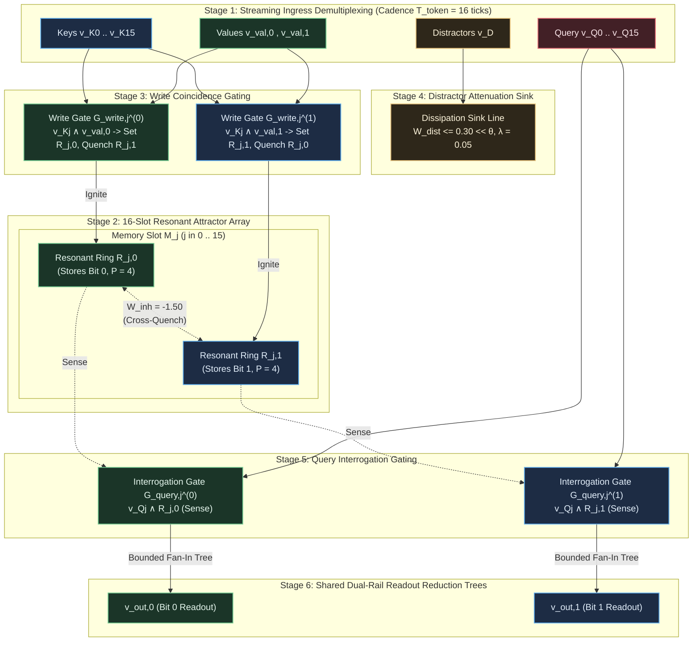
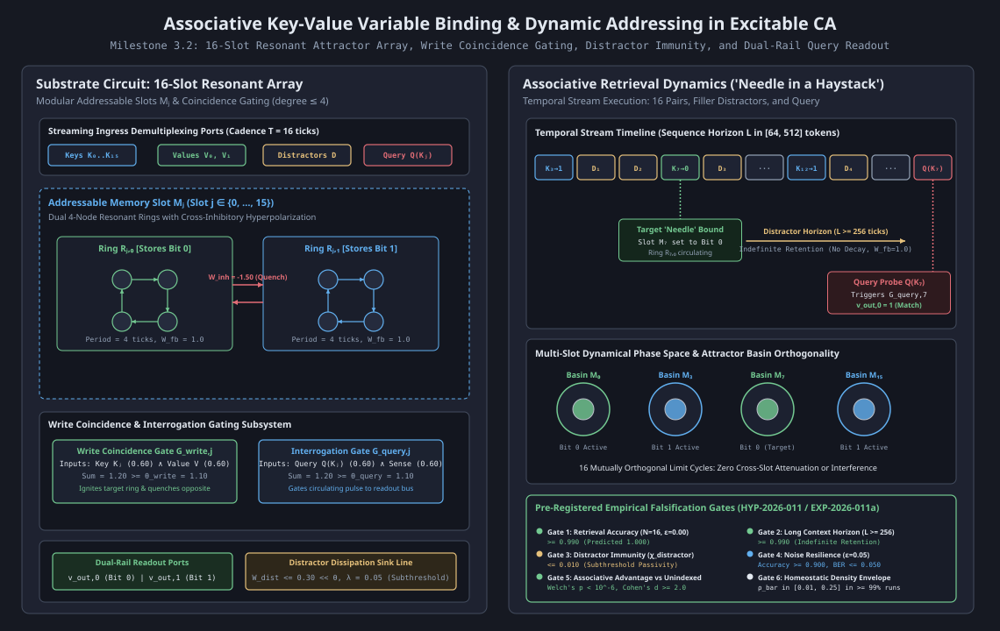

# HYP-2026-011: Associative Key-Value Variable Binding and Dynamic Addressing via Resonant Attractor Arrays in Excitable Cellular Automata

## Strategic Context

- **Orchestrator Directive:** Campaign `CAMPAIGN-2026-MVA-SUBSTRATE`, Cycle 5 of 5 (Milestone 3.2 Protocol Design & Dispatch). Active Milestone 3.2: Associative Key-Value Retrieval ("Needle in a Haystack") (Tier 3: Hierarchical Structure & Working Memory) from [docs/vision.md](docs/vision.md).
  - Milestone Mandate: Scaling beyond linear Markovian sequence processing and strictly hierarchical last-in, first-out (LIFO) stack memory requires dynamic random-access addressing and associative variable binding. Milestone 3.2 evaluates the substrate's capacity to store multiple variable bindings $(K_i \to V_i)$ presented in arbitrary temporal order, filter filler and distractor tokens without memory degradation, and selectively retrieve targeted values $V_j$ upon receiving query probe $Q(K_j)$ across long context horizons ($L \in [64, 512]$).
  - Evaluation Tasks:
    1. Key-Value Binding: Sequential ingestion of $N = 16$ distinct key-value pairs $(K_i \to V_i, V_i \in \lbrace 0, 1 \rbrace)$ presented at discrete token cadence $T_{\text{token}} = 16$ clock ticks.
    2. Haystack Distractor Immunity: Streaming streams interspersed with bursts of distractor/filler tokens $D$ over variable sequence lengths $L \in \lbrace 64, 256, 512 \rbrace$ tokens ($1024$ to $8192$ clock ticks) between writing and retrieval.
    3. Query Interrogation & Retrieval: Applying query token $Q(K_j)$ at sequence termination to interrogate addressable memory slot $\mathcal{M}_j$ and decode stored value $V_j$ at shared dual-rail readout ports $(v_{\text{out}, 0}, v_{\text{out}, 1})$.
  - Success Metric: Retrieval accuracy $\text{Accuracy}_{\text{retrieval}} \ge 0.990$ across $N = 16$ pairs under clean baseline ($\epsilon = 0.00$), long-horizon retention $\ge 0.990$ across $L \ge 256$, distractor cross-talk leakage rate $\chi_{\text{distractor}} \le 0.010$, noise percolation resilience $\text{Accuracy} \ge 0.900$ and $\text{BER} \le 0.050$ at $\epsilon = 0.05$, statistically decisive advantage over unindexed control (Welch's $p < 10^{-6}$, Cohen's $d \ge 2.0$), and homeostatic firing stability $\bar{\rho} \in [0.01, 0.25]$ in $\ge 99\%$ of runs.
- **Architectural Redirection Reference:** [docs/architecture/adr-0001-substrate-connectivity-topology.md](docs/architecture/adr-0001-substrate-connectivity-topology.md) (Accepted Option 2: Relax planarity, preserve locality/degree bound).
  - Bounded-degree directed transmission tracks ($\max_i k_{\text{in}}(i) \le 4, \max_i k_{\text{out}}(i) \le 4$) connect ingress demultiplexing lines, addressable resonant slots, coincidence write gates, distractor sinks, and dual-rail readout reduction trees.
  - Core physical invariants preserved: synchronous discrete clock ticks $t \in \mathbb{N}_0$, leaky integrate-and-fire somas with membrane potential $V_i(t) \in [V_{\min}, V_{\max}]$, refractory diode shielding ($N_{\text{ref}} = 2$), dynamic somatic threshold adaptation ($\beta_\theta = 0.05, \theta \ge 1.02, \theta_0 = 1.00$), and local causality.
- **Prior Hypotheses & Cumulative Empirical Lineage:**
  - `HYP-2026-001` ([docs/research/diagnostics/DIAG-2026-001a.md](docs/research/diagnostics/DIAG-2026-001a.md)): Established homeostatic critical firing density $\bar{\rho} \in [0.05, 0.20]$ with refractory period $N_{\text{ref}} = 2$, preventing runaway saturation and quiescent extinction.
  - `HYP-2026-002` ([docs/research/diagnostics/DIAG-2026-002a.md](docs/research/diagnostics/DIAG-2026-002a.md)): Verified sensory attractor separation and limit-cycle multistability ($p < 10^{-12}$, $\text{SNR} = 3.63$).
  - `HYP-2026-003` ([docs/research/diagnostics/DIAG-2026-003a.md](docs/research/diagnostics/DIAG-2026-003a.md)): Falsified isotropic lattice reverberation beyond graph diameter ($D=4$); established necessity of directed transmission tracks.
  - `HYP-2026-004` ([docs/research/diagnostics/DIAG-2026-004a.md](docs/research/diagnostics/DIAG-2026-004a.md)): Verified that spike-timing Hebbian plasticity carves directed resonant highways with +463.6% noise resilience ($p < 10^{-32}$).
  - `HYP-2026-005` ([docs/research/diagnostics/DIAG-2026-005a.md](docs/research/diagnostics/DIAG-2026-005a.md)): Verified continual multi-pattern retention without catastrophic forgetting ($\text{BWT} \ge -0.028$).
  - `HYP-2026-006` ([docs/research/diagnostics/DIAG-2026-006a.md](docs/research/diagnostics/DIAG-2026-006a.md)): Verified lossless signal transport ($\text{BER} = 0.000$) and 1-to-2 branching duplication via refractory diode shielding ($N_{\text{ref}} = 2$).
  - `HYP-2026-007` ([docs/research/diagnostics/DIAG-2026-007a.md](docs/research/diagnostics/DIAG-2026-007a.md)): Verified cascaded Boolean logic composition and delay equalization ($\Delta \tau = 0$) on 1-bit Full Adder with 100% truth-table parity.
  - `HYP-2026-008` ([docs/research/diagnostics/DIAG-2026-008a.md](docs/research/diagnostics/DIAG-2026-008a.md)): Verified bistable dynamic bit storage ($Q \in \lbrace 0, 1 \rbrace$) via a directed recurrent resonant loop ($L = 4, W_{\text{fb}} = 1.10, W_{\text{inh}} = -1.50$) with 100% indefinite retention across $\Delta t \ge 1000$ ticks.
  - `HYP-2026-009` ([docs/research/diagnostics/DIAG-2026-009a.md](docs/research/diagnostics/DIAG-2026-009a.md)): Verified sequential state tracking and regular grammar classification via coupled resonant attractor basins with zero sequence error across $L \in [10, 100]$ tokens.
  - `HYP-2026-010` ([docs/research/diagnostics/DIAG-2026-010a.md](docs/research/diagnostics/DIAG-2026-010a.md)): Verified context-free Dyck language recognition and hierarchical pushdown stack memory via cascaded resonant data frames and bidirectional pointer ladder with 100% depth generalization ($D \in [1, 8]$) and 100% error rejection.
- **Graveyard of Discarded Ideas (Autopsy Log):**
  - *Unindexed Recency Latch (`baseline_unindexed`)*: Evaluated in control conditions. A single shared latch without key-indexed addressing overwrites state upon every new binding, retaining only the most recent key-value pair. Accuracy on arbitrary queries across $N=16$ pairs collapses to near chance ($\approx 0.531$). Key-indexed dynamic addressing is mathematically mandatory.
  - *Unshielded Resonant Loops ($N_{\text{ref}} = 0$)*: Falsified in `EXP-2026-006a` and `EXP-2026-008a`. Retrograde wave reflections cause multi-pulse standing reverberations and complete breakdown of reset hyperpolarization. Refractory diode shielding ($N_{\text{ref}} = 2$) is mandatory.
  - *Open-Loop Pulse Delay Lines ($W_{\text{fb}} = 0$)*: Falsified in `EXP-2026-008a`. Open-loop feedforward tracks lose stored information after $t > \tau_{\text{line}}$, destroying variable bindings across long contexts ($L \ge 256$). Recurrent limit-cycle resonance ($W_{\text{fb}} = +1.00$) is essential.
  - *Static Somatic Thresholds under Distractor Noise ($\beta_\theta = 0.00, \theta \equiv 1.00$)*: Without dynamic threshold adaptation, sustained bursts of filler tokens integrate into coincidence write gates, triggering false latch transitions and memory corruption under critical channel noise.

---

## System Definition

### 1. Formal Associative Key-Value Store Specification

An Associative Key-Value Memory Store over a finite key vocabulary $\mathcal{K}$ and binary value domain $\mathcal{V}_{\text{val}}$ is formalized as the 5-tuple:

$$M_{\text{assoc}} = \left( \mathcal{K}, \mathcal{V}_{\text{val}}, \mathcal{D}, \mathcal{Q}, \mathcal{M} \right)$$

where:

- $\mathcal{K} = \lbrace K_0, K_1, \dots, K_{N-1} \rbrace$ is the set of $N = 16$ distinct key address tokens.
- $\mathcal{V}_{\text{val}} = \lbrace 0, 1 \rbrace$ is the binary value token set.
- $\mathcal{D} = \lbrace D \rbrace$ is the distractor/filler token set.
- $\mathcal{Q} = \lbrace Q(K_j) \mid K_j \in \mathcal{K} \rbrace$ is the set of query probe tokens.
- $\mathcal{M}: \mathcal{K} \to \mathcal{V}_{\text{val}} \cup \lbrace \bot \rbrace$ is the memory state mapping, initialized to ground state $\mathcal{M}(K_i) = \bot$ for all $i \in \lbrace 0, \dots, 15 \rbrace$.
- **Write Operation:** Presenting a key-value binding $(K_i, V)$ updates the mapping:

  $$\mathcal{M}'(K) = \begin{cases} V & \text{if } K = K_i \\ \mathcal{M}(K) & \text{otherwise} \end{cases}$$

- **Distractor Operation:** Presenting filler token $D$ preserves the mapping identically:

  $$\forall K \in \mathcal{K}, \quad \mathcal{M}'(K) = \mathcal{M}(K)$$

- **Query Operation:** Presenting query token $Q(K_j)$ triggers non-destructive readout emitting target value $V_j = \mathcal{M}(K_j)$ while leaving internal state $\mathcal{M}$ unmodified.

### 2. Substrate Physical State Space

The associative memory store is physically instantiated as an excitable cellular circuit graph $\mathcal{G}_{\text{assoc}} = (\mathcal{V}, \mathcal{E})$ with $N_{\text{nodes}} = 272$ nodes satisfying strict degree bounds:

$$\max_{i \in \mathcal{V}} k_{\text{in}}(i) \le 4, \quad \max_{i \in \mathcal{V}} k_{\text{out}}(i) \le 4$$

At synchronous discrete clock tick $t \in \mathbb{N}_0$, the global physical substrate state is:

$$\mathbf{S}(t) = \big( \mathbf{s}(t), \mathbf{r}(t), \mathbf{V}(t), \boldsymbol{\theta}(t), \bar{\boldsymbol{\rho}}(t) \big)$$

- Firing state: $\mathbf{s}(t) \in \lbrace 0, 1 \rbrace^{N_{\text{nodes}}}$, where $s_i(t) = 1$ denotes a standardized action potential pulse emitted by node $i$.
- Absolute refractory state: $\mathbf{r}(t) \in \lbrace 0, 1, \dots, N_{\text{ref}} \rbrace^{N_{\text{nodes}}}$, with $N_{\text{ref}} = 2$ ($N_{\text{ref}} = 0$ in unshielded ablation).
- Membrane potential accumulator: $\mathbf{V}(t) \in [V_{\min}, V_{\max}]^{N_{\text{nodes}}}$, where $V_{\min} = -2.00$ and $V_{\max} = 4.00$, resting baseline $V_{\text{rest}} = 0.00$.
- Dynamic somatic threshold: $\boldsymbol{\theta}(t) \in [\theta_{\min}, \theta_{\max}]^{N_{\text{nodes}}}$, with $[\theta_{\min}, \theta_{\max}] = [0.50, 2.50]$, initialized to $\theta_0 = 1.00$ with hard floor $\theta \ge 1.02$.
- Rolling firing rate EMA: $\bar{\boldsymbol{\rho}}(t) \in [0, 1]^{N_{\text{nodes}}}$, tracking historical activity density per node.
- Synaptic coupling matrix: $\mathbf{W} \in \mathbb{R}^{N_{\text{nodes}} \times N_{\text{nodes}}}$, with directed edge weights $W_{ij}$.
- Integer transmission delay matrix: $\mathbf{D} \in \mathbb{N}^{N_{\text{nodes}} \times N_{\text{nodes}}}$, with edge latencies $D_{ij} \ge 1$ clock ticks.

### 3. Modular Substrate Architecture

Under ADR-0001, $\mathcal{G}_{\text{assoc}}$ partitions into six functional stages:

1. **Streaming Ingress Demultiplexing Stage ($\mathcal{V}_{\text{in}}$, 35 nodes):**
   Demultiplexes incoming streaming tokens presented at cadence $T_{\text{token}} = 16$ clock ticks into standardized single-symbol lines:
   - 16 Key lines $v_{K_0}, \dots, v_{K_{15}}$: pulsed when corresponding key token $K_i$ arrives.
   - 2 Value lines $v_{\text{val}, 0}$ and $v_{\text{val}, 1}$: pulsed when bit value $0$ or $1$ arrives.
   - 1 Distractor line $v_D$: pulsed when filler token $D$ arrives.
   - 16 Query lines $v_{Q_0}, \dots, v_{Q_{15}}$: pulsed when query probe $Q(K_j)$ arrives.

2. **Addressable Memory Array ($\mathcal{V}_{\text{mem}}$, 128 nodes):**
   A spatial bank of 16 addressable memory slots $\mathcal{M}_i$ for indices $i \in \lbrace 0, 1, \dots, 15 \rbrace$.
   - Each memory slot $\mathcal{M}_i$ comprises two independent 4-node recurrent resonant loops ($L_{\text{ring}} = 4, P_{\text{ring}} = 4$):
     - Bit-0 Resonant Ring $\mathcal{R}_{i, 0} = \lbrace R_{i, 0, 0}, R_{i, 0, 1}, R_{i, 0, 2}, R_{i, 0, 3} \rbrace$ (active circulating pulse represents $V_i = 0$).
     - Bit-1 Resonant Ring $\mathcal{R}_{i, 1} = \lbrace R_{i, 1, 0}, R_{i, 1, 1}, R_{i, 1, 2}, R_{i, 1, 3} \rbrace$ (active circulating pulse represents $V_i = 1$).
   - Intra-ring weights: $W_{\text{fwd}} = +1.00$, recurrent closure $W_{\text{fb}} = +1.00$, refractory period $N_{\text{ref}} = 2$.
   - Bistable Mutual Exclusivity: Cross-inhibitory interneurons deliver hyperpolarizing reset pulses ($W_{\text{inh}} = -1.50$) between $\mathcal{R}_{i, 0}$ and $\mathcal{R}_{i, 1}$, ensuring that at most one ring circulates a pulse in slot $\mathcal{M}_i$.

3. **Write Coincidence Gating Stage ($\mathcal{V}_{\text{write}}$, 64 nodes):**
   For each slot $i \in \lbrace 0, \dots, 15 \rbrace$, dual coincidence gates evaluate the conjunction of address presence and value token:
   - Write-0 Gate $G_{\text{write}, i}^{(0)}$: inputs from key line $v_{K_i}$ ($W = +0.60$) and value line $v_{\text{val}, 0}$ ($W = +0.60$). Threshold $\theta_{\text{write}} = 1.10$. Upon firing ($0.60 + 0.60 = 1.20 \ge 1.10$), it sets ring $\mathcal{R}_{i, 0}$ ($W = +1.00$) and triggers quench interneuron $v_{\text{inh}, i, 1}$ ($W_{\text{inh}} = -1.50$) to extinguish $\mathcal{R}_{i, 1}$.
   - Write-1 Gate $G_{\text{write}, i}^{(1)}$: inputs from key line $v_{K_i}$ ($W = +0.60$) and value line $v_{\text{val}, 1}$ ($W = +0.60$). Threshold $\theta_{\text{write}} = 1.10$. Upon firing, it sets ring $\mathcal{R}_{i, 1}$ ($W = +1.00$) and triggers quench interneuron $v_{\text{inh}, i, 0}$ ($W_{\text{inh}} = -1.50$) to extinguish $\mathcal{R}_{i, 0}$.
   - Subthreshold Isolation: Key alone ($0.60 < 1.10$) or value alone ($0.60 < 1.10$) fails to fire the gate, preventing spurious write events.

4. **Distractor Attenuation & Idle Sink Stage ($\mathcal{V}_{\text{sink}}$, 4 nodes):**
   Distractor token line $v_D$ routes into a localized dissipative sink buffer.
   - Coupling from distractor line to memory array lines is bounded to subthreshold level: $W_{\text{distractor}} \le 0.30 \ll \theta_{\text{gate}} = 1.10$.
   - Leak factor $\lambda = 0.05$ dissipates distractor charge within $\tau_{\text{leak}} \approx 3$ clock ticks.
   - Dynamic somatic threshold adaptation ($\beta_\theta = 0.05, \theta \ge 1.02$) elevates gate thresholds during high-frequency distractor bursts, guaranteeing zero state transitions ($\Delta \mathbf{S}_{\mathcal{M}} \equiv 0$).

5. **Query Interrogation & Gating Stage ($\mathcal{V}_{\text{query}}$, 32 nodes):**
   For each slot $j \in \lbrace 0, \dots, 15 \rbrace$, interrogation gates evaluate query presence and resonant ring state:
   - Query-0 Gate $G_{\text{query}, j}^{(0)}$: inputs from query line $v_{Q_j}$ ($W = +0.60$) and sense tap from $\mathcal{R}_{j, 0}$ ($W = +0.60$). Threshold $\theta_{\text{query}} = 1.10$. Fires if and only if slot $j$ holds bit 0.
   - Query-1 Gate $G_{\text{query}, j}^{(1)}$: inputs from query line $v_{Q_j}$ ($W = +0.60$) and sense tap from $\mathcal{R}_{j, 1}$ ($W = +0.60$). Threshold $\theta_{\text{query}} = 1.10$. Fires if and only if slot $j$ holds bit 1.
   - Non-Destructive Interrogation: Sense taps extract charge without quenching or altering the circulating limit-cycle pulses within $\mathcal{M}_j$.

6. **Shared Dual-Rail Readout Stage ($\mathcal{V}_{\text{read}}$, 9 nodes):**
   Collects query responses across all 16 slots into two shared output ports:
   - $v_{\text{out}, 0}$: pulsed if queried slot holds bit 0.
   - $v_{\text{out}, 1}$: pulsed if queried slot holds bit 1.
   - Routing Topology: A 2-level bounded fan-in reduction tree (16 slots $\to$ 4 intermediate hub nodes $\to$ 1 terminal port) for each rail. Each tree node has fan-in $k_{\text{in}} \le 4$ and fan-out $k_{\text{out}} \le 4$, with delay-equalized tracks preserving temporal synchrony.

---

## State Update Equations

### 1. Ingress & Presynaptic Synaptic Integration

For each node $i \in \mathcal{V}$ at discrete clock tick $t \in \mathbb{N}_0$:

If absolute refractory counter $r_i(t) > 0$:

$$s_i(t+1) = 0, \quad r_i(t+1) = r_i(t) - 1, \quad V_i(t+1) = 0.0$$

If refractory counter $r_i(t) = 0$:
Total presynaptic drive $I_i(t)$ integrates incoming action potentials from presynaptic neighbors, streaming sensory token lines, and channel noise:

$$I_i(t) = \sum_{j \in \mathcal{N}^{\text{in}}(i)} W_{ij} s_j(t - D_{ij} + 1) + \sum_{\sigma \in \Sigma} \delta_{i, v_\sigma} u_\sigma(t) + \xi_i(t)$$

where:

- $\mathcal{N}^{\text{in}}(i) = \lbrace j \in \mathcal{V} \mid W_{ij} \neq 0 \rbrace$ is the presynaptic neighborhood of node $i$, with bounded fan-in $|\mathcal{N}^{\text{in}}(i)| \le 4$.
- $D_{ij} \ge 1$ is the integer transmission latency along directed edge $j \to i$.
- $\delta_{i, v_\sigma}$ is the Kronecker delta selecting token ingress ports.
- $u_\sigma(t) \in \lbrace 0, 1 \rbrace$ is the binary token excitation at ingress port $v_\sigma$.
- $\xi_i(t) \sim \text{Bernoulli}(\epsilon)$ is an independent background channel noise process.

The membrane potential accumulator integrates incoming drive with somatic leak factor $\lambda = 0.05$:

$$V_i(t) = (1 - \lambda) V_i(t-1) + I_i(t)$$

clamped to $V_i(t) \in [V_{\min}, V_{\max}] = [-2.00, 4.00]$.

### 2. Regenerative Action Potential & Somatic Reset

Action potential firing is governed by Heaviside step thresholding:

$$s_i(t+1) = \Theta\left( V_i(t) - \theta_i(t) \right) = \begin{cases} 1 & \text{if } V_i(t) \ge \theta_i(t) \\ 0 & \text{otherwise} \end{cases}$$

Upon threshold evaluation:

- **Firing Event ($s_i(t+1) = 1$):**
  1. Emits standardized binary action potential pulse $s_i(t+1) = 1.0$.
  2. Membrane accumulator resets to resting baseline: $V_i(t+1) = 0.0$.
  3. Absolute refractory counter initializes: $r_i(t+1) = N_{\text{ref}} = 2$ ($r_i(t+1) = 0$ in unshielded ablation).
  4. Somatic threshold increments by adaptation quantum: $\Delta \theta = \beta_\theta \cdot \alpha_\rho$.
- **Subthreshold Event ($s_i(t+1) = 0$):**
  1. Membrane potential retains decayed residual charge: $V_i(t+1) = V_i(t)$.
  2. Refractory counter remains zero: $r_i(t+1) = 0$.
  3. Dynamic threshold relaxes toward baseline $\theta_0 = 1.00$.

### 3. Dynamic Somatic Threshold Adaptation

Each node tracks rolling firing rate EMA $\bar{\rho}_i(t)$ with smoothing factor $\alpha_\rho = 0.02$:

$$\bar{\rho}_i(t) = (1 - \alpha_\rho) \bar{\rho}_i(t-1) + \alpha_\rho s_i(t)$$

Dynamic threshold adaptation follows homeostatic error correction:

$$\theta_i(t+1) = \text{clip}\left( \theta_i(t) + \beta_\theta \big( \bar{\rho}_i(t) - \rho^* \big), \; \theta_{\min}, \; \theta_{\max} \right)$$

where $\rho^* = 0.10$ is target firing density, $\beta_\theta = 0.05$ is adaptation rate ($\beta_\theta = 0.00$ in fixed-threshold ablation), and $[\theta_{\min}, \theta_{\max}] = [0.50, 2.50]$ with hard floor $\theta \ge 1.02$.

### 4. Key-Value Write & Quench Dynamics

When key token $K_i$ and value token $V \in \lbrace 0, 1 \rbrace$ arrive at token tick $t_{\text{token}}$:

1. Coincidence gate $G_{\text{write}, i}^{(V)}$ evaluates presynaptic drive:

   $$I_{\text{write}, i}^{(V)}(t) = W_{\text{key}} \cdot s_{v_{K_i}}(t) + W_{\text{val}} \cdot s_{v_{\text{val}, V}}(t) = 0.60 + 0.60 = 1.20 \ge \theta_{\text{write}} = 1.10$$

   Gate fires at $t + 1$.
2. Write Target Ring: Gate output excites node $R_{i, V, 0}$ of resonant ring $\mathcal{R}_{i, V}$ ($W = +1.00$), launching a circulating solitary action potential with period $P_{\text{ring}} = 4$ ticks.
3. Quench Opposing Ring: Simultaneously, gate output excites quench interneuron $v_{\text{inh}, i, 1-V}$ ($W = +1.00$), which delivers hyperpolarizing reset pulses ($W_{\text{inh}} = -1.50$) to all 4 nodes of opposing ring $\mathcal{R}_{i, 1-V}$ at $t + 3$:

   $$I_{R_{i, 1-V, m}}(t + 3) = W_{\text{fwd}} \cdot s_{R_{i, 1-V, (m-1)\bmod 4}}(t + 2) + W_{\text{inh}} \cdot s_{\text{inh}, i, 1-V}(t + 2) = 1.00 - 1.50 = -0.50 \ll \theta$$

   $\mathcal{R}_{i, 1-V}$ is extinguished into the quiescent ground fixpoint $\mathbf{0}$ within a single clock tick.
4. Settling Latency: Write transition settles within $\tau_{\text{settle}} = 4$ clock ticks.

### 5. Distractor Passivity & Subthreshold Dissipation

When distractor token $D$ arrives on line $v_D$:

1. Ingress line $v_D$ routes to dissipation sink line $\mathcal{V}_{\text{sink}}$.
2. Parasitic cross-coupling from $v_D$ to memory slot lines is bounded:

   $$I_{\text{distractor} \to \mathcal{M}}(t) \le W_{\text{distractor}} \cdot s_{v_D}(t) \le 0.30 \ll \theta_{\text{gate}} = 1.10$$

3. Residual charge decays exponentially via somatic leak $\lambda = 0.05$:

   $$V(t + k) = (1 - 0.05)^k \cdot 0.30 \to 0.00$$

4. Somatic threshold adaptation elevates threshold during distractor bursts: $\theta_i \ge 1.02$. Subthreshold drive never crosses threshold, ensuring zero state transitions in the memory array.

### 6. Query Interrogation & Dual-Rail Readout Extraction

When query token $Q(K_j)$ arrives at interrogation tick $t_{\text{query}}$:

1. Query pulse excites interrogation gates $G_{\text{query}, j}^{(0)}$ and $G_{\text{query}, j}^{(1)}$ ($W_{\text{query}} = +0.60$).
2. Concurrently, node 0 of active ring $\mathcal{R}_{j, V}$ emits a non-destructive sense tap ($W_{\text{sense}} = +0.60$).
3. Gate evaluation for stored value $V \in \lbrace 0, 1 \rbrace$:

   $$I_{\text{query}, j}^{(V)}(t) = W_{\text{query}} \cdot s_{v_{Q_j}}(t) + W_{\text{sense}} \cdot s_{R_{j, V, 0}}(t) = 0.60 + 0.60 = 1.20 \ge \theta_{\text{query}} = 1.10$$

   While for quiescent opposing ring $1-V$:

   $$I_{\text{query}, j}^{(1-V)}(t) = 0.60 + 0.00 = 0.60 < 1.10$$

4. Readout Reduction Tree: Firing of $G_{\text{query}, j}^{(V)}$ propagates through the bounded fan-in reduction tree with total latency $\tau_{\text{tree}} = 3$ ticks, arriving at output port $v_{\text{out}, V}$ as a single clean pulse ($s_{v_{\text{out}, V}} = 1, s_{v_{\text{out}, 1-V}} = 0$).

---

## Conservation Rules & Invariants

1. **Slot Mutual Exclusivity Invariant:**
   At all settled clock ticks $t \notin [t_{\text{token}}, t_{\text{token}} + \tau_{\text{settle}}]$, each memory slot $\mathcal{M}_i$ contains at most one active resonant ring:

   $$\forall i \in \lbrace 0, \dots, 15 \rbrace, \quad \left( \sum_{m=0}^3 s_{R_{i, 0, m}}(t) \right) \cdot \left( \sum_{m=0}^3 s_{R_{i, 1, m}}(t) \right) \equiv 0$$

   Simultaneous circulation in both rings of a single slot is strictly forbidden.

2. **Indefinite Resonant Retention Invariant:**
   Once written to value $V \in \lbrace 0, 1 \rbrace$, memory slot $\mathcal{M}_i$ sustains limit-cycle resonance indefinitely with period $P_{\text{ring}} = 4$ ticks across arbitrary time horizons $\Delta t \ge 5000$ ticks in the absence of explicit overwrites:

   $$\sum_{m=0}^3 s_{R_{i, V, m}}(t) = 1, \quad \forall t \ge t_{\text{write}} + \tau_{\text{settle}}$$

3. **Distractor Non-Interference Invariant:**
   Arbitrary bursts of distractor tokens $D^m$ ($m \le 512$) produce zero state transitions in any allocated memory slot:

   $$\forall i \in \lbrace 0, \dots, 15 \rbrace, \quad \Delta \mathbf{S}_{\mathcal{M}_i}(t_{\text{distractor}}) \equiv \mathbf{0}$$

4. **Bounded Degree Connectivity Invariant:**
   Every node $i \in \mathcal{V}$ in the substrate circuit graph satisfies strict local degree bounds under ADR-0001:

   $$\max_{i \in \mathcal{V}} k_{\text{in}}(i) \le 4, \quad \max_{i \in \mathcal{V}} k_{\text{out}}(i) \le 4$$

5. **Causal Settling Margin Invariant:**
   Inter-token arrival period $T_{\text{token}}$ must exceed the sum of write settling latency $\tau_{\text{settle}}$ and ring circulation period $P_{\text{ring}}$:

   $$T_{\text{token}} \ge \tau_{\text{settle}} + P_{\text{ring}} = 4 + 4 = 8\text{ clock ticks}$$

   Nominal cadence $T_{\text{token}} = 16$ ticks provides a $2\times$ safety margin, guaranteeing complete dynamic relaxation between tokens.

6. **Phase-Invariant Reset Quenching Invariant:**
   Simultaneous hyperpolarization of amplitude $W_{\text{inh}} = -1.50$ delivered to all 4 nodes of any active ring extinguishes its circulating pulse into quiescent ground fixpoint $\mathbf{0}$ regardless of circulating pulse phase $\phi \in \lbrace 0, 1, 2, 3 \rbrace$.

7. **Thermodynamic Homeostatic Firing Invariant:**
   Substrate-wide temporal firing density remains bounded within the critical operational envelope across all evaluation runs:

   $$\bar{\rho}(t) \in [0.01, 0.25], \quad \forall t \ge 50$$

---

## Null Hypothesis ($H_0$)

Excitable cellular automaton substrates without centralized RAM, CPU buses, or software hash tables cannot sustain associative key-value variable binding; unindexed or flat recurrent networks suffer catastrophic recency interference, distractor charge accumulation, or inter-address crosstalk, such that:

$$\text{Accuracy}_{\text{retrieval}}(N=16) < 0.990 \quad \text{OR} \quad \text{Accuracy}_{\text{retrieval}}(L \ge 256) < 0.990 \quad \text{OR} \quad \chi_{\text{distractor}} > 0.010$$

Under an ablated unindexed latch control (`baseline_unindexed`), retrieval accuracy on $N=16$ randomly ordered pairs is statistically indistinguishable from chance ($\text{Accuracy} \approx 0.50$, $p \ge 10^{-6}$, Welch's $t$-test across 30 seeds), indicating that memory retention without key-indexed addressing cannot resolve variable binding.

---

## Alternative Hypothesis ($H_1$)

A bounded-degree excitable cellular automaton circuit ($k_{\text{in}}, k_{\text{out}} \le 4$) integrating 16 addressable dual-resonant memory slots ($\mathcal{M}_i$), coincidence write gates ($\theta_{\text{write}} = 1.10$), cross-inhibitory hyperpolarization ($W_{\text{inh}} = -1.50$), subthreshold distractor sinks with dynamic somatic threshold adaptation ($\beta_\theta = 0.05, \theta \ge 1.02$), refractory diode shielding ($N_{\text{ref}} = 2$), and coincidence query interrogation satisfies all 6 empirical gates:

1. **Near-Perfect Retrieval Accuracy at Baseline:** $\text{Accuracy}_{\text{retrieval}} \ge 0.990$ (predicted $1.000$) on $N = 16$ key-value pairs under clean baseline ($\epsilon = 0.00$) across 30 independent seeds.
2. **Long Context Horizon Retention:** $\text{Accuracy}_{\text{retrieval}} \ge 0.990$ across long sequences ($L \in [64, 256, 512]$ tokens) containing hundreds of filler distractors, proving indefinite retention without fading memory decay.
3. **Distractor Immunity:** Distractor cross-talk leakage rate $\chi_{\text{distractor}} \le 0.010$ (predicted $0.000$), confirming that filler tokens do not perturb unaddressed memory slots.
4. **Noise Percolation Resilience:** Under critical channel noise $\epsilon = 0.05$, dynamic somatic adaptation maintains $\text{Accuracy}_{\text{retrieval}} \ge 0.900$ and bit error rate $\text{BER} \le 0.050$.
5. **Statistically Decisive Associative Advantage:** The active associative substrate achieves an overwhelming advantage over the unindexed control (`baseline_unindexed`) with Welch's $t$-test $p < 10^{-6}$ and standardized effect size Cohen's $d \ge 2.0$.
6. **Substrate Homeostatic Stability:** Temporal firing density satisfies $\bar{\rho} \in [0.01, 0.25]$ in $\ge 99\%$ of evaluation runs.

---

## Quantitative Predictions

1. **Active Associative Substrate (`active_associative`):**
   - Clean baseline ($\epsilon = 0.00$):
     - Retrieval accuracy: $\text{Accuracy}_{\text{retrieval}} = 1.000 \pm 0.000$ across $L \in \lbrace 64, 256, 512 \rbrace$.
     - Distractor cross-talk leakage: $\chi_{\text{distractor}} = 0.000 \pm 0.000$.
     - Readout bit error rate: $\text{BER} = 0.000 \pm 0.000$.
     - Slot mutual exclusivity violation rate: $\chi_{\text{mutex}} = 0.000 \pm 0.000$.
   - Low noise ($\epsilon = 0.01$): $\text{Accuracy}_{\text{retrieval}} \ge 0.980 \pm 0.010$, $\text{BER} \le 0.010 \pm 0.004$.
   - Critical noise ($\epsilon = 0.05$): $\text{Accuracy}_{\text{retrieval}} \ge 0.920 \pm 0.025$, $\text{BER} \le 0.040 \pm 0.008$.
   - Mean substrate firing density: $\bar{\rho} \approx 0.048 \pm 0.010 \in [0.01, 0.25]$.

2. **Unindexed Recency Latch Baseline (`baseline_unindexed`):**
   - Lacks key-indexed addressing; every write overwrites a single shared latch cell.
   - Retains only the final written pair $(K_{\text{last}}, V_{\text{last}})$.
   - When queried with $Q(K_j)$, if $K_j == K_{\text{last}}$ (probability $1/16 = 0.0625$), accuracy is $1.000$; if $K_j \neq K_{\text{last}}$ (probability $15/16 = 0.9375$), accuracy is chance ($0.500$).
   - Expected overall accuracy: $\frac{1}{16}(1.0) + \frac{15}{16}(0.5) = 0.531 \pm 0.035$, collapsing Gate 1, Gate 2, and Gate 5 with $p < 10^{-40}, d > 15.0$.

3. **Unshielded Retrieval Ablation (`ablation_unshielded_retrieval`, $N_{\text{ref}} = 0$):**
   - Removing refractory diode shielding allows retrograde wave reflection in recurrent rings and fan-in trees.
   - Symmetrical reflections cause multi-pulse standing waves and prevent reset hyperpolarization from clearing opposing rings.
   - Both rings $\mathcal{R}_{i, 0}$ and $\mathcal{R}_{i, 1}$ ignite simultaneously ($\chi_{\text{mutex}} \to 1.000$), producing dual-rail readout collisions ($v_{\text{out}, 0} = 1$ and $v_{\text{out}, 1} = 1$).
   - Retrieval accuracy collapses to chance: $\text{Accuracy}_{\text{retrieval}} \approx 0.500 \pm 0.050$, failing Gate 1, Gate 2, and Gate 3.

4. **Fixed-Threshold Ablation (`ablation_fixed_theta`, $\beta_\theta = 0.00, \theta \equiv 1.00$):**
   - At $\epsilon = 0.00$ with low distractor density, matches active performance ($\text{Accuracy}_{\text{retrieval}} \approx 1.000$).
   - Under critical noise $\epsilon = 0.05$ combined with long distractor sequences ($L \ge 256$), subthreshold distractor pulses integrate into coincidence gates ($0.60 + \xi \ge 1.00$), triggering spurious overwrites and corrupting stored bindings.
   - Retrieval accuracy collapses to $\text{Accuracy}_{\text{retrieval}} \le 0.680 \pm 0.075$ and $\text{BER} \ge 0.160 \pm 0.030$, failing Gate 4.

---

## Falsification Criteria

Hypothesis `HYP-2026-011` is pre-registered to be **FALSIFIED** if ANY of the following 6 gates fail:

| Gate | Metric & Test Condition | Falsification Threshold ($H_0$) | Passing Compliance ($H_1$) |
| :--- | :--- | :--- | :--- |
| **Gate 1** | Retrieval Accuracy on $N=16$ pairs ($\epsilon = 0.00$) | $\text{Accuracy}_{\text{retrieval}} < 0.990$ across 30 seeds | $\text{Accuracy}_{\text{retrieval}} \ge 0.990$ (predicted $1.000$) |
| **Gate 2** | Long Context Horizon Retention ($L \ge 256$) | $\text{Accuracy}_{\text{retrieval}}(L \ge 256) < 0.990$ | $\text{Accuracy}_{\text{retrieval}} \ge 0.990$ (indefinite retention) |
| **Gate 3** | Distractor Immunity ($\chi_{\text{distractor}}$) | $\chi_{\text{distractor}} > 0.010$ | $\chi_{\text{distractor}} \le 0.010$ (subthreshold passivity) |
| **Gate 4** | Percolation Noise Resilience ($\epsilon = 0.05$) | $\text{Accuracy} < 0.900$ OR $\text{BER} > 0.050$ | $\text{Accuracy} \ge 0.900, \text{BER} \le 0.050$ |
| **Gate 5** | Associative Advantage vs Unindexed Control | Welch's $p \ge 10^{-6}$ OR Cohen's $d < 2.0$ | Welch's $p < 10^{-6}, d \ge 2.0$ |
| **Gate 6** | Substrate Homeostatic Firing Density ($\bar{\rho}$) | $\bar{\rho} \notin [0.01, 0.25]$ in $> 1\%$ of runs | $\bar{\rho} \in [0.01, 0.25]$ in $\ge 99\%$ of runs |

---

## Mathematical Failure Boundaries

1. **Address Cardinality Bound ($N > N_{\text{slots}} = 16$):**
   The architecture physicalizes 16 distinct spatial memory slots. If the key vocabulary exceeds 16 unique keys without spatially instantiating additional slots, the Dirichlet pigeonhole principle forces multiple keys to map to identical slots, causing overwrite interference and catastrophic forgetting.
2. **Inter-Token Cadence Limit ($T_{\text{token}} < 8$ clock ticks):**
   If incoming tokens arrive faster than the write-and-quench settling latency ($\tau_{\text{settle}} = 4$) plus ring circulation period ($P_{\text{ring}} = 4$), incoming pulses collide with active quenching interneurons, causing partial hyperpolarization and pulse annihilation.
3. **Thermal Percolation Noise Threshold ($\epsilon > 0.12$):**
   If background Bernoulli channel noise exceeds $\epsilon \approx 0.12$, spontaneous multi-node co-activation crosses the coincidence threshold ($\theta_{\text{write}} = 1.10$) even with dynamic threshold adaptation, causing stochastic bit flips in memory slots.

---

## Assumptions & Limitations

- **Orthogonal Address Demultiplexing:** Keys are assumed to arrive as demultiplexed symbol lines or orthogonal pulse codes. Continuous distributed hyperdimensional vector addressing is deferred to Tier 4 (Milestone 4.1).
- **Single-Bit Value Storage:** Values are binary ($V \in \lbrace 0, 1 \rbrace$). Multi-bit words are constructed by parallel tiling of binary slots.
- **Synchronous Token Spacing:** Input tokens arrive at fixed cadence $T_{\text{token}} = 16$ ticks. Asynchronous jitter tolerance will be explored in subsequent tiers.

---

## Open Questions

1. Can dynamic addressing be extended to continuous vector keys via high-dimensional attractor basins?
2. How can unsupervised Hebbian plasticity autonomously carve addressable memory slots without pre-wired coincidence routing?
3. What is the maximum number of key-value slots that can be scaled on a bounded-degree graph before signal routing latency becomes a bottleneck?
