# EXP-2026-001a: Empirical Validation of Homeostatic Firing Regulation on 16-Node Torus Automata

## Part I: Experiment Protocol

### Protocol ID & Hypothesis Reference

- **Protocol ID:** EXP-2026-001a
- **Hypothesis:** [HYP-2026-001](../hypotheses/HYP-2026-001.md) — Local Homeostatic Threshold Regulation for Critical Firing Regimes in Minimal Viable Automata.

### Experimental Objective

Empirically validate whether local homeostatic threshold adaptation ($V_{\text{thresh}}$ regulation) stabilizes the firing density of a 16-node 2D torus discrete cellular automaton within the critical band $[0.05, 0.20]$ over $10^5$ ticks, preventing both absorbing state extinction and runaway seizure saturation, and establishing statistical separation against static and uncoupled controls.

---

### Independent Variables

The experiment manipulates 6 independent factors across a structured grid:

1. **Experimental Mechanism Mode ($M_{\text{mode}}$):**
   - `active`: Closed-loop negative feedback threshold adaptation:

     $$\Delta V_i(t) = \eta \cdot (\bar{r}_i(t) - r_{\text{target}})$$

   - `fixed`: Static threshold baseline ablation ($\eta = 0$).
   - `random_drift`: Decoupled stochastic threshold drift:

     $$\Delta V_i(t) = \eta \cdot \xi_i(t), \quad \xi_i(t) \in \{-1, +1\} \text{ with equal probability } 0.5$$

   - `inverted`: Positive feedback anti-homeostasis:

     $$\Delta V_i(t) = -\eta \cdot (\bar{r}_i(t) - r_{\text{target}})$$

2. **Accumulator Leak Factor ($\lambda$):** $\lambda \in \{0.00, 0.05, 0.10, 0.20\}$ tick$^{-1}$.
3. **Refractory Cooldown Period ($N_{\text{ref}}$):** $N_{\text{ref}} \in \{1, 2, 3\}$ ticks.
4. **Target Firing Setpoint ($r_{\text{target}}$):** $r_{\text{target}} \in \{0.08, 0.12, 0.16\}$.
5. **Adaptation Learning Rate ($\eta$):** $\eta \in \{0.005, 0.020, 0.050\}$ (for `active`, `random_drift`, `inverted`).
6. **Sliding Integration Window ($W_h$):** $W_h \in \{50, 100, 200\}$ ticks.
7. **Random Seed ($\mathcal{S}$):** $\mathcal{S} \in \{1, 2, \dots, 30\}$ ($30$ independent deterministic runs per condition).

---

### Dependent Variables

For each run $m$ over $T = 100{,}000$ clock ticks:

1. **Survival Duration ($\tau_{\text{survive}}$):**

   $$\tau_{\text{survive}} = \min \Big\{ t \in [1, T] \ \Big|\ \sum_{\tau=0}^{99} \bar{\rho}(t-\tau) = 0 \Big\} \quad (\text{or } T \text{ if no extinction occurs})$$

2. **Global Mean Firing Density ($\langle \bar{\rho} \rangle$):**

   $$\langle \bar{\rho} \rangle = \frac{1}{T - T_{\text{burn}}} \sum_{t=T_{\text{burn}}}^T \bar{\rho}(t), \quad \text{where } \bar{\rho}(t) = \frac{1}{N} \sum_{i=1}^N s_i(t), \quad T_{\text{burn}} = 10{,}000$$

3. **Extinction Probability ($P_{\text{ext}}$):**

   $$P_{\text{ext}} = \frac{1}{M} \sum_{m=1}^M \mathbb{I}(\tau_{\text{survive}, m} < T)$$

4. **Saturation Episode Count ($N_{\text{sat}}$):** Count of windowed intervals where rolling firing density exceeds supercritical boundary:

   $$N_{\text{sat}} = \sum_{t=T_{\text{burn}}}^T \mathbb{I}\big( \bar{\rho}_{W_h}(t) > 0.40 \big)$$

5. **Target Setpoint RMSE ($\text{RMSE}_r$):** Root mean squared error between node firing rates and setpoint:

   $$\text{RMSE}_r = \sqrt{\frac{1}{N} \sum_{i=1}^N \big( \bar{r}_i(T) - r_{\text{target}} \big)^2}$$

6. **Critical Branching Ratio ($\sigma$):**

   $$\sigma = \frac{1}{T - T_{\text{burn}}} \sum_{t=T_{\text{burn}}}^T \frac{\sum_{i=1}^N s_i(t)}{\sum_{i=1}^N s_i(t-1) + \epsilon}$$

---

### Control Conditions (Baseline + Ablation)

1. **Baseline Control (`fixed`):** Sets $\eta = 0.0$. Initial thresholds are fixed across the run at $V_{\text{thresh}}^{(0)} \in \{1.5, 2.5, 3.5\}$. Demonstrates the inability of unadapted discrete CA networks to avoid extinction or saturation under non-trivial leaks.
2. **Uncoupled Drift Ablation (`random_drift`):** Sets $\eta > 0$, but modulates thresholds using independent pseudo-random noise $\pm \eta$ independent of the firing rate $\bar{r}_i(t)$. Proves that stability stems from negative-feedback error regulation rather than threshold variability.
3. **Positive Feedback Ablation (`inverted`):** Sets $\Delta V_i(t) = -\eta \cdot (\bar{r}_i(t) - r_{\text{target}})$. Hypoactive nodes lower threshold (increasing excitability), while hyperactive nodes raise excitability. Demonstrates rapid runaway catastrophe.

---

### Signal/Dataset Specification

- **Input Ingress Protocol:**
  - Nodes $(0, 0)$ (Node 0) and $(2, 2)$ (Node 10) are designated sensory ingress nodes.
  - During the transient driving phase $t \in [0, 31]$ ($T_{\text{drive}} = 32$ ticks), independent Bernoulli bit-streams with spike density $p_{\text{init}} = 0.25$ are injected into the ingress nodes.
  - For $t \ge 32$, external bit injection is clamped to $0$ ($u_{\text{ext}}(t) = 0$).
  - The substrate operates in purely autonomous, unforced recurrent relaxation for the remaining $99{,}968$ ticks.

---

### Statistical Analysis Plan

1. **Hypothesis Testing on Survival Rate:** Fisher's exact test comparing $P_{\text{ext}}$ between `active` and `fixed` conditions across the 30 replicates per configuration:
   - Significance threshold: $\alpha = 0.001$.
2. **Distributional Comparison on Critical Firing Density:** Two-sample Kolmogorov-Smirnov test and Mann-Whitney U test between `active` and `random_drift` distributions of $\langle \bar{\rho} \rangle$:
   - Rejection criterion: $p < 10^{-4}$.
3. **Confidence Interval Estimation:** 95% bootstrap confidence intervals ($10{,}000$ resamples) computed for steady-state mean density $\langle \bar{\rho} \rangle$ and branching ratio $\sigma$.

---

### Telemetry Requirements

Telemetry must be emitted directly during simulation runs into `data/telemetry/EXP-2026-001a/`:

1. **Run Summary (`summary.ndjson`):** One JSON object per completed run containing parameter configuration, survival status, steady-state density, RMSE, and final state statistics.
2. **Time-Series Telemetry (`timeseries.ndjson`):** Subsampled snapshot recorded every $K = 100$ ticks recording $(t, \bar{\rho}(t), \bar{V}_{\text{thresh}}(t), \sigma(t))$.

---

### Resource Budget

- **Target Speed:** $\ge 2{,}000{,}000$ ticks/second in compiled release Rust on a modern single CPU core ($10^5$ ticks in $\le 50\text{ ms}$).
- **Factor Grid Size:**
  - Nominal verification: $4 \text{ modes} \times 4 \text{ leaks} \times 2 \text{ refractoriness} \times 3 \text{ targets} \times 30 \text{ seeds} = 2{,}880\text{ runs}$.
  - Total compute time: $2{,}880 \times 0.04\text{ s} \approx 115\text{ seconds}$ CPU time.
- **Memory RSS:** $< 50\text{ MB}$.
- **Storage Footprint:** $< 100\text{ MB}$ compressed NDJSON.

---

### Pass/Fail Criteria

To declare HYP-2026-001 supported, **ALL** of the following pre-registered criteria must be met:

| Criterion | Target Metric | Required Threshold | Verdict Action on Breach |
| :--- | :--- | :--- | :--- |
| **P1: Zero Extinction** | $P_{\text{ext}}$ on `active` condition | Exactly $0.0$ ($0$ of $30$ seeds) for $\lambda \in \{0.05, 0.10\}$ | **FAIL (REFUTE HYP)** |
| **P2: Zero Saturation** | Supercritical intervals ($N_{\text{sat}}$) | Exactly $0$ runs with $\bar{\rho}_{W_h} > 0.40$ for $\ge 200$ ticks | **FAIL (REFUTE HYP)** |
| **P3: Firing Confinement** | Steady-state density $\langle \bar{\rho} \rangle$ | $\langle \bar{\rho} \rangle \in [0.05, 0.20]$ and $\| \langle \bar{\rho} \rangle - r_{\text{target}} \| \le 0.03$ | **FAIL (REFUTE HYP)** |
| **P4: Baseline Separation** | $P_{\text{ext}}$ on `fixed` baseline | $P_{\text{ext}} \ge 0.50$ (demonstrating causal necessity) | **FAIL (INCONCLUSIVE)** |
| **P5: Critical Branching** | Mean Branching Ratio $\langle \sigma \rangle$ | $\langle \sigma \rangle \in [0.95, 1.05]$ | **FAIL (REFUTE SOC)** |

---

### Known Limitations

1. **Finite-Size Absorbing Risk:** In a 16-node network, a rare stochastic fluctuation where all 16 nodes enter refractory periods simultaneously can cause unrecoverable extinction.
2. **Toroidal Symmetry Artifacts:** Spatial symmetries on small lattices can induce standing limit cycles rather than chaotic attractors.

---

## Part II: Implementation Specification

### Target Package & Lineage

All implementation artifacts must be implemented in Rust, adhering strictly to lowercase snake_case naming conventions:

- **Experiment Package Root:** `src/experiments/exp_2026_001a_mva_homeostasis/`
- **Binary CLI Entry Point:** `src/bin/exp_2026_001a_mva_homeostasis.rs`
- **Module Structure:**
  - `src/experiments/exp_2026_001a_mva_homeostasis/mod.rs`: Module declaration and exports.
  - `src/experiments/exp_2026_001a_mva_homeostasis/torus.rs`: 2D Torus topology and von Neumann routing logic.
  - `src/experiments/exp_2026_001a_mva_homeostasis/node.rs`: Micro-core accumulator, leak, refractory state, and ring buffer.
  - `src/experiments/exp_2026_001a_mva_homeostasis/homeostasis.rs`: Threshold adaptation rules (active, fixed, random drift, inverted).
  - `src/experiments/exp_2026_001a_mva_homeostasis/telemetry.rs`: High-throughput NDJSON serializing writers.

---

### System Architecture & Pipeline

```mermaid
%%{init: {
  'theme': 'base',
  'themeVariables': {
    'darkMode': true,
    'background': '#161922',
    'mainBkg': '#1e2230',
    'nodeBorder': '#434c5e',
    'textColor': '#e2e8f0',
    'fontFamily': 'ui-sans-serif, system-ui, sans-serif',
    'fontSize': '14px',
    'lineColor': '#8892b0',
    'primaryColor': '#422026',
    'primaryTextColor': '#fde8ec',
    'primaryBorderColor': '#e06c75',
    'secondaryColor': '#1b3528',
    'secondaryTextColor': '#e6f7ee',
    'secondaryBorderColor': '#73c991',
    'tertiaryColor': '#1d2c44',
    'tertiaryTextColor': '#e4f0fc',
    'tertiaryBorderColor': '#61afef',
    'clusterBkg': '#13161f',
    'clusterBorder': '#373e51',
    'noteBkgColor': '#2e271a',
    'noteTextColor': '#fdf4db',
    'noteBorderColor': '#e5c07b',
    'edgeLabelBackground': '#1a1d27'
  }
}}%%
flowchart LR
    classDef primary fill:#422026,stroke:#e06c75,stroke-width:1.5px,color:#fde8ec;
    classDef secondary fill:#1b3528,stroke:#73c991,stroke-width:1.5px,color:#e6f7ee;
    classDef tertiary fill:#1d2c44,stroke:#61afef,stroke-width:1.5px,color:#e4f0fc;
    classDef note fill:#2e271a,stroke:#e5c07b,stroke-width:1.5px,color:#fdf4db;

    subgraph Ingress["CLI Entry & Parameter Grid"]
        CLI["Cargo CLI Runner<br/>cargo run --release --bin exp_2026_001a_mva_homeostasis"]:::primary
        Grid["Factor Sweep Generator<br/>(Mode, Leak, N_ref, Target, Seed)"]:::secondary
        CLI --> Grid
    end

    subgraph Simulation["Deterministic Rust Simulation Kernel"]
        Torus["16-Node Torus Network<br/>(src/experiments/exp_2026_001a_mva_homeostasis/torus.rs)"]:::primary
        Drive["Drive Ingress (Ticks 0..31)<br/>Bernoulli p=0.25 on Nodes 0, 10"]:::tertiary
        Relax["Autonomous Relaxation (Ticks 32..10^5)<br/>Bit-passing & Homeostasis"]:::secondary

        Grid --> Torus
        Drive --> Torus
        Torus --> Relax
    end

    subgraph Egress["Telemetry & Pass/Fail Verdict"]
        Sink["NDJSON Telemetry Emitter<br/>data/telemetry/EXP-2026-001a/"]:::tertiary
        Reducer["Metric Aggregator<br/>(Survival, Density, RMSE, Branching)"]:::secondary
        Gate["Pre-Registered Pass/Fail Evaluator<br/>(P1-P5 Verdict Generation)"]:::note

        Relax --> Sink
        Sink --> Reducer
        Reducer --> Gate
    end
```



---

### CLI Entry Points

The experiment must be invocable via Cargo with support for single runs, targeted parameter sweeps, and full factorial matrix verification:

```bash
# Execute single run with active homeostasis
cargo run --release --bin exp_2026_001a_mva_homeostasis -- \
  --mode active \
  --ticks 100000 \
  --seed 42 \
  --leak 0.05 \
  --refractory 2 \
  --target-rate 0.12 \
  --eta 0.02 \
  --window 100 \
  --out-dir data/telemetry/EXP-2026-001a/

# Execute full factorial experiment protocol sweep
cargo run --release --bin exp_2026_001a_mva_homeostasis -- \
  --sweep \
  --replicates 30 \
  --ticks 100000 \
  --out-dir data/telemetry/EXP-2026-001a/
```

Supported CLI Arguments:

- `--mode <active|fixed|random_drift|inverted>`: Mechanism variant (default: `active`).
- `--sweep`: Execute the full pre-registered factorial matrix.
- `--ticks <usize>`: Total simulation ticks (default: `100000`).
- `--seed <u64>`: Random seed for deterministic execution (default: `1`).
- `--replicates <usize>`: Number of seeds per factor combination during sweep (default: `30`).
- `--leak <f64>`: Charge leak factor per tick $\lambda \in [0.0, 1.0]$ (default: `0.05`).
- `--refractory <usize>`: Refractory cooldown ticks $N_{\text{ref}}$ (default: `2`).
- `--target-rate <f64>`: Homeostatic target firing rate $r_{\text{target}}$ (default: `0.12`).
- `--eta <f64>`: Threshold adaptation rate $\eta$ (default: `0.02`).
- `--window <usize>`: Rolling rate sliding window $W_h$ (default: `100`).
- `--v-min <f64>`: Minimum allowable threshold (default: `0.5`).
- `--v-max <f64>`: Maximum allowable threshold (default: `8.0`).
- `--v-init <f64>`: Initial threshold value (default: `2.0`).
- `--out-dir <path>`: Output directory for NDJSON telemetry (default: `data/telemetry/EXP-2026-001a/`).

---

### Parameter Search Space

| Factor | Type | Grid Domain | Default |
| :--- | :--- | :--- | :--- |
| `mode` | Categorical | `["active", "fixed", "random_drift", "inverted"]` | `"active"` |
| `leak` ($\lambda$) | Float | `[0.00, 0.05, 0.10, 0.20]` | `0.05` |
| `refractory` ($N_{\text{ref}}$) | Integer | `[1, 2, 3]` | `2` |
| `target_rate` ($r_{\text{target}}$) | Float | `[0.08, 0.12, 0.16]` | `0.12` |
| `eta` ($\eta$) | Float | `[0.005, 0.020, 0.050]` | `0.020` |
| `window` ($W_h$) | Integer | `[50, 100, 200]` | `100` |
| `seed` ($\mathcal{S}$) | Integer | `1..=30` | `1` |

---

### Emission Schemas

#### 1. Summary Record Schema (`summary.ndjson`)

Emitted once at run conclusion:

```json
{
  "run_id": "EXP-2026-001a_mode-active_leak-0.05_ref-2_tgt-0.12_seed-01",
  "mode": "active",
  "seed": 1,
  "ticks": 100000,
  "leak": 0.05,
  "n_ref": 2,
  "r_target": 0.12,
  "eta": 0.02,
  "w_h": 100,
  "v_min": 0.5,
  "v_max": 8.0,
  "survived": true,
  "survival_ticks": 100000,
  "mean_firing_density": 0.1198,
  "std_firing_density": 0.0124,
  "rmse_target": 0.0062,
  "saturation_ticks": 0,
  "extinction_ticks": 0,
  "mean_final_v_thresh": 2.381,
  "branching_ratio": 0.999
}
```

#### 2. Time-Series Record Schema (`timeseries.ndjson`)

Emitted every $K = 100$ ticks:

```json
{
  "run_id": "EXP-2026-001a_mode-active_leak-0.05_ref-2_tgt-0.12_seed-01",
  "tick": 10000,
  "instant_density": 0.1250,
  "rolling_density": 0.1210,
  "mean_v_thresh": 2.375,
  "min_v_thresh": 2.125,
  "max_v_thresh": 2.625,
  "branching_ratio": 1.002
}
```

---

### Resource & Execution Limits

- **Wall Clock Time Limit:** $300$ seconds for full sweep on 4 CPU cores.
- **Process Memory Cap:** $256\text{ MB}$ RSS.
- **Disk I/O Cap:** Summary telemetry must not exceed $20\text{ MB}$; subsampled time-series must not exceed $100\text{ MB}$.

---

### Telemetry Reduction Pipeline

Post-simulation reduction evaluates the pre-registered pass/fail criteria and generates `reduced_metrics.json`:

1. **Survival Aggregation:** Computes $P_{\text{ext}}$ across replicates for each mode.
2. **Confidence Bounds:** Calculates 95% bootstrap intervals for mean firing density across nominal parameter regimes.
3. **Statistical Tests:** Executes Fisher's exact test ($P_{\text{ext}}$ separation) and two-sample Kolmogorov-Smirnov test (active vs. random drift).
4. **Diagnostic Summary Generation:** Outputs structured findings directly for ingestion by `Sci: Execution & Analysis` into `RUN-EXP-2026-001a-01.md`.
