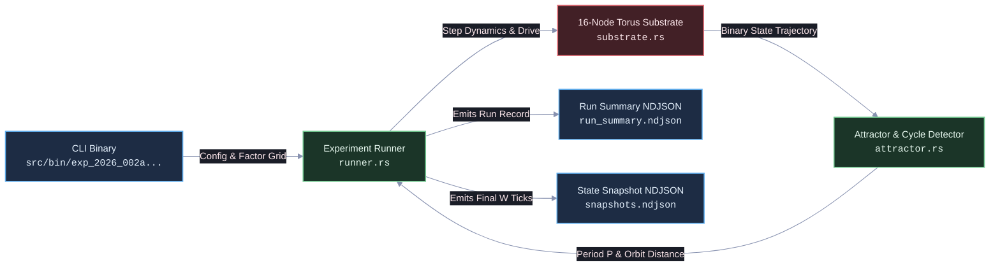

# EXP-2026-002a: Attractor Mapping and Input Separation Protocol

## Part I: Experiment Protocol

### Protocol ID & Hypothesis Reference

- **Protocol ID:** EXP-2026-002a
- **Hypothesis:** [`HYP-2026-002`](file:///workspaces/ca-experiment/docs/research/hypotheses/HYP-2026-002.md) (Attractor Separation and Basin Consistency in Minimal Viable Automata)
- **Campaign Lineage:** `CAMPAIGN-2026-MVA-SUBSTRATE` -> Sprint 1 -> Complexity Ladder Rung 2

### Experimental Objective

Empirically measure and evaluate pairwise attractor separation distance $D(S_A, S_B)$, limit cycle periods $P$, attractor basin consistency $D(S_A, S_A')$, and settling times across distinct 32-tick temporal input bit-trains ($A, B, C, D$) on the 16-node homeostatic 2D torus substrate implemented in Rust.

---

### Independent Variables

1. **Input Drive Pattern ($X$)**:
   - `Pattern_A` (High-frequency burst): Periodic 4-tick bit pattern `11001100110011001100110011001100` (duty cycle 50%).
   - `Pattern_B` (Prime pulse train): Spikes placed at prime ticks $t \in \lbrace 2, 3, 5, 7, 11, 13, 17, 19, 23, 29, 31 \rbrace$.
   - `Pattern_C` (Galois LFSR sequence): Deterministic pseudo-random 32-bit sequence generated via 8-bit LFSR (seed `0x5A`, polynomial $x^8 + x^6 + x^5 + x^4 + 1$).
   - `Pattern_D` (Sparse low-frequency pulse): Period-8 sparse pulse `10000000100000001000000010000000`.
2. **Drive Duration ($T_{\text{drive}}$)**: Fixed at 32 ticks.
3. **Autonomous Relaxation Duration ($T_{\text{relax}}$)**: Factor levels $\lbrace 200, 500, 1000 \rbrace$ ticks.
4. **Input Perturbation Noise ($\epsilon$)**:
   - $\epsilon = 0.00$ (Deterministic clean drive)
   - $\epsilon = 0.01$ (1% bit-flip probability during drive)
   - $\epsilon = 0.05$ (5% bit-flip probability during drive)
5. **Homeostatic Mode**:
   - `Active`: $\eta = 0.02, \lambda = 0.05, N_{\text{ref}} = 2, r_{\text{target}} = 0.12$.
   - `Fixed`: $\eta = 0.0, V_{\text{thresh}} = 1.15$ (Static threshold baseline).
6. **Ensemble Seeds ($n_{\text{seeds}}$)**: 30 independent pseudo-random initialization seeds per factor combination.

---

### Dependent Variables

1. **Limit Cycle Period ($P$)**: Minimal repeat period ($P \in [1, 128]$) detected over the final $W = 128$ relaxation ticks.
2. **Settling Time ($T_{\text{settle}}$)**: Earliest tick $t \ge T_{\text{drive}}$ such that $\mathbf{s}(t' + P) = \mathbf{s}(t')$ for all subsequent $t' \ge t$.
3. **Pairwise Attractor Distance ($D(S_X, S_Y)$)**: Mean composite distance between trajectories driven by distinct patterns $X \neq Y$:
   $$D(S_X, S_Y) = \frac{1}{2} \left( D_{\text{orbit}}(S_X, S_Y) + D_{\text{occ}}(S_X, S_Y) \right)$$
4. **Attractor Basin Consistency ($D(S_X, S_X')$)**: Composite distance between identical input pattern runs across seed perturbations or state jitter.
5. **Attractor Firing Density ($\bar{\rho}_{\text{attractor}}$)**: Mean firing rate over the final $W = 128$ ticks.
6. **Separation-to-Noise Ratio ($\text{SNR}$)**:
   $$\text{SNR} = \frac{\langle D(S_X, S_Y)_{X \neq Y} \rangle}{\langle D(S_X, S_X') \rangle}$$

---

### Control Conditions (Baseline + Ablation)

1. **Identity Replay Control (Positive Control):** Exact identical replay ($A$ vs $A$, seed $s = s$) to confirm deterministic reproducibility ($D(S_A, S_A) = 0.0$).
2. **Matched Bernoulli Noise Control (Negative Control):** Unstructured Bernoulli bitstream ($p = 0.12$) to establish expected random separation.
3. **Static Threshold Ablation:** Baseline with $\eta = 0.0$ and fixed $V_{\text{thresh}} = 1.15$ to evaluate whether homeostatic adaptation is necessary for stable attractor separation.
4. **Zero-Carrier Ablation:** Autonomous relaxation under zero input (`0000...`) instead of carrier clock (`1010...`) to measure absorbing boundary entrapment.
5. **Decoupled Lattice Ablation:** Internal recurrent edges severed ($k_{\text{in}} = 0$) to isolate purely feedforward sensory dynamics.

---

### Signal/Dataset Specification

- **Sensory Ingress Track Allocation:** Nodes $v_0 = (0, 0)$ and $v_1 = (0, 1)$ on the $4 \times 4$ torus.
- Node $v_0$ receives driving bitstream $\mathbf{u}_X(t)$. Node $v_1$ receives complementary sequence $\mathbf{u}_X(t - 4 \pmod {32})$ to induce spatial asymmetry.
- **Neutral Carrier Clock:** For all $t > T_{\text{drive}}$, sensory tracks receive $c(t) = t \pmod 2$.
- Total ticks per run: $T_{\text{total}} = 32 + T_{\text{relax}} \in \lbrace 232, 532, 1032 \rbrace$.

---

### Statistical Analysis Plan

- Compute complete pairwise distance matrices ($4 \times 4$) for all pattern pairs $(X, Y) \in \lbrace A, B, C, D \rbrace^2$.
- Two-sample Mann-Whitney U test and Kolmogorov-Smirnov test comparing between-cluster distances $\lbrace D(S_X, S_Y) \rbrace_{X \neq Y}$ to within-cluster replay distances $\lbrace D(S_X, S_X') \rbrace$.
- Effect size quantification via Cohen's $d$:
  $$d = \frac{\mu_{\text{inter}} - \mu_{\text{intra}}}{\sqrt{(\sigma_{\text{inter}}^2 + \sigma_{\text{intra}}^2) / 2}}$$
- Pre-registered significance threshold: $p < 10^{-5}$ and Cohen's $d \ge 1.5$.
- Silhouette clustering analysis on final $W = 128$ node occupancy vectors $\mathbf{m}_X$.

---

### Telemetry Requirements

- **Run Summary (`run_summary.ndjson`):** One JSON record per run with run ID, factor settings, detected period $P$, settling time $T_{\text{settle}}$, mean firing rate, and final threshold statistics.
- **Attractor State Snapshots (`snapshots.ndjson`):** Binary spike vector snapshots $\mathbf{s}(t)$ encoded as `u16` bitmasks for the final $W = 128$ ticks of each run.

---

### Resource Budget

- **Factor Grid:**
  - 5 input patterns ($A, B, C, D$, noise control)
  - 3 relaxation horizons ($200, 500, 1000$)
  - 3 noise levels ($0.0, 0.01, 0.05$)
  - 2 homeostatic modes (`active`, `fixed`)
  - 30 seeds per condition
  - Total factorial runs: $5 \times 3 \times 3 \times 2 \times 30 = 2{,}700$ runs.
- **Compute Time:** $\le 10$ seconds on modern multi-core x86_64 host (compiled Rust release binary).
- **RAM Footprint:** $\le 100\text{ MB}$ RSS.
- **Disk Storage:** $\le 25\text{ MB}$ uncompressed NDJSON output.

---

### Pass/Fail Criteria

- **CRITERION 1 (Attractor Separation):** Mean pairwise inter-pattern distance $\langle D(S_X, S_Y) \rangle \ge 0.20$ for all $X \neq Y$.
- **CRITERION 2 (Basin Consistency):** Mean intra-pattern replay distance $\langle D(S_X, S_X') \rangle < 0.05$ under $\epsilon = 0.0$.
- **CRITERION 3 (Noise Robustness):** Under $\epsilon = 0.01$, $\langle D(S_X, S_{X,\epsilon}) \rangle < 0.08$.
- **CRITERION 4 (Limit Cycle Convergence):** At least 95.0% of active runs settle into a periodic orbit with period $P \le 128$ within $T_{\text{relax}} = 500$.
- **CRITERION 5 (Homeostatic Advantage):** Active homeostatic mode exhibits statistically superior separation-to-noise ratio over fixed baseline ($\text{SNR}_{\text{active}} \ge 2.0 \times \text{SNR}_{\text{fixed}}$ with $p < 10^{-5}$).

---

### Known Limitations

- The 16-node regular torus exhibits discrete spatial symmetries that can induce orbit degeneracies for symmetrically related input channels.
- Fixed 32-tick drive window may not saturate the memory capacity of the recurrent graph.

---

## Part II: Implementation Specification



### Target Package & Lineage

- **Rust Crate Directory:** `src/experiments/exp_2026_002a_mva_attractor_mapping/`
- **Binary Executable Path:** `src/bin/exp_2026_002a_mva_attractor_mapping.rs`
- **Naming Rule:** Strictly lowercase with underscores (`snake_case`), adhering to Rust package and module identifier standards.

---

### Module Decomposition

1. **`types.rs`**:
   - Data structures: `ExperimentConfig`, `SubstrateParams`, `InputPatternId`, `RunSummaryRecord`, `SnapshotRecord`.
2. **`patterns.rs`**:
   - Exact bit-level pattern generators for $A, B, C, D$, Bernoulli noise, and neutral carrier clock $c(t) = t \pmod 2$.
3. **`substrate.rs`**:
   - 16-node 2D Torus implementation with leaky integrate-and-fire nodes, refractory counter logic, and dynamic homeostatic threshold adaptation.
4. **`attractor.rs`**:
   - Sliding-window cycle detection over final $W = 128$ ticks.
   - Exact calculation of $D_{\text{orbit}}(S_A, S_B)$, $D_{\text{occ}}(S_A, S_B)$, and composite distance $D(S_A, S_B)$.
5. **`runner.rs`**:
   - Multi-threaded execution harness running the factorial sweep across seeds, evaluating distances, and emitting NDJSON logs.

---

### CLI Entry Points

Binary invocation via Cargo:

```bash
cargo run --release --bin exp_2026_002a_mva_attractor_mapping -- \
  --output-dir data/telemetry/EXP-2026-002a \
  --seeds 30 \
  --t-drive 32 \
  --relax-lengths 200,500,1000 \
  --noise-levels 0.0,0.01,0.05
```

---

### Parameter Search Space

| Parameter | Default | Factor Levels |
| :--- | :--- | :--- |
| `input_patterns` | `A,B,C,D` | `Pattern_A`, `Pattern_B`, `Pattern_C`, `Pattern_D`, `Noise` |
| `t_drive` | `32` | Fixed `32` ticks |
| `t_relax` | `500` | `200`, `500`, `1000` ticks |
| `noise_rate` ($\epsilon$) | `0.0` | `0.00`, `0.01`, `0.05` |
| `n_ref` | `2` | Locked at `2` |
| `leak` ($\lambda$) | `0.05` | Locked at `0.05` |
| `r_target` | `0.12` | Locked at `0.12` |
| `eta` | `0.02` | `0.02` (Active), `0.00` (Fixed baseline) |
| `carrier` | `periodic_10` | `periodic_10` (`1010...`), `silent` (`0000...`) |
| `seeds` | `30` | `1..=30` |

---

### Emission Schemas

#### 1. Run Summary Schema (`run_summary.ndjson`)

```json
{
  "run_id": "exp_2026_002a_0001",
  "pattern": "Pattern_A",
  "t_relax": 500,
  "noise": 0.0,
  "mode": "active",
  "seed": 42,
  "period": 8,
  "settling_time": 142,
  "mean_firing_rate": 0.1205,
  "mean_threshold": 1.148,
  "cycle_detected": true
}
```

#### 2. Attractor Snapshot Schema (`snapshots.ndjson`)

```json
{
  "run_id": "exp_2026_002a_0001",
  "tick": 405,
  "spikes": 20485
}
```

*(where `spikes` is a `u16` integer representing the 16 nodes' binary spike configuration as bit flags)*.

---

### Resource & Execution Limits

- **Max Wall-Clock Time:** 60 seconds total.
- **Memory Ceiling:** 512 MB RSS.
- **Storage Limit:** 50 MB total telemetry in output directory.

---

### Telemetry Reduction Pipeline

1. Compute full pairwise distance matrix across all runs in memory or via post-run Rust aggregator.
2. Output final analysis summary `summary_metrics.json` containing:
   - Mean inter-attractor distance $\langle D(S_X, S_Y) \rangle$
   - Mean intra-attractor replay distance $\langle D(S_X, S_X') \rangle$
   - Separation-to-noise ratio $\text{SNR}$
   - Cycle detection rate (% settled with $P \le 128$)
   - Statistical p-values and Cohen's $d$
   - Pass/Fail evaluation against the 5 pre-registered criteria.
