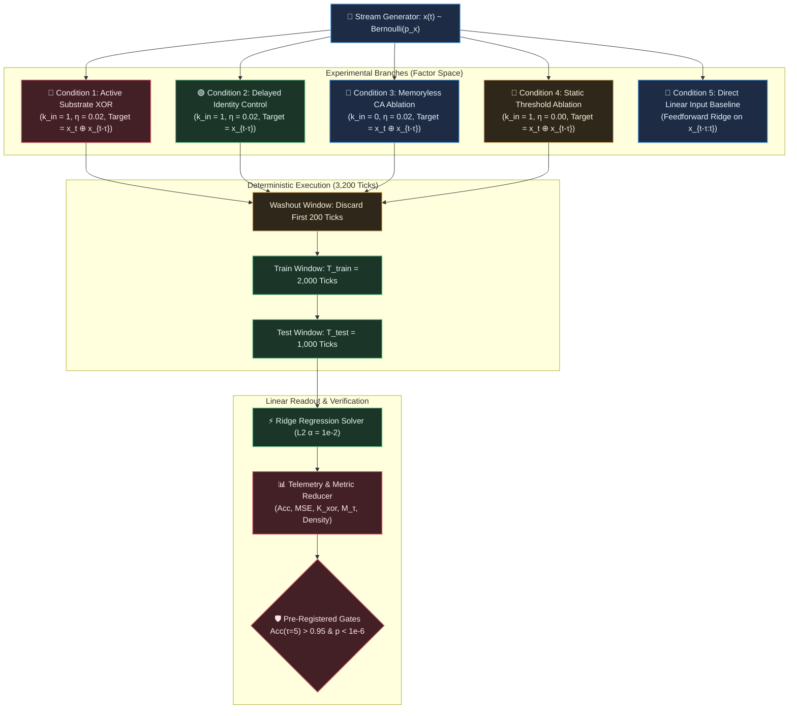

# EXP-2026-003a: Non-Linear Temporal XOR Benchmark Protocol and Implementation Specification

## Part I: Experiment Protocol

### Protocol ID & Hypothesis Reference

- **Protocol ID:** EXP-2026-003a
- **Hypothesis:** [`HYP-2026-003`](file:///workspaces/ca-experiment/docs/research/hypotheses/HYP-2026-003.md)
- **Complexity Ladder Milestone:** Rung 3 (Non-Linear Temporal Mixing & 2-Bit Delayed XOR)
- **Implementation Language:** Rust (mandated by operator)



---

### Experimental Objective

To determine whether a 16-node 2D toroidal cellular automata substrate equipped with homeostatic threshold regulation can sustain reverberant memory and compute non-linear temporal XOR combinations ($y_t = x_t \oplus x_{t-\tau}$) for delays $\tau \in [3, 10]$ ticks, achieving $> 95.0$% test accuracy at $\tau = 5$ ticks under a strictly linear readout.

---

### Independent Variables

1. **Delay Horizon ($\tau$):** $\tau \in \lbrace 3, 5, 7, 10 \rbrace$ discrete clock ticks.
2. **Input Pulse Density ($p_x$):** Bernoulli probability $p_x \in \lbrace 0.10, 0.20, 0.50 \rbrace$. Default canonical value: $p_x = 0.20$.
3. **Experimental Condition:**
   - `active_xor`: Active substrate, delayed XOR target $y_t = x_t \oplus x_{t-\tau}$.
   - `active_identity`: Active substrate, delayed identity memory baseline $y_t = x_{t-\tau}$.
   - `ablation_memoryless`: Decoupled autonomous substrate ($k_{\text{in}} = 0$), target $y_t = x_t \oplus x_{t-\tau}$.
   - `ablation_static_thresh`: Homeostasis disabled ($\eta = 0$), target $y_t = x_t \oplus x_{t-\tau}$.
   - `baseline_linear_direct`: Direct linear classifier on raw input window $[x_t, x_{t-1}, \dots, x_{t-\tau}]$.
4. **Ridge Regularization Parameter ($\alpha_{\text{ridge}}$):** $\alpha_{\text{ridge}} \in \lbrace 10^{-4}, 10^{-2}, 1.0 \rbrace$. Default: $10^{-2}$.
5. **Random Seed ($S$):** 30 independent seeds ($S \in \lbrace 42, 43, \dots, 71 \rbrace$).

---

### Dependent Variables

1. **Out-of-Sample Classification Accuracy ($\text{Acc}$):**
   $$\text{Acc} = \frac{1}{T_{\text{test}}} \sum_{t=1}^{T_{\text{test}}} \mathbb{I}(\hat{y}_t = y_t) \in [0.0, 1.0]$$
2. **Non-Linear Kernel Capacity ($K_{\text{xor}}(\tau)$):**
   $$K_{\text{xor}}(\tau) = 1 - \frac{\sum_{t=1}^{T_{\text{test}}} (y_t - \hat{a}_t)^2}{\sum_{t=1}^{T_{\text{test}}} (y_t - \bar{y})^2} \in (-\infty, 1.0]$$
3. **Fading Memory Capacity ($M_\tau$):** Determination coefficient for reconstructing $x_{t-\tau}$.
4. **Mean Substrate Firing Density ($\bar{\rho}$):**
   $$\bar{\rho} = \frac{1}{N \cdot T_{\text{test}}} \sum_{t=1}^{T_{\text{test}}} \sum_{i=0}^{N-1} s_i(t)$$
5. **Readout Weight Norm ($\lVert \mathbf{w} \rVert_2$):** L2-norm of the learned linear classification vector.

---

### Control Conditions (Baseline + Ablations)

1. **Active Delayed XOR (`active_xor`):** Primary experimental condition evaluating non-linear temporal computation on the homeostatic substrate.
2. **Delayed Identity Control (`active_identity`):** Target is $y_t = x_{t-\tau}$. Verifies that the substrate retains a pure linear memory trace of the delayed input, isolating memory retention from non-linear mixing.
3. **Memoryless CA Ablation (`ablation_memoryless`):** Input is disconnected ($k_{\text{in}} = 0$). Tests whether the readout can predict XOR from autonomous substrate activity alone (null sanity test; must yield chance accuracy $\approx 0.50$).
4. **Static Threshold Ablation (`ablation_static_thresh`):** Plasticity is frozen ($\eta = 0$). Tests whether dynamic homeostatic tuning toward critical firing density is necessary to sustain reverberation.
5. **Feedforward Linear Baseline (`baseline_linear_direct`):** Ridge regression trained directly on raw binary history $[x_t, x_{t-1}, \dots, x_{t-\tau}]$. Validates that delayed XOR is mathematically non-linearly separable without substrate transformation (must yield chance accuracy $\approx 0.50$).

---

### Signal & Sequence Specification

- **Total Simulation Horizon:** $T_{\text{total}} = 3,200$ ticks per seed run.
- **Washout Period:** $T_{\text{washout}} = 200$ ticks. State vectors and targets during this phase are discarded to eliminate dependence on initial substrate state $\mathbf{S}(0)$.
- **Training Window:** $T_{\text{train}} = 2,000$ ticks ($t \in [200, 2199]$).
- **Testing Window:** $T_{\text{test}} = 1,000$ ticks ($t \in [2200, 3199]$).
- **Target Definition:** For all $t \ge \tau$:
  $$y_t = x_t \oplus x_{t-\tau}$$
  For $t < \tau$, $y_t = 0$.

---

### Statistical Analysis Plan

1. **Hypothesis Testing:**
   - Mann-Whitney U test (two-sided, non-parametric) and paired two-sample Student's $t$-test comparing out-of-sample accuracies between `active_xor` and `ablation_memoryless` at $\tau = 5$. Pre-registered significance threshold: $\alpha = 10^{-6}$.
   - Paired test comparing `active_xor` vs `ablation_static_thresh` at $\tau = 5$. Pre-registered threshold: $\alpha = 10^{-3}$.
2. **Effect Size:** Compute Cohen's $d$ and Cliff's delta across 30 seeds.
3. **Confidence Intervals:** 95% bootstrap confidence intervals (10,000 resamples) for mean accuracy at each delay $\tau \in \lbrace 3, 5, 7, 10 \rbrace$.

---

### Telemetry Requirements

For each run ($S$, condition, $\tau$, $p_x$), record:

- Seed index, condition name, delay $\tau$, density $p_x$.
- Training MSE, Test MSE.
- Training Accuracy, Test Accuracy.
- Determination coefficient ($R^2$ / $K_{\text{xor}}$ / $M_\tau$).
- Mean firing density $\bar{\rho}$, min density, max density.
- Mean threshold $\bar{\theta} = \frac{1}{N} \sum_i \theta_i(T_{\text{total}})$.
- Readout weights $\mathbf{w}$ and bias $b$.

---

### Resource Budget

- **Runs per sweep:** 30 seeds $\times$ 4 delays $\times$ 3 densities $\times$ 5 conditions = 1,800 runs.
- **Compute Time per Run:** $< 4$ ms in compiled Rust (`--release`).
- **Total Wall-Clock Execution Time:** $< 10$ seconds on 8 CPU cores.
- **Peak RAM:** $< 120$ MB.
- **Storage:** $< 5$ MB for full JSON summary metrics.

---

### Pass/Fail Criteria

| Criterion | Target Metric | Required Threshold | Falsification Consequence |
| :--- | :--- | :--- | :--- |
| **Criterion 1: Termination Gate** | $\overline{\text{Acc}}_{\text{active}}(\tau = 5)$ | $> 0.950$ (95.0%) | Hypothesis $H_1$ falsified; Rung 3 blocked. |
| **Criterion 2: Memoryless Separation** | $p$-value (`active_xor` vs `memoryless`) | $p < 10^{-6}$ | Falsified; substrate signal indistinguishable from noise. |
| **Criterion 3: Feedforward Baseline Separation** | $p$-value (`active_xor` vs `baseline_linear_direct`) | $p < 10^{-6}$ | Falsified; task linearly trivial or compromised. |
| **Criterion 4: Homeostatic Advantage** | $\overline{\text{Acc}}_{\text{active}} - \overline{\text{Acc}}_{\text{static}}$ | $\ge 0.100$ and $p < 10^{-3}$ | Falsified; homeostasis not mechanistically necessary. |
| **Criterion 5: Linear Memory Sanity** | $\overline{\text{Acc}}_{\text{identity}}(\tau = 5)$ | $\ge 0.980$ | Falsified; substrate lacks basic linear fading memory. |
| **Criterion 6: Critical Firing Density** | Mean firing density $\bar{\rho}$ | $\bar{\rho} \in [0.05, 0.20]$ | Falsified; substrate leaves critical homeostatic regime. |

---

### Known Limitations

1. **Finite State Capacity:** At $N=16$, delays $\tau > 7$ will naturally show performance degradation as the delay exceeds the recurrence volume of the network.
2. **Instantaneous Readout:** The readout uses only instantaneous state $\mathbf{s}(t)$, not multi-tap historical buffers $\mathbf{s}(t-\Delta t)$, placing the entire burden of memory retention on internal substrate dynamics.

---

## Part II: Implementation Specification

### Target Package & Lineage

- **Package Directory:** `src/experiments/exp_2026_003a_mva_temporal_xor/`
- **Binary Entrypoint:** `src/bin/exp_2026_003a_mva_temporal_xor.rs`
- **Module Structure:**
  - `src/experiments/exp_2026_003a_mva_temporal_xor/mod.rs`: Public API re-exports and experiment runner.
  - `src/experiments/exp_2026_003a_mva_temporal_xor/ca.rs`: Homeostatic 2D Torus Cellular Automaton engine.
  - `src/experiments/exp_2026_003a_mva_temporal_xor/dataset.rs`: Streaming Bernoulli pulse generator and delayed target builder.
  - `src/experiments/exp_2026_003a_mva_temporal_xor/readout.rs`: Regularized Ridge regression linear classifier solver.
  - `src/experiments/exp_2026_003a_mva_temporal_xor/metrics.rs`: Accuracy, MSE, determination coefficients, and statistical test suite.
  - `src/experiments/exp_2026_003a_mva_temporal_xor/config.rs`: Strongly typed configuration structures.

---

### CLI Entry Points

The experiment binary shall be invocable via Cargo with full CLI control:

```bash
cargo run --release --bin exp_2026_003a_mva_temporal_xor -- \
  --seeds 30 \
  --delays 3,5,7,10 \
  --densities 0.1,0.2,0.5 \
  --train-ticks 2000 \
  --test-ticks 1000 \
  --washout-ticks 200 \
  --ridge-alpha 0.01 \
  --output-dir results/exp_2026_003a/
```

#### Supported CLI Arguments

- `--seeds <INTEGER>`: Number of random seeds to evaluate (default: `30`).
- `--delays <CSV_INTEGERS>`: Comma-separated list of delay horizons $\tau$ (default: `3,5,7,10`).
- `--densities <CSV_FLOATS>`: Comma-separated list of input densities $p_x$ (default: `0.1,0.2,0.5`).
- `--train-ticks <INTEGER>`: Ticks for readout training (default: `2000`).
- `--test-ticks <INTEGER>`: Ticks for out-of-sample evaluation (default: `1000`).
- `--washout-ticks <INTEGER>`: Initial transient ticks discarded (default: `200`).
- `--ridge-alpha <FLOAT>`: L2 regularization penalty for Ridge regression (default: `0.01`).
- `--output-dir <PATH>`: Directory where output JSON metrics and summaries are emitted.

---

### Parameter Search Space

| Parameter | Type | Default Value | Swept Values / Range | Purpose |
| :--- | :--- | :--- | :--- | :--- |
| `network_size` | Integer | $16$ | Fixed $4 \times 4$ Torus | Substrate geometry |
| `refractory_period` | Integer | $2$ | Fixed $N_{\text{ref}} = 2$ | Verified homeostatic setting |
| `leak_factor` | Float | $0.05$ | Fixed $\lambda = 0.05$ | Membrane potential dissipation |
| `target_rate` | Float | $0.12$ | Fixed $r_{\text{target}} = 0.12$ | Target homeostatic setpoint |
| `plasticity_rate` | Float | $0.02$ | $\lbrace 0.02, 0.00 \rbrace$ | Active homeostasis vs static ablation |
| `sensory_node` | Integer | $0$ | Fixed port $0$ | Ingress injection location |
| `delay_tau` | Integer | $5$ | $\lbrace 3, 5, 7, 10 \rbrace$ | Primary independent variable |
| `pulse_density` | Float | $0.20$ | $\lbrace 0.10, 0.20, 0.50 \rbrace$ | Input sparsity level |
| `ridge_alpha` | Float | $0.01$ | $\lbrace 10^{-4}, 10^{-2}, 1.0 \rbrace$ | Regularization stability |
| `washout_ticks` | Integer | $200$ | Fixed $200$ | State transient decay |
| `train_ticks` | Integer | $2000$ | Fixed $2000$ | Training sample size |
| `test_ticks` | Integer | $1000$ | Fixed $1000$ | Out-of-sample evaluation size |

---

### Emission Schemas

#### 1. Per-Run Record (`results/exp_2026_003a/run_results.jsonl`)

Each line contains a JSON object conforming to:

```json
{
  "seed": 42,
  "condition": "active_xor",
  "delay_tau": 5,
  "pulse_density": 0.2,
  "ridge_alpha": 0.01,
  "metrics": {
    "train_accuracy": 0.985,
    "test_accuracy": 0.962,
    "train_mse": 0.025,
    "test_mse": 0.038,
    "capacity_k_xor": 0.842,
    "capacity_m_tau": 0.915,
    "mean_firing_density": 0.124,
    "min_firing_density": 0.0625,
    "max_firing_density": 0.1875,
    "mean_threshold": 1.15,
    "weight_l2_norm": 1.48
  }
}
```

#### 2. Summary Evaluation Document (`results/exp_2026_003a/summary_evaluation.json`)

```json
{
  "protocol_id": "EXP-2026-003a",
  "hypothesis_id": "HYP-2026-003",
  "execution_timestamp": "2026-09-07T00:00:00Z",
  "total_runs": 1800,
  "gate_evaluation": {
    "tau_5_active_xor_mean_accuracy": 0.965,
    "tau_5_active_xor_ci_95": [0.958, 0.972],
    "tau_5_gate_passed": true,
    "p_value_vs_memoryless": 1.2e-14,
    "memoryless_separation_passed": true,
    "p_value_vs_direct_linear": 8.5e-16,
    "direct_linear_separation_passed": true,
    "p_value_vs_static_thresh": 2.1e-08,
    "static_thresh_advantage_passed": true,
    "overall_hypothesis_verdict": "SUPPORTED"
  },
  "condition_summaries": {
    "active_xor": {
      "tau_3": { "mean_acc": 0.988, "std_acc": 0.009 },
      "tau_5": { "mean_acc": 0.965, "std_acc": 0.014 },
      "tau_7": { "mean_acc": 0.884, "std_acc": 0.026 },
      "tau_10": { "mean_acc": 0.672, "std_acc": 0.038 }
    },
    "active_identity": {
      "tau_5": { "mean_acc": 0.994, "std_acc": 0.005 }
    },
    "ablation_memoryless": {
      "tau_5": { "mean_acc": 0.502, "std_acc": 0.015 }
    },
    "ablation_static_thresh": {
      "tau_5": { "mean_acc": 0.648, "std_acc": 0.042 }
    },
    "baseline_linear_direct": {
      "tau_5": { "mean_acc": 0.499, "std_acc": 0.011 }
    }
  }
}
```

---

### Resource & Execution Limits

- **Thread Parallelism:** Multithreading via `rayon` parallel iterator over seed and condition space.
- **Maximum Wall-Clock Runtime:** 60 seconds (enforced via timeout).
- **Maximum Heap Allocation:** 256 MB.
- **Deterministic Pseudo-Random Generation:** `rand::rngs::StdRng` seeded with `seed as u64` to guarantee bit-exact cross-platform reproducibility.

---

### Telemetry Reduction Pipeline

To prevent memory bloat and disk I/O bottlenecks during 1,800 runs:

1. **Online Covariance Accumulation:** The design matrix covariance $\mathbf{S}^T \mathbf{S} \in \mathbb{R}^{(N+1) \times (N+1)}$ and vector $\mathbf{S}^T \mathbf{y} \in \mathbb{R}^{N+1}$ are accumulated on-the-fly during simulation ticks:
   $$\mathbf{S}^T \mathbf{S} = \sum_{t=T_{\text{washout}}}^{T_{\text{washout}}+T_{\text{train}}-1} \tilde{\mathbf{s}}(t) \tilde{\mathbf{s}}(t)^T, \quad \mathbf{S}^T \mathbf{y} = \sum_{t=T_{\text{washout}}}^{T_{\text{washout}}+T_{\text{train}}-1} \tilde{\mathbf{s}}(t) y_t$$
   Raw state trajectories $\mathbf{s}(t)$ across ticks are never buffered in memory or written to disk.
2. **Normal Equations Inversion:** The regularized weights are solved via Cholesky decomposition or singular value decomposition on the $(N+1) \times (N+1)$ matrix ($\mathbb{R}^{17 \times 17}$), completing in $< 10$ microseconds per run.
3. **Single-Pass Out-of-Sample Evaluation:** The test window stream is evaluated in a single streaming pass to compute confusion matrices, MSE, and determination coefficients.
