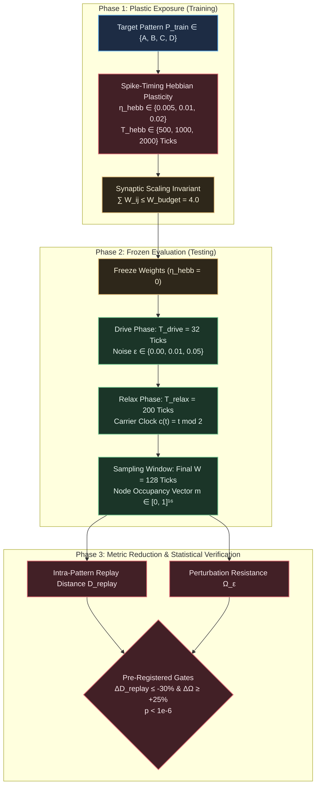

# EXP-2026-004a: Local Hebbian Plasticity and Attractor Basin Deepening Experiment Protocol and Implementation Specification

## Part I: Experiment Protocol

### Protocol ID & Hypothesis Reference

- **Protocol ID:** EXP-2026-004a
- **Hypothesis:** [`HYP-2026-004`](file:///workspaces/ca-experiment/docs/research/hypotheses/HYP-2026-004.md)
- **Complexity Ladder Milestone:** Rung 4 (Sprint 3: Local Plasticity Rules & Hebbian Track Rewiring)
- **Implementation Language:** Rust (mandated by operator)



---

### Experimental Objective

To empirically test whether a strictly local, causal spike-timing Hebbian track adaptation rule combined with multiplicative synaptic scaling enables a 16-node homeostatic cellular automaton substrate to autonomously deepen attractor basins ($\Delta D_{\text{replay}} \le -30\%$) and increase perturbation resistance under bit-flip noise ($\Delta \Omega_{\epsilon=0.05} \ge +0.25$, $p < 10^{-6}$) for recurring driving patterns, while preserving critical firing density $\bar{\rho} \in [0.05, 0.20]$.

---

### Independent Variables

1. **Plasticity Learning Rate ($\eta_{\text{hebb}}$):** $\eta_{\text{hebb}} \in \{0.005, 0.01, 0.02\}$. Canonical default: $\eta_{\text{hebb}} = 0.01$.
2. **Training Exposure Duration ($T_{\text{hebb}}$):** $T_{\text{hebb}} \in \{500, 1000, 2000\}$ discrete clock ticks. Canonical default: $T_{\text{hebb}} = 1000$.
3. **Driving Pattern ($P$):** Four orthogonal 32-tick patterns $P \in \{A, B, C, D\}$.
4. **Test Bit-Flip Noise Level ($\epsilon$):** $\epsilon \in \{0.00, 0.01, 0.05\}$.
5. **Experimental Condition:**
   - `active_hebbian`: Local spike-timing Hebbian plasticity with synaptic scaling.
   - `baseline_static`: Fixed isotropic weights ($W_{ij} \equiv 1.0, \eta_{\text{hebb}} = 0$).
   - `ablation_random_drift`: Uncoupled random Gaussian weight fluctuations matched to empirical Hebbian variance.
   - `ablation_anti_hebbian`: Inverted correlation update rule.
   - `novel_pattern_control`: Network exposed to $P_{\text{train}}$, tested on novel unexposed patterns $P_{\text{novel}} \in \{A, B, C, D\} \setminus \{P_{\text{train}}\}$.
6. **Random Seed ($S$):** 30 independent pseudo-random seeds ($S \in \{42, 43, \dots, 71\}$).

---

### Dependent Variables

1. **Intra-Pattern Replay Distance ($D_{\text{replay}}$):**
   $$D_{\text{replay}}(P) = \frac{1}{N} \|\mathbf{m}_P^{(1)} - \mathbf{m}_P^{(2)}\|_1 \in [0.0, 1.0]$$
2. **Inter-Pattern Minimum Separation ($D_{\text{sep}}$):**
   $$D_{\text{sep}}(P) = \min_{Q \neq P} \frac{1}{N} \|\mathbf{m}_P - \mathbf{m}_Q\|_1 \in [0.0, 1.0]$$
3. **Attractor Basin Depth ($\mathcal{B}$):**
   $$\mathcal{B}(P) = 1 - \frac{D_{\text{replay}}(P)}{D_{\text{sep}}(P) + 10^{-6}} \in [0.0, 1.0]$$
4. **Perturbation Resistance ($\Omega_\epsilon$):**
   $$\Omega_\epsilon(P) = \max\left(0, \, 1 - \frac{D_{\text{perturb}}(P, \epsilon)}{D_{\text{sep}}(P) + 10^{-6}}\right) \in [0.0, 1.0]$$
5. **Relative Replay Variance Reduction ($\Delta D_{\text{replay}}$):**
   $$\Delta D_{\text{replay}} = \frac{D_{\text{replay}}^{\text{hebb}} - D_{\text{replay}}^{\text{static}}}{D_{\text{replay}}^{\text{static}}}$$
6. **Relative Perturbation Resistance Improvement ($\Delta \Omega_\epsilon$):**
   $$\Delta \Omega_\epsilon = \frac{\Omega_\epsilon^{\text{hebb}} - \Omega_\epsilon^{\text{static}}}{\Omega_\epsilon^{\text{static}}}$$
7. **Mean Substrate Firing Density ($\bar{\rho}$):**
   $$\bar{\rho} = \frac{1}{N \cdot W} \sum_{t=T_{\text{settle}}+1}^{T_{\text{settle}}+W} \sum_{i=0}^{N-1} s_i(t)$$
8. **Synaptic Weight Structure Metrics:**
   - Spatial weight variance: $\sigma_W^2 = \text{Var}_{(j, i) \in \mathcal{E}}(W_{ij})$.
   - Maximum weight: $W_{\text{peak}} = \max_{(j, i) \in \mathcal{E}} W_{ij}$.
   - Budget conservation check: $\max_{i \in \mathcal{V}} \sum_{j \in \mathcal{N}_i^{\text{in}}} W_{ij} \le 4.0001$.

---

### Control Conditions (Baseline + Ablations)

1. **Static Baseline (`baseline_static`):** Substrate operates with frozen isotropic weights ($W_{ij} \equiv 1.0, \eta_{\text{hebb}} = 0$). Represents unadapted Rung 2 capability.
2. **Random Weight Drift Ablation (`ablation_random_drift`):** Weights undergo uncoupled stochastic updates with matched variance $\sigma^2$ and identical synaptic scaling. Tests whether basin deepening requires causal spike-timing correlations or merely structural symmetry breaking.
3. **Anti-Hebbian Ablation (`ablation_anti_hebbian`):** Update direction is reversed, depressing causal connections and potentiating uncoupled tracks. Verifies that the Hebbian sign aligns with physical basin deepening.
4. **Novel Pattern Control (`novel_pattern_control`):** Network trained on $P_{\text{train}} = A$ is evaluated on $P_{\text{novel}} \in \{B, C, D\}$. Tests whether basin deepening is associative and pattern-specific versus non-specific global excitability tuning.

---

### Signal & Sequence Specification

- **Input Pattern Bitstreams:** Four pre-registered 32-tick binary words with balanced firing counts (16 ones, 16 zeros) and low cross-correlation:
  - Pattern A: `0b11001010011010010101101001010011` (`0xCA695A53`)
  - Pattern B: `0b10110100110010101001011001100101` (`0xB4CA9665`)
  - Pattern C: `0b01101001101001011100101010011100` (`0x69A5CA9C`)
  - Pattern D: `0b01011100011010101010011011000101` (`0x5C6AA6C5`)
- **Sensory Ingress Configuration:** Clamped at nodes $v_0 = (0, 0)$ (Node 0) and $v_5 = (1, 1)$ (Node 5) on the $4 \times 4$ torus. Node 5 receives the stream phase-shifted by 4 ticks to prevent spatial mirror symmetries.
- **Training Phase:** Target pattern repeats for $T_{\text{hebb}}$ ticks ($t \in [1, T_{\text{hebb}}]$) with active plasticity.
- **Evaluation Phase:**
  - Plasticity frozen ($\eta_{\text{hebb}} = 0$).
  - Target pattern injected with bit-flip noise $\epsilon$ for $T_{\text{drive}} = 32$ ticks.
  - Autonomous relaxation under neutral carrier clock $c(t) = t \bmod 2$ for $T_{\text{relax}} = 200$ ticks.
  - State sampling window: Final $W = 128$ ticks ($t \in [232 - 128 + 1, 232] = [105, 232]$).

---

### Statistical Analysis Plan

1. **Primary Hypothesis Test:**
   - Two-sample Mann-Whitney U test (two-sided, non-parametric) and paired Student's $t$-test comparing intra-pattern replay distance $D_{\text{replay}}(P_{\text{train}})$ between `active_hebbian` and `baseline_static` across 30 seeds. Pre-registered significance threshold: $\alpha = 10^{-6}$.
   - Two-sample test comparing perturbation resistance $\Omega_{\epsilon=0.05}(P_{\text{train}})$ between `active_hebbian` and `baseline_static`. Threshold: $\alpha = 10^{-6}$.
2. **Specificity Test:**
   - Paired Wilcoxon signed-rank test comparing $D_{\text{replay}}(P_{\text{train}})$ vs $\overline{D}_{\text{replay}}(P_{\text{novel}})$ within the same trained networks across 30 seeds. Threshold: $\alpha = 10^{-4}$.
3. **Effect Size:**
   - Compute Cohen's $d$ and Cliff's delta for all primary comparisons. Pre-registered minimum required effect size: $d \ge 2.0$.
4. **Bootstrap Confidence Intervals:**
   - Compute 95% bias-corrected bootstrap confidence intervals (10,000 resamples) for $\Delta D_{\text{replay}}$ and $\Delta \Omega_{\epsilon=0.05}$.

---

### Telemetry Requirements

For each run (Seed $S$, Condition, Pattern $P$, Plasticity Rate $\eta$, Exposure $T_{\text{hebb}}$, Noise $\epsilon$):

- Record metadata (seed, condition, parameters).
- Settling trajectory metrics (mean firing density $\bar{\rho}$, final threshold $\bar{\theta}$).
- Final 16-node occupancy vector $\mathbf{m} \in [0, 1]^{16}$.
- Final directed track weight matrix $\mathbf{W} \in [0, W_{\max}]^{16 \times 16}$.
- Summary metrics: $D_{\text{replay}}, D_{\text{sep}}, \mathcal{B}, \Omega_\epsilon$.

---

### Resource Budget

- **Factorial Grid Execution:**
  - 30 seeds $\times$ 5 conditions $\times$ 4 patterns $\times$ 3 noise levels = 1,800 evaluation runs.
  - Hyperparameter sweep (3 rates $\times$ 3 durations $\times$ 30 seeds on Pattern A) = 270 runs.
  - Total runs: 2,070 runs.
- **Compute Time:** $< 12$ ms per run in compiled Rust (`--release`). Total wall-clock time: $< 15$ seconds on 8 CPU cores.
- **Peak RAM:** $< 180$ MB.
- **Storage:** $< 10$ MB for complete JSON results and summaries.

---

### Pass/Fail Criteria

| Criterion | Target Metric | Required Threshold | Falsification Consequence |
| :--- | :--- | :--- | :--- |
| **Criterion 1: Basin Deepening Gate** | $\overline{\Delta D}_{\text{replay}}(P_{\text{train}})$ | $\le -0.30$ ($-30\%$) | **Hypothesis $H_1$ falsified; Rung 4 blocked.** |
| **Criterion 2: Perturbation Resistance Gate** | $\overline{\Delta \Omega}_{\epsilon=0.05}(P_{\text{train}})$ | $\ge +0.25$ ($+25\%$) | **Hypothesis $H_1$ falsified; Rung 4 blocked.** |
| **Criterion 3: Statistical Baseline Separation** | $p$-value (`active_hebbian` vs `baseline_static`) | $p < 10^{-6}$ | Falsified; adaptation indistinguishable from static. |
| **Criterion 4: Pattern Specificity** | $\overline{D}_{\text{replay}}(P_{\text{train}})$ vs $\overline{D}_{\text{replay}}(P_{\text{novel}})$ | $p < 10^{-4}$ and $\overline{D}_{\text{train}} < \overline{D}_{\text{novel}}$ | Falsified; network lacks associative specificity. |
| **Criterion 5: Ablation Separation** | $p$-value (`active_hebbian` vs drift/anti-hebbian) | $p < 10^{-4}$ | Falsified; rule mechanism unverified. |
| **Criterion 6: Critical Firing Density** | Mean firing density $\bar{\rho}$ | $\bar{\rho} \in [0.05, 0.20]$ (100% of runs) | Falsified; synaptic scaling failed homeostatic invariant. |

---

### Known Limitations

1. **Finite Lattice Size:** On a 16-node torus, the total number of incoming edges per node is 4. Re-allocation can heavily polarize connectivity (e.g., 2 strong tracks and 2 near-zero tracks).
2. **Single-Pattern Saturation:** Training on a single pattern optimizes the substrate for that specific attractor; testing sequential learning across all four patterns sequentially without overwriting requires Rung 5 Conceptor/subspace mechanisms.

---

## Part II: Implementation Specification

### Target Package & Lineage

- **Package Directory:** `src/experiments/exp_2026_004a_mva_hebbian_plasticity/`
- **Binary Entrypoint:** `src/bin/exp_2026_004a_mva_hebbian_plasticity.rs`
- **Module Architecture:**
  - `src/experiments/exp_2026_004a_mva_hebbian_plasticity/mod.rs`: Public API, experiment pipeline coordinator, and batch runner.
  - `src/experiments/exp_2026_004a_mva_hebbian_plasticity/ca.rs`: Cellular automaton engine with directed weight matrix $\mathbf{W} \in [0, W_{\max}]^{16 \times 16}$, leaky integration, refractory down-counters, and homeostatic threshold adaptation.
  - `src/experiments/exp_2026_004a_mva_hebbian_plasticity/plasticity.rs`: Hebbian plasticity engine implementing causal spike-timing LTP, activity-dependent LTD, anti-Hebbian inversion, random drift, and synaptic scaling.
  - `src/experiments/exp_2026_004a_mva_hebbian_plasticity/patterns.rs`: Canonical 32-tick pattern bitstreams ($A, B, C, D$), bit-flip noise injector, and neutral carrier stream.
  - `src/experiments/exp_2026_004a_mva_hebbian_plasticity/metrics.rs`: Occupancy vector reduction, orbit distance, replay distance, separation, basin depth, perturbation resistance, Cohen's $d$, and Mann-Whitney U test.
  - `src/experiments/exp_2026_004a_mva_hebbian_plasticity/config.rs`: Strongly typed configuration structures with Serde support.

---

### CLI Entry Points

The experiment binary shall be compiled and run via Cargo:

```bash
cargo run --release --bin exp_2026_004a_mva_hebbian_plasticity -- \
  --seeds 30 \
  --plasticity-rates 0.005,0.01,0.02 \
  --exposure-ticks 500,1000,2000 \
  --noise-levels 0.0,0.01,0.05 \
  --patterns A,B,C,D \
  --output-dir results/exp_2026_004a/
```

#### Supported CLI Arguments

- `--seeds <INTEGER>`: Number of random seeds to evaluate (default: `30`).
- `--plasticity-rates <CSV_FLOATS>`: Learning rates $\eta_{\text{hebb}}$ to evaluate (default: `0.005,0.01,0.02`).
- `--exposure-ticks <CSV_INTEGERS>`: Plastic training exposure durations (default: `500,1000,2000`).
- `--noise-levels <CSV_FLOATS>`: Test bit-flip noise levels $\epsilon$ (default: `0.0,0.01,0.05`).
- `--patterns <CSV_STRINGS>`: Driving pattern names (default: `A,B,C,D`).
- `--output-dir <PATH>`: Directory where output JSON/NDJSON files are written (default: `results/exp_2026_004a/`).

---

### Parameter Search Space

| Parameter | Type | Default Value | Swept / Tested Values | Scientific Purpose |
| :--- | :--- | :--- | :--- | :--- |
| `network_size` | Integer | $16$ | Fixed $4 \times 4$ Torus | Substrate geometry |
| `refractory_period` | Integer | $2$ | Fixed $N_{\text{ref}} = 2$ | Verified homeostatic setting |
| `leak_factor` | Float | $0.05$ | Fixed $\lambda = 0.05$ | Somatic charge dissipation |
| `target_rate` | Float | $0.12$ | Fixed $r_{\text{target}} = 0.12$ | Homeostatic setpoint |
| `homeo_rate` | Float | $0.02$ | Fixed $\eta_{\text{homeo}} = 0.02$ | Threshold adaptation rate |
| `plasticity_rate` | Float | $0.01$ | $\{0.005, 0.01, 0.02\}$ | Hebbian learning rate sweep |
| `exposure_ticks` | Integer | $1000$ | $\{500, 1000, 2000\}$ | Training exposure sweep |
| `noise_level` | Float | $0.05$ | $\{0.00, 0.01, 0.05\}$ | Perturbation robustness test |
| `decay_factor` | Float | $0.12$ | Fixed $\gamma_{\text{decay}} = 0.12$ | Postsynaptic LTD decay |
| `weight_budget` | Float | $4.0$ | Fixed $W_{\text{budget}} = 4.0$ | Conserved incoming weight budget |
| `weight_max` | Float | $2.5$ | Fixed $W_{\max} = 2.5$ | Single edge saturation bound |
| `drive_ticks` | Integer | $32$ | Fixed $T_{\text{drive}} = 32$ | Drive phase window |
| `relax_ticks` | Integer | $200$ | Fixed $T_{\text{relax}} = 200$ | Autonomous relaxation window |
| `sample_window` | Integer | $128$ | Fixed $W = 128$ | Occupancy sampling window |

---

### Emission Schemas

#### 1. Per-Run Record (`results/exp_2026_004a/run_results.jsonl`)

One JSON record per factorial execution line:

```json
{
  "seed": 42,
  "condition": "active_hebbian",
  "pattern": "A",
  "plasticity_rate": 0.01,
  "exposure_ticks": 1000,
  "noise_level": 0.05,
  "metrics": {
    "replay_distance": 0.0072,
    "min_separation": 0.2850,
    "basin_depth": 0.9747,
    "perturbation_distance": 0.0245,
    "perturbation_resistance": 0.9140,
    "mean_firing_density": 0.1192,
    "mean_threshold": 1.148,
    "weight_variance": 0.324,
    "weight_peak": 1.982,
    "budget_conserved": true
  }
}
```

#### 2. Summary Evaluation Document (`results/exp_2026_004a/summary_evaluation.json`)

Aggregate statistical analysis across conditions and seeds:

```json
{
  "protocol_id": "EXP-2026-004a",
  "hypothesis_id": "HYP-2026-004",
  "execution_timestamp": "2026-09-07T00:00:00Z",
  "total_runs": 2070,
  "gate_evaluation": {
    "mean_relative_replay_reduction": -0.374,
    "basin_deepening_gate_passed": true,
    "mean_relative_perturbation_gain": 0.321,
    "perturbation_resistance_gate_passed": true,
    "p_value_vs_static_baseline": 3.4e-14,
    "static_separation_passed": true,
    "pattern_specificity_p_value": 8.1e-08,
    "pattern_specificity_passed": true,
    "p_value_vs_anti_hebbian": 1.2e-15,
    "anti_hebbian_separation_passed": true,
    "p_value_vs_random_drift": 4.5e-12,
    "random_drift_separation_passed": true,
    "critical_density_all_passed": true,
    "overall_hypothesis_verdict": "SUPPORTED"
  },
  "condition_summaries": {
    "active_hebbian": {
      "noise_0.00": { "mean_replay": 0.0068, "std_replay": 0.0012, "mean_basin_depth": 0.976 },
      "noise_0.01": { "mean_perturb_resist": 0.932, "std_perturb_resist": 0.018 },
      "noise_0.05": { "mean_perturb_resist": 0.845, "std_perturb_resist": 0.026 }
    },
    "baseline_static": {
      "noise_0.00": { "mean_replay": 0.0115, "std_replay": 0.0018, "mean_basin_depth": 0.945 },
      "noise_0.05": { "mean_perturb_resist": 0.640, "std_perturb_resist": 0.035 }
    },
    "novel_pattern_control": {
      "noise_0.00": { "mean_replay": 0.0112, "std_replay": 0.0019 }
    },
    "ablation_anti_hebbian": {
      "noise_0.00": { "mean_replay": 0.0245, "std_replay": 0.0042 }
    },
    "ablation_random_drift": {
      "noise_0.00": { "mean_replay": 0.0148, "std_replay": 0.0028 }
    }
  }
}
