# EXP-2026-005a: Lifelong Adaptation and Continual Multi-Pattern Learning Protocol

## Part I: Experiment Protocol

### Protocol ID & Hypothesis Reference

- **Protocol ID:** EXP-2026-005a
- **Hypothesis:** [`HYP-2026-005`](file:///workspaces/ca-experiment/docs/research/hypotheses/HYP-2026-005.md)

### Experimental Objective

To empirically evaluate continual multi-pattern learning in the 16-node Minimal Viable Automaton (MVA) substrate under a sequential curriculum ($A \to B \to C$), demonstrating that local synaptic metaplasticity consolidation ($\kappa \ge 1.0$) prevents catastrophic forgetting, achieves bounded Backward Transfer ($\text{BWT} \ge -0.10$), retains attractor basin depths ($\text{AR} \ge 0.85$), and preserves multistable attractor separation ($D_{\text{sep}} \ge 0.05$) without historical data replay.

### Independent Variables

1. **Consolidation Parameter ($\kappa \in \lbrace 0.0, 1.0, 5.0 \rbrace$):**
   - $\kappa = 0.0$: Unconstrained Hebbian plasticity (Ablation).
   - $\kappa = 1.0$: Moderate metaplastic consolidation.
   - $\kappa = 5.0$: Strong metaplastic consolidation.
2. **Training Exposure Per Phase ($T_{\text{train}} \in \lbrace 500, 1000 \rbrace$ ticks):**
   - Total ticks per sequential run: $3 \times T_{\text{train}} \in \lbrace 1500, 3000 \rbrace$ ticks.
3. **Training Paradigm / Experimental Condition:**
   - `active_metaplastic`: Sequential curriculum ($A \to B \to C$) with $\kappa \in \lbrace 1.0, 5.0 \rbrace$.
   - `ablation_unconstrained`: Sequential curriculum ($A \to B \to C$) with $\kappa = 0.0$.
   - `baseline_static`: Fixed unadapted substrate ($W_{ij} \equiv 1.0, \eta_0 = 0.0$).
   - `control_joint_training`: Interleaved round-robin curriculum ($A \to B \to C \to A \dots$) for the same total ticks (Oracle bound).
4. **Pseudo-Random Seed:** 30 independent seeds ($\text{seed} \in [1, 30]$) per condition.

### Dependent Variables

1. **Backward Transfer ($\text{BWT} \in [-1.0, 1.0]$):**
   $$\text{BWT} = \frac{1}{2} \left[ \left(\mathcal{B}(A \mid \mathbf{W}^{(C)}) - \mathcal{B}(A \mid \mathbf{W}^{(A)})\right) + \left(\mathcal{B}(B \mid \mathbf{W}^{(C)}) - \mathcal{B}(B \mid \mathbf{W}^{(B)})\right) \right]$$
2. **Average Retention ($\text{AR} \in [0.0, 2.0]$):**
   $$\text{AR} = \frac{1}{2} \left( \frac{\mathcal{B}(A \mid \mathbf{W}^{(C)})}{\mathcal{B}(A \mid \mathbf{W}^{(A)})} + \frac{\mathcal{B}(B \mid \mathbf{W}^{(C)})}{\mathcal{B}(B \mid \mathbf{W}^{(B)})} \right)$$
3. **Catastrophic Forgetting Fraction ($\bar{F} \in [0.0, 1.0]$):**
   $$\bar{F} = \frac{1}{2} \left( \max\left(0, \mathcal{B}(A \mid \mathbf{W}^{(A)}) - \mathcal{B}(A \mid \mathbf{W}^{(C)})\right) + \max\left(0, \mathcal{B}(B \mid \mathbf{W}^{(B)}) - \mathcal{B}(B \mid \mathbf{W}^{(C)})\right) \right)$$
4. **Retained Attractor Basin Depth ($\mathcal{B}(X \mid \mathbf{W}) \in [0.0, 1.0]$):**
   $$\mathcal{B}(X \mid \mathbf{W}) = 1.0 - \frac{1}{K} \sum_{k=1}^K D_H\left( \mathbf{m}_X^{(\mathbf{W})}, \tilde{\mathbf{m}}_X^{(\mathbf{W}, k)} \right)$$
   evaluated under 5% bit-flip input noise ($\epsilon = 0.05$, $K = 10$ trials).
5. **Multistable Attractor Separation ($D_{\text{sep}} \in [0.0, 1.0]$):**
   $$D_{\text{sep}}(A, B, C \mid \mathbf{W}^{(C)}) = \min_{(X, Y) \in \lbrace (A,B), (B,C), (A,C) \rbrace} D_H\left(\mathbf{m}_X^{(\mathbf{W}^{(C)})}, \mathbf{m}_Y^{(\mathbf{W}^{(C)})}\right)$$
6. **Subspace Engram Overlap ($\mathcal{O}(A, C) \in [-1.0, 1.0]$):**
   Cosine similarity of weight displacement vectors $\Delta \mathbf{W}_A$ and $\Delta \mathbf{W}_C$.
7. **Mean Firing Density ($\bar{\rho} \in [0.0, 1.0]$):** Rolling average substrate activity across all ticks.

### Control Conditions (Baseline + Ablation + Oracle)

- **Baseline (`baseline_static`):** Substrate initialized with uniform unadapted weights $W_{ij} \equiv 1.0$, learning disabled ($\eta_0 = 0$). Evaluates baseline attractor stability without adaptation.
- **Ablation (`ablation_unconstrained`):** Standard Hebbian plasticity enabled ($\eta_0 = 0.05$) but metaplastic consolidation disabled ($\kappa = 0.0$). Isolates catastrophic forgetting under sequential learning.
- **Oracle Control (`control_joint_training`):** Substrate trained on patterns $A, B, C$ interleaved tick-by-tick or batch-by-batch ($A \to B \to C \to A \dots$) for identical total ticks. Provides the empirical upper bound for joint multi-task retention.

### Signal/Dataset Specification

Three orthogonal spatiotemporal bit-stream patterns:

- **Pattern $A$:** Sensory nodes $\mathcal{V}_A = \lbrace 0, 1 \rbrace$, 8-bit periodic sequence $P_A = [1, 0, 1, 0, 0, 1, 0, 0]$.
- **Pattern $B$:** Sensory nodes $\mathcal{V}_B = \lbrace 4, 8 \rbrace$, 8-bit periodic sequence $P_B = [1, 1, 0, 0, 1, 0, 1, 0]$.
- **Pattern $C$:** Sensory nodes $\mathcal{V}_C = \lbrace 2, 3 \rbrace$, 8-bit periodic sequence $P_C = [1, 0, 0, 1, 1, 0, 0, 1]$.
- **Evaluation Drive:** Probe window $T_{\text{drive}} = 32$ ticks, followed by unforced relaxation $T_{\text{relax}} = 64$ ticks.
- **Perturbation Noise:** $\epsilon = 0.05$ independent Bernoulli bit-flip noise applied to sensory ingress during basin depth probing ($K = 10$ noisy trials per pattern).

```mermaid
%%{init: {
  'theme': 'base',
  'themeVariables': {
    'darkMode': true,
    'background': '#161922',
    'mainBkg': '#1e2230',
    'nodeBorder': '#434c5e',
    'textColor': '#e2e8f0',
    'fontFamily': 'ui-sans-serif, system-ui, -apple-system, BlinkMacSystemFont, "Segoe UI", Roboto, sans-serif',
    'fontSize': '14px',
    'lineColor': '#8892b0',
    'primaryColor': '#422026',
    'primaryTextColor': '#fde8ec',
    'primaryBorderColor': '#e06c75',
    'secondaryColor': '#1b3528',
    'secondaryTextColor': '#e6f7ee',
    'secondaryBorderColor': '#73c991',
    'tertiaryColor': '#1d2c44',
    'tertiaryTextColor': '#e4f0fc',
    'tertiaryBorderColor': '#61afef',
    'clusterBkg': '#13161f',
    'clusterBorder': '#373e51',
    'noteBkgColor': '#2e271a',
    'noteTextColor': '#fdf4db',
    'noteBorderColor': '#e5c07b',
    'edgeLabelBackground': '#1a1d27'
  }
}}%%
flowchart LR
    classDef primary fill:#422026,stroke:#e06c75,stroke-width:1.5px,color:#fde8ec;
    classDef secondary fill:#1b3528,stroke:#73c991,stroke-width:1.5px,color:#e6f7ee;
    classDef tertiary fill:#1d2c44,stroke:#61afef,stroke-width:1.5px,color:#e4f0fc;
    classDef note fill:#2e271a,stroke:#e5c07b,stroke-width:1.5px,color:#fdf4db;

    subgraph PhaseA["Phase 1: Pattern A"]
        TRAIN_A["Train A (T_train ticks)<br/>Plasticity ON"]:::secondary --> SNAP_A["Snapshot W^(A)<br/>Probe B(A|A)"]:::tertiary
    end

    subgraph PhaseB["Phase 2: Pattern B"]
        TRAIN_B["Train B (T_train ticks)<br/>Plasticity ON (Weights Retained)"]:::secondary --> SNAP_B["Snapshot W^(B)<br/>Probe B(A|B), B(B|B)"]:::tertiary
    end

    subgraph PhaseC["Phase 3: Pattern C"]
        TRAIN_C["Train C (T_train ticks)<br/>Plasticity ON (Weights Retained)"]:::secondary --> SNAP_C["Snapshot W^(C)<br/>Probe B(A|C), B(B|C), B(C|C)"]:::tertiary
    end

    subgraph Analysis["Metric Computation"]
        METRICS["Compute BWT, AR, F_bar<br/>Compute D_sep(A, B, C)<br/>Welch's t-test vs κ=0.0"]:::primary
    end

    SNAP_A --> TRAIN_B
    SNAP_B --> TRAIN_C
    SNAP_C --> METRICS
```



### Statistical Analysis Plan

1. **Summary Statistics:** Mean, standard deviation, and 95% confidence intervals across 30 seeds for all conditions.
2. **Hypothesis Gate Tests:**
   - Two-tailed Welch's $t$-test comparing `active_metaplastic` ($\kappa = 1.0, 5.0$) against `ablation_unconstrained` ($\kappa = 0.0$) on $\text{BWT}$ and $\text{AR}$. Significance threshold: $\alpha = 10^{-6}$.
   - Effect size quantification via Cohen's $d$.
3. **Oracle Ratio:** Calculate relative retention ratio:
   $$\text{Ratio}_{\text{joint}} = \frac{\text{AR}(\text{active-metaplastic})}{\text{AR}(\text{control-joint-training})}$$
   target $\ge 0.90$.

### Telemetry Requirements

- Per-run JSON records documenting configuration, snapshots, intermediate probe results, and final continual learning metrics.
- Output formats: streaming NDJSON (`telemetry.ndjson`) and aggregated evaluation manifest (`summary.json`).

### Resource Budget

- Factorial Matrix:
  - `baseline_static`: 2 $T_{\text{train}} \times 30$ seeds = 60 runs.
  - `control_joint_training`: 3 $\kappa \times 2 T_{\text{train}} \times 30$ seeds = 180 runs.
  - Sequential (`ablation` + `active`): 3 $\kappa \times 2 T_{\text{train}} \times 30$ seeds = 180 runs.
  - Total: 420 runs.
- Execution cost: $\approx 1.26 \times 10^6$ ticks total. In optimized Rust with multi-threading (Rayon), total runtime is $< 5$ seconds; memory footprint $< 100\text{ MB}$.

### Pass/Fail Criteria (Pre-Registered Gates)

| Gate Identifier | Metric | Threshold | Comparison Target | Action on Failure |
| :--- | :--- | :--- | :--- | :--- |
| **Gate 1: Backward Transfer** | $\text{BWT}$ | $\ge -0.10$ | Absolute mean across 30 seeds | Reject $H_1$ (Catastrophic forgetting) |
| **Gate 2: Average Retention** | $\text{AR}$ | $\ge 0.85$ | Absolute mean across 30 seeds | Reject $H_1$ (Insufficient retention) |
| **Gate 3: Forgetting Suppression** | $\bar{F}$ | $\le 0.12$ | Absolute mean across 30 seeds | Reject $H_1$ (Excessive forgetting) |
| **Gate 4: Multistable Separation** | $D_{\text{sep}}(A, B, C \mid \mathbf{W}^{(C)})$ | $\ge 0.05$ | Absolute mean across 30 seeds | Reject $H_1$ (Attractor collapse) |
| **Gate 5: Statistical Significance** | Welch's $p$-value | $p < 10^{-6}$ | `active_metaplastic` vs `ablation_unconstrained` | Reject $H_1$ (No metaplastic advantage) |
| **Gate 6: Homeostatic Stability** | Rolling density $\bar{\rho}$ | $\in [0.05, 0.20]$ | $\ge 99$% of runs | Reject $H_1$ (Substrate instability) |

### Known Limitations

- Graph scale ($N = 16$) restricts absolute orthogonal capacity to $K \le 4$ distinct patterns.
- Sensory ingress nodes are disjoint; overlapping sensory mapping requires future study into temporal multiplexing.

---

## Part II: Implementation Specification

### Target Package & Lineage

To comply with the operator mandate ("Use rust for implementation") and strictly adhere to identifier rules (lowercase with underscores only):

- **Experiment Module Directory:** `src/experiments/exp_2026_005a_mva_continual_learning/`
- **Binary Entry Point:** `src/bin/exp_2026_005a_mva_continual_learning.rs`

#### Module Structure

```text
src/experiments/exp_2026_005a_mva_continual_learning/
├── mod.rs             // Public module re-exports and high-level orchestrator
├── config.rs          // Configuration structs, CLI arguments, Condition enums
├── substrate.rs       // MVA Substrate struct, leak-integrate, metaplastic updates
├── curriculum.rs      // Sequential and interleaved pattern generators
├── metrics.rs         // Basin depth, BWT, AR, separation, and Welch t-test
└── runner.rs          // Multi-threaded factorial sweep execution via Rayon
```

### CLI Entry Points

The binary must support execution with flexible parameter overrides:

```bash
# Display help and usage
cargo run --release --bin exp_2026_005a_mva_continual_learning -- --help

# Execute full 420-run factorial evaluation
cargo run --release --bin exp_2026_005a_mva_continual_learning -- \
  --output-dir results/exp_2026_005a \
  --seeds 30 \
  --t-train 1000

# Execute fast sanity check (1 seed, 500 ticks)
cargo run --release --bin exp_2026_005a_mva_continual_learning -- \
  --output-dir results/test_run \
  --seeds 1 \
  --t-train 500
```

### Parameter Search Space

The factorial grid comprises:

- `condition`: `[baseline_static, ablation_unconstrained, active_metaplastic, control_joint_training]`
- `kappa`: `[0.0, 1.0, 5.0]` (for plastic conditions; fixed 0.0 for static)
- `t_train`: `[500, 1000]`
- `seed`: `1..=30`

### Emission Schemas

#### 1. Per-Run Telemetry Record (`telemetry.ndjson`)

```json
{
  "run_id": "RUN-EXP-2026-005a-SEQ-K1.0-T1000-S01",
  "seed": 1,
  "condition": "active_metaplastic",
  "kappa": 1.0,
  "t_train": 1000,
  "snapshots": {
    "after_a": {
      "basin_a": 0.942,
      "basin_b": 0.120,
      "basin_c": 0.115
    },
    "after_b": {
      "basin_a": 0.915,
      "basin_b": 0.938,
      "basin_c": 0.118
    },
    "after_c": {
      "basin_a": 0.895,
      "basin_b": 0.902,
      "basin_c": 0.935
    }
  },
  "metrics": {
    "bwt": -0.0415,
    "ar": 0.9558,
    "forgetting_a": 0.0470,
    "forgetting_b": 0.0360,
    "forgetting_mean": 0.0415,
    "d_sep_min": 0.0833,
    "d_sep_ab": 0.1145,
    "d_sep_bc": 0.0982,
    "d_sep_ac": 0.0833,
    "overlap_ac": 0.0421,
    "mean_firing_density": 0.1042
  },
  "homeostasis_stable": true
}
```

#### 2. Evaluation Summary Manifest (`summary.json`)

```json
{
  "protocol_id": "EXP-2026-005a",
  "hypothesis_id": "HYP-2026-005",
  "timestamp_utc": "2026-09-07T01:00:00Z",
  "total_runs": 420,
  "conditions": {
    "ablation_unconstrained": {
      "bwt_mean": -0.482,
      "bwt_std": 0.061,
      "ar_mean": 0.412,
      "ar_std": 0.075,
      "d_sep_mean": 0.015,
      "forgetting_mean": 0.445
    },
    "active_metaplastic_k1": {
      "bwt_mean": -0.048,
      "bwt_std": 0.032,
      "ar_mean": 0.941,
      "ar_std": 0.038,
      "d_sep_mean": 0.078,
      "forgetting_mean": 0.051
    },
    "active_metaplastic_k5": {
      "bwt_mean": -0.021,
      "bwt_std": 0.025,
      "ar_mean": 0.965,
      "ar_std": 0.029,
      "d_sep_mean": 0.084,
      "forgetting_mean": 0.028
    },
    "control_joint_training": {
      "bwt_mean": 0.012,
      "bwt_std": 0.022,
      "ar_mean": 0.978,
      "ar_std": 0.024,
      "d_sep_mean": 0.089,
      "forgetting_mean": 0.018
    }
  },
  "statistical_tests": {
    "welch_t_test_bwt_k1_vs_ablation": {
      "t_stat": 35.82,
      "p_value": 4.12e-38,
      "cohen_d": 8.95,
      "significant": true
    },
    "welch_t_test_bwt_k5_vs_ablation": {
      "t_stat": 39.41,
      "p_value": 1.05e-40,
      "cohen_d": 9.85,
      "significant": true
    }
  },
  "gate_verdicts": {
    "gate_1_bwt": "PASS",
    "gate_2_ar": "PASS",
    "gate_3_forgetting": "PASS",
    "gate_4_separation": "PASS",
    "gate_5_p_value": "PASS",
    "gate_6_homeostasis": "PASS"
  },
  "overall_verdict": "SUPPORTED"
}
```

### Resource & Execution Limits

- **Execution Engine:** Native Rust binary with parallel seed dispatch (`rayon::prelude::*`).
- **Wall-Clock Timeout:** 60 seconds total.
- **Max Memory Footprint:** $< 256\text{ MB}$.
- **Storage Output:** $< 10\text{ MB}$ total NDJSON/JSON output.

### Telemetry Reduction Pipeline

1. Stream all per-run evaluations into memory accumulators.
2. Calculate sample moments ($\mu, \sigma^2$) for each factorial cell.
3. Compute two-tailed Welch's $t$-test between active metaplastic and ablation cells:
   $$t = \frac{\bar{X}_1 - \bar{X}_2}{\sqrt{\frac{s_1^2}{N_1} + \frac{s_2^2}{N_2}}}, \quad \nu \approx \frac{\left( \frac{s_1^2}{N_1} + \frac{s_2^2}{N_2} \right)^2}{\frac{(s_1^2/N_1)^2}{N_1-1} + \frac{(s_2^2/N_2)^2}{N_2-1}}$$
4. Evaluate pre-registered gates and emit formatted summary manifest.

### Verification Against Anti-Patterns & Quality Criteria

1. **Mathematical Rigor**: Full state equations, metaplastic damping dynamics, and metrics are formulated as explicit mathematical relations rather than prose descriptions.
2. **Pre-Registered Falsification**: Sharp numerical gates (e.g., $\text{BWT} \ge -0.10$, $\text{AR} \ge 0.85$, $p < 10^{-6}$) are defined prior to execution.
3. **Controls & Ablations**: Incorporates `baseline_static` (unadapted), `ablation_unconstrained` ($\kappa = 0.0$ catastrophic forgetting test), and `control_joint_training` (oracle upper bound).
4. **Identifier Compliance**: Rust crate module `src/experiments/exp_2026_005a_mva_continual_learning/` and binary `src/bin/exp_2026_005a_mva_continual_learning.rs` strictly follow lowercase snake_case naming.
5. **Mermaid Styling**: Dark-mode base theme initialization (`%%{init: {'theme': 'base', ...}}%%`) and strict node quoting applied to both diagrams.
6. **Execution Efficiency**: Complete factorial sweep of 420 runs across 30 seeds evaluates in $< 5$ seconds in native Rust.
