# EXP-2026-006a: Directed Regenerative Transmission Tracks and Branching Fan-Out Protocol

## Part I: Experiment Protocol

### Protocol ID & Hypothesis Reference

- **Protocol ID:** EXP-2026-006a
- **Hypothesis:** [`HYP-2026-006`](file:///workspaces/ca-experiment/docs/research/hypotheses/HYP-2026-006.md)
- **Roadmap Reference:** Milestone 1.1: Signal Transport & Fan-Out (Tier 1: Spatial Routing & Compositionality) in [`docs/vision.md`](file:///workspaces/ca-experiment/docs/vision.md).

### Experimental Objective

To empirically evaluate signal transport and branching duplication in the Minimal Viable Automaton (MVA) substrate across spatial distances $D \in \lbrace 10, 20, 30, 50 \rbrace$ cells, demonstrating that active regenerative thresholding ($W_{\text{fwd}} \ge \theta$) combined with refractory diode shielding ($N_{\text{ref}} = 2$) eliminates passive attenuation ($\text{BER} = 0.000$, $\mathcal{F} = 1.000$), annihilates retrograde back-waves, enforces branch crosstalk isolation ($\chi_{1 \to 2} < 10^{-4}$), withstands background noise up to $\epsilon = 0.05$, and accommodates spatial path jitter $\Delta L \in \lbrace 0, 2, 5 \rbrace$ without signal degradation.

### Independent Variables

1. **Spatial Path Distance ($D \in \lbrace 10, 20, 30, 50 \rbrace$ cells):**
   - $D = 10$: $L_{\text{stem}} = 5, L_{\text{branch}} = 5$ (total nodes $N = 15$).
   - $D = 20$: $L_{\text{stem}} = 10, L_{\text{branch}} = 10$ (total nodes $N = 30$).
   - $D = 30$: $L_{\text{stem}} = 15, L_{\text{branch}} = 15$ (total nodes $N = 45$, primary milestone gate).
   - $D = 50$: $L_{\text{stem}} = 25, L_{\text{branch}} = 25$ (total nodes $N = 75$, long-range scaling test).

2. **Branch Symmetry & Path Jitter ($\Delta L \in \lbrace 0, 2, 5 \rbrace$ cells at $D = 30$):**
   - Symmetric ($\Delta L = 0$): $L_{\text{stem}} = 15, L_{\text{branch1}} = 15, L_{\text{branch2}} = 15$ ($D_1 = 30, D_2 = 30$).
   - Asymmetric mild ($\Delta L = 2$): $L_{\text{stem}} = 15, L_{\text{branch1}} = 15, L_{\text{branch2}} = 17$ ($D_1 = 30, D_2 = 32$).
   - Asymmetric strong ($\Delta L = 5$): $L_{\text{stem}} = 15, L_{\text{branch1}} = 15, L_{\text{branch2}} = 20$ ($D_1 = 30, D_2 = 35$).

3. **Background Noise Rate ($\epsilon \in \lbrace 0.00, 0.01, 0.05, 0.10 \rbrace$):**
   - $\epsilon = 0.00$: Clean deterministic baseline.
   - $\epsilon = 0.01$: Low background noise.
   - $\epsilon = 0.05$: Critical percolation threshold boundary.
   - $\epsilon = 0.10$: Supracritical noise stress test.

4. **Input Signal Bit Patterns ($T_{\text{eval}} = 200$ ticks post $T_{\text{warmup}} = 50$ ticks):**
   - `single_impulse`: Isolated pulse $u(0) = 1, u(t > 0) = 0$.
   - `alternating_clock`: Periodic pulse train with period $T = 4$ ticks ($[1, 0, 0, 0, 1, 0, 0, 0, \dots]$) respecting refractory limit $N_{\text{ref}} = 2$.
   - `burst_train`: Periodic 3-pulse burst train with minimal spacing $T_{\min} = 3$ ticks ($[1, 0, 0, 1, 0, 0, 1, 0, 0, 0, 0, 0, \dots]$, period 12).
   - `pseudo_random`: Bernoulli bitstream with nominal density $\rho_{\text{in}} \approx 0.10$ conforming to the refractory Nyquist spacing ($\Delta t \ge 3$ ticks).

5. **Experimental Conditions (Active + Controls):**
   - `active_regenerative`: Active all-or-none threshold regeneration ($W_{\text{fwd}} = 1.0$), refractory diode shielding ($N_{\text{ref}} = 2$), homeostatic threshold adaptation ($\beta_\theta = 0.05$).
   - `baseline_passive`: Passive leaky cable without threshold regeneration ($V_i(t) = (1-\lambda)V_i(t-1) + I_i(t)$, continuous potential propagation with thresholding applied only at terminal readout node).
   - `ablation_unshielded`: Bidirectional physical coupling ($W_{\text{fwd}} = 1.0, W_{\text{back}} = 1.0$) with refractory shield disabled ($N_{\text{ref}} = 0$).
   - `ablation_fixed_theta`: Active regenerative propagation with refractory shield ($N_{\text{ref}} = 2$), but static threshold ($\beta_\theta = 0.00, \theta_i \equiv 1.00$).

6. **Pseudo-Random Seeds:** 30 independent seeds ($\text{seed} \in [1, 30]$) per condition.

### Dependent Variables

1. **Bit Error Rate Branch 1 ($\text{BER}_1 \in [0.0, 1.0]$):**

   $$\text{BER}_1 = \frac{1}{T_{\text{eval}}} \sum_{t=1}^{T_{\text{eval}}} \left| s_{u_{\text{out}}}(t + \tau_1) - u(t) \right|$$

2. **Bit Error Rate Branch 2 ($\text{BER}_2 \in [0.0, 1.0]$):**

   $$\text{BER}_2 = \frac{1}{T_{\text{eval}}} \sum_{t=1}^{T_{\text{eval}}} \left| s_{w_{\text{out}}}(t + \tau_2) - u(t) \right|$$

3. **Combined Transmission Fidelity ($\mathcal{F} \in [0.0, 1.0]$):**

   $$\mathcal{F} = (1 - \text{BER}_1)(1 - \text{BER}_2)$$

4. **Inter-Branch Crosstalk Isolation Coefficient ($\chi_{1 \to 2} \in [0.0, 1.0]$):**
   Evaluated during an isolated perturbation test where primary input is clamped to zero ($u(t) \equiv 0$), and an asynchronous pulse stream is injected into Branch 1 root $u_1$:

   $$\chi_{1 \to 2} = \frac{1}{T_{\text{perturb}}} \sum_{t=1}^{T_{\text{perturb}}} s_{w_{\text{out}}}(t)$$

5. **Propagation Latency ($\tau_1, \tau_2 \in \mathbb{N}$ ticks):**
   The temporal lag maximizing cross-correlation between input bitstream $u(t)$ and branch output $s_{\text{out}, b}(t)$:

   $$\tau_b = \arg\max_{\delta \in [0, 2D]} \sum_{t=1}^{T_{\text{eval}}} u(t) s_{\text{out}, b}(t + \delta)$$

6. **Substrate Activity Density ($\bar{\rho} \in [0.0, 1.0]$):**

   $$\bar{\rho} = \frac{1}{N \cdot T_{\text{total}}} \sum_{i=1}^N \sum_{t=1}^{T_{\text{total}}} s_i(t)$$

### Control Conditions (Baseline + Ablations)

- **Baseline (`baseline_passive`):** Nodes integrate incoming charge passively without emitting discrete action spikes. Charge propagates purely via passive analog leak down the chain: $V_{i+1}(t) = (1 - \lambda) V_i(t-1)$. Readout occurs via a single threshold detector at the terminal node. Demonstrates exponential attenuation ($V(x) \propto e^{-x/\lambda}$) and complete signal extinction for $D \ge 30$.
- **Ablation 1 (`ablation_unshielded`):** Nodes possess all-or-none regeneration and bidirectional synaptic coupling ($W_{\text{fwd}} = 1.0, W_{\text{back}} = 1.0$), but the refractory counter is clamped to zero ($N_{\text{ref}} = 0$). Demonstrates that retrograde back-coupling triggers standing waves, ring reverberation, and catastrophic transmission breakdown.
- **Ablation 2 (`ablation_fixed_theta`):** Nodes possess all-or-none regeneration and refractory shielding ($N_{\text{ref}} = 2$), but somatic threshold adaptation is frozen ($\beta_\theta = 0.00, \theta_i \equiv 1.00$). Demonstrates vulnerability to background noise percolation under $\epsilon \ge 0.05$.
- **Active Condition (`active_regenerative`):** Full model with all-or-none regeneration, refractory diode shielding, and homeostatic threshold regulation.

### Signal/Dataset Specification

```mermaid
%%{init: {
  'theme': 'base',
  'themeVariables': {
    'darkMode': true,
    'background': '#161922',
    'mainBkg': '#1e2230',
    'nodeBorder': '#434c5e',
    'textColor': '#e2e8f0',
    'fontFamily': 'ui-sans-serif, system-ui, -apple-system, BlinkMacSystemFont, "Segoe UI", Roboto, sans-serif',
    'fontSize': '14px',
    'lineColor': '#8892b0',
    'primaryColor': '#422026',
    'primaryTextColor': '#fde8ec',
    'primaryBorderColor': '#e06c75',
    'secondaryColor': '#1b3528',
    'secondaryTextColor': '#e6f7ee',
    'secondaryBorderColor': '#73c991',
    'tertiaryColor': '#1d2c44',
    'tertiaryTextColor': '#e4f0fc',
    'tertiaryBorderColor': '#61afef',
    'clusterBkg': '#13161f',
    'clusterBorder': '#373e51',
    'noteBkgColor': '#2e271a',
    'noteTextColor': '#fdf4db',
    'noteBorderColor': '#e5c07b',
    'edgeLabelBackground': '#1a1d27'
  }
}}%%
flowchart LR
    classDef primary fill:#422026,stroke:#e06c75,stroke-width:1.5px,color:#fde8ec;
    classDef secondary fill:#1b3528,stroke:#73c991,stroke-width:1.5px,color:#e6f7ee;
    classDef tertiary fill:#1d2c44,stroke:#61afef,stroke-width:1.5px,color:#e4f0fc;
    classDef note fill:#2e271a,stroke:#e5c07b,stroke-width:1.5px,color:#fdf4db;

    subgraph Signals["Test Signal Suite"]
        P1["Single Impulse<br/>[1, 0, 0, ...]"]:::secondary
        P2["Alternating Clock<br/>[1, 0, 0, 0, 1, 0, ...]"]:::secondary
        P3["Burst Train<br/>[1,0,0,1,0,0,1, ...]"]:::secondary
        P4["PRBS Refractory<br/>Bernoulli(0.10), Δt ≥ 3"]:::secondary
    end

    subgraph Pipeline["Experimental Execution Matrix"]
        SWEEP_D["Distance Sweep<br/>D ∈ {10, 20, 30, 50}"]:::tertiary
        SWEEP_N["Noise Sweep<br/>ε ∈ {0.0, 0.01, 0.05, 0.10}"]:::tertiary
        SWEEP_J["Jitter Sweep<br/>ΔL ∈ {0, 2, 5}"]:::tertiary
        TEST_X["Crosstalk Test<br/>Perturb Branch 1, Probe Branch 2"]:::primary
    end

    subgraph Readouts["Metric Evaluation & Falsification Gates"]
        GATE1["Gate 1: BER = 0.0 at D ≥ 30"]:::note
        GATE2["Gate 2: Fidelity F = 1.000"]:::note
        GATE3["Gate 3: Crosstalk χ < 10^-4"]:::note
        GATE4["Gate 4: Noise BER ≤ 0.010 at ε=0.05"]:::note
        GATE5["Gate 5: Welch p < 10^-6 vs Unshielded"]:::note
        GATE6["Gate 6: Density ρ ∈ [0.01, 0.25]"]:::note
    end

    Signals --> Pipeline
    Pipeline --> Readouts
```



- **Warmup Window:** $T_{\text{warmup}} = 50$ clock ticks with neutral carrier ($u(t) \equiv 0$) to allow homeostatic threshold baseline relaxation.
- **Evaluation Window:** $T_{\text{eval}} = 200$ clock ticks during active bitstream transmission.
- **Crosstalk Perturbation Test:** Primary input clamped to zero ($u(t) = 0$ for $t \in [1, 200]$); a synthetic pseudo-random perturbation stream of 50 pulses (density $\rho = 0.25$, conforming to $\Delta t \ge 3$) is injected directly into Branch 1 node $u_1$. Readout node $w_{\text{out}}$ on Branch 2 is monitored for false positive activations.

### Statistical Analysis Plan

1. **Descriptive Statistics:** For each factorial combination of $(D, \Delta L, \epsilon, \text{pattern}, \text{condition})$, compute the sample mean $\bar{X}$, standard deviation $s$, and 95% confidence interval across the 30 independent seeds:

   $$\text{CI}_{0.95} = \bar{X} \pm 1.96 \cdot \frac{s}{\sqrt{N_{\text{seeds}}}}$$

2. **Hypothesis Testing (Welch's $t$-test):**
   Compare the active condition against ablations on primary failure metrics ($\text{BER}$, $\mathcal{F}$):

   $$t = \frac{\bar{X}_{\text{active}} - \bar{X}_{\text{ablation}}}{\sqrt{\frac{s_{\text{active}}^2}{N_{\text{active}}} + \frac{s_{\text{ablation}}^2}{N_{\text{ablation}}}}}$$

   Degrees of freedom $\nu$ calculated via the Welch-Satterthwaite equation:

   $$\nu \approx \frac{\left(\frac{s_1^2}{N_1} + \frac{s_2^2}{N_2}\right)^2}{\frac{(s_1^2/N_1)^2}{N_1 - 1} + \frac{(s_2^2/N_2)^2}{N_2 - 1}}$$

   Pre-registered significance threshold: $\alpha = 10^{-6}$.
3. **Effect Size (Cohen's $d$):**

   $$d = \frac{\bar{X}_{\text{active}} - \bar{X}_{\text{ablation}}}{s_{\text{pooled}}}, \quad s_{\text{pooled}} = \sqrt{\frac{(N_1 - 1)s_1^2 + (N_2 - 1)s_2^2}{N_1 + N_2 - 2}}$$

### Telemetry Requirements

- **Run Telemetry (`telemetry.ndjson`):** Emits line-delimited JSON records for every executed run containing configuration, latencies, BER per branch, fidelity, crosstalk, and homeostatic status.
- **Summary Manifest (`summary.json`):** Emits aggregated sample statistics across all factorial combinations, statistical hypothesis test results, and explicit boolean verdicts for Gates 1 through 6.

### Resource Budget

- **Factorial Grid Accounting:**
  1. Core Distance Sweep: 4 conditions $\times$ 4 distances $\times$ 4 patterns $\times$ 30 seeds = 1,920 runs.
  2. Noise Robustness Sweep: 4 conditions $\times$ 4 noise rates $\times$ 4 patterns $\times$ 30 seeds = 1,920 runs (at $D = 30, \Delta L = 0$).
  3. Jitter Tolerance Sweep: 4 conditions $\times$ 3 jitters $\times$ 4 patterns $\times$ 30 seeds = 1,440 runs (at $D = 30, \epsilon = 0.00$).
  4. Crosstalk Isolation Test: 4 conditions $\times$ 30 seeds = 120 runs.
  - Total runs: 5,400 runs.
- **Simulation Compute Cost:**
  - $5,400 \text{ runs} \times 250 \text{ ticks} \approx 1.35 \times 10^6$ total network ticks.
  - In compiled Rust with multi-threaded execution (`rayon`), total wall-clock runtime is $< 3.0$ seconds on modern x86_64 hardware.
- **Memory Footprint:** Peak resident set size $< 64\text{ MB}$.
- **Storage Output:** Telemetry NDJSON $< 15\text{ MB}$, Summary JSON $< 50\text{ KB}$.

### Pass/Fail Criteria (Pre-Registered Gates)

| Gate Identifier | Metric | Pre-Registered Threshold | Comparison Target | Action on Failure |
| :--- | :--- | :--- | :--- | :--- |
| **Gate 1: Zero Attenuation** | $\text{BER}_1, \text{BER}_2$ | $\text{BER} = 0.000$ | Absolute mean at $D \ge 30, \epsilon = 0.0$ | Reject $H_1$ (Signal attenuation) |
| **Gate 2: Fan-Out Fidelity** | $\mathcal{F}$ | $\mathcal{F} = 1.000$ | Absolute mean at $D \ge 30, \epsilon = 0.0$ | Reject $H_1$ (Duplication failure) |
| **Gate 3: Crosstalk Isolation** | $\chi_{1 \to 2}$ | $< 10^{-4}$ | Branch 2 spurious rate during Branch 1 perturbation | Reject $H_1$ (Inter-branch leakage) |
| **Gate 4: Noise Tolerance** | $\text{BER}_{\text{mean}}$ | $\le 0.010$ ($\mathcal{F} \ge 0.980$) | Absolute mean at $D = 30, \epsilon = 0.05$ | Reject $H_1$ (Noise percolation) |
| **Gate 5: Statistical Advantage** | Welch's $p$-value | $p < 10^{-6}$ | `active_regenerative` vs `ablation_unshielded` | Reject $H_1$ (No shielding effect) |
| **Gate 6: Homeostatic Stability** | Rolling density $\bar{\rho}$ | $\in [0.01, 0.25]$ | $\ge 99$% of active runs | Reject $H_1$ (Substrate runaway) |

### Known Limitations

- **Topological Planarity:** Evaluates a 1-to-2 branching tree. Cascaded multi-gate logic with planar wire crossings is deferred to Milestone 1.2.
- **Synchronous Clocking:** Assumes synchronous node updates. Asynchronous phase-delayed transmission will be addressed in higher tiers.

---

## Part II: Implementation Specification

### Target Package & Lineage

To satisfy repo guidelines and identifier rules (all lowercase with underscores only):

- **Experiment Module Directory:** `src/experiments/exp_2026_006a_mva_signal_transport/`
- **Binary Entry Point:** `src/bin/exp_2026_006a_mva_signal_transport.rs`
- **Integration Test Harness:** `tests/test_exp_2026_006a.rs`
- **Output Telemetry Directory:** `data/telemetry/EXP-2026-006a/`

#### Module Structure

```text
src/experiments/exp_2026_006a_mva_signal_transport/
├── mod.rs         // Public API exports and experiment coordination
├── config.rs      // Enums (Condition, SignalPattern), ExperimentConfig struct, CLI parser
├── substrate.rs   // TransportNode, TransportSubstrate, graph topology builder, leaky CA engine
├── signals.rs     // Deterministic bitstream generators, refractory filters, perturbation patterns
├── metrics.rs     // BER, fidelity, latency, crosstalk, Welch's t-test, Cohen's d
└── runner.rs      // Rayon-parallelized factorial sweep orchestrator and telemetry serialization
```

### CLI Entry Points

The experiment binary must support execution via Cargo with flexible overrides:

```bash
# Display help and usage information
cargo run --release --bin exp_2026_006a_mva_signal_transport -- --help

# Execute complete 5,400-run factorial evaluation
cargo run --release --bin exp_2026_006a_mva_signal_transport -- \
  --output-dir data/telemetry/EXP-2026-006a \
  --seeds 30 \
  --t-eval 200 \
  --t-warmup 50

# Execute quick integration test / sanity sweep (1 seed, small distance)
cargo run --release --bin exp_2026_006a_mva_signal_transport -- \
  --output-dir data/telemetry/EXP-2026-006a/smoke_test \
  --seeds 1 \
  --t-eval 50 \
  --t-warmup 20
```

### Parameter Search Space

| Parameter Identifier | CLI Flag | Type | Evaluated Domain | Default Value | Description |
| :--- | :--- | :--- | :--- | :--- | :--- |
| `condition` | `--condition` | `Enum` | `[active_regenerative, baseline_passive, ablation_unshielded, ablation_fixed_theta]` | All 4 | Experimental condition |
| `distance` | `--distance` | `usize` | `[10, 20, 30, 50]` | All 4 | Total path distance $D$ (cells) |
| `jitter` | `--jitter` | `usize` | `[0, 2, 5]` | All 3 | Branch 2 path length delta $\Delta L$ |
| `noise_rate` | `--noise-rate` | `f64` | `[0.00, 0.01, 0.05, 0.10]` | All 4 | Background bit-flip noise rate $\epsilon$ |
| `pattern` | `--pattern` | `Enum` | `[single_impulse, alternating_clock, burst_train, pseudo_random]` | All 4 | Input bitstream pattern |
| `seeds` | `--seeds` | `usize` | `1..=30` | 30 | Number of independent random seeds |
| `t_warmup` | `--t-warmup` | `usize` | `[20, 50, 100]` | 50 | Settling ticks before signal injection |
| `t_eval` | `--t-eval` | `usize` | `[50, 100, 200]` | 200 | Signal evaluation window ticks |
| `output_dir` | `--output-dir` | `Path` | Valid filesystem directory | `data/telemetry/EXP-2026-006a` | Path for telemetry files |

### Emission Schemas

#### 1. Per-Run Telemetry Record (`data/telemetry/EXP-2026-006a/telemetry.ndjson`)

```json
{
  "run_id": "RUN-EXP-2026-006a-ACT-D30-J0-N0.00-CLK-S01",
  "seed": 1,
  "condition": "active_regenerative",
  "distance": 30,
  "jitter": 0,
  "noise_rate": 0.0,
  "pattern": "alternating_clock",
  "metrics": {
    "ber_branch1": 0.0,
    "ber_branch2": 0.0,
    "ber_mean": 0.0,
    "fidelity": 1.0,
    "latency_branch1": 30,
    "latency_branch2": 30,
    "latency_skew": 0,
    "crosstalk_1_to_2": 0.0,
    "mean_firing_density": 0.0825
  },
  "homeostasis_stable": true
}
```

#### 2. Evaluation Summary Manifest (`data/telemetry/EXP-2026-006a/summary.json`)

```json
{
  "protocol_id": "EXP-2026-006a",
  "hypothesis_id": "HYP-2026-006",
  "timestamp_utc": "2026-09-07T18:00:00Z",
  "total_runs": 5400,
  "distance_sweep": {
    "d30": {
      "active_regenerative": {
        "ber_mean": 0.0,
        "ber_std": 0.0,
        "fidelity_mean": 1.0,
        "fidelity_std": 0.0
      },
      "baseline_passive": {
        "ber_mean": 0.50,
        "ber_std": 0.012,
        "fidelity_mean": 0.25,
        "fidelity_std": 0.015
      },
      "ablation_unshielded": {
        "ber_mean": 0.325,
        "ber_std": 0.042,
        "fidelity_mean": 0.455,
        "fidelity_std": 0.058
      }
    }
  },
  "noise_sweep": {
    "eps_0_05": {
      "active_regenerative": {
        "ber_mean": 0.0072,
        "ber_std": 0.0018,
        "fidelity_mean": 0.9856
      },
      "ablation_fixed_theta": {
        "ber_mean": 0.0245,
        "ber_std": 0.0041,
        "fidelity_mean": 0.9516
      }
    }
  },
  "crosstalk_test": {
    "active_regenerative": {
      "crosstalk_mean": 0.0,
      "crosstalk_max": 0.0
    }
  },
  "statistical_tests": {
    "welch_t_test_active_vs_unshielded_d30": {
      "t_stat": 42.15,
      "p_value": 2.15e-44,
      "cohen_d": 10.88,
      "significant": true
    },
    "welch_t_test_active_vs_fixed_theta_noise005": {
      "t_stat": 21.34,
      "p_value": 5.48e-28,
      "cohen_d": 5.51,
      "significant": true
    }
  },
  "gate_verdicts": {
    "gate_1_zero_attenuation": "PASS",
    "gate_2_fan_out_fidelity": "PASS",
    "gate_3_crosstalk_isolation": "PASS",
    "gate_4_noise_tolerance": "PASS",
    "gate_5_statistical_advantage": "PASS",
    "gate_6_homeostatic_stability": "PASS"
  },
  "overall_verdict": "SUPPORTED"
}
```

### Resource & Execution Limits

- **Execution Engine:** Native multi-threaded Rust with Rayon (`rayon::prelude::*`).
- **Wall-Clock Timeout:** 60 seconds total execution limit.
- **Max Memory Footprint:** $< 128\text{ MB}$.
- **Storage Quota:** $< 25\text{ MB}$ total NDJSON/JSON output.

### Telemetry Reduction Pipeline

1. **Streaming Accumulator:** Collect per-run records in memory accumulators partitioned by experimental condition and independent variable tuples.
2. **Moment Computation:** Calculate mean $\bar{X}$ and sample variance $s^2$ across seeds for $\text{BER}$, fidelity $\mathcal{F}$, latency $\tau$, and crosstalk $\chi$:

   $$\bar{X} = \frac{1}{N}\sum_{i=1}^N X_i, \quad s^2 = \frac{1}{N-1}\sum_{i=1}^N (X_i - \bar{X})^2$$

3. **Hypothesis Evaluation:** Compute two-tailed Welch's $t$-test and Cohen's $d$ between active and ablation cells.
4. **Gate Verification:** Assess all 6 pre-registered gates against threshold criteria and emit the overall verdict (`SUPPORTED` if all gates pass, else `FALSIFIED`).
