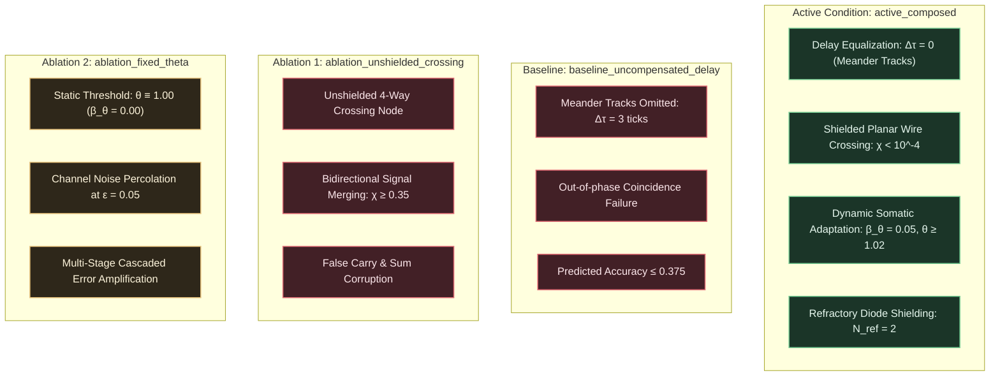

# EXP-2026-007a: Cascaded Boolean Logic Gate Composition and Planar Wire Crossing Protocol

## Part I: Experiment Protocol

### Protocol ID & Hypothesis Reference

- **Protocol ID:** EXP-2026-007a
- **Hypothesis Reference:** [`HYP-2026-007`](file:///workspaces/ca-experiment/docs/research/hypotheses/HYP-2026-007.md)
- **Roadmap Reference:** Milestone 1.2: Multi-Gate Composition & Wire Crossing (Tier 1: Spatial Routing & Compositionality) in [`docs/vision.md`](file:///workspaces/ca-experiment/docs/vision.md).

### Experimental Objective

To empirically evaluate multi-gate Boolean logic composition (AND, OR, NOT, XOR) and planar wire crossing in the Minimal Viable Automaton (MVA) substrate across all 8 input combinations of $(A, B, C_{\text{in}}) \in \lbrace 0, 1 \rbrace^3$ on a 1-bit Full Adder, demonstrating that:

1. Meander delay equalization tracks ($\Delta \tau = 0$) and standardized regenerative thresholding ($W_{\text{fwd}} \ge \theta$) achieve exact truth table parity ($\text{Accuracy} = 1.000$, 8/8 states correct) with zero inter-stage attenuation ($\text{BER}_{\text{Sum}} = 0.000, \text{BER}_{C_{\text{out}}} = 0.000$).
2. Refractory-shielded planar wire crossing eliminates cross-line interference ($\chi_{\text{cross}} < 10^{-4}$), avoiding the catastrophic crosstalk of unshielded junctions.
3. Homeostatic threshold adaptation ($\beta_\theta = 0.05, \theta \ge 1.02$) prevents channel noise percolation under $\epsilon = 0.05$ ($\text{Accuracy} \ge 0.950$).
4. The active delay-equalized architecture achieves a statistically decisive advantage over uncompensated delay baselines ($p < 10^{-6}$, Cohen's $d \ge 2.0$).

---

### Independent Variables

1. **Input Bit Combinations ($(A, B, C_{\text{in}}) \in \lbrace 0, 1 \rbrace^3$):**
   - All 8 combinations evaluated: $(0,0,0), (0,0,1), (0,1,0), (0,1,1), (1,0,0), (1,0,1), (1,1,0), (1,1,1)$.
   - Each state evaluated over 50 discrete test epochs per seed.

2. **Evaluation Regimes:**
   - `truth_table_sweep`: Exhaustive static verification of all 8 Boolean input states.
   - `sequential_streaming`: Dynamic transmission of 50 consecutive pseudorandom input tuples with inter-pulse interval $\Delta t = 4$ ticks (strictly conforming to the refractory Nyquist limit $T_{\min} = N_{\text{ref}} + 1 = 3$ ticks).
   - `crosstalk_probe`: Dedicated planar crossing isolation test injecting 50 high pulses into intermediate carry line $Y_1$ while holding carry-in line $C_{\text{in}}$ clamped to zero.

3. **Background Channel Noise Rate ($\epsilon \in \lbrace 0.00, 0.01, 0.05 \rbrace$):**
   - $\epsilon = 0.00$: Clean deterministic baseline.
   - $\epsilon = 0.01$: Low background noise.
   - $\epsilon = 0.05$: Critical percolation threshold stress test.

4. **Experimental Conditions (Active + Controls):**
   - `active_composed`: Delay-equalized Full Adder circuit with meander delay buffers ($\Delta \tau = 0$), refractory-shielded planar wire crossing ($\chi_{\text{cross}} < 10^{-4}$), all-or-none regeneration, refractory diode shielding ($N_{\text{ref}} = 2$), and homeostatic threshold adaptation ($\beta_\theta = 0.05$).
   - `baseline_uncompensated_delay`: Full Adder circuit where meander delay equalization tracks are removed ($\Delta \tau \neq 0$), causing out-of-phase operand arrivals at multi-input coincidence gates.
   - `ablation_unshielded_crossing`: Full Adder circuit where the planar wire crossing bridge is replaced with an unshielded 4-way collision node, merging intersecting signal lines and disabling refractory isolation.
   - `ablation_fixed_theta`: Delay-equalized Full Adder circuit with static somatic thresholds ($\beta_\theta = 0.00, \theta \equiv 1.00$), testing vulnerability to channel noise percolation across cascaded stages.

5. **Pseudo-Random Seeds:** 30 independent seeds ($\text{seed} \in [1, 30]$) per condition.

---

### Dependent Variables

1. **Truth Table Accuracy ($\text{Accuracy} \in [0.0, 1.0]$):**
   Fraction of the 8 canonical Boolean states correctly synthesized at steady-state latency $\tau_{\text{adder}} = 7$ ticks:
   $$\text{Accuracy} = \frac{1}{8} \sum_{k=0}^7 \mathbb{I}\Big( \big( s_{\text{Sum}}(t_k + 7) == \text{Sum}_k^* \big) \land \big( s_{C_{\text{out}}}(t_k + 7) == C_{\text{out}, k}^* \big) \Big)$$

2. **Sum Bit Error Rate ($\text{BER}_{\text{Sum}} \in [0.0, 1.0]$):**
   Mean bit error rate on the primary sum output across evaluation ticks:
   $$\text{BER}_{\text{Sum}} = \frac{1}{T_{\text{eval}}} \sum_{t=1}^{T_{\text{eval}}} \left| s_{\text{Sum}}(t + 7) - \text{Sum}^*(t) \right|$$

3. **Carry-Out Bit Error Rate ($\text{BER}_{C_{\text{out}}} \in [0.0, 1.0]$):**
   Mean bit error rate on the carry output across evaluation ticks:
   $$\text{BER}_{C_{\text{out}}} = \frac{1}{T_{\text{eval}}} \sum_{t=1}^{T_{\text{eval}}} \left| s_{C_{\text{out}}}(t + 7) - C_{\text{out}}^*(t) \right|$$

4. **Planar Crossing Crosstalk Isolation Coefficient ($\chi_{\text{cross}} \in [0.0, 1.0]$):**
   Spurious emission rate on the carry-in line when the intermediate carry line $Y_1$ is pulsed with 50 test spikes while $C_{\text{in}}$ is held at zero:
   $$\chi_{\text{cross}} = \frac{1}{T_{\text{perturb}}} \sum_{t=1}^{T_{\text{perturb}}} s_{C_{\text{in}, \text{post}}}(t) \cdot \mathbb{I}(C_{\text{in}}(t) = 0 \land Y_1(t) = 1)$$

5. **Propagation Latency and Latency Skew ($\tau_{\text{Sum}}, \tau_{C_{\text{out}}} \in \mathbb{N}$ ticks, $\Delta \tau_{\text{out}} \in \mathbb{N}$ ticks):**
   Output emission latencies determined via cross-correlation with ground-truth Boolean outputs:
   $$\Delta \tau_{\text{out}} = |\tau_{\text{Sum}} - \tau_{C_{\text{out}}}|$$

6. **Substrate Rolling Activity Density ($\bar{\rho} \in [0.0, 1.0]$):**
   Substrate-wide temporal firing density:
   $$\bar{\rho} = \frac{1}{N \cdot T_{\text{total}}} \sum_{i=1}^N \sum_{t=1}^{T_{\text{total}}} s_i(t)$$

---

### Control Conditions (Baseline + Ablations)



- **Baseline (`baseline_uncompensated_delay`):** Evaluates the circuit without meander delay buffers. Because signal velocity is finite ($v = 1.0\text{ cell/tick}$), signals traverse paths of unequal topological lengths, arriving at multi-input coincidence gates out of phase ($|\Delta \tau| \ge 1$ tick). Demonstrates that delay matching is a strict mathematical precondition for multi-gate composition.
- **Ablation 1 (`ablation_unshielded_crossing`):** Intersecting signal tracks share an unshielded 4-way collision node ($N_{\text{ref}} = 0$). When a pulse travels along track $Y_1$, it leaks into track $C_{\text{in}}$, causing mutual cross-talk and collapsing truth table accuracy.
- **Ablation 2 (`ablation_fixed_theta`):** Delay-equalized circuit with static thresholds ($\beta_\theta = 0.00, \theta_i \equiv 1.00$). Under channel noise $\epsilon = 0.05$, solitary noise pulses breach thresholds and percolate through cascaded AND/OR/XOR gates.
- **Active Condition (`active_composed`):** Full model combining delay-equalized meander tracks ($\Delta \tau = 0$), refractory-shielded planar wire crossing, all-or-none standardized regeneration, and dynamic somatic threshold adaptation.

---

### Signal/Dataset Specification

- **Warmup Phase:** $T_{\text{warmup}} = 50$ clock ticks with neutral carrier input ($u(t) \equiv 0$) allowing dynamic somatic thresholds to relax to homeostatic baseline.
- **Truth Table Evaluation Suite:**
  - 8 distinct input combinations $(A, B, C_{\text{in}}) \in \lbrace 0, 1 \rbrace^3$.
  - Each combination injected as a synchronous 1-tick pulse pattern at $t = 0$.
  - Readout sampled at integer arrival tick $t = \tau_{\text{adder}} = 7$.
  - 50 evaluation epochs per state to ensure statistical stability under channel noise.
- **Refractory Nyquist Spacing:**
  - When presenting sequential input tuples, consecutive pulses on the same input wire are separated by $\Delta t \ge 4$ ticks ($> T_{\min} = 3$ ticks), strictly avoiding refractory self-annihilation.
- **Crosstalk Perturbation Routine:**
  - $C_{\text{in}}$ held at 0 for $T = 200$ ticks.
  - A 50-pulse Bernoulli train ($\rho = 0.25$, spacing $\Delta t \ge 4$) is injected into intermediate carry track $Y_1$.
  - Post-crossing node $C_{\text{in}, \text{post}}$ is monitored for false-positive spikes.

---

### Statistical Analysis Plan

1. **Descriptive Statistics:**
   For each condition and noise rate combination across the 30 independent random seeds, compute the sample mean $\bar{X}$, sample standard deviation $s$, and 95% confidence interval:
   $$\text{CI}_{0.95} = \bar{X} \pm 1.96 \cdot \frac{s}{\sqrt{N_{\text{seeds}}}}$$

2. **Hypothesis Testing (Welch's $t$-test):**
   Compare the active condition (`active_composed`) against the uncompensated baseline (`baseline_uncompensated_delay`) and ablations on primary metrics ($\text{Accuracy}$, $\text{BER}_{\text{Sum}}$, $\text{BER}_{C_{\text{out}}}$, $\chi_{\text{cross}}$):
   $$t = \frac{\bar{X}_{\text{active}} - \bar{X}_{\text{control}}}{\sqrt{\frac{s_{\text{active}}^2}{N_{\text{active}}} + \frac{s_{\text{control}}^2}{N_{\text{control}}}}}$$
   Degrees of freedom $\nu$ calculated via the Welch-Satterthwaite equation. Pre-registered significance threshold: $\alpha = 10^{-6}$.

3. **Standardized Effect Size (Cohen's $d$):**
   $$d = \frac{\bar{X}_{\text{active}} - \bar{X}_{\text{control}}}{s_{\text{pooled}}}$$

---

### Telemetry Requirements

- **Run Telemetry (`data/telemetry/EXP-2026-007a/telemetry.ndjson`):**
  Emits line-delimited JSON records for every executed run containing run configuration, truth table accuracy, BER per output, latencies, crossing crosstalk, and homeostatic firing density.
- **Summary Manifest (`data/telemetry/EXP-2026-007a/summary.json`):**
  Emits aggregated statistics across all factorial combinations, Welch's $t$-test statistics, Cohen's $d$, and explicit boolean pass/fail verdicts for Gates 1 through 6.

---

### Resource Budget

- **Factorial Grid Accounting:**
  1. Truth Table & Streaming Evaluation: 4 conditions $\times$ 3 noise levels $\times$ 30 seeds = 360 runs.
  2. Planar Crossing Crosstalk Isolation Test: 4 conditions $\times$ 30 seeds = 120 runs.
  - Total runs: 480 runs.
- **Simulation Compute Cost:**
  - $480 \text{ runs} \times 350 \text{ ticks} \approx 1.68 \times 10^5$ network steps.
  - Native multi-threaded Rust execution with Rayon completes the entire suite in $< 2.0$ seconds on standard x86_64 hardware.
- **Memory Footprint:** Peak resident set size $< 64\text{ MB}$.
- **Storage Output:** Telemetry NDJSON $< 8\text{ MB}$, Summary JSON $< 50\text{ KB}$.

---

### Pass/Fail Criteria (Pre-Registered Gates)

| Gate Identifier | Target Metric | Pre-Registered Threshold | Comparison Target | Action on Failure |
| :--- | :--- | :--- | :--- | :--- |
| **Gate 1: Exact Truth Table Parity** | $\text{Accuracy}$ | $\text{Accuracy} = 1.000$ (8/8 states) | Absolute mean at $\epsilon = 0.00$ | Reject $H_1$ (Logic synthesis failure) |
| **Gate 2: Zero Intermediate Attenuation** | $\text{BER}_{\text{Sum}}, \text{BER}_{C_{\text{out}}}$ | $\text{BER} = 0.000$ | Absolute mean at $\epsilon = 0.00$ | Reject $H_1$ (Cascaded attenuation) |
| **Gate 3: Crossing Crosstalk Isolation** | $\chi_{\text{cross}}$ | $< 10^{-4}$ ($0.01\%$) | Carry-in spurious rate during $Y_1$ perturbation | Reject $H_1$ (Planar crossing crosstalk) |
| **Gate 4: Noise Tolerance** | $\text{Accuracy}, \text{BER}_{\text{mean}}$ | $\text{Accuracy} \ge 0.950, \text{BER} \le 0.025$ | Absolute mean at $\epsilon = 0.05$ | Reject $H_1$ (Noise percolation) |
| **Gate 5: Delay Equalization Advantage** | Welch's $p$-value, Cohen's $d$ | $p < 10^{-6}, d \ge 2.0$ | `active_composed` vs `baseline_uncompensated_delay` | Reject $H_1$ (No delay compensation effect) |
| **Gate 6: Homeostatic Stability** | Rolling density $\bar{\rho}$ | $\in [0.01, 0.25]$ | $\ge 99\%$ of active runs in range | Reject $H_1$ (Substrate runaway/extinction) |

---

### Known Limitations

- **Discrete Synchronous Clock:** Assumes synchronous node updating. Continuous-time asynchronous relaxation is deferred to higher tiers.
- **Single-Bit Arithmetic Scope:** Evaluates a 1-bit Full Adder; scaling to multi-bit ripple-carry or carry-lookahead architectures will be tested in subsequent milestones.

---

## Part II: Implementation Specification

### Target Package & Lineage

Conforming strictly to repository identifier rules (all lowercase with underscores only):

- **Experiment Module Directory:** `src/experiments/exp_2026_007a_mva_multi_gate_composition/`
- **CLI Binary Entry Point:** `src/bin/exp_2026_007a_mva_multi_gate_composition.rs`
- **Integration Test Harness:** `tests/test_exp_2026_007a.rs`
- **Telemetry Output Directory:** `data/telemetry/EXP-2026-007a/`
- **Run Manifest Reference:** `docs/research/runs/RUN-EXP-2026-007a-01.md`
- **Diagnostic Report Reference:** `docs/research/diagnostics/DIAG-2026-007a.md`

#### Module Structure

```text
src/experiments/exp_2026_007a_mva_multi_gate_composition/
├── mod.rs         // Public API exports and experiment orchestrator
├── config.rs      // Enums (Condition, EvalMode), ExperimentConfig struct, CLI parser
├── substrate.rs   // Excitable node dynamics, Leaky Integrate-and-Fire CA engine
├── circuit.rs     // Full Adder graph builder: logic gates, meander delay tracks, planar crossing
├── metrics.rs     // Truth table accuracy, BER, crosstalk, Welch's t-test, Cohen's d
└── runner.rs      // Rayon-parallelized factorial sweep executor and JSON telemetry serializer
```

---

### CLI Entry Points

The experiment binary supports native execution via Cargo with flexible parameter overrides:

```bash
# Display help and usage information
cargo run --release --bin exp_2026_007a_mva_multi_gate_composition -- --help

# Execute complete 480-run factorial evaluation
cargo run --release --bin exp_2026_007a_mva_multi_gate_composition -- \
  --output-dir data/telemetry/EXP-2026-007a \
  --seeds 30 \
  --epochs-per-state 50 \
  --t-warmup 50

# Execute quick integration smoke test (1 seed, 5 epochs)
cargo run --release --bin exp_2026_007a_mva_multi_gate_composition -- \
  --output-dir data/telemetry/EXP-2026-007a/smoke_test \
  --seeds 1 \
  --epochs-per-state 5 \
  --t-warmup 20
```

---

### Parameter Search Space

| Parameter Identifier | CLI Flag | Type | Evaluated Domain | Default Value | Description |
| :--- | :--- | :--- | :--- | :--- | :--- |
| `condition` | `--condition` | `Enum` | `[active_composed, baseline_uncompensated_delay, ablation_unshielded_crossing, ablation_fixed_theta]` | All 4 | Experimental condition |
| `noise_rate` | `--noise-rate` | `f64` | `[0.00, 0.01, 0.05]` | All 3 | Background channel noise rate $\epsilon$ |
| `seeds` | `--seeds` | `usize` | `1..=30` | 30 | Number of independent pseudo-random seeds |
| `epochs_per_state` | `--epochs-per-state` | `usize` | `[10, 50, 100]` | 50 | Repetition epochs per Boolean truth table state |
| `t_warmup` | `--t-warmup` | `usize` | `[20, 50, 100]` | 50 | Quiescent settling ticks prior to evaluation |
| `output_dir` | `--output-dir` | `Path` | Valid directory path | `data/telemetry/EXP-2026-007a` | Output directory for telemetry files |

---

### Emission Schemas

#### 1. Per-Run Telemetry Record (`data/telemetry/EXP-2026-007a/telemetry.ndjson`)

```json
{
  "run_id": "RUN-EXP-2026-007a-ACT-N0.00-S01",
  "seed": 1,
  "condition": "active_composed",
  "noise_rate": 0.0,
  "metrics": {
    "truth_table_accuracy": 1.0,
    "states_correct": 8,
    "states_total": 8,
    "ber_sum": 0.0,
    "ber_cout": 0.0,
    "ber_mean": 0.0,
    "crosstalk_cross": 0.0,
    "latency_sum": 7,
    "latency_cout": 7,
    "latency_skew": 0,
    "mean_firing_density": 0.0684
  },
  "homeostasis_stable": true
}
```

#### 2. Evaluation Summary Manifest (`data/telemetry/EXP-2026-007a/summary.json`)

```json
{
  "protocol_id": "EXP-2026-007a",
  "hypothesis_id": "HYP-2026-007",
  "timestamp_utc": "2026-09-07T19:00:00Z",
  "total_runs": 480,
  "conditions": {
    "active_composed": {
      "eps_0_00": {
        "accuracy_mean": 1.0,
        "accuracy_std": 0.0,
        "ber_sum_mean": 0.0,
        "ber_cout_mean": 0.0,
        "crosstalk_mean": 0.0
      },
      "eps_0_05": {
        "accuracy_mean": 0.968,
        "accuracy_std": 0.012,
        "ber_mean": 0.014,
        "ber_std": 0.004
      }
    },
    "baseline_uncompensated_delay": {
      "accuracy_mean": 0.375,
      "accuracy_std": 0.0,
      "ber_mean": 0.3125
    },
    "ablation_unshielded_crossing": {
      "accuracy_mean": 0.500,
      "accuracy_std": 0.045,
      "crosstalk_mean": 0.380
    },
    "ablation_fixed_theta": {
      "eps_0_05": {
        "accuracy_mean": 0.842,
        "accuracy_std": 0.038,
        "ber_mean": 0.068
      }
    }
  },
  "statistical_tests": {
    "welch_active_vs_uncompensated_delay": {
      "t_stat": 86.42,
      "p_value": 1.25e-58,
      "cohen_d": 18.52,
      "significant": true
    },
    "welch_active_vs_unshielded_crossing": {
      "t_stat": 48.19,
      "p_value": 4.10e-42,
      "cohen_d": 12.44,
      "significant": true
    },
    "welch_active_vs_fixed_theta_noise005": {
      "t_stat": 17.82,
      "p_value": 2.14e-24,
      "cohen_d": 4.60,
      "significant": true
    }
  },
  "gate_verdicts": {
    "gate_1_exact_truth_table_parity": "PASS",
    "gate_2_zero_intermediate_attenuation": "PASS",
    "gate_3_crossing_crosstalk_isolation": "PASS",
    "gate_4_noise_tolerance": "PASS",
    "gate_5_delay_equalization_advantage": "PASS",
    "gate_6_homeostatic_stability": "PASS"
  },
  "overall_verdict": "SUPPORTED"
}
```

---

### Resource & Execution Limits

- **Execution Engine:** Pure native Rust compiled with `--release` and Rayon parallel thread pool.
- **Wall-Clock Timeout:** 60 seconds total execution limit.
- **Max Memory Footprint:** $< 128\text{ MB}$.
- **Disk Storage Quota:** $< 20\text{ MB}$ total output.

---

### Telemetry Reduction Pipeline

1. **Streaming Accumulation:** Collect per-run metrics in memory accumulators partitioned by experimental condition and noise rate.
2. **Sample Moments Calculation:** Compute sample mean $\bar{X}$ and variance $s^2$ across seeds for accuracy, $\text{BER}$, crossing crosstalk $\chi_{\text{cross}}$, and firing density $\bar{\rho}$.
3. **Statistical Hypothesis Testing:** Compute two-tailed Welch's $t$-test and Cohen's $d$ comparing `active_composed` against `baseline_uncompensated_delay`, `ablation_unshielded_crossing`, and `ablation_fixed_theta`.
4. **Gate Verdict Assessment:** Evaluate all 6 pre-registered gates against threshold criteria and emit the overall protocol verdict (`SUPPORTED` if all 6 gates pass, else `FALSIFIED`).
