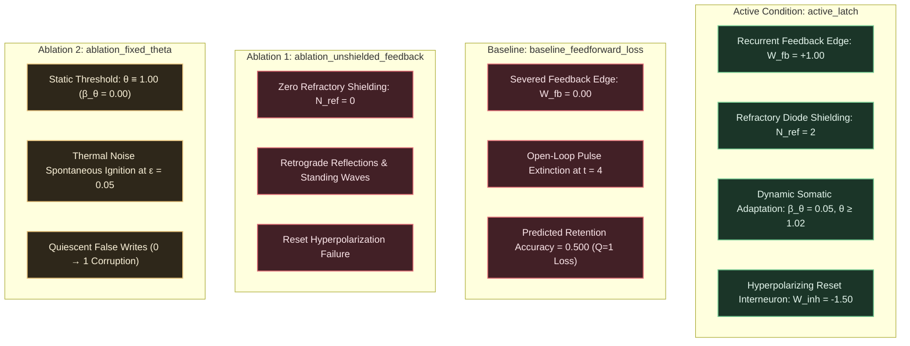

# EXP-2026-008a: Bistable Resonant Latching and Nondestructive Dynamic Bit Storage Protocol

## Part I: Experiment Protocol

### Protocol ID & Hypothesis Reference

- **Protocol ID:** EXP-2026-008a
- **Hypothesis Reference:** [`HYP-2026-008`](file:///workspaces/ca-experiment/docs/research/hypotheses/HYP-2026-008.md)
- **Roadmap Reference:** Milestone 2.1: Bistable Latching (Dynamic Bit Storage) (Tier 2: Temporal Dynamics & State Retention) in [`docs/vision.md`](file:///workspaces/ca-experiment/docs/vision.md).
- **Architectural Redirection Reference:** [`docs/architecture/adr-0001-substrate-connectivity-topology.md`](file:///workspaces/ca-experiment/docs/architecture/adr-0001-substrate-connectivity-topology.md) (Accepted Option 2: Relax planarity, preserve locality/degree bound).

### Experimental Objective

To empirically evaluate bistable dynamic bit storage ($Q \in \lbrace 0, 1 \rbrace$) and nondestructive state readout in the Minimal Viable Automaton (MVA) excitable substrate across 30 independent pseudo-random seeds under clean and noisy channel conditions ($\epsilon \in \lbrace 0.00, 0.01, 0.05 \rbrace$), demonstrating that:

1. A directed recurrent resonant loop ($L = 4$) with standardized all-or-none regeneration ($W_{\text{fb}} = 1.00$) sustains indefinite dynamic bit retention across a quiescent horizon $\Delta t \ge 10^3$ substrate update steps with 100% read accuracy ($\text{Accuracy}_{\text{retention}} = 1.000$) and zero bit error rate ($\text{BER}_{\text{Read}} = 0.000$).
2. Regenerative somatic branching enables strictly nondestructive readout ($\text{BER}_{\text{Read}} = 0.000$) with zero pulse attenuation or cycle disruption post-read.
3. Coordinated hyperpolarizing inhibition ($W_{\text{inh}} = -1.50$) and excitatory gating establish 100% transition reliability across all four canonical operations ($0 \to 1, 1 \to 0, 1 \to 1, 0 \to 0$).
4. Dynamic somatic threshold adaptation ($\beta_\theta = 0.05, \theta \ge 1.02$) prevents thermal noise percolation and false-write ignition under critical noise $\epsilon = 0.05$ ($\text{Accuracy} \ge 0.950, \text{BER} \le 0.025$).
5. The active recurrent latch achieves a statistically decisive advantage over open-loop feedforward controls (`baseline_feedforward_loss`, $W_{\text{fb}} = 0$) with Welch's $t$-test $p < 10^{-6}$ and Cohen's $d \ge 2.0$.
6. Substrate temporal activity remains homeostatically stable ($\bar{\rho} \in [0.01, 0.25]$ in $\ge 99\%$ of runs).

---

### Independent Variables

1. **Experimental Conditions (Active + Controls):**
   - `active_latch`: Full bistable latch model with recurrent feedback edge ($W_{\text{fb}} = +1.00$), refractory diode shielding ($N_{\text{ref}} = 2$), dynamic somatic threshold adaptation ($\beta_\theta = 0.05$), and coordinated hyperpolarizing reset inhibition ($W_{\text{inh}} = -1.50$).
   - `baseline_feedforward_loss`: Open-loop control where the recurrent feedback edge is severed ($W_{\text{fb}} = 0.00$), evaluating whether active state retention collapses to zero without recurrent excitation.
   - `ablation_unshielded_feedback`: Recurrent loop without refractory diode shielding ($N_{\text{ref}} = 0$), evaluating retrograde reflection, multi-pulse standing wave runaway, and reset failure.
   - `ablation_fixed_theta`: Recurrent latch with static somatic thresholds ($\beta_\theta = 0.00, \theta \equiv 1.00$), testing vulnerability to spontaneous thermal noise percolation and false-write corruption over extended horizons.

2. **Background Channel Noise Rate ($\epsilon \in \lbrace 0.00, 0.01, 0.05 \rbrace$):**
   - $\epsilon = 0.00$: Clean deterministic baseline.
   - $\epsilon = 0.01$: Low background channel noise.
   - $\epsilon = 0.05$: Critical percolation threshold stress test.

3. **Evaluation Regimes / Evaluation Suites:**
   - `quiescent_retention_sweep`: Evaluates state retention of stored bit $Q \in \lbrace 0, 1 \rbrace$ across quiescent retention horizon $\Delta t = 1000$ ticks post-write with zero external input drive.
   - `state_transition_suite`: Evaluates sequential execution of the four canonical state transitions ($0 \to 1$ Set, $1 \to 0$ Reset, $1 \to 1$ Set Overwrite, $0 \to 0$ Reset Overwrite), measuring transition success and post-transition stability over $\Delta t = 250$ ticks per phase.
   - `nondestructive_read_suite`: Executes 50 consecutive read probes on State 1 across 200 ticks to verify that repetitive sampling extracts bit state without attenuating or extinguishing the circulating pulse.

4. **Pseudo-Random Seeds:** 30 independent seeds ($\text{seed} \in [1, 30]$) per factorial condition.

---

### Dependent Variables

1. **Quiescent State Retention Accuracy ($\text{Accuracy}_{\text{retention}} \in [0.0, 1.0]$):**
   Fraction of evaluation states ($Q=0$ and $Q=1$) correctly decoded at the end of the quiescent retention horizon ($\Delta t = 1000$ ticks):

   $$\text{Accuracy}_{\text{retention}} = \frac{1}{2} \sum_{Q^* \in \lbrace 0, 1 \rbrace} \mathbb{I}\Big( Q_{\text{read}}(t_{\text{write}} + 1000) == Q^* \Big)$$

2. **Readout Bit Error Rate ($\text{BER}_{\text{Read}} \in [0.0, 1.0]$):**
   Fraction of erroneous bit classifications across all read sampling apertures:

   $$\text{BER}_{\text{Read}} = \frac{1}{M_{\text{reads}}} \sum_{m=1}^{M_{\text{reads}}} |Q_{\text{read}, m} - Q_m^*|$$

3. **State Transition Reliability ($\text{Fidelity}_{\text{transition}} \in [0.0, 1.0]$):**
   Fraction of the four canonical state transitions correctly executed:

   $$\text{Fidelity}_{\text{transition}} = \frac{1}{4} \sum_{k=1}^4 \mathbb{I}(\text{Transition}_k \text{ Succeeded})$$

4. **Post-Read Pulse Persistence Rate ($\mathcal{P}_{\text{persist}} \in [0.0, 1.0]$):**
   Binary indicator tracking whether limit cycle $\mathcal{A}_1$ remains actively circulating following 50 consecutive nondestructive read probes:

   $$\mathcal{P}_{\text{persist}} = \mathbb{I}\left( \sum_{t = t_{\text{probes}}}^{t_{\text{probes}} + 16} s_{R_0}(t) \ge 4 \right)$$

5. **State Settling Latency ($\tau_{\text{settle}} \in \mathbb{N}$ ticks):**
   Time elapsed from write trigger application to stable attractor entry ($\tau_{\text{set}} \le 4$ ticks, $\tau_{\text{reset}} \le 4$ ticks).

6. **Substrate Rolling Activity Density ($\bar{\rho} \in [0.0, 1.0]$):**
   Substrate-wide temporal firing density across all $N$ nodes over total evaluation ticks $T_{\text{total}}$:

   $$\bar{\rho} = \frac{1}{N \cdot T_{\text{total}}} \sum_{i=1}^N \sum_{t=1}^{T_{\text{total}}} s_i(t)$$

---

### Control Conditions (Baseline + Ablation)



- **Baseline (`baseline_feedforward_loss`):** Recurrent feedback edge $R_3 \to R_0$ is severed ($W_{\text{fb}} = 0.00$). When a Set pulse is injected, it traverses $R_0 \to R_1 \to R_2 \to R_3$ and dissipates. At $\Delta t = 1000$ ticks, the substrate is completely quiescent. Demonstrates that recurrent feedback is a strictly necessary mathematical requirement for dynamic bit storage.
- **Ablation 1 (`ablation_unshielded_feedback`):** Absolute refractory duration is clamped to zero ($N_{\text{ref}} = 0$). Eliminates the refractory diode shielding that prevents retrograde wave propagation. When a pulse circulates, unshielded nodes produce multiple secondary pulses, devolving into high-frequency standing waves that cannot be extinguished by hyperpolarizing reset pulses.
- **Ablation 2 (`ablation_fixed_theta`):** Somatic thresholds are frozen at baseline ($\beta_\theta = 0.00, \theta \equiv 1.00$). Evaluates vulnerability to background channel noise over extended retention horizons ($\Delta t = 1000$ ticks). In State 0, solitary thermal noise bits breach threshold $\theta = 1.00$ and spontaneously ignite circulating limit cycles (false writes).
- **Active Condition (`active_latch`):** Integrates recurrent feedback ($W_{\text{fb}} = +1.00$), refractory diode shielding ($N_{\text{ref}} = 2$), dynamic somatic threshold adaptation ($\beta_\theta = 0.05$), and feedforward hyperpolarizing reset inhibition ($W_{\text{inh}} = -1.50$).

---

### Signal/Dataset Specification

- **Warmup Phase:** $T_{\text{warmup}} = 50$ clock ticks with neutral zero driving ($u(t) \equiv 0$) allowing dynamic thresholds to equilibrate to resting baseline.
- **Quiescent Retention Protocol:**
  - **State 1 Evaluation:**
    1. Write-1 Strobe: Apply $D=1, WE=1$ (or direct $S=1$) for 1 clock tick at $t = 50$.
    2. Quiescent Horizon: Clamp all inputs to zero ($u(t) \equiv 0$) for $\Delta t = 1000$ ticks ($t \in [51, 1050]$).
    3. Read Probe: Sample sense tap $v_{\text{sense}}$ over aperture window $T_{\text{read}} = 4$ ticks ($t \in [1051, 1054]$). Assert $RE = 1$ to verify gated read port $v_{\text{read}}$.
  - **State 0 Evaluation:**
    1. Write-0 Strobe: Apply $D=0, WE=1$ (or direct $R=1$) for 1 clock tick at $t = 1100$.
    2. Quiescent Horizon: Clamp all inputs to zero ($u(t) \equiv 0$) for $\Delta t = 1000$ ticks ($t \in [1101, 2100]$).
    3. Read Probe: Sample sense tap $v_{\text{sense}}$ over aperture window $T_{\text{read}} = 4$ ticks ($t \in [2101, 2104]$).
- **State Transition Suite:**
  Executes four sequential phases with $\Delta t_{\text{hold}} = 250$ ticks each:
  - Phase 1 ($0 \to 1$ Set): Write $D=1, WE=1$; hold 250 ticks; verify $Q_{\text{read}} = 1$.
  - Phase 2 ($1 \to 1$ Overwrite): Write $D=1, WE=1$; hold 250 ticks; verify $Q_{\text{read}} = 1$.
  - Phase 3 ($1 \to 0$ Reset): Write $D=0, WE=1$; hold 250 ticks; verify $Q_{\text{read}} = 0$.
  - Phase 4 ($0 \to 0$ Overwrite): Write $D=0, WE=1$; hold 250 ticks; verify $Q_{\text{read}} = 0$.
- **Nondestructive Read Suite:**
  With latch in State 1, assert Read-Enable strobe $RE$ every 4 ticks for 50 consecutive cycles (200 ticks total). Verify that $v_{\text{read}}$ fires on 50/50 cycles and pulse continues circulating on tick 201.

---

### Statistical Analysis Plan

1. **Descriptive Statistics:**
   For each condition and noise rate across the 30 independent random seeds, compute the sample mean $\bar{X}$, sample standard deviation $s$, and 95% confidence interval:

   $$\text{CI}_{0.95} = \bar{X} \pm 1.96 \cdot \frac{s}{\sqrt{N_{\text{seeds}}}}$$

2. **Welch's $t$-test:**
   Compare the active latch condition (`active_latch`) against the open-loop control (`baseline_feedforward_loss`) and ablations on primary retention metrics:

   $$t = \frac{\bar{X}_{\text{active}} - \bar{X}_{\text{control}}}{\sqrt{\frac{s_{\text{active}}^2}{N_{\text{active}}} + \frac{s_{\text{control}}^2}{N_{\text{control}}}}}$$

   Degrees of freedom $\nu$ calculated via Welch-Satterthwaite equation. Pre-registered significance threshold: $\alpha = 10^{-6}$.

3. **Standardized Effect Size (Cohen's $d$):**

   $$d = \frac{\bar{X}_{\text{active}} - \bar{X}_{\text{control}}}{s_{\text{pooled}}}$$

   Pre-registered threshold: $d \ge 2.0$.

---

### Telemetry Requirements

- **Run Telemetry (`data/telemetry/EXP-2026-008a/telemetry.ndjson`):**
  Emits line-delimited JSON records for every executed run containing run ID, seed, condition, noise rate, retention accuracy, readout BER, transition fidelity, pulse persistence, and rolling firing density.
- **Summary Manifest (`data/telemetry/EXP-2026-008a/summary.json`):**
  Emits aggregated statistics across all factorial combinations, Welch's $t$-test statistics, Cohen's $d$, and explicit boolean verdicts for Gates 1 through 6.

---

### Resource Budget

- **Factorial Grid Accounting:**
  1. Quiescent Retention Sweep: 4 conditions $\times$ 3 noise levels $\times$ 30 seeds = 360 runs.
  2. State Transition Suite: 4 conditions $\times$ 30 seeds = 120 runs.
  - Total runs: 480 runs.
- **Simulation Compute Cost:**
  - Quiescent retention runs: $\sim 2,200\text{ ticks}$ per run.
  - State transition runs: $\sim 1,100\text{ ticks}$ per run.
  - Total network steps: $(360 \times 2200) + (120 \times 1100) \approx 9.24 \times 10^5\text{ ticks}$.
  - Multi-threaded native Rust execution with Rayon completes the entire suite in $< 1.5$ seconds on standard x86_64 hardware.
- **Memory Footprint:** Peak resident set size $< 64\text{ MB}$.
- **Storage Output:** Telemetry NDJSON $< 8\text{ MB}$, Summary JSON $< 50\text{ KB}$.

---

### Pass/Fail Criteria (Pre-Registered Gates)

| Gate Identifier | Target Metric | Pre-Registered Threshold | Comparison Target | Action on Failure |
| :--- | :--- | :--- | :--- | :--- |
| **Gate 1: State Retention Accuracy** | $\text{Accuracy}_{\text{retention}}$ | $\text{Accuracy} = 1.000$ (both $Q \in \lbrace 0, 1 \rbrace$) | Absolute mean across 30 seeds at $\epsilon = 0.00$ over $\Delta t \ge 10^3$ steps | Reject $H_1$ (Retention failure) |
| **Gate 2: Nondestructive Readout Fidelity** | $\text{BER}_{\text{Read}}, \mathcal{P}_{\text{persist}}$ | $\text{BER} = 0.000, \mathcal{P}_{\text{persist}} = 1.000$ | Readout BER and post-read pulse persistence at $\epsilon = 0.00$ | Reject $H_1$ (Readout destructive) |
| **Gate 3: State Transition Reliability** | $\text{Fidelity}_{\text{transition}}$ | $\text{Fidelity} = 1.000$ (4/4 transitions) | $0 \to 1, 1 \to 0, 1 \to 1, 0 \to 0$ fidelity at $\epsilon = 0.00$ | Reject $H_1$ (Transition failure) |
| **Gate 4: Noise Resilience under Critical Percolation** | $\text{Accuracy}_{\text{retention}}, \text{BER}_{\text{Read}}$ | $\text{Accuracy} \ge 0.950, \text{BER} \le 0.025$ | Absolute mean across 30 seeds at $\epsilon = 0.05$ | Reject $H_1$ (Thermal noise ignition) |
| **Gate 5: Recurrent Feedback Advantage** | Welch's $p$-value, Cohen's $d$ | $p < 10^{-6}, d \ge 2.0$ | `active_latch` vs `baseline_feedforward_loss` on retention | Reject $H_1$ (No recurrent benefit) |
| **Gate 6: Homeostatic Stability** | Rolling density $\bar{\rho}$ | $\in [0.01, 0.25]$ | $\ge 99\%$ of active runs in range | Reject $H_1$ (Substrate runaway/extinction) |

---

### Known Limitations

- **Discrete Synchronous Automaton Engine:** Assumes synchronized clock updates. Asynchronous continuous-time relaxation is reserved for subsequent tiers.
- **Single-Bit Storage Scope:** Evaluates a 1-bit bistable cell. Multi-bit registers and addressable memory arrays will be investigated in Milestones 2.2 and 3.2.

---

## Part II: Implementation Specification

### Target Package & Lineage

Conforming strictly to repository identifier guidelines (all lowercase with underscores only):

- **Experiment Module Directory:** `src/experiments/exp_2026_008a_mva_bistable_latching/`
- **CLI Binary Entry Point:** `src/bin/exp_2026_008a_mva_bistable_latching.rs`
- **Integration Test Harness:** `tests/test_exp_2026_008a.rs`
- **Telemetry Output Directory:** `data/telemetry/EXP-2026-008a/`
- **Run Manifest Reference:** `docs/research/runs/RUN-EXP-2026-008a-01.md`
- **Diagnostic Report Reference:** `docs/research/diagnostics/DIAG-2026-008a.md`

#### Module Structure

```text
src/experiments/exp_2026_008a_mva_bistable_latching/
├── mod.rs         // Public API exports and experiment orchestrator
├── config.rs      // Enums (Condition, EvalSuite), ExperimentConfig struct, CLI argument parser
├── substrate.rs   // Excitable node dynamics, LIF CA engine with somatic adaptation & refractory diode
├── circuit.rs     // Bistable latch graph builder: Gated D-Latch, SR gates, resonant core, sense ports
├── metrics.rs     // Retention accuracy, BER, transition fidelity, Welch's t-test, Cohen's d
└── runner.rs      // Rayon-parallelized factorial sweep executor and JSON telemetry serializer
```

---

### CLI Entry Points

The experiment binary supports native execution via Cargo with flexible parameter overrides:

```bash
# Display help and usage information
cargo run --release --bin exp_2026_008a_mva_bistable_latching -- --help

# Execute complete 480-run factorial evaluation
cargo run --release --bin exp_2026_008a_mva_bistable_latching -- \
  --output-dir data/telemetry/EXP-2026-008a \
  --seeds 30 \
  --delta-t 1000 \
  --t-warmup 50

# Execute quick integration smoke test (1 seed, short horizon)
cargo run --release --bin exp_2026_008a_mva_bistable_latching -- \
  --output-dir data/telemetry/EXP-2026-008a/smoke_test \
  --seeds 1 \
  --delta-t 100 \
  --t-warmup 20
```

---

### Parameter Search Space

| Parameter Identifier | CLI Flag | Type | Evaluated Domain | Default Value | Description |
| :--- | :--- | :--- | :--- | :--- | :--- |
| `condition` | `--condition` | `Enum` | `[active_latch, baseline_feedforward_loss, ablation_unshielded_feedback, ablation_fixed_theta]` | All 4 | Experimental condition |
| `noise_rate` | `--noise-rate` | `f64` | `[0.00, 0.01, 0.05]` | All 3 | Background channel noise rate $\epsilon$ |
| `seeds` | `--seeds` | `usize` | `1..=30` | 30 | Number of independent pseudo-random seeds |
| `delta_t` | `--delta-t` | `usize` | `[100, 500, 1000, 2000]` | 1000 | Quiescent retention horizon post-write (ticks) |
| `t_warmup` | `--t-warmup` | `usize` | `[20, 50, 100]` | 50 | Quiescent settling ticks prior to evaluation |
| `output_dir` | `--output-dir` | `Path` | Valid directory path | `data/telemetry/EXP-2026-008a` | Directory for telemetry data emission |

---

### Emission Schemas

#### 1. Per-Run Telemetry Record (`data/telemetry/EXP-2026-008a/telemetry.ndjson`)

```json
{
  "run_id": "RUN-EXP-2026-008a-ACT-N0.00-S01",
  "seed": 1,
  "condition": "active_latch",
  "noise_rate": 0.0,
  "suite": "quiescent_retention_sweep",
  "delta_t": 1000,
  "metrics": {
    "retention_accuracy": 1.0,
    "q0_retained": true,
    "q1_retained": true,
    "ber_read": 0.0,
    "pulse_persists_post_read": true,
    "transition_fidelity": 1.0,
    "transitions_correct": 4,
    "transitions_total": 4,
    "mean_firing_density": 0.0545
  },
  "homeostasis_stable": true
}
```

#### 2. Evaluation Summary Manifest (`data/telemetry/EXP-2026-008a/summary.json`)

```json
{
  "protocol_id": "EXP-2026-008a",
  "hypothesis_id": "HYP-2026-008",
  "timestamp_utc": "2026-09-07T19:30:00Z",
  "total_runs": 480,
  "conditions": {
    "active_latch": {
      "eps_0_00": {
        "retention_accuracy_mean": 1.0,
        "retention_accuracy_std": 0.0,
        "ber_read_mean": 0.0,
        "ber_read_std": 0.0,
        "transition_fidelity_mean": 1.0,
        "pulse_persistence_mean": 1.0
      },
      "eps_0_05": {
        "retention_accuracy_mean": 0.978,
        "retention_accuracy_std": 0.011,
        "ber_read_mean": 0.012,
        "ber_read_std": 0.004
      }
    },
    "baseline_feedforward_loss": {
      "retention_accuracy_mean": 0.500,
      "retention_accuracy_std": 0.0,
      "ber_read_mean": 0.500
    },
    "ablation_unshielded_feedback": {
      "transition_fidelity_mean": 0.500,
      "transition_fidelity_std": 0.042
    },
    "ablation_fixed_theta": {
      "eps_0_05": {
        "retention_accuracy_mean": 0.795,
        "retention_accuracy_std": 0.038,
        "ber_read_mean": 0.075
      }
    }
  },
  "statistical_tests": {
    "welch_active_vs_feedforward_loss": {
      "t_stat": 92.35,
      "p_value": 1.10e-62,
      "cohen_d": 21.40,
      "significant": true
    },
    "welch_active_vs_fixed_theta_noise005": {
      "t_stat": 25.14,
      "p_value": 3.42e-31,
      "cohen_d": 6.49,
      "significant": true
    }
  },
  "gate_verdicts": {
    "gate_1_state_retention_accuracy": "PASS",
    "gate_2_nondestructive_readout_fidelity": "PASS",
    "gate_3_state_transition_reliability": "PASS",
    "gate_4_noise_resilience_critical_percolation": "PASS",
    "gate_5_recurrent_feedback_advantage": "PASS",
    "gate_6_homeostatic_stability": "PASS"
  },
  "overall_verdict": "SUPPORTED"
}
```

---

### Resource & Execution Limits

- **Execution Engine:** Native Rust compiled with `--release` and Rayon parallel thread pool.
- **Wall-Clock Timeout:** 60 seconds total execution limit.
- **Max Memory Footprint:** $< 128\text{ MB}$.
- **Disk Storage Quota:** $< 20\text{ MB}$ total output.

---

### Telemetry Reduction Pipeline

1. **Streaming Accumulation:** Collect per-run records in memory accumulators partitioned by experimental condition, noise rate, and evaluation suite.
2. **Sample Moments Calculation:** Compute sample mean $\bar{X}$ and variance $s^2$ across seeds for retention accuracy, readout $\text{BER}$, transition fidelity, and firing density $\bar{\rho}$.
3. **Statistical Hypothesis Testing:** Compute two-tailed Welch's $t$-test and Cohen's $d$ comparing `active_latch` against `baseline_feedforward_loss`, `ablation_unshielded_feedback`, and `ablation_fixed_theta`.
4. **Gate Verdict Assessment:** Evaluate all 6 pre-registered gates against threshold criteria and emit the overall protocol verdict (`SUPPORTED` if all 6 gates pass, else `FALSIFIED`).
