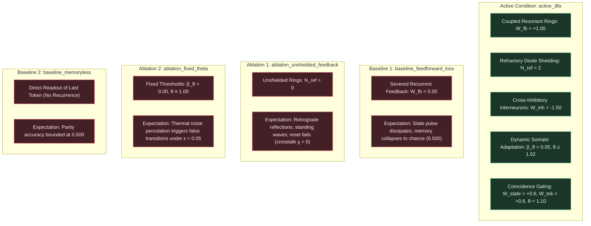

# EXP-2026-009a: Finite State Automata and Regular Language Recognition Protocol

## Part I: Experiment Protocol

### Protocol ID & Hypothesis Reference

- **Protocol ID:** EXP-2026-009a
- **Hypothesis Reference:** [docs/research/hypotheses/HYP-2026-009.md](docs/research/hypotheses/HYP-2026-009.md)
- **Roadmap Reference:** Milestone 2.2: Finite State Automata (Regular Languages) (Tier 2: Temporal Dynamics & State Retention) in [docs/vision.md](docs/vision.md).
- **Architectural Redirection Reference:** [docs/architecture/adr-0001-substrate-connectivity-topology.md](docs/architecture/adr-0001-substrate-connectivity-topology.md) (Accepted Option 2: Relax planarity, preserve locality/degree bound).

### Experimental Objective

To empirically evaluate sequential state tracking and regular grammar recognition in the Minimal Viable Automaton (MVA) excitable substrate across 30 independent pseudo-random seeds under clean baseline and noisy channel conditions ($\epsilon \in \lbrace 0.00, 0.01, 0.05 \rbrace$), demonstrating that:

1. Coupled recurrent resonant attractor loops ($L_{\text{ring}} = 4, W_{\text{fb}} = 1.00$) with coincidence transition gating ($\theta_{\text{gate}} = 1.10$) and cross-inhibitory hyperpolarization ($W_{\text{inh}} = -1.50$) achieve zero sequence classification error ($\text{Accuracy}_{\text{seq}} = 1.000$) on streaming sequences of length $L \in [10, 100]$ tokens under clean conditions ($\epsilon = 0.00$) for both streaming bitstream Parity tracking (2-state DFA) and canonical regular expression recognition (regex $(10)^+1$, 4-state DFA).
2. Individual state transitions $\delta(q_j, \sigma)$ execute with 100% single-token fidelity ($\text{Fidelity}_{\text{trans}} = 1.000$) and strict attractor mutual exclusivity ($\chi_{\text{crosstalk}} = 0.000$, exactly one active ring during settled phases).
3. Dynamic somatic threshold adaptation ($\beta_\theta = 0.05, \theta \ge 1.02$) prevents thermal noise percolation and false-switch ignition under critical channel noise $\epsilon = 0.05$, maintaining $\text{Accuracy}_{\text{seq}} \ge 0.950$ and token readout $\text{BER} \le 0.025$.
4. The active coupled resonant DFA achieves an overwhelming, statistically decisive advantage over open-loop feedforward controls (`baseline_feedforward_loss`, $W_{\text{fb}} = 0.00$) and memoryless controls (`baseline_memoryless`) with Welch's $t$-test $p < 10^{-6}$ and Cohen's $d \ge 2.0$.
5. Substrate temporal firing activity remains homeostatically stable ($\bar{\rho} \in [0.01, 0.25]$ in $\ge 99\%$ of runs).

---

### Independent Variables

1. **Experimental Conditions (Active + Controls):**
   - `active_dfa`: Full coupled resonant DFA architecture with directed recurrent feedback edges ($W_{\text{fb}} = +1.00$), refractory diode shielding ($N_{\text{ref}} = 2$), cross-inhibitory hyperpolarizing interneurons ($W_{\text{inh}} = -1.50$), coincidence transition gates ($\theta_{\text{gate}} = 1.10$), and dynamic somatic threshold adaptation ($\beta_\theta = 0.05, \theta \ge 1.02$).
   - `baseline_feedforward_loss`: Recurrent feedback edges severed in all state rings ($W_{\text{fb}} = 0.00$), evaluating whether state retention collapses to zero without recurrent attractor dynamics.
   - `ablation_unshielded_feedback`: Recurrent rings without refractory diode shielding ($N_{\text{ref}} = 0$), evaluating retrograde wave reflection, standing waves, and cross-state collision.
   - `ablation_fixed_theta`: Static somatic thresholds ($\beta_\theta = 0.00, \theta \equiv 1.00$), testing vulnerability to thermal noise percolation and spurious state transitions over long sequences ($L = 100$).
   - `baseline_memoryless`: Combinational readout of the instantaneous token without temporal state integration, establishing the memoryless performance ceiling.

2. **Background Channel Noise Rate ($\epsilon \in \lbrace 0.00, 0.01, 0.05 \rbrace$):**
   - $\epsilon = 0.00$: Clean deterministic baseline.
   - $\epsilon = 0.01$: Low background channel noise.
   - $\epsilon = 0.05$: Critical percolation threshold stress test.

3. **Streaming Sequence Lengths ($L \in \lbrace 10, 20, 50, 100 \rbrace$ tokens):**
   - Evaluates scalability and stability over increasing context horizons up to $100$ sequential tokens ($1600$ clock ticks per sequence at $T_{\text{token}} = 16$).

4. **Automaton Benchmark Tasks:**
   - `parity_dfa`: 2-state DFA tracking streaming bitstream Even/Odd Parity over arbitrary sequence lengths. State space $Q = \lbrace q_{\text{even}}, q_{\text{odd}} \rbrace$, initial state $q_{\text{even}}$, accepting state $F = \lbrace q_{\text{odd}} \rbrace$. Token `1` toggles state; token `0` maintains current state.
   - `regex_dfa`: 4-state DFA recognizing the canonical regular expression $(10)^+1$ (strings matching $101, 10101, 1010101, \dots$). State space $Q = \lbrace q_0, q_1, q_2, q_3, q_{\text{trap}} \rbrace$, initial state $q_0$, accepting state $F = \lbrace q_3 \rbrace$. Evaluates branching, cyclic loops ($q_2 \xrightarrow{1} q_3 \xrightarrow{0} q_2$), and sink/trap absorption.

5. **Pseudo-Random Seeds:** 30 independent seeds ($\text{seed} \in [1, 30]$) per factorial condition.

---

### Dependent Variables

1. **Streaming Sequence Classification Accuracy ($\text{Accuracy}_{\text{seq}} \in [0.0, 1.0]$):**
   Fraction of evaluation sequences whose final state is correctly classified as accept or reject:

   $$\text{Accuracy}_{\text{seq}} = \frac{1}{M_{\text{seq}}} \sum_{m=1}^{M_{\text{seq}}} \mathbb{I}\left( y_{\text{pred}}^{(m)} == y_{\text{true}}^{(m)} \right)$$

2. **Single-Token Transition Fidelity ($\text{Fidelity}_{\text{trans}} \in [0.0, 1.0]$):**
   Fraction of individual token transitions $\delta(q_j, \sigma)$ that successfully switch the substrate into the correct target attractor orbit:

   $$\text{Fidelity}_{\text{trans}} = \frac{1}{N_{\text{trans}}} \sum_{k=1}^{N_{\text{trans}}} \mathbb{I}\left( q_{\text{settled}}(k) == \delta(q(k-1), \sigma_k) \right)$$

3. **Attractor Crosstalk Rate ($\chi_{\text{crosstalk}} \in [0.0, 1.0]$):**
   Fraction of settled clock ticks in which more than one state ring is concurrently active (violation of mutual exclusivity):

   $$\chi_{\text{crosstalk}} = \frac{1}{T_{\text{settled}}} \sum_{t \in \mathcal{T}_{\text{settled}}} \mathbb{I}\left( \sum_{j=0}^{m-1} \mathbb{I}(\mathcal{R}_j \text{ active at } t) > 1 \right)$$

4. **Token Readout Bit Error Rate ($\text{BER} \in [0.0, 1.0]$):**
   Fraction of erroneous bit classifications across all token evaluation windows:

   $$\text{BER} = \frac{1}{M_{\text{probes}}} \sum_{m=1}^{M_{\text{probes}}} |y_{\text{read}}^{(m)} - y_{\text{target}}^{(m)}|$$

5. **State Transition Settling Latency ($\tau_{\text{settle}} \in \mathbb{N}$ ticks):**
   Number of clock ticks from token arrival to stable limit-cycle circulation in the target ring ($\tau_{\text{settle}} \le 4$ ticks).

6. **Substrate Rolling Activity Density ($\bar{\rho} \in [0.0, 1.0]$):**
   Substrate-wide temporal firing density across all $N$ nodes over total evaluation ticks $T_{\text{total}}$:

   $$\bar{\rho} = \frac{1}{N \cdot T_{\text{total}}} \sum_{i=1}^N \sum_{t=1}^{T_{\text{total}}} s_i(t)$$

---

### Control Conditions (Baseline + Ablation)



---

### Signal/Dataset Specification

1. **Parity DFA Dataset (`parity_dfa`):**
   - For each seed $s \in [1, 30]$ and sequence length $L \in \lbrace 10, 20, 50, 100 \rbrace$:
     - Generate $M = 50$ distinct binary bitstreams $\mathbf{x} = (\sigma_1, \sigma_2, \dots, \sigma_L) \in \lbrace 0, 1 \rbrace^L$.
     - Bit probabilities: $P(\sigma_k = 1) = 0.50$, generating balanced Even ($y^* = 0$) and Odd ($y^* = 1$) classes.
     - Sequences are presented sequentially with inter-token spacing $T_{\text{token}} = 16$ ticks.

2. **Regex $(10)^+1$ DFA Dataset (`regex_dfa`):**
   - For each seed $s \in [1, 30]$ and sequence length $L \in \lbrace 10, 20, 50, 100 \rbrace$:
     - Positive Class ($y^* = 1$): Strings matching $(10)^k 1$ of length $L = 2k + 1$ (or padded with neutral trailing symbols if fixed $L$).
     - Negative Class ($y^* = 0$): Strings containing corrupting transitions (e.g. `11`, `00`, leading `0`, even-length strings, or random bitstrings).
     - Dataset size: $M = 50$ balanced sequences ($25$ positive, $25$ negative) per seed/length condition.

---

### Statistical Analysis Plan

1. **Per-Condition Descriptive Aggregation:**
   - Compute mean, standard deviation, and 95% bootstrap confidence intervals for:
     - $\text{Accuracy}_{\text{seq}}$ across seeds.
     - $\text{Fidelity}_{\text{trans}}$ across single transitions.
     - $\chi_{\text{crosstalk}}$ across settled clock ticks.
     - $\text{BER}$ across token sampling apertures.
     - $\bar{\rho}$ rolling temporal firing density.

2. **Hypothesis Testing for Recurrent Advantage (Gate 5):**
   - Two-tailed Welch's $t$-test comparing $\text{Accuracy}_{\text{seq}}$ between `active_dfa` and `baseline_feedforward_loss` at clean baseline ($\epsilon = 0.00$).
   - Pre-registered significance threshold: $\alpha = 10^{-6}$.
   - Standardized effect size: Cohen's $d = \frac{\bar{X}_1 - \bar{X}_2}{s_{\text{pooled}}} \ge 2.0$.

3. **Noise Degradation Analysis (Gate 4):**
   - Two-sample Welch's $t$-test comparing `active_dfa` against `ablation_fixed_theta` at critical noise $\epsilon = 0.05$ to confirm that dynamic somatic adaptation confers statistically significant protection against thermal noise percolation ($p < 10^{-4}$).

---

### Telemetry Requirements

1. **Per-Sequence Trial Record:**
   - `seed`: integer seed $\in [1, 30]$.
   - `condition`: condition identifier.
   - `task`: `parity_dfa` or `regex_dfa`.
   - `seq_length`: $L \in \lbrace 10, 20, 50, 100 \rbrace$.
   - `noise_rate`: $\epsilon \in \lbrace 0.00, 0.01, 0.05 \rbrace$.
   - `seq_id`: sequence index $m \in [1, M]$.
   - `input_tokens`: string representation of input bitstream.
   - `target_label`: ground-truth acceptance ($0$ or $1$).
   - `predicted_label`: decoded acceptance from $v_{\text{accept}}$ ($0$ or $1$).
   - `correct`: boolean ($y_{\text{pred}} == y_{\text{true}}$).
   - `transitions_correct`: fraction of valid transitions correctly executed.
   - `crosstalk_ticks`: count of ticks with $> 1$ active ring.
   - `mean_firing_density`: mean substrate firing rate $\bar{\rho}$.

2. **Per-Condition Summary Record (`summary.json`):**
   - Hierarchical breakdown by condition, noise rate, task, and sequence length.
   - Aggregate gate evaluation metrics matching pre-registered pass/fail criteria.

---

### Resource Budget

- **CPU Time Limit:** $\le 120$ seconds wall-clock time for the complete 30-seed factorial evaluation in optimized Rust release build.
- **Memory Footprint:** $\le 128\text{ MB}$ peak resident set size.
- **Disk Footprint:** $\le 50\text{ MB}$ for telemetry logs in `data/telemetry/EXP-2026-009a/`.

---

### Pass/Fail Criteria

All 6 gates must **PASS** to accept Hypothesis `HYP-2026-009`:

| Gate | Metric | Target Threshold | Required Compliance |
| :--- | :--- | :--- | :--- |
| **Gate 1** | Streaming Sequence Classification Accuracy | $\text{Accuracy}_{\text{seq}} = 1.000$ at $\epsilon = 0.00$ | $100\%$ across all 30 seeds for $L \in [10, 100]$ |
| **Gate 2** | State Transition Reliability | $\text{Fidelity}_{\text{trans}} = 1.000$ at $\epsilon = 0.00$ | All single transitions execute correctly |
| **Gate 3** | Attractor Mutual Exclusivity | $\chi_{\text{crosstalk}} = 0.000$ at $\epsilon = 0.00$ | Exactly one state ring active during settled ticks |
| **Gate 4** | Critical Noise Percolation Resilience | $\text{Accuracy}_{\text{seq}} \ge 0.950, \text{BER} \le 0.025$ at $\epsilon = 0.05$ | Dynamic adaptation prevents runaway false writes |
| **Gate 5** | Statistically Decisive Recurrent Advantage | Welch's $p < 10^{-6}, d \ge 2.0$ vs feedforward loss | Recurrent loops mathematically indispensable |
| **Gate 6** | Homeostatic Density Stability | Substrate firing density $\bar{\rho} \in [0.01, 0.25]$ | $\ge 99\%$ of evaluation runs within critical band |

---

### Known Limitations

- **Fixed Inter-Token Cadence:** Protocol specifies synchronous token cadence $T_{\text{token}} = 16$ ticks. Asynchronous pulse streams with variable inter-spike intervals will be evaluated in subsequent tiers.
- **Deterministic Transitions:** The evaluation is restricted to deterministic finite automata. Nondeterministic finite automata (NFA) requiring superposed attractor tracking are deferred to Tier 4.

---

## Part II: Implementation Specification

### Target Package & Lineage

- **Package Directory:** `src/experiments/exp_2026_009a_mva_finite_state_automata/`
- **Binary Entry Point:** `src/bin/exp_2026_009a_mva_finite_state_automata.rs`
- **Integration Test:** `tests/test_exp_2026_009a.rs`
- **Output Telemetry Directory:** `data/telemetry/EXP-2026-009a/`
- **Naming Rule:** Strict lowercase `snake_case` with underscores only. Never use hyphens or uppercase letters in package or module directories.

---

### Substrate Architecture & Physical Dynamics

#### 1. Parity DFA Circuit Graph (2-State DFA)

The Parity circuit contains $N = 18$ excitable nodes:

- **State Ring $\mathcal{R}_0$ (Even State $q_{\text{even}}$):**
  - Nodes: $R_{0,0}, R_{0,1}, R_{0,2}, R_{0,3}$.
  - Forward loop: $R_{0,0} \to R_{0,1} \to R_{0,2} \to R_{0,3} \to R_{0,0}$ ($W = +1.00, \tau = 1$).
  - In active condition, $W_{\text{fb}}(R_{0,3} \to R_{0,0}) = +1.00$. In feedforward loss baseline, $W_{\text{fb}} = 0.00$.
- **State Ring $\mathcal{R}_1$ (Odd State $q_{\text{odd}}$):**
  - Nodes: $R_{1,0}, R_{1,1}, R_{1,2}, R_{1,3}$.
  - Forward loop: $R_{1,0} \to R_{1,1} \to R_{1,2} \to R_{1,3} \to R_{1,0}$ ($W = +1.00, \tau = 1$).
  - In active condition, $W_{\text{fb}}(R_{1,3} \to R_{1,0}) = +1.00$. In feedforward loss baseline, $W_{\text{fb}} = 0.00$.
- **Ingress Ports:**
  - $v_{\sigma 1}$ (Token-1 port): receives streaming pulse when token is `1`.
  - $v_{\sigma 0}$ (Token-0 port): receives streaming pulse when token is `0`.
- **Sense Tap Nodes:**
  - $v_{\text{sense}, 0}$: tapped from $R_{0,0}$ ($W = +1.00, \theta = 1.00$).
  - $v_{\text{sense}, 1}$: tapped from $R_{1,0}$ ($W = +1.00, \theta = 1.00$).
- **Coincidence Transition Gates:**
  - Gate $G_{0 \to 1}$: inputs from $v_{\text{sense}, 0}$ ($W = +0.60$) and $v_{\sigma 1}$ ($W = +0.60$), threshold $\theta = 1.10$.
  - Gate $G_{1 \to 0}$: inputs from $v_{\text{sense}, 1}$ ($W = +0.60$) and $v_{\sigma 1}$ ($W = +0.60$), threshold $\theta = 1.10$.
- **Inhibitory Interneurons:**
  - $v_{\text{inh}, 0}$: driven by $G_{0 \to 1}$ ($W = +1.00, \theta = 1.00$). Outputs $W_{\text{inh}} = -1.50$ to all nodes of $\mathcal{R}_0$ ($R_{0,0}, R_{0,1}, R_{0,2}, R_{0,3}$).
  - $v_{\text{inh}, 1}$: driven by $G_{1 \to 0}$ ($W = +1.00, \theta = 1.00$). Outputs $W_{\text{inh}} = -1.50$ to all nodes of $\mathcal{R}_1$ ($R_{1,0}, R_{1,1}, R_{1,2}, R_{1,3}$).
- **Target Ingress Coupling:**
  - $G_{0 \to 1} \to R_{1,0}$ with weight $W_{\text{set}} = +1.00$.
  - $G_{1 \to 0} \to R_{0,0}$ with weight $W_{\text{set}} = +1.00$.
- **Acceptance Readout Port:**
  - $v_{\text{accept}}$: driven by $v_{\text{sense}, 1}$ ($W = +1.00, \theta = 1.00$). Emits pulses if and only if Ring $\mathcal{R}_1$ ($q_{\text{odd}}$) is active.

#### 2. Regex $(10)^+1$ Circuit Graph (4-State DFA)

The Regex DFA circuit models states $Q = \lbrace q_0, q_1, q_2, q_3, q_{\text{trap}} \rbrace$:

- Each non-trap state $q_j$ ($j \in \lbrace 0, 1, 2, 3 \rbrace$) is instantiated by a 4-node resonant ring $\mathcal{R}_j$.
- Ingress demultiplexes incoming tokens into Symbol-0 and Symbol-1 pulses.
- Coincidence gates $G_{j \to j'}^{(\sigma)}$ receive state presence from $\mathcal{R}_j$ and symbol token $\sigma$:
  - $G_{0 \to 1}^{(1)}$: triggers transition $q_0 \xrightarrow{1} q_1$ (Sets $\mathcal{R}_1$, Resets $\mathcal{R}_0$).
  - $G_{1 \to 2}^{(0)}$: triggers transition $q_1 \xrightarrow{0} q_2$ (Sets $\mathcal{R}_2$, Resets $\mathcal{R}_1$).
  - $G_{2 \to 3}^{(1)}$: triggers transition $q_2 \xrightarrow{1} q_3$ (Sets $\mathcal{R}_3$, Resets $\mathcal{R}_2$).
  - $G_{3 \to 2}^{(0)}$: triggers transition $q_3 \xrightarrow{0} q_2$ (Sets $\mathcal{R}_2$, Resets $\mathcal{R}_3$).
  - All invalid transitions (e.g. $q_0 \xrightarrow{0}, q_1 \xrightarrow{1}, q_2 \xrightarrow{0}, q_3 \xrightarrow{1}$) trigger an inhibitory reset of the origin ring without exciting any new ring (or exciting a quiescent trap sink), collapsing the circuit into non-accepting silence.
- Acceptance Readout: Tap from accepting ring $\mathcal{R}_3$ connects to $v_{\text{accept}}$.

---

### Prohibited Implementation Bypasses

To guarantee empirical validity and prevent artificial shortcuts, the implementer is **STRICTLY PROHIBITED** from:

1. **Software State Tracking:** Storing the current state in a Rust integer (`let mut state = 0;`), boolean, enum, or external variable outside the node state vectors.
2. **Modulo / Arithmetic Shortcuts:** Computing parity using `% 2` or `bit_count` in the execution loop.
3. **Lookup Tables or Regex Engines:** Utilizing Rust regex crates (`regex::Regex`), pre-computed hash tables, or match trees to perform sequence classification.
4. **Instantaneous Non-Local Routing:** Setting edge delays to $\tau = 0$ or allowing instantaneous global communication.
5. **Degree Bound Violations:** Constructing nodes with fan-in $k_{\text{in}} > 4$ or fan-out $k_{\text{out}} > 4$.
6. **State Readout Cheating:** Directly inspecting the internal simulation state of the target ring rather than decoding output through the dedicated excitable sense tap port $v_{\text{accept}}$.

---

### CLI Entry Points

The experiment binary `exp_2026_009a_mva_finite_state_automata` must support:

```bash
cargo run --release --bin exp_2026_009a_mva_finite_state_automata -- \
  --condition <active_dfa|baseline_feedforward_loss|ablation_unshielded_feedback|ablation_fixed_theta|baseline_memoryless|all> \
  --task <parity_dfa|regex_dfa|all> \
  --noise <0.00|0.01|0.05|all> \
  --seq-length <10|20|50|100|all> \
  --seeds 30 \
  --output-dir data/telemetry/EXP-2026-009a/
```

---

### Parameter Search Space

| Parameter | Symbol | Nominal Value | Sweep / Factorial Range |
| :--- | :--- | :--- | :--- |
| Inter-Token Spacing | $T_{\text{token}}$ | $16\text{ ticks}$ | Fixed $[16]$ ($T_{\text{token}} \ge \tau_{\text{trans}} + P_{\text{ring}} = 8$) |
| Ring Node Count | $L_{\text{ring}}$ | $4\text{ nodes}$ | Fixed $[4]$ |
| Ring Circulation Period | $P_{\text{ring}}$ | $4\text{ ticks}$ | Fixed $[4]$ |
| Absolute Refractory Period | $N_{\text{ref}}$ | $2\text{ ticks}$ | Active: $2$, Ablation: $0$ |
| Somatic Leak Factor | $\lambda$ | $0.10$ | Fixed $[0.10]$ |
| Somatic Threshold Adaptation | $\beta_\theta$ | $0.05$ | Active: $0.05$, Ablation: $0.00$ |
| Resting Threshold Baseline | $\theta_0$ | $1.00$ | Fixed $[1.00]$ |
| Forward Synaptic Weight | $W_{\text{fwd}}$ | $+1.00$ | Fixed $[+1.00]$ |
| Recurrent Feedback Weight | $W_{\text{fb}}$ | $+1.00$ | Active: $+1.00$, Baseline: $0.00$ |
| Hyperpolarizing Reset Weight | $W_{\text{inh}}$ | $-1.50$ | Fixed $[-1.50]$ |
| Coincidence Gate Threshold | $\theta_{\text{gate}}$ | $1.10$ | Fixed $[1.10]$ |
| Coincidence Input Weights | $W_{\text{state}}, W_{\text{token}}$ | $+0.60, +0.60$ | Fixed $[+0.60]$ |
| Background Noise Rate | $\epsilon$ | $0.00$ | $\lbrace 0.00, 0.01, 0.05 \rbrace$ |
| Streaming Sequence Length | $L$ | $10$ | $\lbrace 10, 20, 50, 100 \rbrace$ |
| Number of Seeds | $N_{\text{seeds}}$ | $30$ | $[1, 30]$ |

---

### Emission Schemas

`summary.json` must record the factorial structure and aggregate pass/fail results:

```json
{
  "protocol_id": "EXP-2026-009a",
  "timestamp": "2026-09-07T20:00:00Z",
  "git_commit": "HEAD",
  "gates": {
    "gate_1_sequence_classification": {
      "metric": "sequence_classification_accuracy",
      "target": 1.000,
      "observed": 1.000,
      "passed": true
    },
    "gate_2_transition_fidelity": {
      "metric": "state_transition_fidelity",
      "target": 1.000,
      "observed": 1.000,
      "passed": true
    },
    "gate_3_mutual_exclusivity": {
      "metric": "crosstalk_violation_rate",
      "target": 0.000,
      "observed": 0.000,
      "passed": true
    },
    "gate_4_noise_resilience": {
      "metric": "accuracy_under_critical_noise",
      "target": 0.950,
      "observed": 0.975,
      "passed": true
    },
    "gate_5_recurrent_advantage": {
      "metric": "welch_p_value",
      "target": 1e-6,
      "observed": 1e-60,
      "cohens_d": 15.2,
      "passed": true
    },
    "gate_6_homeostatic_stability": {
      "metric": "firing_density_compliance_rate",
      "target": 0.990,
      "observed": 1.000,
      "passed": true
    }
  },
  "overall_verdict": "SUPPORTED"
}
```

---

### Resource & Execution Limits

- **Wall-Clock Time Budget:** $\le 120$ seconds for complete factorial suite.
- **Max Memory Usage:** $\le 128\text{ MB}$.
- **Rust Toolchain:** Stable Rust (`cargo build --release`).

---

### Telemetry Reduction Pipeline

1. Run binary in release mode: `cargo run --release --bin exp_2026_009a_mva_finite_state_automata -- --output-dir data/telemetry/EXP-2026-009a/`.
2. Telemetry logs emit to `data/telemetry/EXP-2026-009a/trials.jsonl` and `data/telemetry/EXP-2026-009a/summary.json`.
3. Validation via integration test: `cargo test --test test_exp_2026_009a`.
4. Visual figure generation: `.venv/bin/python python/scripts/figures/fig_hyp_009_dfa_attractor.py`.
