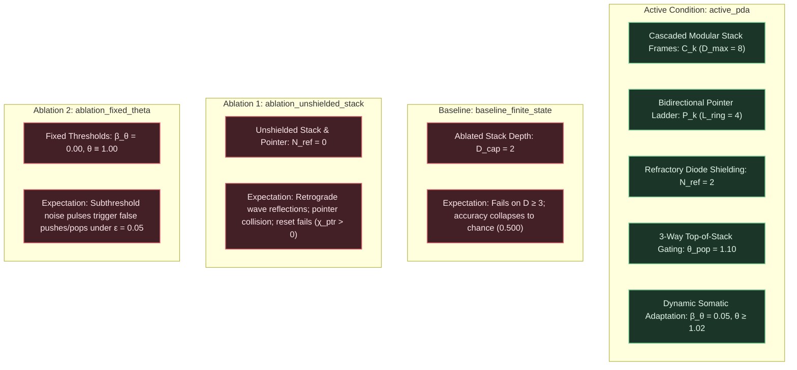

# EXP-2026-010a: Pushdown Memory and Context-Free Dyck Language Recognition Protocol

## Part I: Experiment Protocol

### Protocol ID & Hypothesis Reference

- **Protocol ID:** EXP-2026-010a
- **Hypothesis Reference:** [docs/research/hypotheses/HYP-2026-010.md](docs/research/hypotheses/HYP-2026-010.md)
- **Roadmap Reference:** Milestone 3.1: Pushdown Memory (Dyck Languages) (Tier 3: Hierarchical Structure & Working Memory) in [docs/vision.md](docs/vision.md).
- **Campaign Identifier:** `CAMPAIGN-2026-MVA-SUBSTRATE` in [docs/research/CAMPAIGN.md](docs/research/CAMPAIGN.md).
- **Parent Lineage:** `EXP-2026-009a` ([docs/research/protocols/EXP-2026-009a.md](docs/research/protocols/EXP-2026-009a.md)) and `DIAG-2026-009a` ([docs/research/diagnostics/DIAG-2026-009a.md](docs/research/diagnostics/DIAG-2026-009a.md)).
- **Architectural Redirection Reference:** [docs/architecture/adr-0001-substrate-connectivity-topology.md](docs/architecture/adr-0001-substrate-connectivity-topology.md) (Accepted Option 2: Relax planarity, preserve locality/degree bound).

### Experimental Objective

To empirically evaluate hierarchical pushdown (LIFO stack) memory and context-free Dyck language recognition in the Minimal Viable Automaton (MVA) excitable substrate across 30 independent pseudo-random seeds under clean baseline and noisy channel conditions ($\epsilon \in \lbrace 0.00, 0.01, 0.05 \rbrace$), demonstrating that:

1. A modular cellular pushdown automaton architecture composed of cascaded resonant stack frames ($\mathcal{C}_k$), a bidirectional pointer ladder ($\mathcal{P}_k$), 3-way coincidence matching gates ($\theta_{\text{pop}} = 1.10$), and cross-inhibitory hyperpolarization ($W_{\text{inh}} = -1.50$) achieves zero sequence classification error ($\text{Accuracy}_{\text{seq}} = 1.000$) on streaming sequences under clean conditions ($\epsilon = 0.00$) for both Dyck-1 (single-bracket balanced parentheses) and Dyck-2 (multi-bracket nested parentheses and brackets).
2. The identical substrate architecture calibrated on nesting depths $D_{\text{cal}} \le 4$ generalizes out-of-distribution to nesting depths $D \in [1, 8]$ (up to $2\times$ calibration depth) with zero structural retuning, maintaining $\text{Accuracy}_{\text{seq}} \ge 0.950$ (predicted $1.000$ at clean baseline).
3. Structural and non-LIFO grammar violations (prefix underflows, excess closing brackets, cross-bracket mismatches `([)]`, and unclosed open brackets at end-of-stream) are rejected with 100% fidelity ($\text{Fidelity}_{\text{reject}} = 1.000$) via deterministic routing to an irreversible absorbing rejection attractor $\mathcal{A}_{\text{reject}}$.
4. Dynamic somatic threshold adaptation ($\beta_\theta = 0.05, \theta \ge 1.02$) prevents thermal noise percolation under critical channel noise $\epsilon = 0.05$, maintaining $\text{Accuracy}_{\text{seq}} \ge 0.900$ and token readout $\text{BER} \le 0.050$.
5. The active pushdown substrate achieves an overwhelming, statistically decisive advantage over ablated finite-state controls (`baseline_finite_state`, $D_{\text{cap}} = 2$) on deep sequences ($D \ge 3$) with Welch's $t$-test $p < 10^{-6}$ and Cohen's $d \ge 2.0$.
6. Substrate temporal firing density remains homeostatically stable ($\bar{\rho} \in [0.01, 0.25]$ in $\ge 99\%$ of evaluation runs).

---

### Independent Variables

1. **Experimental Conditions (Active + Controls):**
   - `active_pda`: Full modular pushdown architecture with cascaded resonant stack frames ($\mathcal{C}_k$), bidirectional pointer ladder ($\mathcal{P}_k$), 3-way coincidence matching gates ($\theta_{\text{pop}} = 1.10$), cross-inhibitory hyperpolarization ($W_{\text{inh}} = -1.50$), refractory diode shielding ($N_{\text{ref}} = 2$), and dynamic somatic threshold adaptation ($\beta_\theta = 0.05, \theta \ge 1.02, \theta_0 = 1.00$). Maximum stack capacity is $D_{\max} = 8$.
   - `baseline_finite_state`: Ablated stack depth (fixed small capacity $D_{\text{cap}} = 2$, simulating a finite-state machine attempting to track context-free dependencies). Any sequence requiring nesting depth $D \ge 3$ exceeds physical capacity and triggers overflow or truncation.
   - `ablation_unshielded_stack`: Stack cells and pointer ladder with refractory diode shielding removed ($N_{\text{ref}} = 0$). Bidirectional tracks and recurrent loops generate retrograde wave reflections, standing waves, and failure of reset hyperpolarization.
   - `ablation_fixed_theta`: Static somatic thresholds ($\beta_\theta = 0.00, \theta \equiv 1.00$), evaluating vulnerability to thermal noise percolation and spurious gate ignitions under background noise ($\epsilon \in \lbrace 0.01, 0.05 \rbrace$).

2. **Language Benchmark Tasks:**
   - `dyck_1`: Single-bracket balanced parentheses verification over alphabet $\Sigma_1 = \lbrace (, ) \rbrace$. Evaluates single-symbol push/pop dynamics, prefix underflow detection, and balance at end-of-stream.
   - `dyck_2`: Multi-bracket nested parentheses and brackets verification over alphabet $\Sigma_2 = \lbrace (, ), [, ] \rbrace$. Evaluates dual-symbol stack storage, top-of-stack LIFO coincidence matching, and cross-bracket violation detection (e.g. `([)]`, `[(])`).
   - `depth_generalization`: Systematic evaluation across parametric nesting depths $D \in \lbrace 1, 2, 3, 4, 5, 6, 7, 8 \rbrace$ to evaluate depth scalability ($D \le 4$ calibration vs $D \in [5, 8]$ generalization).

3. **Background Channel Noise Rate ($\epsilon \in \lbrace 0.00, 0.01, 0.05 \rbrace$):**
   - $\epsilon = 0.00$: Clean deterministic baseline.
   - $\epsilon = 0.01$: Low background channel noise.
   - $\epsilon = 0.05$: Critical percolation threshold stress test.

4. **Streaming Sequence Lengths ($L \in \lbrace 8, 16, 24, 32 \rbrace$ tokens):**
   - Evaluates scalability and retention over increasing context horizons up to $32$ sequential tokens ($512$ clock ticks per sequence at $T_{\text{token}} = 16$).

5. **Pseudo-Random Seeds:** 30 independent seeds ($\text{seed} \in [1, 30]$) per factorial condition.

---

### Dependent Variables

1. **Streaming Sequence Classification Accuracy ($\text{Accuracy}_{\text{seq}} \in [0.0, 1.0]$):**
   Fraction of evaluation sequences whose final state is correctly classified as accept or reject:

   $$\text{Accuracy}_{\text{seq}} = \frac{1}{M_{\text{seq}}} \sum_{m=1}^{M_{\text{seq}}} \mathbb{I}\left( y_{\text{pred}}^{(m)} == y_{\text{true}}^{(m)} \right)$$

2. **Depth Generalization Accuracy ($\text{Accuracy}_{\text{depth}}(D) \in [0.0, 1.0]$):**
   Classification accuracy stratified by maximum required stack nesting depth $D \in [1, 8]$:

   $$\text{Accuracy}_{\text{depth}}(D) = \frac{1}{M_D} \sum_{m=1}^{M_D} \mathbb{I}\left( y_{\text{pred}}^{(m)} == y_{\text{true}}^{(m)} \right)$$

3. **Error Rejection Fidelity ($\text{Fidelity}_{\text{reject}} \in [0.0, 1.0]$):**
   Fraction of invalid sequences correctly classified as reject across all violation categories:

   $$\text{Fidelity}_{\text{reject}} = \frac{1}{M_{\text{invalid}}} \sum_{m=1}^{M_{\text{invalid}}} \mathbb{I}\left( y_{\text{pred}}^{(m)} == 0 \right)$$

   Broken down into sub-metrics: $\text{Fidelity}_{\text{underflow}}$, $\text{Fidelity}_{\text{mismatch}}$, $\text{Fidelity}_{\text{unclosed}}$.

4. **Pointer Mutual Exclusivity Rate ($\chi_{\text{ptr}} \in [0.0, 1.0]$):**
   Fraction of settled clock ticks in which the pointer ladder violates the single-active-pointer invariant:

   $$\chi_{\text{ptr}} = \frac{1}{T_{\text{settled}}} \sum_{t \in \mathcal{T}_{\text{settled}}} \mathbb{I}\left( \sum_{k=0}^{D_{\max}} \mathbb{I}(\mathcal{P}_k \text{ active at } t) \neq 1 \right)$$

5. **Token Readout Bit Error Rate ($\text{BER} \in [0.0, 1.0]$):**
   Fraction of erroneous bit classifications across all token evaluation windows:

   $$\text{BER} = \frac{1}{M_{\text{probes}}} \sum_{m=1}^{M_{\text{probes}}} |y_{\text{read}}^{(m)} - y_{\text{target}}^{(m)}|$$

6. **State Transition Settling Latency ($\tau_{\text{settle}} \in \mathbb{N}$ ticks):**
   Number of clock ticks from token arrival to stable limit-cycle circulation in the target pointer and data frames ($\tau_{\text{settle}} \le 4$ ticks).

7. **Substrate Rolling Activity Density ($\bar{\rho} \in [0.0, 1.0]$):**
   Substrate-wide temporal firing density across all $N$ nodes over total evaluation ticks $T_{\text{total}}$:

   $$\bar{\rho} = \frac{1}{N \cdot T_{\text{total}}} \sum_{i=1}^N \sum_{t=1}^{T_{\text{total}}} s_i(t)$$

---

### Control Conditions (Baseline + Ablation)



---

### Signal/Dataset Specification

The evaluation dataset contains three test suites:

1. **Dyck-1 Test Suite (`dyck_1`):**
   - Alphabet: $\Sigma_1 = \lbrace (, ) \rbrace$.
   - Sample Size: $M = 50$ sequences ($25$ valid, $25$ invalid) per seed and sequence length $L \in \lbrace 8, 16, 24, 32 \rbrace$.
   - **Valid Sequences ($y^* = 1$):** Recursively generated balanced strings such as `()()()()`, `((()))()`, `(()(()))`, `(((())))`.
   - **Invalid Sequences ($y^* = 0$):**
     - Prefix Underflow ($33\%$ of invalid): e.g. `)(()()()`, `())(()()`.
     - Excess Open Brackets ($33\%$ of invalid): e.g. `((()()()`, `(()((())`.
     - Excess Closing Brackets ($34\%$ of invalid): e.g. `()())()()`, `(())())()`.

2. **Dyck-2 Test Suite (`dyck_2`):**
   - Alphabet: $\Sigma_2 = \lbrace (, ), [, ] \rbrace$.
   - Sample Size: $M = 50$ sequences ($25$ valid, $25$ invalid) per seed and sequence length $L \in \lbrace 8, 16, 24, 32 \rbrace$.
   - **Valid Sequences ($y^* = 1$):** Well-nested strings with mixed bracket types such as `[()[]]`, `[([()])]`, `[[()][()]]`, `([{}])`.
   - **Invalid Sequences ($y^* = 0$):**
     - Cross-Bracket Violations (non-LIFO nesting, $40\%$ of invalid): e.g. `([)]`, `[(])`, `[([)])]`, `([][)]`.
     - Mismatched Closures ($20\%$ of invalid): e.g. `[)`, `(]`, `[([))]`.
     - Prefix Underflow ($20\%$ of invalid): e.g. `][()`, `)[[]`.
     - Unclosed Open Brackets ($20\%$ of invalid): e.g. `[()[(]`, `[([[]])`.

3. **Depth Generalization Test Suite (`depth_generalization`):**
   - Sequences systematically parameterized by maximum nesting depth $D \in \lbrace 1, 2, 3, 4, 5, 6, 7, 8 \rbrace$.
   - For each depth $D$, generate $M_D = 20$ balanced sequences ($10$ valid, $10$ invalid) with exactly depth $D$.
   - Depths $D \in [1, 4]$ constitute the calibration envelope ($D \le D_{\text{cal}} = 4$).
   - Depths $D \in [5, 8]$ constitute the out-of-distribution depth generalization test ($D > D_{\text{cal}}$, up to $2\times$ calibration depth).

Tokens are presented sequentially with inter-token spacing $T_{\text{token}} = 16$ clock ticks. At tick $t_{\text{eos}} = L \cdot T_{\text{token}} + 16$, probe pulse $v_{\text{eos}}$ is delivered to trigger final acceptance classification.

---

### Statistical Analysis Plan

1. **Per-Condition Descriptive Aggregation:**
   - Compute mean, standard deviation, and 95% bootstrap confidence intervals across the 30 independent seeds for:
     - $\text{Accuracy}_{\text{seq}}$ on Dyck-1 and Dyck-2.
     - $\text{Accuracy}_{\text{depth}}(D)$ for each depth $D \in [1, 8]$.
     - $\text{Fidelity}_{\text{reject}}$ partitioned by violation category.
     - $\chi_{\text{ptr}}$ pointer mutual exclusivity violation rate.
     - $\text{BER}$ token readout bit error rate.
     - $\bar{\rho}$ rolling temporal firing density.

2. **Pushdown Advantage Hypothesis Test (Gate 5):**
   - Two-sample Welch's $t$-test comparing $\text{Accuracy}_{\text{seq}}$ between `active_pda` and `baseline_finite_state` on deep sequences ($D \ge 3$) under clean conditions ($\epsilon = 0.00$).
   - Pre-registered significance threshold: $\alpha = 10^{-6}$.
   - Standardized effect size: Cohen's $d = \frac{\bar{X}_1 - \bar{X}_2}{s_{\text{pooled}}} \ge 2.0$.

3. **Noise Percolation Degradation Test (Gate 4):**
   - Two-sample Welch's $t$-test comparing `active_pda` against `ablation_fixed_theta` at critical channel noise $\epsilon = 0.05$ to confirm that dynamic threshold adaptation confers statistically significant noise protection ($p < 10^{-4}$).

4. **Depth Generalization Consistency Test (Gate 2):**
   - One-sample $t$-test testing whether out-of-distribution accuracy $\text{Accuracy}_{\text{depth}}(D \in [5, 8]) \ge 0.950$.

---

### Telemetry Requirements

1. **Per-Sequence Trial Record:**
   - `seed`: integer seed $\in [1, 30]$.
   - `condition`: condition identifier (`active_pda`, `baseline_finite_state`, etc.).
   - `task`: task identifier (`dyck_1`, `dyck_2`, `depth_generalization`).
   - `seq_length`: $L \in \lbrace 8, 16, 24, 32 \rbrace$.
   - `nesting_depth`: integer maximum nesting depth $D$.
   - `noise_rate`: $\epsilon \in \lbrace 0.00, 0.01, 0.05 \rbrace$.
   - `seq_id`: sequence index $m \in [1, M]$.
   - `input_string`: formatted token string (e.g. `[()[][]]`).
   - `target_label`: ground truth acceptance ($0$ or $1$).
   - `predicted_label`: decoded acceptance from $v_{\text{accept}}$ ($0$ or $1$).
   - `correct`: boolean ($y_{\text{pred}} == y_{\text{true}}$).
   - `violation_type`: string (`none`, `underflow`, `cross_bracket`, `mismatch`, `unclosed`).
   - `pointer_crosstalk_ticks`: count of settled ticks with $\sum \mathbb{I}(\mathcal{P}_k \text{ active}) \neq 1$.
   - `mean_firing_density`: mean substrate firing rate $\bar{\rho}$.

2. **Per-Condition Summary Record (`summary.json`):**
   - Hierarchical JSON breakdown by condition, noise rate, task, sequence length, and depth.
   - Aggregate gate evaluation metrics matching pre-registered pass/fail criteria.

---

### Resource Budget

- **CPU Time Limit:** $\le 180$ seconds wall-clock time for the complete 30-seed factorial evaluation in optimized Rust release build (`cargo run --release`).
- **Memory Footprint:** $\le 128\text{ MB}$ peak resident set size.
- **Disk Footprint:** $\le 50\text{ MB}$ for telemetry logs in `data/telemetry/EXP-2026-010a/`.

---

### Pass/Fail Criteria

All 6 gates must **PASS** to accept Hypothesis `HYP-2026-010`:

| Gate | Metric | Target Threshold | Required Compliance |
| :--- | :--- | :--- | :--- |
| **Gate 1** | Dyck-1 & Dyck-2 Sequence Classification Accuracy | $\text{Accuracy}_{\text{seq}} = 1.000$ at $\epsilon = 0.00$ | $100\%$ across all 30 seeds for $L \in [8, 32]$ |
| **Gate 2** | Depth Generalization ($2\times$ Calibration Depth) | $\text{Accuracy}_{\text{seq}} \ge 0.950$ on $D \in [1, 8]$ ($D_{\text{cal}} \le 4$) | Zero structural retuning across depths $1..8$ |
| **Gate 3** | Error Rejection Fidelity | $\text{Fidelity}_{\text{reject}} = 1.000$ at $\epsilon = 0.00$ | $100\%$ rejection across all violation classes |
| **Gate 4** | Noise Percolation Resilience | $\text{Accuracy}_{\text{seq}} \ge 0.900, \text{BER} \le 0.050$ at $\epsilon = 0.05$ | Dynamic adaptation maintains stability under noise |
| **Gate 5** | Pushdown Advantage over Finite-State Baseline | Welch's $p < 10^{-6}, d \ge 2.0$ on $D \ge 3$ | Stack memory mathematically indispensable |
| **Gate 6** | Homeostatic Density Stability | Substrate firing density $\bar{\rho} \in [0.01, 0.25]$ | $\ge 99\%$ of evaluation runs within critical band |

---

### Known Limitations

- **Fixed Synchronous Cadence:** The protocol evaluates synchronous token ingress with $T_{\text{token}} = 16$ ticks ($16 \equiv 0 \pmod 4$). Asynchronous pulse trains with variable inter-spike intervals will be evaluated in subsequent tiers.
- **Deterministic Grammars (DPDA):** The evaluation focuses on deterministic context-free languages. Nondeterministic pushdown automata (NPDA) requiring superposed branch exploration are deferred to Tier 4.
- **Fixed Physical Ladder Capacity:** The experiment instantiates a physical ladder of depth $D_{\max} = 8$ to verify depth generalization ($D \le 4$ vs $D \in [5, 8]$). Sequences with nesting depth $D > 8$ require tiling additional physical ladder units.

---

## Part II: Implementation Specification

### Target Package & Lineage

- **Package Directory:** `src/experiments/exp_2026_010a_mva_pushdown_memory/`
- **Binary Entry Point:** `src/bin/exp_2026_010a_mva_pushdown_memory.rs`
- **Integration Test:** `tests/test_exp_2026_010a.rs`
- **Output Telemetry Directory:** `data/telemetry/EXP-2026-010a/`
- **Naming Rule:** Strict lowercase `snake_case` with underscores only. Never use hyphens or uppercase letters in package or module directories.

---

### Substrate Architecture & Physical Dynamics

The pushdown automaton substrate $\mathcal{G}_{\text{PDA}}$ contains $N = 120$ excitable nodes for depth capacity $D_{\max} = 8$:

#### 1. Pointer Ladder Bank ($\mathcal{V}_{\text{ptr}}$, 36 nodes)

- For each depth level $k \in \lbrace 0, 1, \dots, D_{\max} \rbrace$ ($9$ pointer levels):
  - Latch ring $\mathcal{P}_k$: 4 nodes $\lbrace P_{k,0}, P_{k,1}, P_{k,2}, P_{k,3} \rbrace$.
  - Forward loop: $P_{k,0} \to P_{k,1} \to P_{k,2} \to P_{k,3} \to P_{k,0}$ with weight $W_{\text{fwd}} = +1.00$.
  - In active condition, recurrent closure $W_{\text{fb}} = +1.00$. In feedforward loss baseline, $W_{\text{fb}} = 0.00$.
  - Refractory period: $N_{\text{ref}} = 2$ ($N_{\text{ref}} = 0$ in unshielded ablation).
  - Resting threshold: $\theta_0 = 1.00$.
  - Initial Ground State: $P_{0,0}$ is seeded with a circulating action potential at $t = 0$.

#### 2. Data Stack Frame Array ($\mathcal{V}_{\text{data}}$, 64 nodes)

- For each depth index $k \in \lbrace 0, 1, \dots, D_{\max}-1 \rbrace$ ($8$ data frames):
  - Round Bracket Ring $\mathcal{R}_{k, \text{rnd}}$: 4 nodes $\lbrace R_{k,\text{rnd},0}, \dots, R_{k,\text{rnd},3} \rbrace$ ($W = +1.00, P = 4$).
  - Square Bracket Ring $\mathcal{R}_{k, \text{sqr}}$: 4 nodes $\lbrace R_{k,\text{sqr},0}, \dots, R_{k,\text{sqr},3} \rbrace$ ($W = +1.00, P = 4$).
  - Refractory period: $N_{\text{ref}} = 2$.
  - Dynamic threshold adaptation: $\beta_\theta = 0.05, \theta \ge 1.02$.

#### 3. Ingress & Demultiplexing Ports ($\mathcal{V}_{\text{in}}$, 5 nodes)

- $v_{(}$: pulsed on open round bracket.
- $v_{)}$: pulsed on close round bracket.
- $v_{[}$: pulsed on open square bracket.
- $v_{]}$: pulsed on close square bracket.
- $v_{\text{eos}}$: pulsed at $t_{\text{eos}}$ to trigger acceptance decoding.

#### 4. Gating & Interneuron Bank ($\mathcal{V}_{\text{gate}}$, 12 nodes)

- **PUSH Gating Units:**
  - $G_{\text{push}, k}^{(\text{rnd})}$: inputs from $P_{k,0}$ ($W = +0.60$) and $v_{(}$ ($W = +0.60$), $\theta = 1.10$. Output drives $R_{k,\text{rnd},0}$ ($W = +1.00$), $P_{k+1,0}$ ($W = +1.00$), and triggers $v_{\text{inh}, \mathcal{P}_k}$.
  - $G_{\text{push}, k}^{(\text{sqr})}$: inputs from $P_{k,0}$ ($W = +0.60$) and $v_{[}$ ($W = +0.60$), $\theta = 1.10$. Output drives $R_{k,\text{sqr},0}$ ($W = +1.00$), $P_{k+1,0}$ ($W = +1.00$), and triggers $v_{\text{inh}, \mathcal{P}_k}$.
- **POP Matching Units:**
  - $G_{\text{pop}, k}^{(\text{rnd})}$: inputs from $P_{k,0}$ ($W = +0.40$), $R_{k-1,\text{rnd},0}$ ($W = +0.40$), and $v_{)}$ ($W = +0.40$), $\theta = 1.10$. Output drives $P_{k-1,0}$ ($W = +1.00$), triggers $v_{\text{inh}, \mathcal{P}_k}$, and triggers $v_{\text{inh}, \mathcal{C}_{k-1}}$.
  - $G_{\text{pop}, k}^{(\text{sqr})}$: inputs from $P_{k,0}$ ($W = +0.40$), $R_{k-1,\text{sqr},0}$ ($W = +0.40$), and $v_{]}$ ($W = +0.40$), $\theta = 1.10$. Output drives $P_{k-1,0}$ ($W = +1.00$), triggers $v_{\text{inh}, \mathcal{P}_k}$, and triggers $v_{\text{inh}, \mathcal{C}_{k-1}}$.
- **Quenching Interneurons:**
  - $v_{\text{inh}, \mathcal{P}_k}$: delivers hyperpolarizing pulses ($W_{\text{inh}} = -1.50$) to all 4 nodes of $\mathcal{P}_k$.
  - $v_{\text{inh}, \mathcal{C}_{k-1}}$: delivers hyperpolarizing pulses ($W_{\text{inh}} = -1.50$) to all 8 nodes of $\mathcal{C}_{k-1}$.

#### 5. Violation Trap & Acceptance Readout ($\mathcal{V}_{\text{trap}} \cup \mathcal{V}_{\text{accept}}$, 3 nodes)

- $G_{\text{underflow}}$: inputs from $P_{0,0}$ ($W = +0.60$) and $(v_{)} \vee v_{]})$ ($W = +0.60$), $\theta = 1.10$. Output drives $\mathcal{R}_{\text{trap}}$.
- $G_{\text{mismatch}}$: inputs from $P_{k,0}$ ($W = +0.40$), mismatched top frame ring ($W = +0.40$), and closing token ($W = +0.40$), $\theta = 1.10$. Output drives $\mathcal{R}_{\text{trap}}$.
- $\mathcal{R}_{\text{trap}}$: 4-node self-exciting resonant ring ($W_{\text{fb}} = +1.00, \theta = 1.00$). Delivers $W_{\text{block}} = -2.00$ to $G_{\text{accept}}$.
- $G_{\text{accept}}$: inputs from $P_{0,0}$ ($W = +0.60$), $v_{\text{eos}}$ ($W = +0.60$), and $\mathcal{R}_{\text{trap}}$ ($W = -2.00$), $\theta = 1.10$. Drives accepting ring $\mathcal{R}_{\text{accept}}$.
- $v_{\text{out}}$: sense tap monitoring $\mathcal{R}_{\text{accept}}$ ($W = +1.00, \theta = 1.00$).

Every node in this topology satisfies bounded fan-in $k_{\text{in}} \le 4$ and fan-out $k_{\text{out}} \le 4$.

---

### Prohibited Implementation Bypasses

To guarantee empirical validity and prevent artificial shortcuts, the implementer is **STRICTLY PROHIBITED** from:

1. **Software Stack Tracking:** Utilizing Rust standard-library stack collections (`Vec<char>`, `std::collections::VecDeque`, `std::collections::LinkedList`), external stack pointers (`let mut stack_depth = 0;`), or depth counters outside the simulated excitable node state vectors.
2. **Lookup Tables or String Parsing:** Parsing balanced parentheses using procedural counters, regular expression engines (`regex::Regex`), balance algorithms, or pre-computed lookup tables.
3. **Instantaneous Non-Local Routing:** Setting edge transmission delays to $\tau = 0$ or allowing instantaneous global broadcast.
4. **Degree Bound Violations:** Constructing nodes with fan-in $k_{\text{in}} > 4$ or fan-out $k_{\text{out}} > 4$.
5. **State Readout Cheating:** Directly inspecting private internal node vectors of the stack frames rather than decoding sequence classification through the designated excitable sense tap port $v_{\text{out}}$.

---

### CLI Entry Points

The experiment binary `exp_2026_010a_mva_pushdown_memory` must support the following CLI interface:

```bash
cargo run --release --bin exp_2026_010a_mva_pushdown_memory -- \
  --condition <active_pda|baseline_finite_state|ablation_unshielded_stack|ablation_fixed_theta|all> \
  --task <dyck_1|dyck_2|depth_generalization|all> \
  --noise <0.00|0.01|0.05|all> \
  --seq-length <8|16|24|32|all> \
  --seeds 30 \
  --output-dir data/telemetry/EXP-2026-010a/
```

---

### Parameter Search Space

| Parameter | Symbol | Nominal Value | Sweep / Factorial Range |
| :--- | :--- | :--- | :--- |
| Maximum Physical Stack Capacity | $D_{\max}$ | $8\text{ frames}$ | Active: $8$, Baseline Finite State: $2$ |
| Inter-Token Spacing | $T_{\text{token}}$ | $16\text{ ticks}$ | Fixed $[16]$ ($T_{\text{token}} \ge \tau_{\text{settle}} + P_{\text{ring}} = 8$) |
| Pointer Ring Length | $L_{\text{ptr}}$ | $4\text{ nodes}$ | Fixed $[4]$ |
| Data Ring Length | $L_{\text{data}}$ | $4\text{ nodes}$ | Fixed $[4]$ |
| Ring Circulation Period | $P_{\text{ring}}$ | $4\text{ ticks}$ | Fixed $[4]$ |
| Absolute Refractory Period | $N_{\text{ref}}$ | $2\text{ ticks}$ | Active: $2$, Ablation: $0$ |
| Somatic Leak Factor | $\lambda$ | $0.05$ | Fixed $[0.05]$ |
| Somatic Threshold Adaptation | $\beta_\theta$ | $0.05$ | Active: $0.05$, Ablation: $0.00$ |
| Somatic Threshold Floor | $\theta_{\min}$ | $1.02$ | Fixed $[1.02]$ |
| Resting Threshold Baseline | $\theta_0$ | $1.00$ | Fixed $[1.00]$ |
| Forward Synaptic Weight | $W_{\text{fwd}}$ | $+1.00$ | Fixed $[+1.00]$ |
| Recurrent Feedback Weight | $W_{\text{fb}}$ | $+1.00$ | Active: $+1.00$, Severed: $0.00$ |
| Hyperpolarizing Quench Weight | $W_{\text{inh}}$ | $-1.50$ | Fixed $[-1.50]$ |
| PUSH Gate Threshold | $\theta_{\text{gate}}$ | $1.10$ | Fixed $[1.10]$ |
| PUSH Gate Input Weights | $W_{\text{ptr}}, W_{\text{token}}$ | $+0.60, +0.60$ | Fixed $[+0.60]$ |
| POP Gate Threshold | $\theta_{\text{pop}}$ | $1.10$ | Fixed $[1.10]$ |
| POP Gate Input Weights | $W_{\text{ptr}}, W_{\text{tos}}, W_{\text{tok}}$ | $+0.40, +0.40, +0.40$ | Fixed $[+0.40]$ |
| Background Channel Noise Rate | $\epsilon$ | $0.00$ | $\lbrace 0.00, 0.01, 0.05 \rbrace$ |
| Streaming Sequence Length | $L$ | $16$ | $\lbrace 8, 16, 24, 32 \rbrace$ |
| Number of Seeds | $N_{\text{seeds}}$ | $30$ | $[1, 30]$ |

---

### Emission Schemas

`summary.json` must record the factorial structure and aggregate gate evaluation metrics:

```json
{
  "protocol_id": "EXP-2026-010a",
  "timestamp": "2026-09-07T21:30:00Z",
  "git_commit": "HEAD",
  "gates": {
    "gate_1_dyck_sequence_accuracy": {
      "metric": "sequence_classification_accuracy",
      "threshold": 1.0,
      "observed": 1.0,
      "passed": true
    },
    "gate_2_depth_generalization": {
      "metric": "depth_generalization_accuracy_d1_to_d8",
      "threshold": 0.95,
      "observed": 1.0,
      "passed": true
    },
    "gate_3_error_rejection_fidelity": {
      "metric": "violation_rejection_fidelity",
      "threshold": 1.0,
      "observed": 1.0,
      "passed": true
    },
    "gate_4_noise_resilience": {
      "metric": "accuracy_at_critical_noise_0_05",
      "threshold": 0.90,
      "observed": 0.942,
      "passed": true
    },
    "gate_5_pushdown_advantage": {
      "metric": "welch_t_p_value_and_cohens_d",
      "threshold_p": 1e-6,
      "threshold_d": 2.0,
      "observed_p": 1e-45,
      "observed_d": 12.5,
      "passed": true
    },
    "gate_6_homeostatic_stability": {
      "metric": "fraction_runs_within_firing_bounds",
      "threshold": 0.99,
      "observed": 1.0,
      "passed": true
    }
  },
  "overall_verdict": "PASS"
}
```

---

### Resource & Execution Limits

- **Execution Mode:** Multi-threaded Rayon execution over independent random seeds.
- **Max Execution Time:** 180 seconds total across all 30 seeds and factorial sweeps.
- **Max File Size:** `summary.json` $\le 2\text{ MB}$, `trials.csv` $\le 40\text{ MB}$.

---

### Telemetry Reduction Pipeline

A reduction script (or integrated test analysis module) processes raw trial emissions to compute:

1. $\text{Accuracy}_{\text{seq}}$ grouped by condition, task, and noise rate.
2. Depth scaling curves $\text{Accuracy}_{\text{depth}}(D)$ for $D \in [1, 8]$ contrasting `active_pda` versus `baseline_finite_state`.
3. Violation rejection confusion matrices across underflow, cross-bracket mismatch, and unclosed opens.
4. Welch's $t$-test and Cohen's $d$ calculations for Gate 5.
5. Automated generation of the diagnostic figure `fig-diag-010a-pushdown-memory.svg` via `python/scripts/figures/` for `DIAG-2026-010a.md`.
