# EXP-2026-011a: Associative Key-Value Retrieval ("Needle in a Haystack") Protocol

## Part I: Experiment Protocol

### Protocol ID & Hypothesis Reference

- **Protocol ID:** EXP-2026-011a
- **Hypothesis Reference:** [docs/research/hypotheses/HYP-2026-011.md](docs/research/hypotheses/HYP-2026-011.md)
- **Roadmap Reference:** Milestone 3.2: Associative Key-Value Retrieval ("Needle in a Haystack") (Tier 3: Hierarchical Structure & Working Memory) in [docs/vision.md](docs/vision.md).
- **Campaign Identifier:** `CAMPAIGN-2026-MVA-SUBSTRATE` in [docs/research/CAMPAIGN.md](docs/research/CAMPAIGN.md).
- **Parent Lineage:** `EXP-2026-010a` ([docs/research/protocols/EXP-2026-010a.md](docs/research/protocols/EXP-2026-010a.md)) and `DIAG-2026-010a` ([docs/research/diagnostics/DIAG-2026-010a.md](docs/research/diagnostics/DIAG-2026-010a.md)).
- **Architectural Redirection Reference:** [docs/architecture/adr-0001-substrate-connectivity-topology.md](docs/architecture/adr-0001-substrate-connectivity-topology.md) (Accepted Option 2: Relax planarity, preserve locality/degree bound).

### Experimental Objective

To empirically evaluate associative key-value variable binding, distractor immunity, and dynamic random-access addressing in the Minimal Viable Automaton (MVA) excitable substrate across 30 independent pseudo-random seeds under clean baseline and noisy channel conditions ($\epsilon \in \lbrace 0.00, 0.01, 0.05 \rbrace$), demonstrating that:

1. A modular cellular associative memory architecture composed of 16 addressable dual-resonant slots ($\mathcal{M}_i$), coincidence write gates ($\theta_{\text{write}} = 1.10$), cross-inhibitory hyperpolarization ($W_{\text{inh}} = -1.50$), and dual-rail interrogation trees achieves near-perfect retrieval accuracy ($\text{Accuracy}_{\text{retrieval}} \ge 0.990$, predicted $1.000$) on streaming sequences of $N = 16$ key-value pairs under clean baseline conditions ($\epsilon = 0.00$).
2. The substrate retains stored variable bindings across long context horizons ($L \in [64, 512]$ tokens, up to $8192$ clock ticks) interspersed with hundreds of filler distractor tokens $D$, maintaining $\text{Accuracy}_{\text{retrieval}} \ge 0.990$ without fading memory decay.
3. Distractor tokens are completely attenuated by localized dissipation sinks with subthreshold coupling ($W_{\text{distractor}} \le 0.30 \ll \theta$) and dynamic somatic threshold adaptation, yielding distractor cross-talk leakage rate $\chi_{\text{distractor}} \le 0.010$.
4. Dynamic somatic threshold adaptation ($\beta_\theta = 0.05, \theta \ge 1.02$) prevents thermal noise percolation under critical channel noise $\epsilon = 0.05$, maintaining retrieval accuracy $\text{Accuracy}_{\text{retrieval}} \ge 0.900$ and bit error rate $\text{BER} \le 0.050$.
5. The active associative substrate demonstrates an overwhelming, statistically decisive advantage over unindexed control baselines (`baseline_unindexed`) on $N = 16$ pairs with Welch's $t$-test $p < 10^{-6}$ and standardized effect size Cohen's $d \ge 2.0$.
6. Substrate temporal firing density remains homeostatically stable ($\bar{\rho} \in [0.01, 0.25]$ in $\ge 99\%$ of evaluation runs).

---

### Independent Variables

1. **Experimental Conditions (Active + Controls):**
   - `active_associative`: Full 16-slot addressable memory array with dual resonant rings ($\mathcal{R}_{i, 0}, \mathcal{R}_{i, 1}$), coincidence write gating ($W = +0.60, \theta = 1.10$), cross-inhibitory hyperpolarization ($W_{\text{inh}} = -1.50$), refractory diode shielding ($N_{\text{ref}} = 2$), and dynamic somatic threshold adaptation ($\beta_\theta = 0.05, \theta \ge 1.02, \theta_0 = 1.00$).
   - `baseline_unindexed`: Single recency-biased latch cell lacking key-indexed addressing. All incoming write pairs overwrite the single shared latch cell, retaining only the most recent binding $(K_{\text{last}}, V_{\text{last}})$.
   - `ablation_unshielded_retrieval`: Refractory diode shielding removed ($N_{\text{ref}} = 0$). Bidirectional tracks and recurrent loops generate retrograde wave reflections, standing waves, and failure of reset hyperpolarization.
   - `ablation_fixed_theta`: Static somatic thresholds ($\beta_\theta = 0.00, \theta \equiv 1.00$), evaluating vulnerability to thermal percolation and spurious gate ignitions under background noise ($\epsilon \in \lbrace 0.01, 0.05 \rbrace$).

2. **Context Horizon / Sequence Length ($L \in \lbrace 64, 256, 512 \rbrace$ tokens):**
   - $L = 64$: Short context horizon ($1024$ clock ticks), dense key-value presentation with short distractor runs.
   - $L = 256$: Medium context horizon ($4096$ clock ticks), standard "needle in a haystack" regime with extensive distractor padding.
   - $L = 512$: Long context horizon ($8192$ clock ticks), deep needle stress test evaluating indefinite retention across thousands of operational ticks.

3. **Background Channel Noise Rate ($\epsilon \in \lbrace 0.00, 0.01, 0.05 \rbrace$):**
   - $\epsilon = 0.00$: Clean deterministic baseline.
   - $\epsilon = 0.01$: Low background channel noise.
   - $\epsilon = 0.05$: Critical percolation threshold stress test.

4. **Key-Value Pair Cardinality ($N = 16$ pairs):**
   - Exactly $N = 16$ distinct key address tokens ($K_0 \dots K_{15}$) bound to binary values $V_i \in \lbrace 0, 1 \rbrace$.

5. **Pseudo-Random Seeds:** 30 independent seeds ($\text{seed} \in [1, 30]$) per factorial condition.

---

### Dependent Variables

1. **Key-Value Retrieval Accuracy ($\text{Accuracy}_{\text{retrieval}} \in [0.0, 1.0]$):**
   Fraction of evaluation sequences whose queried value is correctly retrieved and classified at output ports:

   $$\text{Accuracy}_{\text{retrieval}} = \frac{1}{M_{\text{seq}}} \sum_{m=1}^{M_{\text{seq}}} \mathbb{I}\left( y_{\text{pred}}^{(m)} == y_{\text{true}}^{(m)} \right)$$

2. **Long Context Horizon Retention ($\text{Retention}(L) \in [0.0, 1.0]$):**
   Retrieval accuracy stratified by total streaming sequence length $L \in \lbrace 64, 256, 512 \rbrace$:

   $$\text{Retention}(L) = \frac{1}{M_L} \sum_{m=1}^{M_L} \mathbb{I}\left( y_{\text{pred}}^{(m)} == y_{\text{true}}^{(m)} \right)$$

3. **Distractor Cross-Talk Leakage Rate ($\chi_{\text{distractor}} \in [0.0, 1.0]$):**
   Fraction of distractor token windows during which unaddressed memory slot lines emit spurious action potentials ($s_i(t) = 1$):

   $$\chi_{\text{distractor}} = \frac{1}{T_{\text{distractor}}} \sum_{t \in \mathcal{T}_{\text{distractor}}} \mathbb{I}\left( \sum_{i \in \mathcal{V}_{\text{mem}}} s_i(t) > 16 \right)$$

   where $16$ accounts for standard 1-pulse-per-slot limit-cycle circulation.

4. **Readout Bit Error Rate ($\text{BER} \in [0.0, 1.0]$):**
   Fraction of incorrect bit outputs across all query interrogation windows:

   $$\text{BER} = \frac{1}{M_{\text{probes}}} \sum_{m=1}^{M_{\text{probes}}} |y_{\text{read}}^{(m)} - y_{\text{target}}^{(m)}|$$

5. **Slot Mutual Exclusivity Violation Rate ($\chi_{\text{mutex}} \in [0.0, 1.0]$):**
   Fraction of settled clock ticks in which any slot $\mathcal{M}_i$ has simultaneous activity in both $\mathcal{R}_{i, 0}$ and $\mathcal{R}_{i, 1}$:

   $$\chi_{\text{mutex}} = \frac{1}{16 \cdot T_{\text{settled}}} \sum_{i=0}^{15} \sum_{t \in \mathcal{T}_{\text{settled}}} \mathbb{I}\left( \sum_{m=0}^3 s_{R_{i, 0, m}}(t) \ge 1 \enspace \wedge \enspace \sum_{m=0}^3 s_{R_{i, 1, m}}(t) \ge 1 \right)$$

6. **Query Readout Settling Latency ($\tau_{\text{readout}} \in \mathbb{N}$ ticks):**
   Clock ticks elapsed from query token arrival $t_{\text{query}}$ to standardized pulse emission at $v_{\text{out}, V}$ ($\tau_{\text{readout}} \le 4$ ticks).

7. **Substrate Rolling Activity Density ($\bar{\rho} \in [0.0, 1.0]$):**
   Substrate-wide temporal firing density across all $N_{\text{nodes}}$ nodes over total evaluation ticks $T_{\text{total}}$:

   $$\bar{\rho} = \frac{1}{N_{\text{nodes}} \cdot T_{\text{total}}} \sum_{i=1}^{N_{\text{nodes}}} \sum_{t=1}^{T_{\text{total}}} s_i(t)$$

---

### Control Conditions (Baseline + Ablation)

```mermaid
%%{init: {
  'theme': 'base',
  'themeVariables': {
    'darkMode': true,
    'background': '#161922',
    'mainBkg': '#1e2230',
    'nodeBorder': '#434c5e',
    'textColor': '#e2e8f0',
    'fontFamily': 'ui-sans-serif, system-ui, -apple-system, BlinkMacSystemFont, "Segoe UI", Roboto, sans-serif',
    'fontSize': '14px',
    'lineColor': '#8892b0',
    'primaryColor': '#422026',
    'primaryTextColor': '#fde8ec',
    'primaryBorderColor': '#e06c75',
    'secondaryColor': '#1b3528',
    'secondaryTextColor': '#e6f7ee',
    'secondaryBorderColor': '#73c991',
    'tertiaryColor': '#1d2c44',
    'tertiaryTextColor': '#e4f0fc',
    'tertiaryBorderColor': '#61afef',
    'clusterBkg': '#13161f',
    'clusterBorder': '#373e51',
    'noteBkgColor': '#2e271a',
    'noteTextColor': '#fdf4db',
    'noteBorderColor': '#e5c07b',
    'edgeLabelBackground': '#1a1d27'
  }
}}%%
flowchart TD
    classDef primary fill:#422026,stroke:#e06c75,stroke-width:1.5px,color:#fde8ec;
    classDef secondary fill:#1b3528,stroke:#73c991,stroke-width:1.5px,color:#e6f7ee;
    classDef tertiary fill:#1d2c44,stroke:#61afef,stroke-width:1.5px,color:#e4f0fc;
    classDef note fill:#2e271a,stroke:#e5c07b,stroke-width:1.5px,color:#fdf4db;

    subgraph C1["Condition 1: active_associative"]
        c1_desc["16 Addressable Slots (M_0..M_15)<br/>Coincidence Write Gates (θ = 1.10)<br/>Refractory Diode Shielding (N_ref = 2)<br/>Dynamic Threshold Adaptation (β_θ = 0.05)"]:::secondary
    end

    subgraph C2["Condition 2: baseline_unindexed"]
        c2_desc["Single Unindexed Latch Cell<br/>No Key Addressing (All writes overwrite)<br/>Recency Bias (Retains only last pair)<br/>Evaluates Variable Binding Necessity"]:::primary
    end

    subgraph C3["Condition 3: ablation_unshielded_retrieval"]
        c3_desc["Full 16 Slots without Diode Shielding<br/>Refractory Counter N_ref = 0<br/>Standing Waves & Retrograde Reflections<br/>Mutual Exclusivity Quench Breakdown"]:::tertiary
    end

    subgraph C4["Condition 4: ablation_fixed_theta"]
        c4_desc["Static Somatic Thresholds (β_θ = 0.0, θ ≡ 1.00)<br/>Vulnerable to Distractor Noise Leakage<br/>Thermal Percolation at ε = 0.05<br/>Evaluates Homeostatic Shielding"]:::note
    end
```



| Condition ID | Description | Memory Topology | Refractory Period | Somatic Adaptation | Expected Accuracy ($N=16, \epsilon=0.00$) |
| :--- | :--- | :--- | :--- | :--- | :--- |
| `active_associative` | Full addressable memory array | 16 Addressable Slots | $N_{\text{ref}} = 2$ | $\beta_\theta = 0.05, \theta \ge 1.02$ | $\ge 0.990$ (predicted $1.000$) |
| `baseline_unindexed` | Single recency latch | 1 Shared Latch | $N_{\text{ref}} = 2$ | $\beta_\theta = 0.05, \theta \ge 1.02$ | $\approx 0.531$ (Chance on $N=16$) |
| `ablation_unshielded_retrieval` | Unshielded array | 16 Slots ($N_{\text{ref}} = 0$) | $N_{\text{ref}} = 0$ | $\beta_\theta = 0.05, \theta \ge 1.02$ | $\approx 0.500$ (Reflections) |
| `ablation_fixed_theta` | Static threshold array | 16 Addressable Slots | $N_{\text{ref}} = 2$ | $\beta_\theta = 0.00, \theta \equiv 1.00$ | $1.000$ (Clean), $\le 0.680$ ($\epsilon=0.05$) |

---

### Signal/Dataset Specification

The evaluation dataset generates synthetic streaming "Needle in a Haystack" trials:

1. **Trial Structure:**
   - Key Alphabet: $\mathcal{K} = \lbrace K_0, K_1, \dots, K_{15} \rbrace$ ($16$ distinct keys).
   - Value Alphabet: $\mathcal{V}_{\text{val}} = \lbrace 0, 1 \rbrace$.
   - Sample Size: $M = 50$ evaluation sequences per seed and sequence length $L \in \lbrace 64, 256, 512 \rbrace$.
   - **Key-Value Pair Generation:** For each sequence, exactly $16$ distinct key-value pairs are created. Values $V_i \in \lbrace 0, 1 \rbrace$ are sampled i.i.d. Bernoulli(0.5). The presentation order of the $16$ keys is permuted uniformly at random.
   - **Distractor Placement ("Haystack"):** Distractor tokens $D$ are inserted between key-value pairs and before the final query probe to fill the target sequence length $L \in \lbrace 64, 256, 512 \rbrace$.
   - **Target Query Selection ("Needle"):** At sequence conclusion, a query token $Q(K_j)$ is selected uniformly at random from the 16 written keys ($j \in \lbrace 0, \dots, 15 \rbrace$).
   - Ground Truth Label: The target value $V_j$ bound to key $K_j$.

2. **Timing & Inter-Token Cadence:**
   - Tokens arrive at discrete cadence $T_{\text{token}} = 16$ clock ticks.
   - For a sequence of length $L$, the query token $Q(K_j)$ arrives at tick $t_{\text{query}} = L \cdot T_{\text{token}}$.
   - Readout window: Dual-rail ports $v_{\text{out}, 0}$ and $v_{\text{out}, 1}$ are monitored over window $[t_{\text{query}} + 1, t_{\text{query}} + 16]$. Output is decoded as $1$ if $v_{\text{out}, 1}$ emits an action potential, and $0$ if $v_{\text{out}, 0}$ emits an action potential.

---

### Statistical Analysis Plan

1. **Per-Condition Descriptive Aggregation:**
   - Compute mean, standard deviation, and 95% bootstrap confidence intervals across 30 independent seeds for:
     - $\text{Accuracy}_{\text{retrieval}}$ overall and stratified by sequence length $L$.
     - $\chi_{\text{distractor}}$ distractor leakage rate.
     - $\text{BER}$ readout bit error rate.
     - $\chi_{\text{mutex}}$ slot mutual exclusivity violation rate.
     - $\bar{\rho}$ rolling temporal firing density.

2. **Associative Advantage Hypothesis Test (Gate 5):**
   - Two-sample Welch's $t$-test comparing $\text{Accuracy}_{\text{retrieval}}$ between `active_associative` and `baseline_unindexed` on $N = 16$ pairs under clean baseline ($\epsilon = 0.00$).
   - Pre-registered significance threshold: $\alpha = 10^{-6}$.
   - Standardized effect size: Cohen's $d = \frac{\bar{X}_1 - \bar{X}_2}{s_{\text{pooled}}} \ge 2.0$.

3. **Noise Percolation Degradation Test (Gate 4):**
   - Two-sample Welch's $t$-test comparing `active_associative` against `ablation_fixed_theta` at critical channel noise $\epsilon = 0.05$ to confirm that dynamic somatic adaptation provides statistically significant noise shielding ($p < 10^{-4}$).

4. **Long Context Horizon Consistency Test (Gate 2):**
   - One-sample $t$-test testing whether long-horizon retention $\text{Retention}(L \in \lbrace 256, 512 \rbrace) \ge 0.990$.

---

### Telemetry Requirements

1. **Per-Sequence Trial Record:**
   - `seed`: integer seed $\in [1, 30]$.
   - `condition`: condition identifier (`active_associative`, `baseline_unindexed`, etc.).
   - `seq_length`: $L \in \lbrace 64, 256, 512 \rbrace$.
   - `noise_rate`: $\epsilon \in \lbrace 0.00, 0.01, 0.05 \rbrace$.
   - `seq_id`: trial index $m \in [1, M]$.
   - `queried_key`: integer key index $j \in [0, 15]$.
   - `target_value`: ground truth binary value ($0$ or $1$).
   - `predicted_value`: decoded binary value from dual-rail readout ($0$ or $1$).
   - `correct`: boolean ($y_{\text{pred}} == y_{\text{true}}$).
   - `distractor_leakage_events`: count of distractor ticks with spurious memory line firing.
   - `mutex_violation_ticks`: count of settled ticks with simultaneous ring activation.
   - `mean_firing_density`: substrate temporal firing rate $\bar{\rho}$.

2. **Per-Condition Summary Record (`summary.json`):**
   - Hierarchical JSON summary recording condition metadata, noise sweeps, horizon breakdowns, and aggregate gate compliance.

---

### Resource Budget

- **CPU Time Limit:** $\le 180$ seconds wall-clock time for the complete 30-seed factorial evaluation in optimized Rust release build (`cargo run --release`).
- **Memory Footprint:** $\le 128\text{ MB}$ peak resident set size.
- **Disk Footprint:** $\le 50\text{ MB}$ for telemetry logs in `data/telemetry/EXP-2026-011a/`.

---

### Pass/Fail Criteria

All 6 gates must **PASS** to accept Hypothesis `HYP-2026-011`:

| Gate | Metric | Target Threshold | Required Compliance |
| :--- | :--- | :--- | :--- |
| **Gate 1** | Retrieval Accuracy on $N=16$ pairs ($\epsilon = 0.00$) | $\text{Accuracy}_{\text{retrieval}} \ge 0.990$ | $\ge 99.0\%$ across all 30 seeds (predicted $1.000$) |
| **Gate 2** | Long Context Horizon Retention ($L \ge 256$) | $\text{Accuracy}_{\text{retrieval}}(L \ge 256) \ge 0.990$ | Indefinite retention across $L \in \lbrace 256, 512 \rbrace$ |
| **Gate 3** | Distractor Immunity | $\chi_{\text{distractor}} \le 0.010$ | Subthreshold passivity; zero distractor corruption |
| **Gate 4** | Noise Percolation Resilience ($\epsilon = 0.05$) | $\text{Accuracy} \ge 0.900, \text{BER} \le 0.050$ | Dynamic adaptation maintains stability under noise |
| **Gate 5** | Associative Advantage vs Unindexed Control | Welch's $p < 10^{-6}, d \ge 2.0$ | Dynamic addressing mathematically indispensable |
| **Gate 6** | Homeostatic Density Stability | Substrate firing density $\bar{\rho} \in [0.01, 0.25]$ | $\ge 99\%$ of evaluation runs within critical band |

---

### Known Limitations

- **Fixed Key Vocabulary Size:** The architecture instantiates 16 spatial memory slots ($N_{\text{slots}} = 16$). Scaling to larger vocabularies ($N \ge 64$) requires spatial replication of slot modules.
- **Single-Bit Values:** Storage is evaluated on binary values $V \in \lbrace 0, 1 \rbrace$. Multi-bit words require parallel banks of dual-resonant slots.
- **Discrete Synchronous Timing:** Input tokens arrive at fixed synchronous cadence $T_{\text{token}} = 16$ ticks. Asynchronous pulse trains will be evaluated in subsequent tiers.

---

## Part II: Implementation Specification

### Target Package & Lineage

- **Package Directory:** `src/experiments/exp_2026_011a_mva_associative_retrieval/`
- **Binary Entry Point:** `src/bin/exp_2026_011a_mva_associative_retrieval.rs`
- **Integration Test:** `tests/test_exp_2026_011a.rs`
- **Output Telemetry Directory:** `data/telemetry/EXP-2026-011a/`
- **Naming Rule:** Strict lowercase `snake_case` with underscores only. Never use hyphens or uppercase letters in package or module directories.

---

### Substrate Architecture & Physical Dynamics

The associative memory circuit graph $\mathcal{G}_{\text{assoc}}$ contains $N_{\text{nodes}} = 272$ excitable nodes partitioned as follows:

#### 1. Addressable Memory Array ($\mathcal{V}_{\text{mem}}$, 128 nodes)

- For each slot $i \in \lbrace 0, 1, \dots, 15 \rbrace$ ($16$ slots):
  - Bit-0 Ring $\mathcal{R}_{i, 0}$: 4 nodes $\lbrace R_{i, 0, 0}, \dots, R_{i, 0, 3} \rbrace$ in forward directed loop ($W_{\text{fwd}} = +1.00, W_{\text{fb}} = +1.00$).
  - Bit-1 Ring $\mathcal{R}_{i, 1}$: 4 nodes $\lbrace R_{i, 1, 0}, \dots, R_{i, 1, 3} \rbrace$ in forward directed loop ($W_{\text{fwd}} = +1.00, W_{\text{fb}} = +1.00$).
  - Refractory period: $N_{\text{ref}} = 2$ ($N_{\text{ref}} = 0$ in unshielded ablation).
  - Somatic leak: $\lambda = 0.05$.
  - Dynamic threshold adaptation: $\beta_\theta = 0.05, \theta \ge 1.02$.

#### 2. Write Coincidence Gates & Quench Interneurons ($\mathcal{V}_{\text{write}}$, 64 nodes)

- For each slot $i \in \lbrace 0, 1, \dots, 15 \rbrace$:
  - Write-0 Gate $G_{\text{write}, i}^{(0)}$: inputs from key line $v_{K_i}$ ($W = +0.60$) and value line $v_{\text{val}, 0}$ ($W = +0.60$). Threshold $\theta = 1.10$. Drives node $R_{i, 0, 0}$ ($W = +1.00$) and quench interneuron $v_{\text{inh}, i, 1}$.
  - Write-1 Gate $G_{\text{write}, i}^{(1)}$: inputs from key line $v_{K_i}$ ($W = +0.60$) and value line $v_{\text{val}, 1}$ ($W = +0.60$). Threshold $\theta = 1.10$. Drives node $R_{i, 1, 0}$ ($W = +1.00$) and quench interneuron $v_{\text{inh}, i, 0}$.
  - Quench Interneuron $v_{\text{inh}, i, 0}$: delivers hyperpolarizing pulses ($W_{\text{inh}} = -1.50$) to all 4 nodes of $\mathcal{R}_{i, 0}$.
  - Quench Interneuron $v_{\text{inh}, i, 1}$: delivers hyperpolarizing pulses ($W_{\text{inh}} = -1.50$) to all 4 nodes of $\mathcal{R}_{i, 1}$.

#### 3. Query Interrogation Gating Stage ($\mathcal{V}_{\text{query}}$, 32 nodes)

- For each slot $j \in \lbrace 0, 1, \dots, 15 \rbrace$:
  - Query-0 Gate $G_{\text{query}, j}^{(0)}$: inputs from query line $v_{Q_j}$ ($W = +0.60$) and sense tap from $R_{j, 0, 0}$ ($W = +0.60$). Threshold $\theta = 1.10$. Drives Rail-0 reduction tree.
  - Query-1 Gate $G_{\text{query}, j}^{(1)}$: inputs from query line $v_{Q_j}$ ($W = +0.60$) and sense tap from $R_{j, 1, 0}$ ($W = +0.60$). Threshold $\theta = 1.10$. Drives Rail-1 reduction tree.

#### 4. Streaming Ingress Demultiplexing Ports ($\mathcal{V}_{\text{in}}$, 35 nodes)

- 16 Key lines $v_{K_0} \dots v_{K_{15}}$: pulsed when corresponding key token $K_i$ arrives.
- 2 Value lines $v_{\text{val}, 0}, v_{\text{val}, 1}$: pulsed on value bits $0$ and $1$.
- 1 Distractor line $v_D$: pulsed on filler token $D$.
- 16 Query lines $v_{Q_0} \dots v_{Q_{15}}$: pulsed on query probe $Q(K_j)$.

#### 5. Shared Dual-Rail Readout Reduction Trees ($\mathcal{V}_{\text{read}}$, 10 nodes)

- Rail-0 Tree (5 nodes): 4 intermediate hub nodes (each pooling 4 query gates with $W = +1.00, \theta = 1.00$) driving terminal readout port $v_{\text{out}, 0}$ ($W = +1.00, \theta = 1.00$).
- Rail-1 Tree (5 nodes): 4 intermediate hub nodes driving terminal readout port $v_{\text{out}, 1}$.
- Strict degree compliance: Every hub node has fan-in $k_{\text{in}} \le 4$ and fan-out $k_{\text{out}} \le 4$.

#### 6. Distractor Dissipation Sink ($\mathcal{V}_{\text{sink}}$, 3 nodes)

- Ingress line $v_D$ routes to a 3-node passive dissipation line with leak factor $\lambda = 0.05$ and subthreshold coupling ($W_{\text{distractor}} \le 0.30 \ll \theta$).

Every node across the entire substrate graph satisfies $k_{\text{in}} \le 4$ and $k_{\text{out}} \le 4$.

---

### Prohibited Implementation Bypasses

To guarantee empirical validity and prevent artificial shortcuts, the implementer is **STRICTLY PROHIBITED** from:

1. **Software Dictionaries or Hash Tables:** Utilizing Rust standard-library associative containers (`std::collections::HashMap`, `std::collections::BTreeMap`), external arrays (`let mut mem = [0; 16];`), or key-value lookup structures outside the simulated excitable node state vectors.
2. **Procedural State Tracking:** Storing key-value bindings in variables, structs, or closures outside the dynamical action potentials and membrane potentials of the simulated network.
3. **Instantaneous Non-Local Routing:** Setting edge transmission delays to $\tau = 0$ or allowing instantaneous global broadcast.
4. **Degree Bound Violations:** Constructing nodes with fan-in $k_{\text{in}} > 4$ or fan-out $k_{\text{out}} > 4$.
5. **Private State Inspection Cheating:** Inspecting private internal node vectors of the resonant rings rather than decoding retrieval outputs through the designated excitable ports $v_{\text{out}, 0}$ and $v_{\text{out}, 1}$.

---

### CLI Entry Points

The experiment binary `exp_2026_011a_mva_associative_retrieval` must support the following CLI interface:

```bash
cargo run --release --bin exp_2026_011a_mva_associative_retrieval -- \
  --condition <active_associative|baseline_unindexed|ablation_unshielded_retrieval|ablation_fixed_theta|all> \
  --length <64|256|512|all> \
  --noise <0.00|0.01|0.05|all> \
  --seeds 30 \
  --output-dir data/telemetry/EXP-2026-011a/
```

---

### Parameter Search Space

| Parameter | Symbol | Nominal Value | Sweep / Factorial Range |
| :--- | :--- | :--- | :--- |
| Number of Addressable Slots | $N_{\text{slots}}$ | $16\text{ slots}$ | Fixed $[16]$ ($0..15$) |
| Inter-Token Cadence | $T_{\text{token}}$ | $16\text{ ticks}$ | Fixed $[16]$ ($T_{\text{token}} \ge \tau_{\text{settle}} + P_{\text{ring}} = 8$) |
| Resonant Ring Length | $L_{\text{ring}}$ | $4\text{ nodes}$ | Fixed $[4]$ |
| Ring Circulation Period | $P_{\text{ring}}$ | $4\text{ ticks}$ | Fixed $[4]$ |
| Absolute Refractory Period | $N_{\text{ref}}$ | $2\text{ ticks}$ | Active: $2$, Ablation: $0$ |
| Somatic Leak Factor | $\lambda$ | $0.05$ | Fixed $[0.05]$ |
| Somatic Threshold Adaptation | $\beta_\theta$ | $0.05$ | Active: $0.05$, Ablation: $0.00$ |
| Somatic Threshold Floor | $\theta_{\min}$ | $1.02$ | Fixed $[1.02]$ |
| Resting Threshold Baseline | $\theta_0$ | $1.00$ | Fixed $[1.00]$ |
| Forward Synaptic Weight | $W_{\text{fwd}}$ | $+1.00$ | Fixed $[+1.00]$ |
| Recurrent Feedback Weight | $W_{\text{fb}}$ | $+1.00$ | Active: $+1.00$, Severed: $0.00$ |
| Hyperpolarizing Quench Weight | $W_{\text{inh}}$ | $-1.50$ | Fixed $[-1.50]$ |
| Write Gate Threshold | $\theta_{\text{write}}$ | $1.10$ | Fixed $[1.10]$ |
| Write Gate Input Weights | $W_{\text{key}}, W_{\text{val}}$ | $+0.60, +0.60$ | Fixed $[+0.60]$ |
| Query Gate Threshold | $\theta_{\text{query}}$ | $1.10$ | Fixed $[1.10]$ |
| Query Gate Input Weights | $W_{\text{query}}, W_{\text{sense}}$ | $+0.60, +0.60$ | Fixed $[+0.60]$ |
| Background Channel Noise Rate | $\epsilon$ | $0.00$ | $\lbrace 0.00, 0.01, 0.05 \rbrace$ |
| Streaming Sequence Length | $L$ | $256$ | $\lbrace 64, 256, 512 \rbrace$ |
| Number of Seeds | $N_{\text{seeds}}$ | $30$ | $[1, 30]$ |

---

### Emission Schemas

`summary.json` must record the factorial structure and aggregate gate evaluation metrics:

```json
{
  "experiment_id": "EXP-2026-011a",
  "timestamp": "2026-09-07T22:00:00Z",
  "conditions": {
    "active_associative": {
      "overall_accuracy": 1.0,
      "horizon_breakdown": {
        "64": 1.0,
        "256": 1.0,
        "512": 1.0
      },
      "distractor_leakage_rate": 0.0,
      "noise_sweep": {
        "0.00": {"accuracy": 1.0, "ber": 0.0},
        "0.01": {"accuracy": 0.985, "ber": 0.008},
        "0.05": {"accuracy": 0.925, "ber": 0.038}
      },
      "mutex_violation_rate": 0.0,
      "mean_firing_density": 0.048,
      "welch_t_stat_vs_unindexed": 42.15,
      "welch_p_val_vs_unindexed": 1.2e-45,
      "cohens_d_vs_unindexed": 15.4
    }
  },
  "gate_evaluations": {
    "gate_1_retrieval_accuracy": {
      "passed": true,
      "value": 1.0,
      "threshold": 0.99
    },
    "gate_2_long_horizon_retention": {
      "passed": true,
      "value": 1.0,
      "threshold": 0.99
    },
    "gate_3_distractor_immunity": {
      "passed": true,
      "value": 0.0,
      "threshold": 0.01
    },
    "gate_4_noise_resilience": {
      "passed": true,
      "accuracy_at_005": 0.925,
      "ber_at_005": 0.038,
      "threshold_accuracy": 0.9,
      "threshold_ber": 0.05
    },
    "gate_5_associative_advantage": {
      "passed": true,
      "p_value": 1.2e-45,
      "cohens_d": 15.4,
      "threshold_p": 1e-6,
      "threshold_d": 2.0
    },
    "gate_6_homeostatic_stability": {
      "passed": true,
      "within_envelope_pct": 1.0,
      "threshold": 0.99
    }
  },
  "overall_verdict": "SUPPORTED"
}
```

Per-sequence trial telemetry in `trials.csv` must emit:

```csv
seed,condition,seq_length,noise_rate,seq_id,queried_key,target_value,predicted_value,correct,distractor_leakage_events,mutex_violation_ticks,mean_firing_density
```

---

### Resource & Execution Limits

- **Total Execution Timeout:** 180 seconds across all 30 seeds.
- **Max Threads:** Multi-threaded parallel seed execution via `rayon` permitted.
- **Determinism:** Seeded standard pseudo-random number generator (`rand::rngs::StdRng` seeded with `seed as u64`) ensuring exact numerical reproducibility.

---

### Telemetry Reduction Pipeline

1. **Extraction:** Python reduction script `python/src/tools/analyze_trajectory.py` or experiment diagnostic runner reads `summary.json` and `trials.csv`.
2. **Statistical Testing:** Computes Welch's $t$-test and Cohen's $d$ comparing `active_associative` against `baseline_unindexed` for Gate 5, and evaluates compliance across all 6 gates.
3. **Artifact Generation:** Produces `docs/research/diagnostics/DIAG-2026-011a.md` and telemetry figures in `docs/research/assets/`.
