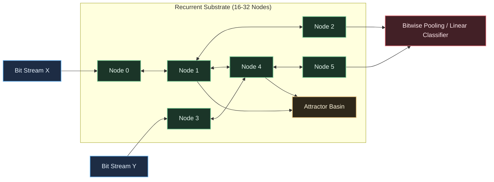

# Multi-Scale Self-Organizing Computational Substrate

To transition from the current deep learning paradigm to a self-organizing, multi-scale computational substrate, the research program requires a precise formulation of what failure modes we are escaping, the target computational principles, and the empirical milestones that define progress.

## **The Foundational North Star**

> **The North Star:** *To engineer an autopoietic, thermodynamically bounded computational substrate wherein sequence modeling, persistent continual learning, and hierarchical abstraction emerge as the native physical relaxation of a decentralized, self-repairing dynamical system.*  
In operational terms, this means replacing the **"train once, freeze forever, recompute everything"** lifecycle of digital Transformers with an **adaptive physical medium** that operates at biological levels of energy efficiency (the human brain consumes approximately $20\text{ W}$) by unifying inference, learning, and structural morphogenesis into a single continuous homeostatic process.

## **Core Research Goals: Current Limits vs. Proposed Advances**

| Architectural Dimension | Existing Paradigm (Transformers & Deep Learning) | Multi-Scale Self-Organizing Alternative | Key Scientific Objective |
| :---- | :---- | :---- | :---- |
| **Operational Lifecycle** | Disconnected: Offline gradient descent over static weights, followed by inference-only execution. | Unified: Continuous, local energy-minimization where inference and learning occur simultaneously. | **Eliminate the training/inference divide.** The system continuously updates its organization on streaming data without explicit optimization phases. |
| **Learning & Plasticity** | Ephemeral activation routing (In-Context Learning) or catastrophic forgetting / plasticity loss under continual fine-tuning. | Multi-scale structural plasticity, Hebbian turnover, and Conceptor subspace partitioning. | **Lifelong, non-interfering memory.** Novel sequence patterns carve out new, orthogonal attractor basins without overwriting historical competencies. |
| **Hardware & Energetics** | Synchronous, dense floating-point tensor contractions (GEMM) operating orders of magnitude above the Landauer limit. | Asynchronous, physics-driven relaxation (analog dynamics, bitwise cellular Boolean operations, or thermodynamic compute). | **Orders-of-magnitude reduction in Energy-Delay Product (EDP)** by substituting digital simulation of math with native physical substrate kinetics. |
| **Memory Topology** | Explicit $\mathcal{O}(1)$ attention matrices and volatile Key-Value (KV) caches scaling with sequence length. | Somatic attractor engrams, localized traveling waves (solitons/SLPs), and bioelectric-like setpoints. | **Bounded, topological state retention.** Sequence context is encoded in self-stabilizing spatio-temporal dynamics rather than growing memory buffers. |
| **Representational Structure** | Monolithic parameter tensors optimized in an unconstrained, hyper-dimensional continuous search space. | Hierarchical Assembly Spaces: validated functional motifs (feedback loops, logic gates) cached in an Assembly Pool. | **Exponential search-space bounding.** Search scales via recursive composition of pre-adapted modules (symbiogenesis) rather than random point perturbations. |

## **Target Quantitative Metrics (Success Indicators)**

To evaluate this paradigm rigorously against mainstream AI benchmarks, experiments should measure:

1. **Continual Learning Efficiency (Plasticity vs. Stability)**:

 $$\text{Backward Transfer (BWT)} = \frac{1}{T - 1} \sum_{i=1}^{T - 1} (R_{T,i} - R_{i,i}) \ge 0$$

 Unlike Transformers where $\text{BWT} \ll 0$ due to catastrophic forgetting, this system must maintain $\text{BWT} \approx 0$ or positive transfer without storing raw data replay buffers.

1. **Thermodynamic Arithmetic Intensity**:

 $$\eta_{\text{thermo}} = \frac{\text{Information Bits Consolidated}}{\text{Joules Dissipated}}$$

 Quantifying how closely the physical or simulated substrate approaches the theoretical Landauer bound ($\Delta E \ge k_B T \ln 2$ per bit erasure) during lifelong sequence learning.

1. **Assembly Depth / Modularity Factor**:

 $$\text{Reuse Ratio} = \frac{\sum a_i(\mathcal{M}_{\text{reused}})}{\text{Total System Degrees of Freedom}}$$

 Tracking whether complex computational graphs are formed through the recursive combination of pre-adapted modules rather than unconstrained parameter growth.

Starting with discrete bit-train automata that settle into attractor basins connects directly to the formalisms of **Liquid State Machines (LSM)**, **Cellular Automata Reservoirs (ReCA)**, and **Stochastic Computing**.

The fundamental trap in unguided recurrent discrete networks is the **ergodic boundary**: without careful tuning, open-ended bit-passing topologies almost always collapse into either trivial extinction (all zeros / static fixpoints) or uncorrelated white noise (hyper-chaos). To make this computationally useful, the starting point must be designed around **Self-Organized Criticality (SOC)** at the smallest possible scale.

---

## Getting Started

### Phase 0: The Minimal Viable Automaton (MVA)

Do not start with an unconstrained graph or continuous signals. Constrain the design space to a tiny, deterministic testbed before allowing the coding to evolve open topologies.

**1. The Signal Protocol (Bit-Streams)**

* Use synchronous, discrete bit-streams where time $t \in \mathbb{N}$.
* A track between node $i$ and node $j$ transmits a single bit $b \in \{0, 1\}$ per clock tick.
* Information is encoded in **temporal pulse spacing** (inter-spike intervals) or **bit density** (Bernoulli rate coding). This natively mimics spike-timing-dependent computation and keeps arithmetic bitwise.

**2. Node Architecture (The 4-Neighbor Micro-Core)**

* **State:** Each node holds an internal register: a small $k$-bit ring buffer (e.g., $k = 4$ to $8$ bits) representing its local temporal history, plus an accumulated charge counter $V \in [0, V_{\text{thresh}}]$.
* **Incoming Tracks:** Exactly 2 to 4 input tracks.
* **Outgoing Tracks:** Exactly 2 to 4 output tracks.
* **Transition Rule:** At each tick:

1. Incoming bits are logically combined (e.g., bitwise parity, majority voting, or bitwise AND/XOR).
2. If the internal accumulator exceeds $V_{\text{thresh}}$, the node fires a `1` downstream and enters a refractory period ($N_{\text{ref}}$ ticks of forced `0`). Otherwise, it outputs `0`.
3. The internal accumulator decays by a fixed leak factor $\lambda$ on idle ticks.

**3. Homeostasis (The Anti-Chaos Shield)**
To prevent the network from blowing up into seizure-like saturation or freezing into silence:

* Each node tracks its rolling firing rate $\bar{r}$.
* If $\bar{r} > r_{\text{target}}$, dynamically increment $V_{\text{thresh}}$ (make it harder to fire).
* If $\bar{r} < r_{\text{target}}$, decrement $V_{\text{thresh}}$ (make it more excitable).
* *This single local rule forces the entire substrate toward the "edge of chaos" without centralized tuning.*

---

### Reading In, Settling, and Reading Out

* **Read-In (Encoding):** Reserve 1 to 3 "sensory nodes." Clamp their incoming tracks to the input data bit-train for a fixed window $T_{\text{drive}}$ (e.g., 32 ticks).
* **Dynamic Settling (Relaxation):** After $T_{\text{drive}}$, disconnect or clamp the inputs to a neutral carrier pattern (`0000...` or periodic clock `1010...`). Allow the network to run for $T_{\text{relax}}$ ticks.
* **Settling Criterion:** Track Hamming distance between global network state snapshots $S_t$ and $S_{t-\tau}$. A "settled state" is either:
* A point attractor: $H(S_t, S_{t-1}) = 0$.
* A limit cycle: $H(S_t, S_{t-P}) = 0$ for small period $P$.
* A bounded strange attractor: The trajectory stays within a bounded subspace (measured via state variance).

* **Read-Out:** Extract the binary vector of the network state (either the instantaneous state at $T_{\text{relax}}$ or the time-averaged bit frequencies of all nodes over $T_{\text{relax}}$). Feed this state vector into a simple linear mapping (or majority vote logic) to determine the answer.

---

### The "Hello World" Task: 2-Bit Temporal XOR

Do not give the agents sequence modeling or language modeling tasks yet. The network must first prove it has **non-linear mixing** and **fading memory**.

* **Input:** Feed a bit $x_t \in \{0, 1\}$ into the network at irregular intervals.
* **Target:** Predict $y_t = x_t \oplus x_{t-\tau}$, where $\tau$ is a delay of 3 to 10 ticks.
* **Evaluation:** A feedforward network or simple memoryless CA cannot solve this. The substrate *must* sustain the reverberation of $x_{t-\tau}$ in internal feedback loops while simultaneously performing the non-linear XOR separation with $x_t$.

---

### Experimental Staging Roadmap for Agents

| Phase | Scope | Core Question to Validate | Termination Gate |
| --- | --- | --- | --- |
| **Sprint 0** | 16-node 2D Torus / Small-World Graph | Can local homeostatic threshold adjustment keep bit activity within $5\%\text{--}20\%$ firing density? | Zero state extinctions; zero full-saturation runaways across $10^5$ ticks. |
| **Sprint 1** | Fixed Topology + Attractor Mapping | Does different input history reliably guide the network into distinct, reproducible limit cycles / attractors? | High separation property: $D(S_A, S_B) > 0$ for distinct inputs $A \neq B$. |
| **Sprint 2** | Temporal XOR Task | Can a simple linear readout extract $x_t \oplus x_{t-\tau}$ purely from the settled substrate dynamics? | $>95\%$ accuracy on delayed XOR with $\tau \ge 5$ ticks. |
| **Sprint 3** | Local Plasticity Rules | Can edges rewire or adjust delay tracks via a strictly local, bitwise Hebbian/anti-Hebbian rule without backprop? | Network autonomously improves attractor basin depth for recurring inputs. |
